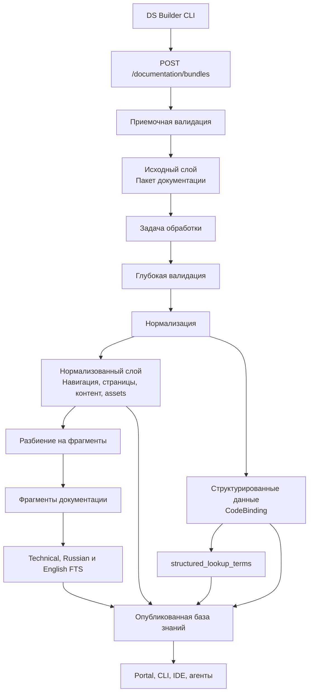
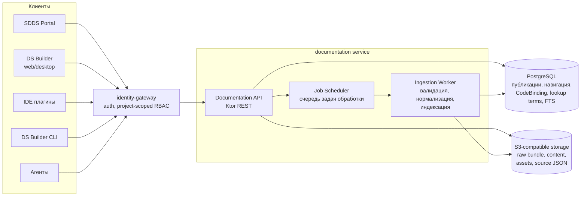
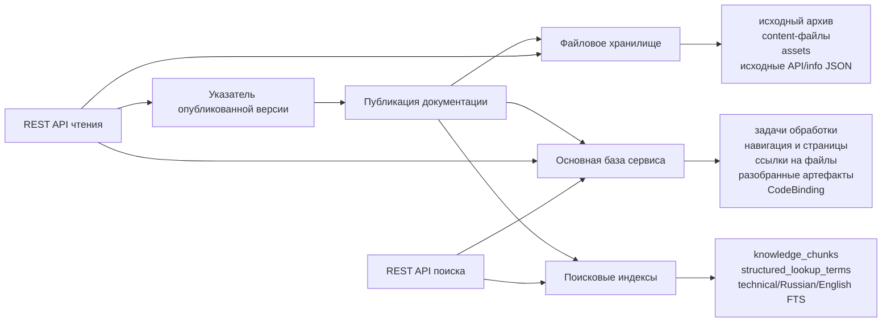
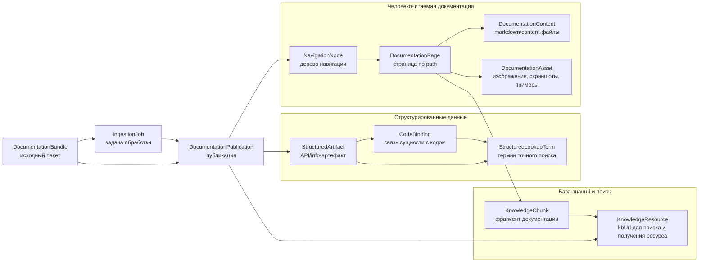
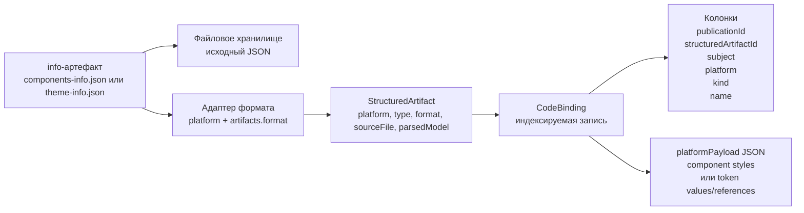
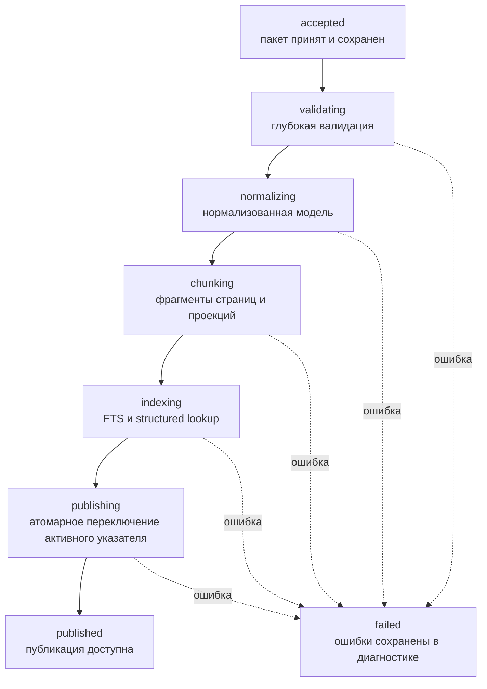

# ADR-0002: Документация

## Статус
* Принято.

## Контекст

Документация к пользовательским дизайн-системам на основе SDDS должна быть доступна как человеку в удобном и понятном
виде, так и агентам ИИ в том виде, в котором будут обеспечиваться минимальные затраты на токены.
Имеем несколько видов документации, разделяемых по следующим признакам: 
- Принадлежность к слою: (слой Core, слой пользовательской документации)
- Принадлежность к платформе: (Дизайн, Android Compose, Android View, iOS SwiftUI, React)

### Core документация
Документация слоя Core компонентов принадлежит команде SDDS, соответственно создается и поддерживается на уровне Core 
репозиториев с исходным кодом библиотек SDDS. Такая документация пишется отдельно под каждую платформу. Документация для
дизайна (Figma, Pixso) в данном случае не исключение - она тоже может храниться в специализированном репозитории.  
Core документация по своей природе общая для всех дизайн-систем, созданных на платформе SDDS. 

### Пользовательская документация
Пользовательская документация - это документация, которой владеет сам пользователь - владелец или участник дизайн-системы, 
созданной на платформе SDDS. Аналогично core документации, такая документация может писаться для всех платформ, но является 
опциональной. Полезна в тех случаях, когда core документация не покрывает нужные кейсы. 
Например, функционал (компонент, утилита и т.д.) определен на уровне конечной дизайн-системы пользователя. Или пользователь 
захотел сделать пометку по какому-то частому кейсу ошибок. Пользовательская документация дополняет Core документацию.

### Платформенная документация
Центральная часть всей документации - это документация дизайна. Она описывает гайдлайны, usecases, основы дизайн-системы;
описания, спецификации и анатомия компонентов; accessibility и т.д. Платформенная документация (Android, iOS, React) существует
как дополнение, она описывает платформоспецифичные концепции, код, туториалы и т.д. 


### Проблема
На данный момент документация для разных платформ находится на разных ресурсах, а также не удобна при использовании 
с агентами ИИ. 


## Решение
В связи с вышеперечисленным, необходимо разделить сбор документации и серверную обработку документации.
Сбор исходников документации из разных источников, работа DS Builder CLI и формирование входного пакета описаны в
[ADR-0003: Сбор документации DS Builder CLI](./ADR-0003-documentation-cli.md).
Этот ADR описывает сервис хранения и обработки документации, который принимает готовый пакет и создает базу знаний для
пользователя и ИИ-агентов.
Данное архитектурное решение согласовано с командной целью обеспечить работу агентно-ориентированного подхода в работе 
с дизайн-системой.

### Входной пакет документации
Сервис документации работает с уже собранным пакетом документации. Правила подготовки исходников, слияния Core и
пользовательского слоя, насыщения markdown, формирования `manifest.json`, `docs.json`, `content/`, `assets/`, `api/` и
`meta/`, а также команды DS Builder CLI описаны отдельно в
[ADR-0003: Сбор документации DS Builder CLI](./ADR-0003-documentation-cli.md).

Для этого ADR важна только граница ответственности:
- сервис документации принимает готовый пакет через REST API;
- пакет должен быть самодостаточным: внутри должны быть все content-файлы, assets и info-артефакты, на которые ссылаются
  `manifest.json` и `docs.json`;
- сервис не клонирует исходные репозитории, не запускает Gradle, Dokka, TypeDoc, Storybook или другие платформенные
  инструменты и не резолвит markdown-шаблоны;
- `manifest.json` и `docs.json` являются входным контрактом для приемочной валидации, нормализации, построения
  `CodeBinding`, поиска и базы знаний.

Ожидаемая структура пакета:

```text
manifest.json
docs.json
content/
meta/
assets/
api/
```

`api/`, `meta/` и `assets/` могут отсутствовать, если соответствующие артефакты не объявлены в `manifest.json`.

### Сервис документации

Сервис документации принимает только готовый пакет документации, созданный DS Builder CLI. Он не должен клонировать
пользовательские репозитории, запускать Gradle, Dokka, TypeDoc, Storybook или другие платформенные инструменты, резолвить
шаблоны markdown и генерировать примеры или скриншоты. Эти действия выполняются до публикации пакета.

Зона ответственности сервиса:
- принять пакет от `dsbuilder docs publish`;
- выполнить приемочную валидацию;
- сохранить исходный пакет для диагностики и воспроизводимости;
- создать асинхронную задачу обработки;
- выполнить глубокую валидацию содержимого;
- нормализовать `docs.json`, markdown-контент, info-артефакты и assets во внутреннюю модель;
- подготовить страницы документации для отображения людям;
- построить фрагменты для поиска и агентов;
- построить полнотекстовые и структурированные lexical-индексы;
- опубликовать базу знаний для конкретной дизайн-системы, версии и платформы.

Границы MVP:
- вся документация является private и доступна только через project-scoped авторизацию;
- поиск является lexical-only: PostgreSQL FTS, exact/prefix/trigram structured lookup и deterministic rank fusion;
- embeddings, vector search, `pgvector`, LLM reranking и public visibility не реализуются;
- `CodeBinding` поддерживает kinds `component-style` и `token` для платформ `compose`, `android-view` и `swiftui`;
- Web/React и UIKit `CodeBinding` adapters не входят в MVP.

#### Верхнеуровневая архитектура
Сервис документации хранит и обрабатывает данные в трех слоях:
- исходный слой - загруженный пакет документации и файлы из архива;
- нормализованный слой - навигация, страницы, ссылки на контент, assets и машинно-собираемые артефакты;
- слой поиска - фрагменты документации, термины точного поиска, полнотекстовые индексы и опубликованные ресурсы
  базы знаний.



#### Компонентная архитектура сервиса
На уровне runtime сервис документации состоит из нескольких инфраструктурных компонентов. Логически это один доменный
сервис `documentation`, но внутри него нужно разделить синхронные REST API, асинхронную обработку bundle и хранилища.



`Documentation API` обслуживает синхронные REST API: загрузку bundle, получение статуса задачи, чтение публикации,
навигации, страниц, assets, `CodeBinding` и поиск. Он не должен выполнять тяжелую обработку bundle в
HTTP-запросе: после приемочной валидации API сохраняет пакет, создает задачу обработки и возвращает `jobId`.

`Ingestion Worker` выполняет тяжелые шаги пайплайна: глубокую валидацию, нормализацию, разбор `components-info` и
`theme-info`,
построение `CodeBinding`, `structured_lookup_terms`, markdown-фрагментов и полнотекстовых индексов. На первом
этапе worker может быть частью того же deployable-сервиса, что и REST API, но архитектурно это отдельный runtime-компонент:
его можно масштабировать, перезапускать и ограничивать по ресурсам независимо от read API.

`Job Scheduler` может быть реализован как таблица задач в PostgreSQL с блокировками и статусами или как отдельная очередь.
Для первого этапа достаточно PostgreSQL-backed очереди, потому что она проще в эксплуатации и хорошо сочетается с
атомарной публикацией. Если появятся большие bundle или высокий параллелизм, очередь можно
заменить на отдельный брокер без изменения публичного REST API.

`PostgreSQL` является основной базой сервиса. В ней хранятся публикации, статусы задач, дерево навигации, страницы,
метаданные файлов, разобранные info-артефакты, `CodeBinding`, `structured_lookup_terms` и полнотекстовые индексы.

`S3-compatible storage` или эквивалентное объектное/файловое хранилище хранит большие и неизменяемые файлы: исходный
архив bundle, распакованные markdown/content-файлы, assets, скриншоты, примеры и исходные API/info JSON. В PostgreSQL
хранятся ссылки, контрольные суммы, размеры и метаданные этих файлов.

#### Модель хранения
Сервис документации должен разделять хранение больших файлов, нормализованных метаданных и поисковых индексов.



Исходный пакет хранится как неизменяемый файловый артефакт. Он нужен для диагностики, повторной обработки и аудита:
сервис должен иметь возможность показать, из какого пакета была построена публикация. В объектном хранилище или
эквивалентном файловом хранилище сохраняются исходный архив, распакованные content-файлы, assets и исходные API/info-файлы.

Нормализованный слой хранится как структурированная модель в основной базе сервиса. В него входят публикации, задачи
обработки, дерево навигации, страницы, ссылки на content-файлы, связи с assets, разобранные info-артефакты и
`CodeBinding`. Markdown-контент не обязан полностью дублироваться в строковых полях базы: достаточно хранить ссылку на файл,
контрольную сумму, формат, размер и метаданные. Это не мешает API возвращать markdown-контент клиенту, но не раздувает
нормализованную модель.

Машинно-собираемые JSON-артефакты хранятся в двух видах:
- исходный файл - для диагностики и повторной обработки;
- разобранная модель - для точных запросов по `CodeBinding` и терминам точного поиска.

Слой поиска логически отделен от нормализованного слоя: он состоит из markdown-фрагментов, терминов точного поиска,
трёх полнотекстовых проекций и метаданных подбора контекста. В MVP этот слой физически реализуется в PostgreSQL через
отдельные таблицы, PostgreSQL Full Text Search и btree/trigram индексы.
Архитектурно важно, что слой поиска является
производным: его можно перестроить из нормализованной публикации без повторной загрузки пакета. Если объем данных или
нагрузка вырастут, реализация `DocumentationSearchIndex` может быть вынесена в OpenSearch/Elasticsearch без изменения REST API.

Опубликованная база знаний должна обновляться атомарно: клиенты либо видят предыдущую опубликованную публикацию, либо
новую полностью построенную публикацию. Промежуточное состояние задачи обработки не должно становиться доступным через
API чтения документации.

#### Ключевые сущности


`DocumentationBundle` - исходный пакет документации, полученный от CLI. Хранит идентификатор пакета, дизайн-систему,
версию, платформу, ссылку на исходный архив, контрольную сумму, размер, дату загрузки и результат приемочной валидации.

`IngestionJob` - асинхронная задача обработки пакета. Хранит статус, текущий шаг, прогресс, ошибки, предупреждения и
ссылку на пакет. Одна задача строит одну кандидатную публикацию.

`DocumentationPublication` - опубликованная или подготавливаемая версия документации для конкретной дизайн-системы,
версии и платформы. Хранит статус публикации, ссылку на исходный пакет, время публикации, схему данных, версию модели
и признаки актуальности для клиентов.

`NavigationNode` - узел итогового дерева документации. Может быть группой, категорией или страницей. Хранит заголовок,
порядок, родителя, `subjects`, признак скрытия и, для страницы, ссылку на `DocumentationPage`.

`DocumentationPage` - человекочитаемая единица документации. Хранит `path`, заголовок, `subjects`, формат контента,
ссылки на content-файлы, связи с assets и метаданные, нужные порталу, desktop-приложению и IDE-плагинам.

`DocumentationContent` - markdown/MDX/HTML-файл, связанный со страницей. Хранит ссылку на файл в хранилище, формат,
контрольную сумму, размер и источник (`core` или пользовательский слой). Несколько content-файлов могут собираться в одну
страницу после слияния.

`DocumentationAsset` - файл, используемый документацией: скриншот, изображение, большой пример кода, архив с примером или
другой внешний ресурс страницы. Хранит ссылку на файл, `mediaType`, размер, контрольную сумму и связи со страницами.

`StructuredArtifact` - разобранный info-артефакт из пакета. Хранит тип артефакта, исходный файл, платформу, схему,
разобранную платформенную модель и связи с `subjects`. На первом этапе из него строятся `CodeBinding` и термины точного
поиска.

`CodeBinding` - опубликованная read-only связь между сущностью дизайн-системы и ее представлением в коде конкретной
платформы. Хранит `subject`, `kind`, имя сущности, платформу, источник, общие параметры вариаций, ссылки на код и
платформенные данные. Эта сущность не заменяет продуктовую модель токенов, стилей и вариаций в DS Builder
API.

`StructuredLookupTerm` - производный термин точного поиска по структурированным данным. Хранит `publicationId`,
`platform`, `subject`, `codeBindingId`, исходный термин, нормализованный термин, тип термина и вес. Строится
детерминированно адаптером из `CodeBinding`.

`KnowledgeChunk` - фрагмент человекочитаемой документации для полнотекстового поиска и выдачи агентам. Строится из
markdown-секции. Хранит подготовленный для поиска текст, заголовки, `path`, `subjects`, ссылку
на исходную страницу и технические метаданные разбиения.

`KnowledgeResource` - опубликованный ресурс базы знаний, доступный через `kbUrl`. Обычно соответствует `KnowledgeChunk`
и используется в сценарии `search -> fetch`. Это сервисная модель документации, а не MCP resource из
[ADR-0004](./ADR-0004-dsbuilder-cli-mcp.md): MCP в MVP получает такие данные через типизированный инструмент или REST API
получения ресурса по `kbUrl`.

#### CodeBinding
`CodeBinding` описывает связь между сущностью дизайн-системы и ее представлением в коде конкретной платформы. Эта связь
нужна документации, CLI, IDE-плагинам и агентам, чтобы не угадывать имена generated API, а использовать точные references
из опубликованной версии дизайн-системы.

`CodeBinding` строится из платформенных info-артефактов, которые приходят в bundle:
- `components-info` - информация о сгенерированных компонентах, стилях, параметрах и вариациях;
- `theme-info` - информация о сгенерированных токенах, теме и references.

Конкретная JSON-схема таких артефактов зависит от платформы. Имена файлов внутри bundle могут оставаться
платформенно-нейтральными, например `components-info.json` и `theme-info.json`; принадлежность определяется через
`platform` и `artifacts.format`. Сервис документации выбирает адаптер разбора по этим
полям, а не по суффиксу имени файла.

В MVP `CodeBinding` строится только для следующих canonical platform identifiers:
- Android Compose — `compose`;
- Android XML/View — `android-view`;
- SwiftUI — `swiftui`.

Web/React, UIKit и design-платформы могут публиковать человекочитаемую документацию, но adapters их info-артефактов и
`CodeBinding` для них в MVP отсутствуют.

Разбор info-артефактов выполняется в три слоя:

```text
исходный info-артефакт
  -> платформенная модель
  -> CodeBinding
```

Исходный info-артефакт сохраняется как файл для диагностики и повторной обработки. Платформенная модель сохраняет
полную разобранную модель конкретной платформы: например, Compose `styleApi`, qualified names, receiver types и return
types. `CodeBinding` является общей проекцией поверх платформенной модели и отвечает на вопрос: как сущность или значение
дизайн-системы использовать в коде этой платформы.

REST-контракт `CodeBinding`, реализованный в коде, является приоритетным и полным для MVP:
- `id` - идентификатор binding;
- `subject` - связь с сущностью документации или дизайн-системы;
- `platform` - платформа, для которой построена связь;
- `kind` - закрытый MVP-набор: `component-style` или `token`;
- `name` - имя сущности или значения;
- `platformPayload` - полный JSON payload поддержанной платформы; для компонента он содержит `key`, `coreName` и
  `styles`, для токена - type/name/value layers и references.

Этот контракт считается полным для MVP. Дополнительные kinds не вводятся до отдельного изменения контракта.

Внутри сервиса `CodeBinding` хранится не как отдельный исходный JSON-файл, а как запись нормализованного слоя, построенная
из `StructuredArtifact`. Индексируемые поля (`publicationId`, `structuredArtifactId`, `subject`, `platform`, `kind`,
`name`) хранятся отдельными колонками, а платформенная часть - в `platformPayload`. Такой подход позволяет выполнять
точные запросы по `subject`, `kind` и `name`, но не требует общей реляционной схемы payload для Compose, Android XML/View
и SwiftUI.



Пример `CodeBinding` для стиля компонента:

```json
{
  "id": "binding-avatar",
  "subject": "components.avatar",
  "platform": "compose",
  "kind": "component-style",
  "name": "Avatar",
  "platformPayload": {
    "key": "avatar",
    "coreName": "Avatar",
    "styles": [
      {
        "key": "avatar",
        "coreName": "Avatar",
        "styleName": "Avatar",
        "props": [],
        "styleApi": {
          "stylesClassQualifiedName": "com.sdds.sbcom.styles.avatar.AvatarStyles"
        },
        "variations": [
          {
            "name": "M",
            "composeReference": "Avatar.M"
          }
        ]
      }
    ]
  }
}
```

Пример `CodeBinding` для токена:

```json
{
  "id": "binding-token-hover",
  "subject": "tokens.dark.surface.default.transparent-card-brightness-hover",
  "platform": "compose",
  "kind": "token",
  "name": "dark.surface.default.transparent-card-brightness-hover",
  "platformPayload": {
    "type": "color",
    "name": "dark.surface.default.transparent-card-brightness-hover",
    "displayName": "transparentCardBrightnessHoverDefault",
    "description": "Прозрачный фон для карточек",
    "values": [
      {
        "color": "0x1FFAFAFA"
      }
    ],
    "reference": "SurfaceDefaultTransparentCardBrightnessHover",
    "themeReference": "SddsSbComTheme.colors.surfaceDefaultTransparentCardBrightnessHover"
  }
}
```

`CodeBinding` не заменяет продуктовую модель DS Builder. DS Builder API остается источником истины для редактирования,
генерации и бизнес-логики. Сервис документации хранит опубликованное read-only представление, нужное для документации,
поиска, CLI, IDE-плагинов и агентов.

Основной поток данных:
```text
пакет документации
  -> исходный слой
  -> нормализованная навигация и страницы
  -> фрагменты документации
  -> полнотекстовые и структурированные lexical-индексы
  -> опубликованная база знаний
```

Нормализованный слой используется для отображения документации людям: в портале, desktop-приложении, IDE-плагинах и других
клиентах. Слой поиска используется для CLI, агентов и контекстной выдачи, где важны компактные релевантные фрагменты, а
не вся страница целиком.

#### Прием пакета
Публикация документации выполняется через HTTP API сервиса:

```http
POST /documentation/bundles
```

Обработка запроса состоит из двух фаз:
- синхронная приемочная валидация;
- асинхронная задача обработки.

Приемочная валидация выполняется в рамках HTTP-запроса и проверяет только базовую пригодность пакета. Если пакет не
проходит эти проверки, задача обработки не создается, а сервис возвращает ошибку `400` или `422`.

Минимальные проверки приемочной валидации:
- архив читается и не превышает допустимый размер;
- в архиве есть `manifest.json`;
- `manifest.json` соответствует поддерживаемому `schemaVersion`;
- заполнены `designSystem.id`, `designSystem.version` и `platform`;
- все артефакты, объявленные в `manifest.json`, существуют в архиве;
- среди артефактов есть `resolved-docs` с путем `docs.json`;
- существует `content-root`, если он объявлен в `manifest.json`;
- пути внутри архива безопасны: запрещены абсолютные пути, `../`, обход путей (path traversal) и ссылки наружу;
- `artifacts.type` и `artifacts.format` поддерживаются текущей версией сервиса.

Пример ошибки приемочной валидации:

```json
{
  "errors": [
    {
      "code": "MISSING_ARTIFACT",
      "path": "api/compose-api.json",
      "message": "Артефакт, объявленный в manifest.json, не найден."
    }
  ]
}
```

Если приемочная валидация прошла успешно, сервис сохраняет исходный пакет, создает задачу обработки и возвращает идентификатор
задачи:

```json
{
  "jobId": "2a4be621-d033-4a95-a291-21d475d3e54a",
  "status": "accepted"
}
```

Такой двухфазный прием отделяет быстрый ответ CLI на явно некорректный пакет от тяжелой обработки, которая может занять
существенное время и завершиться диагностируемой ошибкой.

#### Задача обработки
Задача обработки выполняется асинхронно, потому что построение базы знаний может включать парсинг большого количества
markdown-файлов, обработку API/info-артефактов, разбиение на фрагменты и обновление lexical-индексов.

Статусы задачи обработки:
- `accepted` - пакет прошел приемочную валидацию и сохранен;
- `validating` - выполняется глубокая проверка `docs.json`, content и assets;
- `normalizing` - строится внутренняя модель навигации, страниц, ссылок на контент, assets и машинно-собираемых артефактов;
- `chunking` - страницы и сгенерированные блоки разбиваются на фрагменты;
- `indexing` - фрагменты и structured lookup terms записываются в lexical-индексы;
- `publishing` - обновляется указатель на опубликованную базу знаний;
- `published` - база знаний доступна клиентам;
- `failed` - обработка завершилась ошибкой.

Поток обработки внутри задачи:



Статус задачи должен быть доступен через API:

```http
GET /documentation/ingestion-jobs/{jobId}
```

Пример ответа:

```json
{
  "jobId": "2a4be621-d033-4a95-a291-21d475d3e54a",
  "status": "chunking",
  "progress": {
    "currentStep": "chunking",
    "processedPages": 42,
    "totalPages": 120
  },
  "diagnostics": []
}
```

#### Глубокая валидация
Глубокая валидация внутри задачи обработки проверяет:
- `docs.json` соответствует поддерживаемой схеме;
- все `contentRefs` указывают на существующие content-файлы;
- все markdown-файлы читаются и имеют поддерживаемую кодировку;
- все ссылки на assets указывают на существующие файлы;
- `subjects` имеют допустимый формат;
- `path` страниц уникальны в итоговой навигации;
- результат слияния Core и пользовательского слоя не содержит конфликтов;
- info-артефакты, из которых строится `CodeBinding`, парсятся соответствующими адаптерами;
- API-артефакты, если они приложены к bundle, не являются обязательным источником структурированной модели в MVP:
  платформенный инструмент должен заранее преобразовать API-документацию в markdown;
- машинно-собираемые артефакты можно связать с платформой и, где возможно, с `subjects`;
- для страниц и сгенерированных блоков можно построить текст для поиска.

#### Ошибки и диагностика обработки
Диагностика обработки должна быть частью `IngestionJob`. CLI, портал и админские инструменты должны получать одинаковую
картину ошибок и предупреждений через статус задачи:

```http
GET /documentation/ingestion-jobs/{jobId}
```

Диагностическое сообщение должно иметь единый формат:

```json
{
  "level": "error",
  "code": "MISSING_CONTENT_REF",
  "message": "contentRef указывает на несуществующий файл.",
  "path": "docs.json",
  "artifactType": "resolved-docs",
  "subject": "components.button",
  "details": {
    "contentRef": "content/core/components/button/overview.md"
  }
}
```

Поля диагностики:
- `level` - уровень сообщения: `error` или `warning`;
- `code` - стабильный машинно-читаемый код ошибки или предупреждения;
- `message` - человекочитаемое описание проблемы;
- `path` - путь внутри bundle, к которому относится сообщение;
- `artifactType` - тип артефакта из `manifest.json`, если сообщение связано с конкретным артефактом;
- `subject` - связанная сущность документации или дизайн-системы, если ее удалось определить;
- `details` - структурированные детали для CLI, UI и автоматической диагностики.

`error` блокирует публикацию. Если во время глубокой валидации, нормализации, разбиения на фрагменты или индексации
появляется хотя бы один `error`, задача обработки должна перейти в статус `failed`, а активная
публикация для этой версии дизайн-системы не должна измениться.

`warning` не блокирует публикацию. Такие сообщения подходят для ситуаций, которые не нарушают целостность документации,
но требуют внимания: неиспользуемый asset, страница без `subjects`, устаревший, но еще поддерживаемый `format`, отсутствие
опционального API/info-артефакта.

Ошибки приемочной валидации возвращаются сразу из `POST /documentation/bundles` и не создают `IngestionJob`. Ошибки,
найденные после успешного приема пакета, сохраняются в `IngestionJob` и доступны через API статуса задачи.

Все пути в диагностике должны быть путями внутри bundle. Сервис не должен возвращать локальные пути пользователя, пути CI
или абсолютные пути файловой системы.

Пример ответа для неуспешной задачи:

```json
{
  "jobId": "2a4be621-d033-4a95-a291-21d475d3e54a",
  "status": "failed",
  "progress": {
    "currentStep": "validating"
  },
  "diagnostics": [
    {
      "level": "error",
      "code": "MISSING_CONTENT_REF",
      "message": "contentRef указывает на несуществующий файл.",
      "path": "docs.json",
      "artifactType": "resolved-docs",
      "subject": "components.button",
      "details": {
        "contentRef": "content/core/components/button/overview.md"
      }
    }
  ]
}
```

#### Поток построения базы знаний
После приемочной валидации задача обработки строит базу знаний по детерминированному потоку:

```text
исходный пакет
  -> глубокая валидация
  -> нормализация
  -> фрагменты документации
  -> lexical-индексы
  -> опубликованная база знаний
```

На этапе нормализации сервис преобразует `docs.json`, markdown-контент, assets и машинно-собираемые артефакты во
внутреннюю модель публикации: навигацию, страницы, ссылки на контент, assets и сгенерированные блоки. Эти данные являются
основой для отображения документации людям.

Фрагменты документации строятся после нормализации. Сервис разбивает нормализованные страницы и сгенерированные блоки на
компактные части, пригодные для поиска и выдачи агентам. Исходные файлы пакета не являются
основной единицей поиска.

Публикация базы знаний должна быть атомарной. Пока новая задача обработки не дошла до статуса `published`, клиенты
продолжают получать предыдущую опубликованную документацию для той же пары дизайн-система/версия/платформа.

#### Публикация и версионирование
У документации не должно быть отдельной бизнес-версии. Документация публикуется для конкретной версии дизайн-системы и
платформы, поэтому `designSystem.version` в `manifest.json` является версией дизайн-системы или платформенной библиотеки.

Ключ активной документации:

```text
designSystemId + designSystemVersion + platform
```

`publicationId` не является версией документации. Это технический идентификатор конкретной публикации, построенной из
конкретного bundle. Он нужен для диагностики, аудита, воспроизводимости агентского контекста и стабильных `dsb://` ссылок
в рамках одной публикации.

Повторная публикация той же версии должна работать как замена активной публикации. Если для пары
`designSystemId + designSystemVersion + platform` уже есть опубликованная документация, новый `dsbuilder docs publish`
создает новую кандидатную публикацию, выполняет валидацию, нормализацию, разбиение на фрагменты и индексацию. Только после
успешного завершения задачи сервис атомарно переключает активный указатель на новую публикацию.

Пример:

```text
active(sbcom, 2.4.0, compose) = pub_001

dsbuilder docs publish
  -> создается pub_002
  -> выполняется обработка bundle
  -> если обработка успешна: active(sbcom, 2.4.0, compose) = pub_002
  -> если обработка завершилась ошибкой: active остается pub_001
```

Для клиентов основной контракт остается простым: запрос по `designSystemId`, `designSystemVersion` и `platform` всегда
возвращает последнюю успешно опубликованную документацию для этой версии дизайн-системы. Старая публикация может
сохраняться технически для аудита, диагностики или rollback, но не является отдельной пользовательской версией
документации. Срок хранения старых публикаций определяется retention policy сервиса и не входит в публичный контракт
чтения документации.

CLI, IDE-плагины и агенты могут сохранять `publicationId`, если им нужна воспроизводимость конкретного контекста. Если
достаточно актуальной документации для версии дизайн-системы, следует использовать ключ
`designSystemId + designSystemVersion + platform`.

#### Фрагменты и ресурсы базы знаний
Фрагмент документации - это минимальная единица поиска и выдачи агентам. Фрагмент не равен
исходному файлу: один markdown-файл может дать несколько фрагментов. Машинно-собираемые JSON-артефакты не превращаются
в markdown-фрагменты: они разбираются в структурированную модель и используются для точных запросов.

Решения по разбиению и ресурсам базы знаний:
1. Markdown-страницы разбиваются на фрагменты по заголовкам внутри страницы.
2. Базовая граница фрагмента - заголовок второго уровня (`H2`). Заголовок первого уровня (`H1`) считается заголовком
   страницы и сам по себе не создает отдельный фрагмент.
3. Если в странице нет `H2`, вся страница становится одним фрагментом. Если фрагмент по `H2` слишком большой, сервис
   может дополнительно разделить его по заголовкам третьего уровня (`H3`). Разбиение не должно происходить внутри
   fenced code block, таблицы или другого цельного markdown-блока.
4. Машинно-собираемые JSON-артефакты не разбиваются как markdown. Они парсятся адаптерами, сохраняются как
   структурированные данные и `CodeBinding`. Для поиска по таким данным сервис строит не отдельное текстовое описание, а
   детерминированные термины точного поиска (`structured_lookup_terms`) из известных полей модели.
5. Для машинно-собираемых артефактов в MVP сервис должен поддерживать точные структурированные запросы только по
   `CodeBinding`, а также поиск по `structured_lookup_terms`. API-документация на первом этапе публикуется как
   markdown-контент и попадает в обычный полнотекстовый поиск.
6. Ресурс базы знаний - это опубликованный поисковый фрагмент. Он предназначен для сценариев `search -> fetch`, где поиск
   возвращает ссылку на фрагмент, а отдельный запрос получает его полный контент и метаданные.
7. `dsb://documentation/{publicationId}/{contentId}/{ordinal}` используется как адрес сервисного ресурса базы знаний.
Это не MCP resource, а внутренне адресуемый результат поиска сервиса документации. Такой адрес должен быть стабильным в рамках одной публикации, но не обязан переживать
   новую публикацию той же дизайн-системы и версии. Для долгоживущих человекочитаемых ссылок следует использовать
   `designSystemId`, `version`, `platform` и `path` страницы.
8. Поисковый API для markdown-фрагментов должен возвращать `kbUrl`, краткий фрагмент совпадения и метаданные, достаточные
   для отображения результата. Для структурированных совпадений API должен возвращать `codeBindingId`, по которому клиент
   сможет получить точную запись `CodeBinding`.

Пример результата поиска:

```json
{
  "results": [
    {
      "kbUrl": "dsb://documentation/pub_123/content_456/0",
      "title": "Disabled state",
      "snippet": "Disabled state используется для...",
      "path": "components/button/overview.md",
      "subjects": ["components.button"]
    }
  ]
}
```

#### Lexical search baseline и future evolution
Сервис документации должен поддерживать два разных контура lexical search:
- поиск по человекочитаемой документации;
- точный поиск по структурированным данным.

Ключевое решение:
- markdown-страницы разбиваются на `KnowledgeChunk`, по ним строятся technical `simple`, Russian и English FTS-проекции;
- API-документация публикуется как markdown-секция или markdown-страница;
- `components-info` и `theme-info` разбираются в `CodeBinding`;
- для `CodeBinding` строятся `structured_lookup_terms` - детерминированные термины поиска из известных полей;
- embeddings, vector search и LLM reranking не входят в обязательный publication pipeline;
- общий поиск объединяет результаты markdown-поиска и структурного поиска, но не подменяет точные данные отдельными
  текстовыми описаниями.

##### Подбор контекста для RAG-сценариев
Сервис документации должен предоставлять контур поиска и подбора контекста для RAG-сценариев: подготовить фрагменты,
построить индексы, найти релевантные ресурсы, вернуть ссылки на найденные записи и отдать полный контекст по отдельному
запросу. Генерация финального ответа остается ответственностью агента или клиентского сценария.

Обязательный baseline является полностью локальным и детерминированным PostgreSQL lexical search, потому что в документации много точных
идентификаторов: имена токенов, параметры API, ссылки на стили, классы, функции и значения вариаций. Поэтому сервис
документации должен явно разделять:
- поиск по тексту документации;
- поиск по точным структурированным данным.

##### Контур человекочитаемой документации
После нормализации markdown-страниц сервис строит `KnowledgeChunk`. Это производная единица индексации, а не новая
пользовательская сущность.

Базовые поля `KnowledgeChunk`:

```text
publicationId
designSystemId
version
platform
path
title
headings
subjects
text
kbUrl
contentHash
metadata
```

`text` - очищенный текст фрагмента с сохранением значимых markdown-блоков: списков, таблиц, примеров кода и подписей к
изображениям. `kbUrl` указывает на опубликованный ресурс базы знаний, который можно получить через отдельный REST API.

Пример `KnowledgeChunk`, построенного из markdown-секции:

```json
{
  "title": "Disabled state",
  "text": "Disabled state используется, когда действие недоступно...",
  "path": "components/button/overview.md",
  "subjects": ["components.button"],
  "headings": ["Button", "Disabled state"],
  "kbUrl": "dsb://documentation/pub_123/content_456/0"
}
```

##### Структурированные данные
Структурированные данные не превращаются в отдельные документы для полнотекстового поиска. Они остаются в нормализованной модели сервиса:
- `CodeBinding` хранит связь сущности дизайн-системы с ее представлением в коде конкретной платформы.

API-документация в MVP не хранится как отдельная структурированная модель. Платформенный инструмент может сгенерировать
markdown-секцию или markdown-страницу с таблицами API, сигнатурами и описаниями; сервис документации обработает ее как
обычную человекочитаемую документацию. Такой подход снижает сложность интеграции с Dokka, TypeDoc, Swift tooling и
другими платформенными генераторами.

Для точного доступа используются отдельные REST API. Например, `/bindings` позволяет получить опубликованные связи компонента
и их references в коде:

```json
{
  "subject": "components.avatar",
  "platform": "compose",
  "kind": "component-style",
  "name": "Avatar",
  "params": [
    {
      "name": "size",
      "defaultValue": "size-72",
      "values": [
        {
          "value": "size-72",
          "codeName": "Size72",
          "reference": "Avatar.Size72"
        }
      ]
    }
  ],
  "styleApi": {
    "stylesClassName": "AvatarStyles",
    "stylesClassQualifiedName": "com.sdds.compose.uikit.AvatarStyles"
  }
}
```

Такой ответ нужен людям, CLI и агентам как источник точных ссылок на код. Поиск может помочь найти нужный `CodeBinding`,
но сам `CodeBinding` остается источником истины.

##### Structured lookup terms
`structured_lookup_terms` - это таблица производных терминов для точного поиска по структурированным данным. Она нужна,
чтобы пользователь или агент мог найти `CodeBinding` по любому известному техническому имени: subject, имени компонента,
имени параметра, значению вариации, reference в коде, имени класса или qualified name.

Практическая модель:

```text
structured_lookup_terms
  id
  publication_id
  platform
  subject
  code_binding_id
  term
  normalized_term
  term_type
  weight
```

`code_binding_id` указывает на точную запись `CodeBinding`. После совпадения по термину сервис возвращает этот
идентификатор клиенту как `codeBindingId`.

Термины строятся детерминированно адаптером формата. Сервис не придумывает описание для
структурированных данных. Он берет только уже существующие поля.

Для `CodeBinding` термины строятся из:
- `subject`;
- `kind`;
- `name`;
- `params.name`;
- `params.values.value`;
- `params.values.codeName`;
- variation references (`composeReference`, `viewReference`, `viewOverlayReference` или `reference`);
- платформенной части, если адаптер явно знает ее поля. Например, для Compose это могут быть
  `styleApi.stylesClassName`, `styleApi.stylesClassQualifiedName`, `themeToken.reference`, `themeToken.themeReference`.

Пример терминов для `CodeBinding` компонента `Avatar`:

```text
term                                      term_type
components.avatar                         subject
component-style                           kind
Avatar                                    name
size                                      param-name
size-72                                   param-value
Size72                                    code-name
Avatar.Size72                            reference
AvatarStyles                             class-name
com.sdds.compose.uikit.AvatarStyles       qualified-name
```

Поля `normalized` и `tokenized` строятся общей canonical normalization: exact representation сохраняет значимые
символы `.`, `-`, `_`, `:`, `@`, `?`, а token representation разбивает составные identifiers. Для prefix comparison
клиентские `\`, `%`, `_` экранируются, добавляется только служебный suffix `%`, а SQL использует явный `LIKE ... ESCAPE`.
Обе проекции имеют composite B-tree `text_pattern_ops` indexes; GIN/trigram indexes используются для fuzzy lookup.

##### Общий поиск
Общий REST API поиска объединяет normalized exact/prefix/bounded trigram lookup по `structured_lookup_terms` и три
полнотекстовых канала `KnowledgeChunk`: technical `simple`, Russian и English. Exact structured tiers имеют явный
приоритет, остальные каналы объединяются versioned weighted reciprocal-rank fusion. Embeddings, vector search,
автоматический перевод и LLM reranking могут рассматриваться только отдельным evidence-backed решением после измерения
lexical eval corpus и не должны блокировать публикацию.

Примеры запросов, которые должны обрабатываться структурированно:
- найти кодовую ссылку для токена `color.text.primary`;
- показать значения параметра `size` для `components.avatar`;
- найти Compose-ссылку для вариации `size-72`.

Базовый алгоритм:

```text
1. Применить обязательные фильтры:
   trusted projectId, designSystemId, version, platform, subjects.

2. Выполнить literal technical, Russian и English FTS по `KnowledgeChunk` без advanced-query operators.

3. Выполнить поиск по `structured_lookup_terms`:
   exact match, prefix match или trigram match по normalized_term.

4. Сохранить exact tiers, объединить остальные каналы weighted RRF и удалить дубли.

5. Вернуть результат с явным типом и explainable match metadata:
   documentation-fragment или code-binding.
```

Результат для markdown-фрагмента содержит `kbUrl`:

```json
{
  "type": "markdown",
  "kbUrl": "dsb://documentation/pub_123/content_456/0",
  "title": "Disabled state",
  "snippet": "Disabled state используется, когда действие недоступно...",
  "pagePath": "components/button/overview.md",
  "subjects": ["components.button"],
  "matchType": "fts-russian",
  "matchedFields": ["body"]
}
```

Результат для `CodeBinding` содержит `codeBindingId`, через который клиент может получить полную запись:

```json
{
  "type": "structured",
  "codeBindingId": "cb_123",
  "title": "Avatar",
  "subject": "components.avatar",
  "matchedTerm": "Avatar.Size72",
  "termType": "reference",
  "matchType": "exact-reference"
}
```

##### Полнотекстовый baseline
Полнотекстовый поиск нужен для лексического совпадения по естественному тексту и техническим identifiers. Каждый
`KnowledgeChunk` получает три independently queryable generated projections:
- `technical_search_vector` с конфигурацией `simple`, raw и CamelCase-tokenized representations;
- `russian_search_vector` для русской морфологии;
- `english_search_vector` для английской морфологии.

Title, headings и subjects имеют больший вес, чем body; source path и code индексируются без stemming. Exact page title и
terminal title-token matches образуют explainable приоритетный tier перед обычным weighted RRF. Embeddings, vector search,
`pgvector`, semantic search и LLM reranking не входят в это решение. Их добавление возможно только отдельным ADR/change
после измеримого выигрыша относительно versioned lexical eval corpus.

CLI и агенты должны использовать двухшаговую модель доступа. Для markdown-фрагментов: сначала выполнить поиск и получить
`kbUrl`, затем запросить полный ресурс базы знаний. Для структурированных результатов: сначала найти совпадение по
`structured_lookup_terms`, затем получить точную запись через REST API `CodeBinding` по `codeBindingId`.

##### Технологический выбор
Для MVP выбран PostgreSQL как единая основа хранения и поиска:
- основная нормализованная модель хранится в PostgreSQL;
- полнотекстовый поиск строится на PostgreSQL Full Text Search с technical/Russian/English projections;
- поиск по техническим идентификаторам строится через `structured_lookup_terms` и отдельные btree/trigram индексы;
- файловые артефакты остаются в файловом или объектном хранилище, а PostgreSQL хранит ссылки, метаданные и индексы.

Причины выбора PostgreSQL lexical search:
- текущие сервисы DS Builder уже используют PostgreSQL;
- уменьшается количество инфраструктурных компонентов;
- проще обеспечить атомарность публикации и диагностику ingestion;
- полнотекстовый и структурированный поиск связаны с одной нормализованной моделью;
- для ожидаемого первого объема документации дизайн-системы этого достаточно.

Практическая модель таблиц для слоя поиска и подбора контекста:

```text
knowledge_chunks
  id
  publication_id
  page_id
  content_id
  source_path
  ordinal
  heading_path
  page_title
  markdown
  search_text
  code_text
  subjects
  approximate_size
  kb_url
  technical_search_vector
  russian_search_vector
  english_search_vector

structured_lookup_terms
  id
  publication_id
  code_binding_id
  original
  normalized
  tokenized
  category
```

Документация может содержать русский и английский текст, а также технические идентификаторы. Поэтому полнотекстовый индекс должен
быть настроен как минимум с учетом:
- русскоязычного текста;
- англоязычного текста;
- технических идентификаторов в markdown без стемминга и потери символов `.` / `-` / `_`.

На уровне реализации это может быть несколько `tsvector`/индексируемых полей или единая проекция с дополнительными
trigram-индексами для технических строк внутри markdown. Для структурированных данных таким механизмом является
`structured_lookup_terms`.

Ранжирование для первого этапа:
- результаты структурированного поиска получают высокий приоритет при точном совпадении по `structured_lookup_terms`;
- результаты полнотекстового поиска ранжируются по оценке PostgreSQL FTS и дополнительным повышающим коэффициентам за
  совпадение в `title` и `subjects`;
- точные совпадения имени, qualified name, reference и terminal title-token образуют объяснимые приоритетные tiers;
- остальные lexical-каналы объединяются через versioned weighted RRF;
- повторное ранжирование через LLM не входит в первый этап, потому что увеличивает стоимость, задержку ответа и сложность диагностики.

Ограничения этого выбора:
- при большом количестве дизайн-систем, языков, версий и высоком QPS может потребоваться отдельный поисковый кластер;
- сложное ранжирование, подсветка совпадений, морфология и распределенный поиск могут быть проще в OpenSearch/Elasticsearch.

Поэтому архитектура должна оставлять порт `DocumentationSearchIndex`, чтобы заменить реализацию без изменения
контракта сервиса:

```text
Первый этап:
  PostgreSQL FTS + btree/trigram/keyword индексы

Вариант масштабирования:
  OpenSearch/Elasticsearch для полнотекстового поиска
```

##### Публикация индексов
Индексы должны публиковаться атомарно вместе с `DocumentationPublication`.

Во время обработки сервис строит `KnowledgeChunk`, три полнотекстовые проекции и `structured_lookup_terms`
для кандидатной публикации. До статуса `published` эти данные не должны участвовать в project-scoped поисковом API. После
успешного завершения `indexing` сервис переключает активный указатель публикации. Поисковый API всегда фильтрует
результаты по активной публикации или по явно указанному `publicationId`.

Если этап lexical indexing завершился ошибкой, задача переходит в `failed`, а предыдущая активная публикация и ее
индексы продолжают обслуживать клиентов.

##### Подбор контекста для агентов
В MVP отдельный REST API `POST /documentation/context` не вводится. CLI, IDE-плагины и агенты должны собирать контекст из
трех базовых операций:
- выполнить поиск через `GET /documentation/search`;
- получить markdown-фрагмент через `GET /documentation/kb/fetch?url={kbUrl}`;
- получить точную запись `CodeBinding` через `GET /documentation/publications/{publicationId}/bindings/{bindingId}`.

Такой подход уменьшает количество API и оставляет подбор контекста на стороне клиента или агента. Если позже появится
повторяющийся сценарий, где серверу выгоднее самому выбирать и упаковывать контекст, `POST /documentation/context` можно
добавить как надстройку над этими тремя операциями. Этот будущий API не должен генерировать финальный ответ пользователю:
он может возвращать только найденные markdown-фрагменты, `codeBindingId` и метаданные источников.

#### Права доступа
Сервис документации должен использовать общую модель доступа DS Builder, описанную в
[ADR-0001: Auth, Projects и project-scoped RBAC](./ADR-0001-auth-projects-rbac.md). Сервис документации не является
источником истины по пользователям, проектам, ролям и project-scoped membership.

Получение и обогащение контекста доступа выполняет `identity-gateway`: проверяет JWT или project-bound access key,
определяет `projectId`, actor type, global roles, project role или scopes и передает этот контекст в downstream-сервисы.
Сервис документации может выполнять прикладную проверку роли или permission на своих REST API, используя доверенный
контекст запроса.

Права на документацию наследуются от проекта и дизайн-системы:
- публикация bundle через `POST /documentation/bundles` требует права на изменение или публикацию артефактов
  дизайн-системы в проекте;
- чтение навигации, страниц, assets и `CodeBinding` требует права на чтение проекта или дизайн-системы;
- поиск и получение ресурса базы знаний по `kbUrl` требуют тех же прав на чтение, что и человекочитаемая
  документация;
- `system_admin` может использовать global-role override в соответствии с ADR-0001;
- project-bound access key может использовать только явно выданные scopes.

В MVP все публикации private и доступны только через project-scoped авторизацию. Поле `visibility`, anonymous read-only
маршруты и public publication lifecycle не входят в область этого ADR. Public visibility потребует отдельного ADR/change
с моделью доверенного управления публичностью, rate limits и согласованным доступом к navigation, pages, assets, search,
`CodeBinding` и базе знаний.

`kbUrl` не является секретом и не должен обходить авторизацию. Любой запрос `GET /documentation/kb/fetch?url={kbUrl}`
должен определить публикацию, проект и дизайн-систему и проверить project-scoped право на чтение.

Assets должны проверяться так же, как страницы документации. Нельзя отдавать файл asset только по `assetId` без проверки,
что actor имеет доступ к публикации, с которой связан asset.

#### REST API сервиса
После публикации базы знаний сервис должен предоставлять разные REST API для человекочитаемой документации и для
поиска/агентских сценариев. Эти API используют одни и те же опубликованные данные, но решают разные задачи.

Пути ниже описывают внутреннюю сервисную поверхность и считаются источником истины в том виде, в котором реализованы в
коде. `identity-gateway` публикует их с project-scoped prefix `/api/projects/{projectId}/documentation/...` и выполняет
rewrite во внутренний `/documentation/...`. Anonymous/public prefix в MVP отсутствует.

API для человекочитаемой документации работает с нормализованным слоем:
- получить опубликованную документацию для дизайн-системы, версии и платформы;
- получить дерево навигации;
- получить страницу по `path`;
- получить связанные assets;
- получить точную запись `CodeBinding`, если клиент пришел к ней из поиска.

Сервис документации не является источником истины по конфигурациям компонентов, вариациям, темам, значениям токенов и
другим продуктовым сущностям DS Builder, если эти данные уже хранятся в продуктовой базе. Такие данные клиенты получают
через DS Builder API. Сервис документации хранит документационные страницы, API-документацию, поисковые ресурсы и
`CodeBinding`, извлеченные из `components-info` и `theme-info`.

Минимально необходимые REST API для человекочитаемых клиентов:

| REST API | Входные данные | Выходные данные |
| --- | --- | --- |
| `POST /documentation/bundles` | multipart bundle и publish metadata | принятая ingestion-задача с `jobId` |
| `GET /documentation/ingestion-jobs/{jobId}` | `jobId` | состояние и diagnostics ingestion-задачи |
| `GET /documentation/publications/active?designSystemId={designSystemId}&version={version}&platform={platform}` | `designSystemId`, `version`, `platform` | активная публикация документации для версии дизайн-системы |
| `GET /documentation/publications/{publicationId}/navigation` | `publicationId` | дерево навигации с заголовками, путями, родителями и порядком отображения |
| `GET /documentation/publications/{publicationId}/pages/{path...}` | `publicationId`, tail `path` | страница документации с markdown-контентом и метаданными |
| `GET /documentation/publications/{publicationId}/assets/{assetId}` | `publicationId`, `assetId` | файл asset или ссылка на скачивание с `mediaType` и метаданными |
| `GET /documentation/publications/{publicationId}/bindings/{bindingId}` | `publicationId`, `bindingId` | точная связь сущности с кодом платформы |
| `GET /documentation/publications/{publicationId}/bindings` | `publicationId`, optional `subject`, `kind`, `name`, `cursor`, `limit` | страница `CodeBinding` для диагностики и клиентов |

Сервис документации не должен быть основным HTML-rendering сервисом. Он отдает markdown-контент, структурированные блоки,
метаданные и assets. Portal, desktop-приложение, IDE-плагины и другие клиенты самостоятельно выбирают способ отображения
markdown и структурированных данных.

API для поиска и агентов работает со слоем поиска:
- выполнить поиск по markdown-фрагментам и `CodeBinding`;
- получить ресурс базы знаний по `kbUrl`;
- получить точную запись `CodeBinding` по `codeBindingId`, если поиск нашел структурированное совпадение.

Минимально необходимые REST API для поиска и агентов:

| REST API | Входные данные | Выходные данные |
| --- | --- | --- |
| `GET /documentation/search?query={query}&designSystemId={designSystemId}&version={version}&platform={platform}` | поисковая строка, дизайн-система, версия, платформа, опционально повторяемый `subject`, `cursor`, `limit` | результаты `type=markdown` с `kbUrl`, `pagePath`, snippet и match metadata либо `type=structured` с `codeBindingId`, `matchedTerm`, `termType`, `matchType` |
| `GET /documentation/kb/fetch?url={kbUrl}` | `kbUrl` | полный ресурс базы знаний: текст фрагмента, `subjects`, ссылки на источник, технические метаданные |
| `GET /documentation/publications/{publicationId}/bindings/{bindingId}` | `publicationId`, `bindingId` | полная запись `CodeBinding` с параметрами, вариациями, references и платформенной частью |

Следующие REST API не входят в минимальный MVP и могут быть добавлены позже при появлении конкретных сценариев:
- `POST /documentation/context` - удобная надстройка над `search`, `kb/fetch` и `bindings/{bindingId}` для
  агентских сценариев;
- `GET /documentation/publications/{publicationId}/api?subject={subject}` - структурированное API, если позже появится
  доказанная потребность в машиночитаемой API-модели. В MVP API-документация публикуется как markdown.

Все REST API должны учитывать дизайн-систему, версию, платформу и права доступа пользователя. Для долгоживущих
ссылок в человекочитаемых клиентах следует использовать `designSystemId`, `version`, `platform` и `path`; для поисковых и
агентских сценариев используются `kbUrl` для markdown-фрагментов и `codeBindingId` для точных связей с кодом.

### За рамками MVP
Public visibility, embeddings/semantic search и CodeBinding-адаптеры для Web/React/UIKit не входят в это решение. Набор
`CodeBinding.kind` закрыт значениями `component-style` и `token`; расширение не планируется без отдельного подтвержденного
use case и нового ADR/change.
