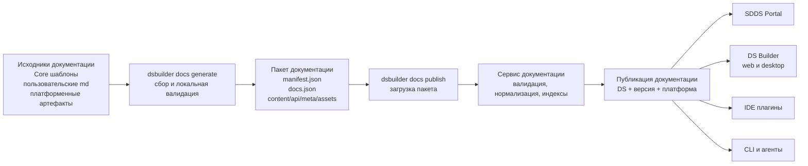

# ADR-0003: Сбор документации DS Builder CLI

## Статус
* На ревью.

## Контекст

Сервис документации, описанный в [ADR-0002: Документация](./ADR-0002-documentation.md), должен принимать готовый пакет
документации. Он не должен знать, где лежали исходные markdown-файлы, как резолвились шаблоны, какие платформенные
инструменты запускались и как генерировались примеры кода, скриншоты или info-артефакты.

Эта ответственность должна быть вынесена на сторону DS Builder CLI и платформенных инструментов. CLI должен собрать
исходники документации, Core шаблоны, пользовательские страницы, результаты платформенной генерации и подготовить единый
самодостаточный пакет для публикации в сервис документации.

## Решение

DS Builder CLI отвечает за локальную сборку документации и публикацию готового пакета:

- `dsbuilder docs generate` - локально собирает и валидирует пакет документации;
- `dsbuilder docs publish` - загружает готовый пакет в сервис документации.

Платформенные инструменты, например Android Docs Gradle Plugin, React/Swift CLI или аналогичные инструменты, отвечают за
платформенное насыщение: подстановку примеров, скриншотов, API-документации и info-артефактов. CLI координирует процесс и
собирает итоговый формат, но не должен самостоятельно реализовывать всю платформенную логику.

### Модель редактирования документации

На первом этапе принимается модель, в которой исходники документации хранятся в файлах:

- авторы редактируют `md`/`mdx` файлы и `structure.json` в репозитории или рабочей директории дизайн-системы;
- Core документация хранится рядом с кодом Core библиотек SDDS и поставляется как версионированный шаблонный артефакт;
- пользовательская документация хранится на уровне рабочей директории дизайн-системы, модуля или проекта;
- `dsbuilder docs generate` собирает исходники в пакет;
- `dsbuilder docs publish` отправляет пакет в сервис документации.

Такой режим проще внедрить, потому что он не требует сразу проектировать UI для редактирования документации, хранение
черновиков и совместное редактирование. Он также хорошо подходит для Core документации, где документация живет рядом с
кодом платформенных библиотек.

Целевое состояние - интерфейс DS Builder для создания и редактирования пользовательской документации:

- в web и desktop приложениях DS Builder должен появиться интерфейс для создания, редактирования и предпросмотра страниц;
- UI должен работать с той же логической моделью, что и файловые исходники: страницы, группы, `subjects`, порядок,
  `hidden`, `merge`, content-блоки и assets;
- результат редактирования должен уметь экспортироваться обратно в исходную файловую структуру или формировать тот же
  пакет, который сейчас собирает CLI;
- публикация через UI должна проходить через тот же сервис документации, чтобы не появилось второго способа публикации.

Плагин Figma/Pixso может быть отдельным клиентом для дизайнеров, но его роль должна быть вспомогательной:

- создавать или обновлять заметки, связанные с дизайн-компонентом или токеном;
- помогать выбирать `subjects` и связывать страницу с design artifact;
- прикладывать скриншоты, изображения или ссылки на дизайн-артефакты;
- инициировать черновик или изменение, которое затем попадает в DS Builder UI или файловые исходники.

Плагин не должен становиться единственным местом хранения документации. Иначе документация дизайна окажется привязанной к
конкретному инструменту и будет сложнее синхронизировать ее с платформенными документациями, CLI и агентами.

### Авторская файловая структура

Документация в исходниках должна храниться как файловая структура, близкая к тому, как человек ожидает видеть ее в
навигации портала или IDE. Директории внутри этой структуры описывают категории или смысловые группы, а `md`/`mdx` файлы
являются минимальными пользовательскими единицами документации.

Пример:

```text
docs/
  structure.json
  components/
    button/
      overview.md
      usage.md
      accessibility.md
    text-field/
      overview.md
      usage.md
  foundations/
    colors.md
    typography.md
```

Такая структура удобна авторам документации, но сама по себе недостаточна для публикации. Порядок страниц, публичные
заголовки, скрытые разделы, связи с сущностями дизайн-системы и платформенная принадлежность не должны выводиться только
из имени файла или пути. Поэтому в корне документации должен находиться `structure.json`.

`structure.json` описывает структуру, навигацию и метаданные документации. По смыслу он близок к `sidebars.ts` в
Docusaurus, но должен быть декларативным и пригодным для обработки CLI, сервисом документации и агентами.

Пример:

```json
{
  "schemaVersion": "1.0",
  "navigation": [
    {
      "title": "Components",
      "items": [
        {
          "title": "Actions",
          "items": [
            {
              "title": "Button",
              "subjects": ["components.button"],
              "items": [
                {
                  "title": "Overview",
                  "path": "components/button/overview.md"
                },
                {
                  "title": "Usage",
                  "path": "components/button/usage.md"
                },
                {
                  "title": "Accessibility",
                  "path": "components/button/accessibility.md"
                }
              ]
            }
          ]
        }
      ]
    }
  ]
}
```

Исходный `docs/structure.json` не должен описывать все технические детали публикации. Его задача - зафиксировать
смысловую структуру документации: категории, порядок страниц, семантические метки страниц и метаданные страниц. На основе
этого файла, насыщенных markdown-файлов, API-артефактов и info-артефактов CLI формирует итоговый `docs.json`.

Группы и категории описываются прямо в дереве `navigation`. Отдельный раздел `categories` не требуется: узел без `path` и
с массивом `items` считается навигационной группой, а узел с `path` считается страницей документации. Порядок элементов в
`items` определяет порядок отображения в портале, IDE и других клиентах.

`subjects` можно указывать как на странице, так и на группе. Если дочерняя страница не указала собственный `subjects`,
она наследует значения ближайшей родительской группы. Например, группа `Button` может иметь семантическую метку
`components.button`, а страницы `Overview`, `Usage` и `Accessibility` унаследуют эту связь.

Markdown-файл попадает в публичную документацию только если он указан в `structure.json`. Файлы, отсутствующие в дереве
навигации, считаются черновиками, частичными шаблонами, фрагментами примеров или служебными материалами для сборки. Для
локального предпросмотра CLI может поддержать автообнаружение по директориям, но для публикации документации
`structure.json` должен быть явным источником правды.

### Команды для поддержки `structure.json`

Чтобы обязательный `structure.json` не стал ручным барьером для авторов, DS Builder CLI должен помогать создавать и
поддерживать этот файл:

- `dsbuilder docs init` - создает стартовую структуру документации: директорию `docs/`, базовый `structure.json`, пример
  страницы и рекомендуемые директории для файлов и примеров;
- `dsbuilder docs structure update` - сканирует документационную директорию, находит новые markdown-файлы и предлагает
  добавить их в `structure.json`;
- команда обновления не должна молча публиковать все найденные markdown-файлы: новые страницы должны попадать в навигацию
  явно, через подтверждение автора, интерактивный режим или флаг;
- CLI должен сохранять уже заданный порядок, заголовки, `subjects`, `hidden` и `merge`, а не перегенерировать
  `structure.json` целиком;
- при обнаружении файлов, которых нет в `structure.json`, `docs generate` должен показывать предупреждение: это помогает
  найти забытые страницы, но не ломает сборку, если файл действительно является черновиком или частичным шаблоном.

Минимальная авторская единица документации - markdown-файл. Внутри одного файла может быть несколько блоков, разделенных
заголовками, таблицами, примерами и изображениями. Эти внутренние блоки важны для отображения и поиска, но автор не
должен описывать каждый markdown-заголовок в `structure.json` вручную.

### Subjects как семантические метки

`subjects` - это свободно задаваемые семантические метки, которые связывают страницы, фрагменты и машинно-собираемые
артефакты с предметами документации. Они похожи на теги технически, потому что это массив строк, но используются не для
произвольной маркировки, а для смысловой связи материалов между платформами и источниками.

Система не требует предварительной регистрации `subject` и не должна иметь закрытый enum всех возможных значений.
Одинаковые значения `subjects` считаются одной связующей меткой. Например, если документация дизайна, Compose и React
используют `components.button`, портал и поиск могут агрегировать эти материалы как относящиеся к Button.

При этом `subjects` не являются:

- идентификаторами страниц;
- путями файлов;
- ключами слияния Core и пользовательской документации;
- строгими ссылками на продуктовые сущности DS Builder;
- заменой info-артефактов и `CodeBinding`.

Начальные соглашения по именованию:

- использовать lowercase dot/kebab notation: `components.button`, `tokens.color`, `guidelines.accessibility`;
- не включать платформу в имя, если метка должна связывать документацию разных платформ;
- использовать общие префиксы там, где они помогают договориться между командами: `components.*`, `tokens.*`, `themes.*`,
  `foundations.*`, `patterns.*`, `guidelines.*`;
- для токенов обычно указывать группу токенов, например `tokens.color` или `tokens.spacing`, а не каждый конкретный токен;
- конкретные токены, стили, вариации и references в коде должны приходить из info-артефактов и `CodeBinding`, а не
  массово перечисляться в `subjects`.

Пользовательская документация может вводить новые `subjects` без предварительной регистрации, например
`patterns.checkout-form` или `brand.voice`. Чтобы `subjects` не превращались в несогласованный набор случайных тегов,
инструменты должны помогать авторам: показывать уже использованные значения, подсказывать похожие метки, предупреждать о
возможных опечатках и давать autocomplete в CLI/IDE.

`subjects` не участвуют в слиянии Core и пользовательского слоя; слияние выполняется по `path`.

### Машинно-собираемые артефакты

Часть документации создается автором как markdown, а часть собирается машинно из платформенных артефактов: `api.json`,
`components-info`, `theme-info` и подобных файлов. Такие артефакты не должны описываться как страницы в `structure.json`.
Их тип и формат фиксируются в `manifest.json` через `artifacts.type` и `artifacts.format`, чтобы сервис документации
понимал, как обрабатывать API, стили, токены и вариации.

В модели документации различаются:

- авторские страницы: произвольная структура и произвольные названия, описанные в `docs/structure.json`;
- внутренние markdown-блоки: заголовки, абзацы, таблицы, code blocks и изображения;
- машинно-собираемые артефакты: API, info-файлы токенов, стили, вариации и другие данные, которые описываются в
  `manifest.json`.

API-документация в MVP не обязана становиться отдельной структурированной моделью. Платформенный инструмент может
сгенерировать markdown-секцию или markdown-страницу с таблицами API, сигнатурами и описаниями. Сервис документации
обработает ее как обычную человекочитаемую документацию.

`components-info` и `theme-info` нужны для построения `CodeBinding`: точной связи между сущностью дизайн-системы и тем,
как она называется в коде конкретной платформы.

### Слияние Core и пользовательского слоя

Документация должна допускать композицию Core и пользовательского слоя. Core документация задает базовую структуру и
описание сущностей, а пользовательская документация может добавлять новые страницы, дополнять существующие страницы или
заменять их содержимое.

Core и пользовательский `structure.json` должны иметь одинаковую модель дерева. DS Builder CLI выполняет слияние этих
деревьев по относительному `path` страницы внутри документационной директории.

Базовые правила слияния:

- если `path` страницы совпадает, контент объединяется в порядке: Core, затем пользовательский слой;
- если `path` отсутствует в Core структуре, страница добавляется как новая;
- группы объединяются по положению в дереве и совпадающим заголовкам в рамках одной платформенной структуры;
- если пользовательская страница должна быть добавлена в определенное место, порядок задается ее позицией в
  пользовательском `structure.json` внутри найденной родительской группы;
- если CLI не может однозначно сопоставить группу или обнаруживает конфликт структуры, сборка документации завершается
  ошибкой.

Для изменения поведения слияния страница может указывать поле `merge`:

- `append` - добавить пользовательский контент после Core контента; используется по умолчанию;
- `prepend` - добавить пользовательский контент перед Core контентом;
- `replace` - заменить Core контент пользовательским.

Чтобы скрыть страницу или группу из итоговой документации, пользовательский `structure.json` может указать `hidden: true`
для соответствующего `path` страницы или группы в дереве. Скрытие влияет на итоговую навигацию и публикацию документации,
но не должно удалять исходные Core артефакты.

Пример пользовательского дополнения к Core структуре:

```json
{
  "schemaVersion": "1.0",
  "navigation": [
    {
      "title": "Components",
      "items": [
        {
          "title": "Button",
          "subjects": ["components.button"],
          "items": [
            {
              "title": "Overview",
              "path": "components/button/overview.md",
              "merge": "append"
            },
            {
              "title": "Company guidelines",
              "path": "components/button/company-guidelines.md"
            }
          ]
        }
      ]
    }
  ]
}
```

После слияния совпавшая страница `components/button/overview.md` будет содержать несколько ссылок на контент:

```json
{
  "title": "Overview",
  "path": "components/button/overview.md",
  "subjects": ["components.button"],
  "contentRefs": [
    {
      "source": "core",
      "path": "content/core/components/button/overview.md"
    },
    {
      "source": "user",
      "path": "content/user/components/button/company-overview.md"
    }
  ]
}
```

Поле `source` в `contentRefs` сохраняется как диагностическая и продуктовая метаинформация. Оно позволяет отличить Core
контент от пользовательского, показать происхождение блока в UI, упростить отладку merge-конфликтов и в дальнейшем
использовать разные правила доступа или аудита для разных слоев документации.

### Content и assets

Markdown-файлы являются content-артефактами и остаются отдельными файлами, чтобы не раздувать структурные JSON-файлы.
Скриншоты, изображения, большие примеры кода и sample-проекты являются assets и подключаются из документации через
стабильные идентификаторы или относительные ссылки.

На этапе насыщения платформенный инструмент должен проверить, что все такие ссылки разрешаются, а DS Builder CLI должен
включить эти файлы в итоговый пакет.

Общая структура документации состоит из трех уровней:

- авторская файловая структура в исходниках: удобна человеку и владельцам документации;
- `docs/structure.json`: описывает навигацию, порядок, связь с сущностями и метаданные страниц;
- `docs.json` и `manifest.json`: результат работы DS Builder CLI, который передается в сервис документации.

### Шаблоны документации

Core документация обезличена и содержит общую для всех дизайн-систем информацию. В связи с этим она выступает как шаблон
документации для дизайн-систем.

Core/platform шаблоны должны храниться не в продуктовой базе DS Builder как редактируемые записи, а как версионированные
артефакты. Причины:

- шаблоны привязаны к версии Core библиотеки и должны воспроизводиться вместе с ней;
- шаблоны включают markdown, фрагменты примеров, изображения и другую файловую структуру, которую удобнее хранить как
  артефакт;
- CLI должен иметь возможность скачать точную версию шаблонов и собрать документацию локально или в CI;
- база DS Builder должна хранить только метаданные шаблонного артефакта, если нужен каталог версий.

Рекомендуемая модель хранения шаблонов:

```text
template artifact storage:
  sdds-compose-core-docs-1.2.0.zip
  sdds-ios-core-docs-1.2.0.zip
  sdds-react-core-docs-1.2.0.zip

database metadata:
  platform
  coreVersion
  artifactUrl
  checksum
  schemaVersion
  createdAt
```

Способ публикации релиза Core документации может быть выбран командой платформы: вручную или отдельным release workflow.
Конечный результат один - из шаблонов собирается zip-архив и публикуется как шаблонный артефакт, доступный DS Builder
CLI. Это не является публикацией конечной документации через REST API сервиса документации.

При создании и публикации конечной документации дизайн-системы DS Builder CLI загружает архив с шаблонами Core
документации согласно используемой версии Core библиотеки SDDS.

### Насыщение документации

Насыщение документации выполняется платформенными инструментами генерации документации.

Процесс для Android Docs Gradle Plugin может выглядеть так:

- читает директории с Core шаблонами и пользовательской документацией;
- заменяет ключи в markdown-файлах на примеры кода и скриншоты;
- создает результирующую директорию `.sdds/temp/docs`;
- создает `.sdds/temp/docs/content/` и кладет туда насыщенные markdown-файлы;
- опционально кладет исходники примеров в `.sdds/temp/docs/assets/examples`;
- опционально кладет скриншоты в `.sdds/temp/docs/assets/screenshots`;
- опционально кладет API markdown или API json в `.sdds/temp/docs/api`;
- кладет info-файлы сгенерированного кода дизайн-системы в `.sdds/temp/docs/meta`, например `components-info.json` и
  `theme-info.json`.

Для других платформ процесс может отличаться, но результат должен быть одинаковым: CLI получает директорию с насыщенным
content, assets, API-артефактами и info-артефактами.

### Контракт пакета документации

После насыщения документации DS Builder CLI должен собрать единый пакет документации. Пакет является единственным входным
форматом сервиса документации: сервис принимает архив, валидирует его и строит из него нормализованную публикацию и базу
знаний.

Пакет должен содержать:

- `manifest.json` - служебное описание пакета: дизайн-система, версия, платформа, схема и список артефактов;
- `docs.json` - итоговая структура документации: навигация, страницы, `subjects`, ссылки на content и assets;
- `content/` - насыщенный markdown-контент страниц;
- `api/` - опциональные API-артефакты платформы, например результат Dokka, TypeDoc или другого инструмента;
- `meta/` - опциональные info-артефакты генерации дизайн-системы, например `components-info.json` и `theme-info.json`;
- `assets/` - опциональные изображения, скриншоты, примеры кода и другие файлы, используемые страницами.

Минимальный пакет обязан содержать `manifest.json`, `docs.json` и все content-файлы, на которые ссылается `docs.json`.
API/info-артефакты и assets являются опциональными, но если они объявлены в `manifest.json`, соответствующие файлы должны
присутствовать в архиве.

Пример структуры архива:

```text
manifest.json
docs.json
content/
  core/components/button/overview.md
  user/components/button/company-overview.md
api/
  compose-api.md
meta/
  components-info.json
  theme-info.json
assets/
  screenshots/button-default.png
  examples/button.kt
```

`manifest.json` описывает состав архива и позволяет сервису выполнить приемочную валидацию без глубокого разбора всех
файлов:

```json
{
  "schemaVersion": "1.0",
  "designSystem": {
    "id": "ds-uid",
    "version": "2.4.0"
  },
  "platform": "compose",
  "artifacts": [
    {
      "type": "resolved-docs",
      "path": "docs.json",
      "format": "dsb-resolved-docs-v1"
    },
    {
      "type": "content-root",
      "path": "content/"
    },
    {
      "type": "api-docs",
      "path": "api/compose-api.md",
      "format": "markdown"
    },
    {
      "type": "components-info",
      "path": "meta/components-info.json",
      "format": "sdds-compose-components-info-v1"
    },
    {
      "type": "theme-info",
      "path": "meta/theme-info.json",
      "format": "sdds-compose-theme-info-v1"
    },
    {
      "type": "asset-root",
      "path": "assets/"
    }
  ]
}
```

`docs.json` описывает итоговую структуру документации: какие есть страницы, с какими сущностями они связаны через
`subjects`, где лежит markdown-контент и какие assets привязаны.

```json
{
  "navigation": [
    {
      "title": "Components",
      "items": [
        {
          "title": "Button",
          "subjects": ["components.button"],
          "items": [
            {
              "title": "Описание",
              "path": "components/button/overview.md",
              "contentFormat": "markdown",
              "contentRefs": [
                {
                  "source": "core",
                  "path": "content/core/components/button/overview.md"
                }
              ]
            }
          ]
        }
      ]
    }
  ]
}
```

Инварианты пакета:

- все пути внутри `manifest.json` и `docs.json` должны быть относительными путями внутри архива;
- `docs.json` не должен содержать markdown-контент целиком, только ссылки на content-файлы;
- один content-файл может использоваться одной или несколькими страницами, если это явно указано в `docs.json`;
- markdown-файлы являются content-артефактами, а не assets;
- assets не участвуют в построении структуры документации напрямую, но могут быть связаны со страницами или markdown;
- каждый API/info-артефакт должен иметь `type` и `format`, чтобы сервис выбрал подходящий адаптер разбора;
- `components-info` и `theme-info` являются платформенно-специфичными артефактами; сервис не требует одинаковую JSON-схему
  для всех платформ, но каждый поддерживаемый формат должен иметь адаптер разбора;
- принадлежность info-артефакта к платформе определяется `platform` и `artifacts.format`, а не суффиксом имени файла;
- пакет должен быть самодостаточным: сервис не должен обращаться к исходным репозиториям или запускать платформенные
  инструменты для восстановления недостающих данных.

### Пайплайн DS Builder CLI

Команда `dsbuilder docs generate` выполняет локальную подготовку:

- получает контекст: идентификаторы проекта и дизайн-системы, версия, платформа, версии Core библиотек;
- загружает шаблоны Core документации как версионированный артефакт;
- читает пользовательскую документацию из рабочей директории;
- проверяет `structure.json`;
- делегирует насыщение платформенному инструменту;
- получает насыщенный markdown-контент, assets, API/info-артефакты;
- формирует `docs.json` и `manifest.json`;
- выполняет локальную валидацию пакета;
- пакует данные в zip-архив;
- очищает временные директории.

Команда `dsbuilder docs publish` выполняет загрузку:

- читает ранее собранный пакет;
- отправляет его в сервис документации;
- получает идентификатор задачи обработки;
- показывает пользователю статус публикации или диагностируемую ошибку.

Общий поток:



## Последствия

- Сервис документации остается сервисом публикации, чтения и поиска, а не инструментом сборки документации.
- Платформенные команды могут независимо развивать свои Gradle/CLI плагины, пока они выдают согласованный пакет.
- Core шаблоны версионируются вместе с Core библиотеками и доступны CLI как артефакты.
- Пользовательская документация в MVP остается файловой, но модель совместима с будущим UI для создания и редактирования
  документации.
- `structure.json` становится явным источником публичной навигации, а `docs.json` и `manifest.json` - входным контрактом
  сервиса документации.

## Открытые вопросы

- Где именно будет храниться каталог шаблонных артефактов: в DS Builder API, project-publisher или отдельном реестре?
- Какие платформенные форматы `components-info` и `theme-info` будут первыми поддержаны после Compose?
- Нужен ли отдельный локальный предпросмотр для результата `dsbuilder docs generate` до публикации в сервис?
