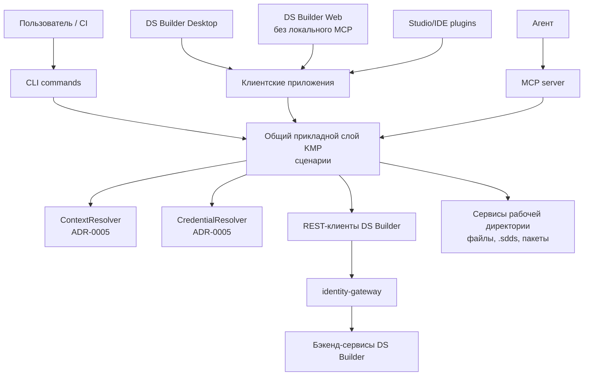

# ADR-0004: MCP сервер клиентской части DS Builder

## Статус
* На ревью.

## Контекст

Решение должно разрабатываться в [dsbuilder-frontend](../../dsbuilder-frontend/). Сейчас в этом проекте есть
[cli](../../dsbuilder-frontend/cli/) - Kotlin Multiplatform приложение, которое является локальной точкой интеграции с
DS Builder:

- хранит локальный контекст проекта в `.sdds/config.json`;
- знает `projectId`, `designSystemId` и окружение;
- умеет получать project-bound access key из среды выполнения;
- выполняет авторизованные REST-запросы в бэкенд DS Builder;
- пишет локальные артефакты дизайн-системы в `.sdds`;
- будет выполнять команды документации, описанные в
  [ADR-0003: Сбор документации DS Builder CLI](./ADR-0003-documentation-cli.md).

В дальнейшем в `dsbuilder-frontend` могут появиться другие клиенты DS Builder:

- desktop приложение;
- web приложение;
- плагин для Android Studio / IntelliJ IDEA;
- плагин для VS Code;
- другие интеграции, которым может быть нужен доступ к локальному проекту пользователя.

Локальным клиентам нужны те же возможности, что и CLI: доступ к контексту дизайн-системы, авторизации, REST-клиентам,
документации, темам, токенам и локальным артефактам. Web-клиент может переиспользовать общие модели, DTO и REST-клиенты,
но не должен зависеть от локальной рабочей директории и не должен запускать локальный MCP server. Правила локального
контекста, `.sdds`, авторизации пользователя и проектных ключей описаны в
[ADR-0005: Локальный контекст и авторизация DS Builder Frontend](./ADR-0005-frontend-local-context-auth.md). Если оставить
бизнес-логику внутри `cli`, каждый новый клиент будет либо дублировать ее, либо вызывать CLI как внешний процесс.

При этом агентам и IDE-инструментам неудобно работать с DS Builder только через shell-команды CLI:

- команды CLI оптимизированы под человека: stdout, progress, exit codes и интерактивные подтверждения;
- агентам нужны типизированные входные данные и структурированные ответы;
- ошибки должны быть машинно-читаемыми, а не только текстовыми;
- shell-проброс команд увеличивает риск небезопасных операций;
- при прямом вызове команд появляется лишний слой: MCP-инструмент -> парсер команд -> прикладной сценарий -> REST-клиент.

Нужен MCP сервер, который позволит агентам получать доступ к возможностям DS Builder через безопасный и структурированный
интерфейс. Локальный MCP сервер должен быть доступен не только из терминального CLI, но и из других локальных
клиентских приложений, которые могут запускать процессы на устройстве пользователя: desktop-приложения и IDE-плагинов.
Обычное web-приложение в браузере локальный MCP сервер запускать не будет.

## Решение

Бизнес-логика [cli](../../dsbuilder-frontend/cli/) должна быть вынесена в общий прикладной слой Kotlin Multiplatform
внутри `dsbuilder-frontend`. Терминальный CLI остается тонкой оберткой для запуска сценариев из терминала.

MCP сервер должен быть реализован как отдельная Kotlin Multiplatform библиотека/модуль поверх того же прикладного слоя.
Его смогут использовать:

- терминальный CLI через команду `dsbuilder mcp serve`;
- desktop приложение;
- IDE-плагины;
- другие локальные клиенты DS Builder.

Ключевое решение:

> CLI-команды, MCP-инструменты и будущие клиентские приложения являются разными интерфейсами к одним прикладным
> сценариям. MCP сервер не должен быть тонкой оберткой над shell-командами CLI, кроме временного режима совместимости.

Логическая структура:

```text
dsbuilder-frontend
  общие прикладные модули
    разрешение контекста
    разрешение учетных данных
    REST-клиенты
    клиент документации
    клиент тем
    сценарии документации
    сервисы локальной рабочей директории

  cli приложение
    dsbuilder init
    dsbuilder status
    dsbuilder theme fetch
    dsbuilder docs generate
    dsbuilder docs publish
    dsbuilder mcp serve

  библиотека/среда выполнения MCP server
    tools/list
    tools/call

  будущие приложения
    desktop приложение
    web приложение
    Android Studio / IntelliJ IDEA plugin
    VS Code plugin
```

Такой подход позволяет:

- переиспользовать общий механизм разрешения контекста и учетных данных из ADR-0005;
- не дублировать REST-клиенты;
- возвращать агентам структурированные ответы;
- вводить отдельные правила подтверждений для опасных операций;
- развивать CLI, MCP и будущие приложения поверх одних доменных сценариев;
- дать локальным клиентам DS Builder возможность поднять MCP сервер на устройстве пользователя.

## Архитектура



### Модульная декомпозиция

Целевая декомпозиция `dsbuilder-frontend`:

```text
dsbuilder-frontend/
  cli/
    терминальная обертка, парсинг аргументов, stdout/stderr, exit codes

  core/application/
    прикладные сценарии, прикладные сервисы, модели результатов и ошибок

  core/workspace/
    работа с локальными файлами, безопасные пути, операции рабочей директории

  core/network/
    REST-клиенты, заголовки gateway/auth, политика повторных запросов, преобразование DTO

  core/auth/
    разрешение учетных данных, авторизация пользователя и поддержка проектного ключа

  mcp/
    MCP-инструменты, среда выполнения сервера, преобразование результата сценария в MCP-ответ

  desktop/ или app/
    будущий DS Builder desktop клиент

  web/
    будущий DS Builder web клиент без запуска локального MCP server

  plugins/
    будущие IDE-плагины или общие SDK для них
```

Названия модулей могут быть уточнены при реализации. Важен принцип: `cli` не должен быть владельцем бизнес-логики.
Он должен зависеть от общих модулей так же, как MCP сервер и будущие приложения.

### Runtime модель

MCP сервер может запускаться несколькими способами:

```text
dsbuilder mcp serve
DS Builder Desktop -> start local MCP server
IDE plugin -> start local MCP server
```

Во всех вариантах сервер запускается локально на устройстве пользователя. Среда выполнения MCP получает активный контекст
и учетные данные от общего прикладного слоя клиентской части. Правила выбора контекста, источники `.sdds`, глобальных
пользовательских настроек, настроек запускающего приложения, авторизации пользователя и проектных ключей описаны в
ADR-0005.

Обычное web-приложение в браузере не запускает локальный MCP server. Web-клиент продолжает работать через REST API
бэкенда и gateway. Удаленный MCP server для web/облачных агентских сценариев можно рассмотреть отдельно, но это не входит
в данное решение о локальной среде выполнения MCP в `dsbuilder-frontend`.

MCP сервер не хранит секреты и не решает RBAC локально. Он использует общий механизм учетных данных, а решение о доступе
принимает бэкенд/gateway.

### Граница между CLI, MCP и приложениями

CLI-команда отвечает за пользовательский сценарий в терминале:

```text
dsbuilder docs publish
  -> парсинг аргументов
  -> progress и человекочитаемый вывод
  -> DocsPublishUseCase
  -> exit code
```

MCP-инструмент отвечает за агентский сценарий:

```text
docs_publish
  -> типизированная схема входных данных
  -> DocsPublishUseCase
  -> структурированный результат
  -> машинно-читаемая диагностика
```

Desktop-приложение или IDE-плагин отвечают за интерактивный UI-сценарий:

```text
Publish documentation button
  -> состояние интерфейса и подтверждение пользователя
  -> DocsPublishUseCase
  -> модель прогресса
  -> диагностика в интерфейсе
```

Общий код должен находиться ниже интерфейсного слоя:

- прикладной сценарий;
- REST-клиент;
- механизм разрешения учетных данных;
- локальный контекст проекта;
- файловые сервисы рабочей директории;
- преобразователи и модели ошибок.

Интерфейсный слой отличается:

- CLI форматирует результат в stdout/stderr и exit code;
- MCP возвращает JSON-совместимый результат, код ошибки, диагностику и сервисные ссылки на найденные данные, например
  `kbUrl` сервиса документации.
- UI-клиенты отображают прогресс, предпросмотр, подтверждения и диагностику в интерфейсе.

MCP сервер не должен выполнять произвольные shell-команды и не должен предоставлять инструмент вида
`run_cli_command(command)`. Каждая операция должна быть отдельным типизированным инструментом с явной схемой входа и
выхода.

## Набор инструментов

Точный список MCP-инструментов должен определяться вместе с финальным набором REST API бэкенд-сервисов DS Builder. В этом
ADR фиксируются не конкретные имена всех инструментов, а группы возможностей, которые MCP server должен уметь
представлять агентам.

Инструменты должны быть типизированными и предметными. MCP server не должен предоставлять универсальный инструмент вида
`call_rest_endpoint(method, path, body)`, потому что это превращает MCP в небезопасный прокси к API бэкенда. При этом
каждый инструмент может внутри вызывать один или несколько REST API через общий прикладной слой.

### Группы инструментов

| Группа | Назначение | Примеры инструментов |
| --- | --- | --- |
| Контекст проекта | Получить локальный и удаленный контекст текущей дизайн-системы. | `design_system_get_context`, `design_system_get_versions`, `project_get_capabilities` |
| Документация | Искать и читать опубликованную документацию. | `documentation_search`, `documentation_fetch`, `documentation_get_page`, `documentation_get_navigation` |
| CodeBinding | Получать точные references в коде для токенов, компонентов, стилей и вариаций. | `code_binding_get`, `code_binding_search` |
| Токены | Читать токены, группы токенов, значения токенов и связи с темами. | `tokens_list`, `token_get`, `token_values_get` |
| Темы | Читать темы, тенанты, палитру и платформенные значения. | `themes_list`, `theme_get`, `tenants_list`, `palette_get` |
| Компоненты | Читать компоненты, конфигурации, вариации и доступные платформенные представления. | `components_list`, `component_get`, `component_variations_get` |
| Локальная рабочая директория | Проверять состояние локальной рабочей директории и валидировать локальные артефакты. | `workspace_status`, `workspace_read_generated_artifact`, `docs_validate` |
| Сбор документации | Создавать и обновлять исходники документации, собирать пакет. | `docs_init`, `docs_structure_update`, `docs_generate` |
| Публикация | Выполнять операции, которые меняют состояние бэкенда. | `docs_publish`, `docs_ingestion_status` |

Примеры имен в таблице не являются финальным контрактом. Финальные имена, схемы входных и выходных данных и коды ошибок
должны быть зафиксированы на этапе реализации соответствующих REST API бэкенда и прикладных сценариев.

### Этапность

На первом этапе разумно начать с инструментов только для чтения:

- контекст проекта;
- документация;
- `CodeBinding`;
- токены;
- темы;
- компоненты.

Эти инструменты не изменяют локальные файлы и не публикуют данные. Они дают агенту базовый контекст дизайн-системы: что
есть в проекте, какие токены и компоненты доступны, где лежит документация и какие ссылки на код нужно использовать.

Следующим этапом можно добавить инструменты локальной рабочей директории:

- проверка локальной рабочей директории;
- чтение локально сгенерированных артефактов;
- валидация документации;
- `docs_init`;
- `docs_structure_update`;
- `docs_generate`.

Инструменты, которые меняют файлы в рабочей директории, должны возвращать не только итоговый статус, но и план изменений,
список созданных/измененных файлов и диагностику. Для операций записи нужен режим подтверждения со стороны MCP-клиента
или явный флаг, разрешающий изменение рабочей директории.

Публикация меняет состояние бэкенда и должна быть выделена отдельно. Например, `docs_publish` должен требовать
подтверждения и возвращать `jobId`, статус приемочной валидации и ссылку на последующую диагностику.

### MCP resources

MCP resources в MVP не вводятся. Для чтения конкретных сущностей используются инструменты `get_*`, например:

- `documentation_get_page`;
- `documentation_get_chunk`;
- `code_binding_get`;
- `token_get`;
- `component_get`;
- `theme_get`.

Такое решение уменьшает количество интерфейсов и не заставляет поддерживать два способа чтения одного и того же объекта:
инструмент `get_*` и resource URI. Resources можно рассмотреть позже как дополнительный слой только для чтения, если
конкретные MCP-клиенты будут лучше работать с адресуемыми документами и появится практическая польза от URI-модели.

Это решение не отменяет `kbUrl` и ресурсы базы знаний сервиса документации из
[ADR-0002](./ADR-0002-documentation.md). `kbUrl` остается адресом опубликованного фрагмента внутри сервиса документации:
MCP-инструмент поиска может вернуть `kbUrl`, а MCP-инструмент чтения может получить по нему полный фрагмент через общий
прикладной слой и REST API сервиса документации.

## Авторизация и доступ

MCP сервер наследует модель доступа общего прикладного слоя клиентской части, описанную в ADR-0005:

- получает разрешенный контекст от запускающего приложения или механизма разрешения контекста;
- получает учетные данные от общего механизма учетных данных;
- передает учетные данные в бэкенд через общий REST-клиент;
- не вычисляет RBAC локально;
- не хранит секреты;
- получает `401`, `403`, `404` и другие ошибки от бэкенда/gateway и возвращает их как структурированную диагностику.

Если MCP-инструмент вызывается без разрешенного контекста, сервер должен вернуть диагностируемую ошибку:

```json
{
  "code": "CONTEXT_NOT_FOUND",
  "message": "Не выбран проект, дизайн-система, версия и платформа."
}
```

Для публичной документации возможен режим чтения без проектного ключа, если он поддержан сервисом документации и gateway.
Но локальный MCP сервер не должен сам решать, что публикация публичная: это должен подтвердить бэкенд.

## Ошибки и диагностика

MCP-инструменты должны возвращать стабильную структуру ошибки:

```json
{
  "code": "FORBIDDEN",
  "message": "Недостаточно прав для чтения документации.",
  "details": {
    "httpStatus": 403,
    "projectId": "project-123",
    "designSystemId": "ds-456"
  }
}
```

Для инструментов, которые вызывают сценарий документации, диагностика должна быть совместима с диагностикой из ADR-0002 и
ADR-0003:

- `level`;
- `code`;
- `message`;
- `path`;
- `artifactType`;
- `subject`;
- `details`.

Это позволит агенту не парсить текстовый вывод CLI, а принимать решения по стабильным кодам ошибок.

## Безопасность

MCP сервер расширяет поверхность доступа к локальному проекту и бэкенду, поэтому вводятся ограничения:

- не предоставлять инструмент для произвольного запуска CLI или shell-команд;
- не отдавать учетные данные агенту;
- не логировать учетные данные;
- явно разделять инструменты только для чтения, инструменты записи в рабочую директорию и инструменты публикации;
- для операций записи и публикации требовать подтверждение или режим запуска, который явно разрешает такие действия;
- возвращать только относительные пути внутри рабочей директории, если абсолютный путь не нужен для диагностики;
- не обходить RBAC бэкенда локальными проверками.

## Последствия

- MCP становится альтернативным интерфейсом к общим возможностям `dsbuilder-frontend`, а не отдельным бэкенд-сервисом и
  не оберткой над терминальным CLI.
- Авторизация, REST-клиенты и механизм разрешения контекста не дублируются между CLI, MCP и будущими приложениями.
- Агенты получают типизированные инструменты вместо shell-команд и stdout.
- Для сценариев только для чтения MCP можно внедрить раньше, чем для операций записи и публикации.
- Для реализации потребуется вынести бизнес-логику из `dsbuilder-frontend/cli` в общие Kotlin Multiplatform модули.
- Терминальный CLI останется тонкой оберткой над общими прикладными сценариями.
- Локальные клиенты DS Builder смогут запускать MCP сервер на устройстве пользователя и давать агенту доступ к тому же
  разрешенному контексту.
- Web-клиент не запускает локальный MCP server; удаленный MCP server остается отдельным рассматриваемым направлением.

## Открытые вопросы

- Нужно ли поддерживать MCP server как долгоживущий процесс только через stdio, или также нужен локальный HTTP/SSE режим
  для desktop-приложения и IDE?
- Нужен ли удаленный MCP server для web-клиента и облачных агентских сценариев, или web должен ограничиться REST API и
  интеграциями на стороне бэкенда?
- Где хранить пользовательские настройки разрешений MCP-инструментов: в глобальной пользовательской конфигурации,
  настройках запускающего приложения или настройках MCP-клиента?
- Нужен ли отдельный список разрешенных инструментов для CI, чтобы MCP server в автоматизации работал только в режиме
  чтения?
- Какой минимальный набор инструментов должен быть доступен в первой версии: только документация или также темы/токены?
- Какие общие KMP-модули выделить первыми из текущего `dsbuilder-frontend/cli`: `core/application`, `core/network`,
  `core/workspace`, `core/auth` или более компактный начальный набор?
