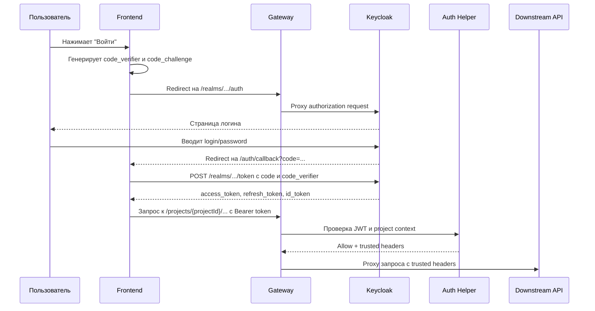

# Identity Gateway

Identity Gateway - локальная и production-ready основа аутентификации DS Builder:

- Keycloak отвечает за identity пользователей, login, self-registration, refresh tokens и global roles.
- nginx Gateway является edge-точкой входа для browser/API traffic.
- Auth Helper проверяет Keycloak JWT для user-scoped и project-scoped запросов Gateway и возвращает trusted request-context headers.
- Auth Helper также проверяет project-bound access keys для machine-to-machine project-scoped запросов.
- `projects-service` является source of truth для project membership и effective project role checks.

## Project Access Keys

Gateway поддерживает два типа project-scoped авторизации:

- `Authorization: Bearer <jwt>` для user actor.
- `Authorization: ProjectKey <access-key>` или `Authorization: <access-key>` для `project_key` actor.

Project access key используется только для project-scoped routes, например:

```text
/projects/{projectId}
/projects/{projectId}/members
/projects/{projectId}/...
```

Для project key flow Gateway:

1. читает `Authorization`;
2. отличает JWT от project access key;
3. вызывает `projects-service` internal endpoint `POST /internal/access-keys/verify`;
4. при успехе прокидывает downstream trusted headers:
   `X-Actor-Type: project_key`, `X-Project-Id`, `X-Project-Key-Id`, `X-Project-Scopes`.

Scope для `project_key` вычисляются в `projects-service`. Gateway сам scope не вычисляет и не расширяет.

## Локальный запуск

При необходимости можно создать [`.env.local.example`](./.env.local.example) -> `identity-gateway/.env.local`. Скрипт [start-local.sh](../start-local.sh) автоматически подхватит этот файл перед запуском compose и bootstrap Keycloak.

```bash
cp identity-gateway/.env.local.example identity-gateway/.env.local
./start-local.sh --detach
```

Основные URL:

| URL | Назначение |
| --- | --- |
| `http://localhost:8080/auth/login` | Страница входа пользователя |
| `http://localhost:8080/auth/register` | Страница self-registration |
| `http://localhost:8080/auth/account` | Keycloak account console |
| `http://localhost:8080/auth/logout` | Browser logout через Keycloak |
| `http://localhost:8080/api/projects` | Gateway entrypoint для Projects API |
| `http://localhost:8090/admin` | Keycloak admin console |
| `http://localhost:8091/health` | Healthcheck Auth Helper |

Локальный compose stack также поднимает внутренние `projects-db` и `projects-service`. Они используются самим Gateway и не требуют отдельного standalone запуска `projects-service` для обычной e2e разработки.

Admin credentials для локальной разработки:

```text
admin / admin
```

Seed users:

```text
user@example.com / password
user2@example.com / password
admin@example.com / password
```

При старте локального stack корневой `start-local.sh` также bootstrap-ит confidential client `projects-service` в Keycloak и назначает service account read-only роли для user lookup (`query-users`, `view-users`). Это нужно для сценария `POST /projects/{projectId}/members` по email.

Если меняется код `projects-service`, который используется через Gateway, достаточно пересобрать именно этот stack:

```bash
./start-local.sh --down
./start-local.sh --detach
```

Остановить stack:

```bash
./start-local.sh --down
```

Быстрая smoke-проверка token/API flow:

```bash
./smoke/check-api-flow.sh
```

Быстрая smoke-проверка browser login flow:

```bash
./smoke/check-browser-flow.sh
```

## Short URL

Gateway предоставляет короткие user-facing URL:

```text
/auth/login
/auth/register
/auth/account
/auth/logout
```

Они полезны не только локально. В production их тоже имеет смысл оставить как стабильный фасад Gateway:

- frontend и пользователи не зависят от внутренних Keycloak paths;
- можно менять realm/client/Keycloak deployment без переписывания ссылок в UI;
- Gateway остается единой публичной точкой входа;
- проще добавлять rate limit, access logs, security headers и audit.

При этом стандартные OIDC endpoints лучше тоже оставлять доступными через Gateway, потому что OIDC libraries и discovery metadata ожидают canonical paths:

```text
/realms/dsbuilder/.well-known/openid-configuration
/realms/dsbuilder/protocol/openid-connect/auth
/realms/dsbuilder/protocol/openid-connect/token
/realms/dsbuilder/protocol/openid-connect/certs
```

То есть красивые URL - это удобный фасад для human-facing действий, а canonical OIDC endpoints - стабильный контракт для SDK и discovery.

## Login flow для frontend

Frontend приложения должны использовать Authorization Code Flow with PKCE. Ниже тот же flow, но уже в практическом виде: что именно делает браузер, что делает frontend-код, и в какой момент появляется JWT.

### Что происходит по шагам

1. Пользователь нажимает кнопку "Войти" в UI.
2. Frontend генерирует случайный `code_verifier`.
3. Frontend вычисляет `code_challenge = BASE64URL(SHA256(code_verifier))`.
4. Frontend сохраняет `code_verifier` во временном client state до завершения login flow.
5. Browser уходит на authorization endpoint Keycloak через Gateway.
6. Пользователь вводит login/password на странице Keycloak.
7. Keycloak редиректит browser на `redirect_uri` frontend-приложения с query-параметром `code`.
8. Frontend callback handler читает `code`, берет сохраненный `code_verifier` и вызывает token endpoint.
9. Keycloak возвращает `access_token`, `refresh_token`, `id_token`.
10. Frontend сохраняет session state по выбранной архитектуре и начинает вызывать protected API с `Authorization: Bearer <access_token>`.

Важно: `code` из callback URL - это не JWT. Это короткоживущий одноразовый authorization code, который сам по себе не дает доступа к API.

### Кто за что отвечает

| Компонент | Ответственность |
| --- | --- |
| Keycloak | Login UI, учетные данные, выдача authorization code и tokens |
| Gateway | Публичная точка входа, proxy до Keycloak, защита project-scoped API через Auth Helper |
| Frontend | Запуск login flow, хранение PKCE state, callback handler, token exchange, вызовы API |
| Auth Helper | Проверка Bearer JWT и project access key для project-scoped API, формирование trusted headers |

### Схема login flow



### Login redirect

Для ручной проверки можно открыть короткий URL:

```text
http://localhost:8080/auth/login
```

Он редиректит на realm authorization endpoint:

```text
http://localhost:8080/realms/dsbuilder/protocol/openid-connect/auth
```

Но для реальной frontend-интеграции обычно используется не просто переход на `/auth/login`, а полноценная сборка authorization URL с PKCE-параметрами. Пример:

```text
GET http://localhost:8080/realms/dsbuilder/protocol/openid-connect/auth
  ?client_id=dsbuilder-api
  &response_type=code
  &scope=openid
  &redirect_uri=http://localhost:3000/auth/callback
  &code_challenge=<base64url-sha256-code-verifier>
  &code_challenge_method=S256
```

Параметры:

| Параметр | Значение |
| --- | --- |
| `client_id` | OIDC client в realm, сейчас `dsbuilder-api` |
| `response_type=code` | Просим authorization code flow |
| `scope=openid` | Базовый OIDC scope |
| `redirect_uri` | URL frontend callback handler |
| `code_challenge` | SHA-256 от `code_verifier` в Base64URL |
| `code_challenge_method=S256` | Говорим Keycloak, что используем PKCE через SHA-256 |

В `redirect_uri` нужно передавать реальный callback URL frontend-приложения. Сейчас local realm рассчитан на локальный запуск; когда появится UI, добавь его callback URL и web origins в `keycloak/dsbuilder-realm.json`.

### Обработчик callback

Обработчик callback должен жить во frontend-приложении или в будущем BFF/session service, а не в Auth Helper.

## Production docker-compose

Для production добавлен [docker-compose.prod.yml](../docker-compose.prod.yml), env-шаблон [`.env.prod.example`](../.env.prod.example), отдельный nginx-шаблон [nginx.prod.conf.template](./gateway/nginx.prod.conf.template) и встроенный `keycloak` stack для сценария, когда все сервисы живут на одной машине.

Для локальной разработки используется отдельный конфиг [nginx.local.conf](./gateway/nginx.local.conf), чтобы не смешивать dev и production routing.

Что входит в stack:

- `gateway` как единственная публичная точка входа;
- `keycloak` во внутренней сети compose;
- `auth-helper` и `projects-service` только во внутренней сети compose;
- все runtime-переменные контейнеров объявлены прямо в корневом `docker-compose.prod.yml` через `${VAR}`, поэтому одинаково работают и с локальным `--env-file .env.prod`, и с переменными окружения, заданными платформой деплоя;
- `auth-helper` и встроенный `projects-service` собираются из корня checkout репозитория через `build.context: .`;
- внешние PostgreSQL для `keycloak` и `projects-service` задаются через env.

Что нужно заполнить перед запуском:

- admin credentials и DB credentials для `keycloak`;
- общий `PROJECTS_INTERNAL_API_KEY` для связки `auth-helper -> projects-service`;
- публичные и внутренние адреса Keycloak (`KEYCLOAK_ISSUER`, `KEYCLOAK_JWKS_URL`, `PROJECTS_IDENTITY_KEYCLOAK_BASE_URL`, `KEYCLOAK_UPSTREAM_HOST`);
- `OIDC_REDIRECT_URI` и `OIDC_WEB_ORIGIN` без `localhost`, например `https://app.example.com/auth/callback` и `https://app.example.com`.

Запускать production compose нужно из корня checkout репозитория, чтобы Docker build context видел и `identity-gateway`, и `projects-service`.

Пример запуска на сервере:

```bash
cp .env.prod.example .env.prod
docker compose --env-file .env.prod -f docker-compose.prod.yml up --build -d
```

Важно:

- `KEYCLOAK_UPSTREAM_HOST` должен резолвиться из контейнера `gateway`; обычно это DNS-имя внешнего Keycloak или имя контейнера в общей docker-сети;
- `KEYCLOAK_ISSUER` должен совпадать с публичным URL, который попадет в claim `iss`;
- `KEYCLOAK_JWKS_URL` в current stack можно держать внутренним, например `http://keycloak:8080/.../certs`;
- `KC_DB_URL_DATABASE`, `KC_DB_USERNAME` и `KC_DB_PASSWORD` выводятся автоматически из `KEYCLOAK_POSTGRES_*`;
- если используете отдельный production stack `projects-service`, синхронизируйте `PROJECTS_INTERNAL_API_KEY` между стеками вручную.

Production nginx дополнительно публикует:

- `/admin/` - Keycloak admin console через gateway;
- `POST /auth/token` - alias для Keycloak token endpoint;
- `POST /auth/logout` - alias для Keycloak OIDC logout endpoint.

Прямой `KEYCLOAK_ADMIN_PORT` в production compose по умолчанию привязан к `127.0.0.1`; для внешнего доступа используйте gateway `/admin/`.

Production Keycloak bootstrap отключает self-registration, email verification и password reset через email. Realm user profile не требует `email`, `firstName` и `lastName`, поэтому ручной пользователь в admin console может состоять только из `username` и `password`. `/auth/login`, `/auth/register`, canonical registration endpoint и browser registration action в production закрыты и возвращают `404`; авторизация идет через `POST /auth/token`.

Пример callback URL:

```text
http://localhost:3000/auth/callback?code=<authorization-code>&session_state=<session-state>
```

Минимальный алгоритм обработчика callback:

1. Прочитать `code` из query-параметров.
2. Проверить, что в локальном client state есть сохраненный `code_verifier`.
3. Отправить `POST` на token endpoint.
4. Получить `access_token`, `refresh_token`, `id_token`.
5. Сохранить session state согласно frontend-архитектуре.
6. Очистить временный login state, связанный с PKCE.
7. Перевести пользователя на защищенный экран приложения.

Если пользователь вернулся на callback без `code`, это неуспешный login flow или отмена авторизации. Такой сценарий frontend тоже должен обрабатывать явно.

### Token exchange

Canonical token endpoint:

```text
POST http://localhost:8080/realms/dsbuilder/protocol/openid-connect/token
```

Для token exchange лучше использовать canonical endpoint или discovery metadata. OIDC libraries лучше настраивать через discovery:

```text
GET http://localhost:8080/realms/dsbuilder/.well-known/openid-configuration
```

Тело запроса:

```text
grant_type=authorization_code
client_id=dsbuilder-api
code=<authorization-code>
redirect_uri=<same-redirect-uri-used-for-login>
code_verifier=<original-code-verifier>
```

Content type:

```text
application/x-www-form-urlencoded
```

Пример запроса:

```bash
curl -X POST http://localhost:8080/realms/dsbuilder/protocol/openid-connect/token \
  -H 'Content-Type: application/x-www-form-urlencoded' \
  -d 'grant_type=authorization_code' \
  -d 'client_id=dsbuilder-api' \
  -d 'code=<authorization-code>' \
  -d 'redirect_uri=http://localhost:3000/auth/callback' \
  -d 'code_verifier=<original-code-verifier>'
```

Успешный ответ содержит:

- `access_token` - Bearer JWT для вызова API;
- `refresh_token` - token для продления session;
- `id_token` - OIDC identity token для UI/identity use cases;
- `expires_in`, `refresh_expires_in`, `token_type`, `scope`.

### Что frontend делает с токенами

В рамках этой foundation frontend должен считать `access_token` единственным входом в protected API:

```text
Authorization: Bearer <access_token>
```

`id_token` не используется для авторизации project-scoped API. `refresh_token` нужен только для продления пользовательской session.

Точная стратегия хранения токенов зависит от архитектуры UI:

- SPA без BFF обычно хранит session state на клиенте и сама делает refresh flow;
- BFF/service-session вариант хранит токены на серверной стороне и отдает браузеру cookie-сессию.

В этой change реализована только foundation для JWT validation на gateway side. Browser session management сюда не входит.

### Что именно проверять при интеграции frontend

Если frontend login flow реализован правильно, то должны выполняться все пункты:

1. Browser открывает login page через Gateway.
2. После успешного логина frontend получает callback с `code`.
3. Callback handler успешно меняет `code` на `access_token`.
4. Вызов protected API с `Authorization: Bearer <access_token>` больше не получает `401`.
5. Project-scoped API проходит через Gateway и доходит до downstream.

Для локальной проверки уже есть smoke-скрипты:

```bash
./smoke/check-browser-flow.sh
./smoke/check-api-flow.sh
```

Первый проверяет browser-facing login chain через Gateway. Второй проверяет получение токена и проход через protected API.

## Protected API requests

После login protected project routes вызываются через Gateway:

```text
GET http://localhost:8080/api/projects/{projectId}/...
Authorization: Bearer <access_token>
```

Gateway вызывает Auth Helper перед проксированием project-scoped routes. Downstream-сервисы получают trusted headers только от Gateway:

```text
X-Actor-Type
X-User-Id
X-Project-Id
X-Project-Role
X-System-Admin
```

Внешние клиенты не должны рассчитывать на самостоятельную передачу этих headers. Gateway удаляет incoming trusted headers и устанавливает новые только после allow-ответа Auth Helper.

## Текущий scope foundation

Эта foundation не реализует frontend session и callback UI.

При этом локальный stack уже интегрирован с `projects-service` как source of truth для project membership и project-scoped RBAC:

- `auth-helper` использует HTTP access-check до `projects-service`;
- `projects-service` поддерживает add-member по email зарегистрированного Keycloak user;
- local bootstrap создает Keycloak client `projects-service` для read-only lookup через Admin API.
