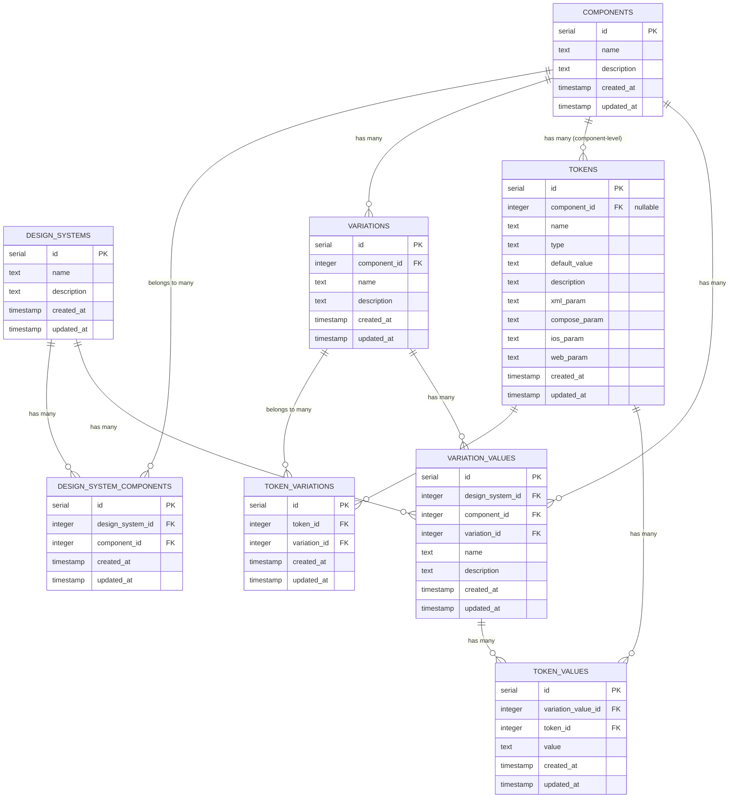

# Database Schema Documentation

## Overview

This document provides a comprehensive visualization and explanation of the Design System Builder database schema. The database is designed to support flexible design token management across multiple platforms and design systems with many-to-many relationships between tokens and variations.

## Entity Relationship Diagram



## Table Descriptions

### Core Entities

#### `design_systems`
The top-level container for design systems. Each design system represents a cohesive set of design standards and guidelines.

**Fields:**
- `id` (serial, PK) - Unique identifier
- `name` (text, required) - Name of the design system
- `description` (text, optional) - Description of the design system
- `created_at`, `updated_at` (timestamp) - Audit fields

#### `components`
Reusable UI components that can be part of multiple design systems.

**Fields:**
- `id` (serial, PK) - Unique identifier
- `name` (text, required) - Component name (e.g., "Button", "Card")
- `description` (text, optional) - Component description
- `created_at`, `updated_at` (timestamp) - Audit fields

#### `variations`
Different variants or states of a component (e.g., primary button, secondary button).

**Fields:**
- `id` (serial, PK) - Unique identifier
- `component_id` (integer, FK) - Reference to parent component
- `name` (text, required) - Variation name
- `description` (text, optional) - Variation description
- `created_at`, `updated_at` (timestamp) - Audit fields

#### `tokens`
Design tokens that define the visual properties (colors, spacing, typography, etc.) for components. Tokens belong to components and can be assigned to multiple variations through the junction table.

**Fields:**
- `id` (serial, PK) - Unique identifier
- `component_id` (integer, FK, optional) - Reference to parent component
- `name` (text, required) - Token name
- `type` (text, required) - Token type (color, spacing, typography, etc.)
- `default_value` (text, optional) - Default token value
- `description` (text, optional) - Token description
- `xml_param` (text, optional) - XML-specific parameter for Android
- `compose_param` (text, optional) - Jetpack Compose parameter
- `ios_param` (text, optional) - iOS-specific parameter
- `web_param` (text, optional) - Web-specific parameter
- `created_at`, `updated_at` (timestamp) - Audit fields

**Business Rules:**
- Tokens belong to components (`component_id`)
- Tokens can be assigned to multiple variations of their component
- Variations can use multiple tokens from their component

#### `token_variations`
Junction table that implements the many-to-many relationship between tokens and variations. This allows a token to be used in multiple variations and a variation to use multiple tokens.

**Fields:**
- `id` (serial, PK) - Unique identifier
- `token_id` (integer, FK) - Reference to token
- `variation_id` (integer, FK) - Reference to variation
- `created_at`, `updated_at` (timestamp) - Audit fields
- **Unique Constraint**: `(token_id, variation_id)` - Prevents duplicate assignments

#### `variation_values`
Specific instances of variations within design systems, representing how a variation is implemented in a particular design system.

**Fields:**
- `id` (serial, PK) - Unique identifier
- `design_system_id` (integer, FK) - Reference to design system
- `component_id` (integer, FK) - Reference to component
- `variation_id` (integer, FK) - Reference to variation
- `name` (text, required) - Instance name
- `description` (text, optional) - Instance description
- `created_at`, `updated_at` (timestamp) - Audit fields

#### `token_values`
The actual values assigned to tokens in specific variation instances.

**Fields:**
- `id` (serial, PK) - Unique identifier
- `variation_value_id` (integer, FK) - Reference to variation value
- `token_id` (integer, FK) - Reference to token
- `value` (text, required) - The actual token value
- `created_at`, `updated_at` (timestamp) - Audit fields

### Junction Tables

#### `design_system_components`
Many-to-many relationship table connecting design systems and components.

**Fields:**
- `id` (serial, PK) - Unique identifier
- `design_system_id` (integer, FK) - Reference to design system
- `component_id` (integer, FK) - Reference to component
- `created_at`, `updated_at` (timestamp) - Audit fields

## Relationships

### One-to-Many Relationships
- **Components → Variations**: Each component can have multiple variations
- **Components → Tokens**: Each component can have multiple tokens
- **Design Systems → Variation Values**: Each design system can have multiple variation values
- **Components → Variation Values**: Each component can have multiple variation values
- **Variations → Variation Values**: Each variation can have multiple variation values
- **Variation Values → Token Values**: Each variation value can have multiple token values
- **Tokens → Token Values**: Each token can have multiple token values

### Many-to-Many Relationships
- **Design Systems ↔ Components**: Through the `design_system_components` junction table
- **Tokens ↔ Variations**: Through the `token_variations` junction table (key relationship for token assignment)

## Current Admin Interface Architecture

The admin interface operates with the following simplified model:

1. **Components**: Base UI components (Button, Card, etc.)
2. **Variations**: Different states/types of components (Primary Button, Secondary Button)
3. **Tokens**: Design properties that belong to components
4. **Token Assignment**: Many-to-many assignment of component tokens to component variations

### Token Assignment Flow
1. Create tokens at the component level
2. Create variations for the component  
3. Assign specific tokens to specific variations through the junction table
4. Each token can be assigned to multiple variations
5. Each variation can use multiple tokens

## Usage Patterns

### Current Admin Workflow
1. Create a `components` record
2. Create `tokens` for the component
3. Create `variations` for the component
4. Assign tokens to variations via `token_variations` junction table

### Cross-Platform Token Management
The token table includes platform-specific parameter fields:
- `xml_param` - For Android XML resources
- `compose_param` - For Jetpack Compose
- `ios_param` - For iOS development
- `web_param` - For web applications

This allows the same token to have different representations across platforms while maintaining semantic consistency.

## Example Data Flow

```
Component: "Button" (id: 1)
├── Component Tokens:
│   ├── Token: "border_radius" (id: 1, type: spacing)
│   │   ├── xml_param: "@dimen/button_corner_radius"
│   │   ├── compose_param: "16.dp"
│   │   ├── ios_param: "16.0"
│   │   └── web_param: "16px"
│   ├── Token: "background_color" (id: 2, type: color)
│   └── Token: "text_color" (id: 3, type: color)
├── Variations:
│   ├── Variation: "Primary" (id: 1)
│   │   └── Token Assignments (via token_variations):
│   │       ├── border_radius (token_id: 1, variation_id: 1)
│   │       ├── background_color (token_id: 2, variation_id: 1)
│   │       └── text_color (token_id: 3, variation_id: 1)
│   └── Variation: "Secondary" (id: 2)
│       └── Token Assignments (via token_variations):
│           ├── border_radius (token_id: 1, variation_id: 2)  // Shared token
│           └── background_color (token_id: 2, variation_id: 2)  // Shared token
```

## Migration History

- **Initial Schema**: Basic design system structure with `variation_id` in tokens table
- **Token Enhancement**: Added platform-specific parameter fields (`description`, `xml_param`, `compose_param`, `ios_param`, `web_param`)
- **Schema Refactor**: Replaced direct `variation_id` in tokens with many-to-many `token_variations` junction table
- **Current State**: Proper many-to-many relationship allowing tokens to be assigned to multiple variations

## Database Technology

- **Database**: PostgreSQL
- **ORM**: Drizzle ORM
- **Schema Location**: `backend/src/db/schema.ts`
- **Migrations**: `backend/drizzle/` directory

## Admin Interface Features

- Three-panel linear UI: Components → Variations → Tokens
- Independent search functionality for each entity type
- Multi-token selection and assignment to variations
- Visual indicators for unassigned tokens
- CRUD operations for all entities
- Real-time updates and proper state management 