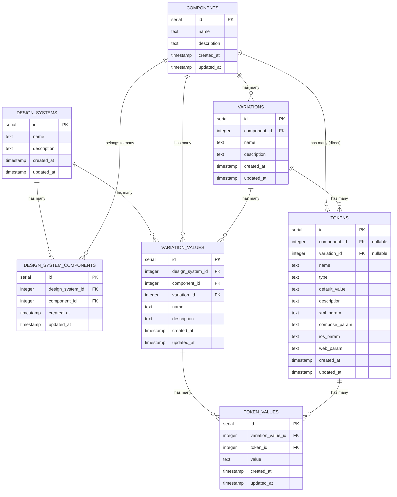

# Database Schema Documentation

## Overview

This document provides a comprehensive visualization and explanation of the Design System Builder database schema. The database is designed to support flexible design token management across multiple platforms and design systems.

## Entity Relationship Diagram



## Table Descriptions

### Core Entities

#### `design_systems`
The top-level container for design systems. Each design system represents a cohesive set of design standards and guidelines.

**Fields:**
- `id` (serial, PK) - Unique identifier
- `name` (text, required) - Name of the design system
- `description` (text, optional) - Description of the design system
- `created_at`, `updated_at` (timestamp) - Audit fields

#### `components`
Reusable UI components that can be part of multiple design systems.

**Fields:**
- `id` (serial, PK) - Unique identifier
- `name` (text, required) - Component name (e.g., "Button", "Card")
- `description` (text, optional) - Component description
- `created_at`, `updated_at` (timestamp) - Audit fields

#### `variations`
Different variants or states of a component (e.g., primary button, secondary button).

**Fields:**
- `id` (serial, PK) - Unique identifier
- `component_id` (integer, FK) - Reference to parent component
- `name` (text, required) - Variation name
- `description` (text, optional) - Variation description
- `created_at`, `updated_at` (timestamp) - Audit fields

#### `tokens`
Design tokens that define the visual properties (colors, spacing, typography, etc.) for components or variations. Tokens can belong directly to a component or to a specific variation of a component.

**Fields:**
- `id` (serial, PK) - Unique identifier
- `component_id` (integer, FK, optional) - Reference to parent component (for component-level tokens)
- `variation_id` (integer, FK, optional) - Reference to parent variation (for variation-specific tokens)
- `name` (text, required) - Token name
- `type` (text, required) - Token type (color, spacing, typography, etc.)
- `default_value` (text, optional) - Default token value
- `description` (text, optional) - Token description
- `xml_param` (text, optional) - XML-specific parameter for Android
- `compose_param` (text, optional) - Jetpack Compose parameter
- `ios_param` (text, optional) - iOS-specific parameter
- `web_param` (text, optional) - Web-specific parameter
- `created_at`, `updated_at` (timestamp) - Audit fields

**Business Rules:**
- Either `component_id` OR `variation_id` must be set (not both, not neither)
- Component-level tokens are inherited by all variations of that component
- Variation-level tokens override or supplement component-level tokens

#### `variation_values`
Specific instances of variations within design systems, representing how a variation is implemented in a particular design system.

**Fields:**
- `id` (serial, PK) - Unique identifier
- `design_system_id` (integer, FK) - Reference to design system
- `component_id` (integer, FK) - Reference to component
- `variation_id` (integer, FK) - Reference to variation
- `name` (text, required) - Instance name
- `description` (text, optional) - Instance description
- `created_at`, `updated_at` (timestamp) - Audit fields

#### `token_values`
The actual values assigned to tokens in specific variation instances.

**Fields:**
- `id` (serial, PK) - Unique identifier
- `variation_value_id` (integer, FK) - Reference to variation value
- `token_id` (integer, FK) - Reference to token
- `value` (text, required) - The actual token value
- `created_at`, `updated_at` (timestamp) - Audit fields

### Junction Tables

#### `design_system_components`
Many-to-many relationship table connecting design systems and components.

**Fields:**
- `id` (serial, PK) - Unique identifier
- `design_system_id` (integer, FK) - Reference to design system
- `component_id` (integer, FK) - Reference to component
- `created_at`, `updated_at` (timestamp) - Audit fields

## Relationships

### One-to-Many Relationships
- **Components → Variations**: Each component can have multiple variations
- **Components → Tokens**: Each component can have multiple direct tokens (component-level tokens)
- **Variations → Tokens**: Each variation can have multiple variation-specific tokens
- **Design Systems → Variation Values**: Each design system can have multiple variation values
- **Components → Variation Values**: Each component can have multiple variation values
- **Variations → Variation Values**: Each variation can have multiple variation values
- **Variation Values → Token Values**: Each variation value can have multiple token values
- **Tokens → Token Values**: Each token can have multiple token values

### Many-to-Many Relationships
- **Design Systems ↔ Components**: Through the `design_system_components` junction table

## Usage Patterns

### Creating a Design System
1. Create a `design_systems` record
2. Link components via `design_system_components`
3. Create `variation_values` for each component variation
4. Set `token_values` for each token in the variation values

### Cross-Platform Token Management
The token table includes platform-specific parameter fields:
- `xml_param` - For Android XML resources
- `compose_param` - For Jetpack Compose
- `ios_param` - For iOS development
- `web_param` - For web applications

This allows the same token to have different representations across platforms while maintaining semantic consistency.

## Example Data Flow

```
Design System: "Material Design 3"
├── Component: "Button"
│   ├── Component Tokens (shared by all variations):
│   │   ├── Token: "border_radius" (type: spacing)
│   │   │   ├── xml_param: "@dimen/button_corner_radius"
│   │   │   ├── compose_param: "16.dp"
│   │   │   ├── ios_param: "16.0"
│   │   │   └── web_param: "16px"
│   │   └── Token: "typography" (type: text)
│   ├── Variation: "Primary"
│   │   └── Variation Tokens (specific to Primary):
│   │       └── Token: "background_color" (type: color)
│   │           ├── xml_param: "@color/primary"
│   │           ├── compose_param: "MaterialTheme.colorScheme.primary"
│   │           ├── ios_param: "UIColor.systemBlue"
│   │           └── web_param: "var(--primary-color)"
│   └── Variation: "Secondary"
│       └── Variation Tokens (specific to Secondary):
│           └── Token: "background_color" (type: color)
│               ├── xml_param: "@color/secondary"
│               ├── compose_param: "MaterialTheme.colorScheme.secondary"
│               ├── ios_param: "UIColor.systemGray"
│               └── web_param: "var(--secondary-color)"
└── Component: "Card"
    ├── Component Tokens:
    │   └── Token: "elevation" (type: shadow)
    └── Variations...
```

## Migration History

- **Initial Schema**: Basic design system structure
- **Token Enhancement**: Added platform-specific parameter fields (`description`, `xml_param`, `compose_param`, `ios_param`, `web_param`)
- **Schema Refactor**: Added direct component-token relationship while preserving variation-token relationship. Tokens can now belong to either a component directly or to a specific variation

## Database Technology

- **Database**: PostgreSQL
- **ORM**: Drizzle ORM
- **Schema Location**: `backend/src/db/schema.ts`
- **Migrations**: `backend/drizzle/` directory 