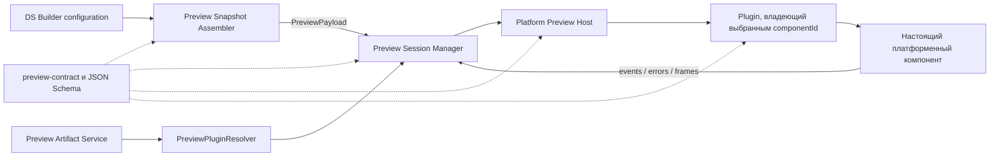
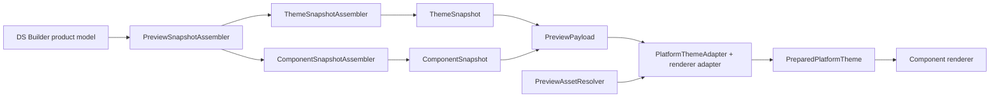
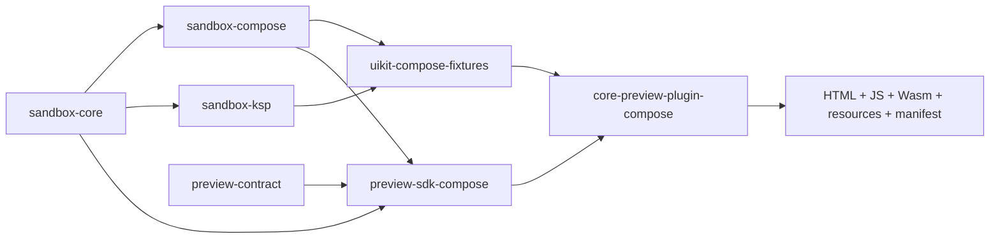

# ADR-0006: Preview конфигурируемых компонентов

## Статус
* На ревью.

## Контекст

DS Builder позволяет конфигурировать тему и компоненты дизайн-системы: токены, appearance, variations, styles,
инвариантные свойства, состояния и platform-specific adjustments. Пользователь должен видеть результат изменений в
preview настоящего компонента выбранной платформы.

В текущем React-клиенте из `js/apps/client` конфигурация приходит из backend-модели, а исполняемый
renderer подключается отдельно через вручную зарегистрированные stories и mapper. Это показывает важное ограничение:
конфигурации компонента недостаточно для его отображения. Необходим платформенный код, который знает API настоящего
компонента и умеет преобразовать модель DS Builder в вызов этого API.

Новый клиент DS Builder MP должен поддерживать preview для нескольких платформ:

- Compose;
- React;
- Android XML/View;
- iOS UIKit/SwiftUI.

Платформы используют разные runtime и способы загрузки исполняемого кода:

- Compose-компоненты собираются в self-contained Compose/Wasm bundle и выполняются в браузере или встроенном WebView;
- React выполняется в WebView или браузере;
- Android XML/View требует Android runtime и, как правило, emulator/device;
- UIKit/SwiftUI требует iOS runtime и simulator/device.

Кроме Core-компонентов, доступных всем дизайн-системам, конкретная дизайн-система может содержать пользовательские
компоненты. Добавление пользовательского компонента не должно требовать пересборки DS Builder Client. SDDS Team должна
поставлять preview всех Core-компонентов для каждой поддерживаемой платформы, а команды дизайн-систем должны иметь
возможность создавать и публиковать расширения с preview собственных компонентов.

## Решение

Preview строится вокруг единого версионированного Preview Protocol, семейства платформенных Preview SDK, подключаемых
Preview Plugin и платформенных Preview Host.

Ключевое решение:

> DS Builder формирует платформенно-независимый `PreviewPayload` и управляет preview-сессией, но делегирует фактический
> рендеринг подключаемому платформенному Preview Plugin. SDDS Team обязана поставлять Preview SDK, Preview Host и Core
> Preview Plugin для каждой поддерживаемой платформы. Команды отдельных дизайн-систем используют тот же SDK для разработки
> scoped extension plugins с пользовательскими компонентами. Плагины собираются и публикуются независимо от DS Builder
> Client и загружаются клиентом в runtime по versioned manifest.

Для Compose принимается дополнительное решение:

> Compose Preview Plugin первой версии публикуется и исполняется только как self-contained `wasmJs` web artifact. Текущий
> React-клиент загружает его в `iframe`, а DS Builder MP Desktop - во встроенном WebView. Kotlin, Compose Runtime и
> библиотека компонентов являются внутренними зависимостями bundle и не входят в бинарный контракт с DS Builder Client.
> In-process Compose/JVM plugin не входит в первую версию архитектуры.

Общая архитектура:



DS Builder не создает компонент по имени и не анализирует его API во время рендеринга. Он знает контекст, стабильный
`componentId`, конфигурацию и требуемую платформу. Preview Plugin содержит renderer, который сопоставляет эти данные с
конкретным платформенным API.

## Термины и артефакты

### Preview Protocol

Preview Protocol - версионированный JSON-контракт между DS Builder и Preview Host. Он определяет:

- `PreviewPayload` для полного снимка preview;
- `PreviewPatch` для инкрементального обновления;
- `PreviewEvent` для действий пользователя;
- `PreviewError` и diagnostics;
- lifecycle preview-сессии;
- manifest и capabilities плагина.

Каноническим source of truth является версионированная JSON Schema. Она хранится и публикуется вместе с
`preview-contract`, но остается language-neutral: Kotlin, TypeScript и Swift-модели не могут независимо определять
семантику или расходиться с ней. ADR фиксирует семантику и границы контракта, но не закрепляет окончательный набор полей.

### Preview Contract

`preview-contract` - publishable Kotlin Multiplatform-модуль общего контракта. Его целевое расположение в
`backend-kt`:

```text
preview/
  contract/
    schemas/
      v1/
        preview-payload.schema.json
        preview-event.schema.json
        preview-plugin-manifest.schema.json
    src/
      commonMain/
        kotlin/                  # kotlinx.serialization models
        resources/              # опубликованные JSON Schema
```

Gradle project path: `:preview:contract`. Публикуемый Maven artifact: `preview-contract`. Точные `groupId` и package name
определяются при создании модуля и не являются частью решения ADR.

Модуль содержит:

- `PreviewPayload`, `PreviewPatch`, `PreviewEvent`, `PreviewError` и diagnostics;
- `ThemeSnapshot`, typed token values и asset descriptors;
- plugin manifest и capabilities;
- версии Preview Protocol и Theme Contract;
- сериализацию, базовую структурную валидацию и compatibility helpers.

Модуль не содержит Compose-типы, renderer, `PlatformThemeAdapter`, WebView bridge или код конкретной дизайн-системы.

От `preview-contract` напрямую зависят DS Builder MP/CLI, общий preview application layer и `preview-sdk-compose`. Compose
plugins включают его транзитивно в self-contained bundle. Для React, Android tooling и iOS из тех же JSON Schema
публикуются совместимые language-specific models; эти платформы не обязаны использовать Kotlin artifact. CI контракта
должен проверять schema fixtures и взаимную совместимость сериализации опубликованных моделей.

### Preview SDK

Preview SDK является не одной универсальной библиотекой, а семейством платформенных библиотек вокруг общего контракта:

```text
preview-contract             Kotlin Multiplatform
preview-runtime              Kotlin Multiplatform, где это возможно
preview-sdk-compose          Kotlin Multiplatform: Preview Protocol -> Compose theme/style/state adapter
tooling-gradle-plugin         единый JVM/Gradle tooling: demo, stories, preview и documentation
preview-sdk-react            TypeScript/npm
preview-sdk-android          Kotlin/Android
preview-sdk-ios              Swift Package и/или XCFramework
```

`preview-contract` содержит сериализуемые модели, версии протокола, базовую валидацию, события и ошибки. Для платформ,
которые не используют Kotlin, из JSON Schema должны публиковаться совместимые модели или библиотеки контракта.

Отдельный `preview-compose-gradle-plugin` не создается. SDDS Team поставляет один `tooling-gradle-plugin`, который
конфигурирует генерацию и сборку demo-приложений, stories, preview artifacts и документации. Возможности разделяются DSL и
задачами внутри одного plugin artifact, чтобы проект подключал только необходимые feature sets и зависимости.

Это тот же публичный Gradle tooling entry point, который реализует платформенное насыщение документации из
[ADR-0003](./ADR-0003-documentation-cli.md), а не второй plugin с похожими обязанностями. Внутри он может зависеть от
нескольких implementation libraries и KSP processors, но для пользователя публикуется и применяется один Gradle plugin.

Платформенный SDK предоставляет API регистрации renderer, контракт `PlatformThemeAdapter`, стандартную реализацию
адаптера для Core component library, интеграцию с Preview Host и build tooling. SDK не содержит renderer или компонентов
конкретной дизайн-системы.

Для Compose не создается параллельная система stories. Compose Preview SDK переиспользует существующие KMP/CMP-модули
`plasma-android/integration-core`:

```text
sandbox-core               BaseStory, UiState, properties, StateTransformer, StoryRegistry и аннотации
sandbox-compose            ComposeBaseStory и Compose renderer/theme/style infrastructure
sandbox-ksp                KSP-генерация properties, state transformers и registry
uikit-compose-fixtures     @Story renderer всех Core Compose-компонентов
preview-sdk-compose        PreviewPayload adapter и web runtime bridge
```

`sandbox-ksp` расширяется генерацией данных, необходимых Preview Plugin, поэтому отдельный дублирующий Compose preview
processor не вводится. Все перечисленные story-модули должны оставаться совместимыми с `commonMain` и `wasmJs`.

### Preview Plugin

Preview Plugin содержит исполняемую интеграцию конкретной библиотеки компонентов с Preview Protocol:

- registry поддерживаемых компонентов;
- renderer каждого компонента;
- преобразование `PreviewPayload` в API компонента;
- включенную при сборке реализацию platform-specific theme adapter;
- manifest, capabilities и сведения о совместимости.

Плагин является независимо версионируемым и публикуемым артефактом. Изменение токенов, variations и styles не требует
его пересборки: эти данные передаются в `PreviewPayload`. Пересборка нужна при изменении кода компонента, renderer,
платформенного адаптера или их бинарных зависимостей.

### Preview Host

Preview Host исполняет плагин в подходящем runtime, управляет его lifecycle и передает результат в DS Builder Client.
Host может работать внутри браузера/WebView или в отдельном процессе/emulator/simulator.

### Preview Artifact Service

Preview Artifact Service - backend-компонент, который хранит metadata опубликованных plugin artifacts, проверяет права
доступа и возвращает manifests и ссылки на загрузку. Бинарные файлы могут физически находиться в object storage. Сервис
не выбирает renderer и не исполняет plugin.

### PreviewPluginResolver

`PreviewPluginResolver` - компонент application layer DS Builder Client. Для контекста `projectId + designSystemId +
version + platform` он:

1. Получает доступные manifests из Preview Artifact Service и локального dev source.
2. Фильтрует их по scope, platform, Preview Protocol, Theme Contract, runtime capabilities и версии дизайн-системы.
3. Проверяет checksum, trust policy и отсутствие запрещенных конфликтов `componentId`.
4. Строит routing table `componentId -> plugin artifact`.
5. Для выбранного компонента возвращает `ResolvedPreviewPlugin` с manifest, artifact digest, entry point и способом запуска.

`PreviewPluginResolver` не объединяет исполняемый код Core и Design System plugins. Он только выбирает один self-contained
artifact, который владеет выбранным `componentId`.

## Типы Preview Plugin

### Core Preview Plugin

Core Preview Plugin содержит renderer Core-компонентов, доступных всем дизайн-системам. Он является обязательной частью
поставки платформенной библиотеки компонентов.

SDDS Team владеет следующими артефактами для каждой поддерживаемой платформы:

| Платформа | SDK, theme implementation и tooling | Core Preview Plugin |
| --- | --- | --- |
| Compose | Compose Preview SDK, `sandbox-*`, KSP, `tooling-gradle-plugin`, host integration | `sdds-core-preview-compose` |
| React | React Preview SDK, registry generator, web host integration | `sdds-core-preview-react` |
| Android XML/View | Android Preview SDK и host tooling | `sdds-core-preview-android` |
| iOS | iOS Preview SDK и simulator tooling | `sdds-core-preview-ios` |

Новый Core-компонент не считается полностью интегрированным с DS Builder, пока для него нет renderer в Core Preview
Plugin. Core plugin должен выпускаться согласованно с библиотекой компонентов. CI SDDS Team должен как минимум проверять
уникальность `componentId`, сборку registry и возможность инициализировать каждый renderer.

Стандартная реализация `PlatformThemeAdapter` входит в соответствующий Platform Preview SDK как build-time код, а не
публикуется отдельным runtime plugin. И Core Preview Plugin, и Design System Preview Plugin используют одну реализацию из
SDK; при сборке она включается в итоговый self-contained artifact.

### Design System Preview Plugin

Design System Preview Plugin содержит renderer пользовательских компонентов одной дизайн-системы. Он имеет scope по
`designSystemId` и не доступен другим дизайн-системам без явной публикации с другим scope. Исходный preview-модуль может
зависеть от Core component library, если пользовательский компонент использует Core-компоненты, но опубликованный Wasm
bundle является self-contained и не линкуется с Core Preview Plugin в runtime.

Итоговый registry формируется `PreviewPluginResolver` на уровне metadata, а не объединением исполняемого кода плагинов:

```text
sdds.core.button                  -> sdds-core-preview-compose-web.zip
my-design-system.payment-card     -> my-ds-preview-compose-web.zip
```

Core identifiers резервируются в общем namespace, например:

```text
sdds.core.button
sdds.core.checkbox
sdds.core.counter
```

Пользовательские компоненты используют namespace конкретной дизайн-системы:

```text
my-design-system.payment-card
my-design-system.product-tile
```

На первом этапе пользовательский plugin не может неявно переопределять Core renderer. Возможность замены Core renderer
может быть добавлена позднее через явное поле `replaces` в manifest и отдельную проверку совместимости.

### Local Preview Plugin

Local Preview Plugin - непубликованная сборка Design System Preview Plugin для разработки. DS Builder Client может
получить ее из локального каталога или локального preview server. Локальный плагин не становится доступным другим
пользователям и версиям дизайн-системы до публикации.

## Распределение ответственности

```text
SDDS Team
  Preview Protocol и JSON Schema
  общие contract/runtime модули
  Preview Session Manager и PreviewPluginResolver
  Preview Artifact Service
  CLI orchestration
  публикация и получение plugin artifacts
  trust policy и диагностика
  Preview SDK для каждой поддерживаемой платформы
  PlatformThemeAdapter contract и стандартная platform implementation в составе каждого Preview SDK
  platform analyzer/generator и единый tooling plugin
  Preview Host для каждой поддерживаемой платформы
  Core Preview Plugin со всеми Core-компонентами каждой платформы
  совместимость с platform component libraries

Design-system teams
  preview-модуль пользовательских компонентов
  renderer пользовательских компонентов
  fixtures/example props
  сборка, проверка и публикация Design System Preview Plugin
```

## Preview Payload

`PreviewPayload` описывает полный воспроизводимый снимок состояния preview:

```text
PreviewPayload
  schemaVersion
  requestId
  target
    projectId
    designSystemId
    source: draft revision или published designSystemVersionId/version
    rendererPlatform: compose | web | xml | ios
    themeValuePlatform: web | android | ios
  theme
    tenant: id + name
    mode
    digest
    tokenValues[]
      token: id + name + type + enabled
      selector: tenantId + platform + mode
      source: literal JSON или palette reference + дополнительные параметры
      resolvedValue: нормализованное typed value
      assets[]
  component
    component: database id + stable plugin componentId + name
    appearance: id + name
    variationSelections[]
      variation: id + name
      style: id + name + isDefault
    invariantProperties[]
    variationProperties[]
    styleCombinations[]
    dependencies[]
  example
    storyId
    runtime props
    content slots
  surface
    viewport
    background
    density/scale при необходимости
```

Нужно разделять:

- `target.source` - конкретное состояние модели: draft revision или immutable published version;
- `theme` - выбранные значения theme tokens для tenant, mode и theme-value platform;
- `component` - конфигурацию дизайн-системы из продуктовой модели DS Builder;
- `example` - данные демонстрационного экземпляра: текст, loading, disabled, иконки, content slots и другие runtime props;
- `surface` - окружение preview.

`rendererPlatform` и `themeValuePlatform` разделяются намеренно. В текущей модели `token_values.platform` принимает
`web | android | ios`, а `property_platform_params.platform` - `web | compose | xml | ios`. Поэтому для Compose нельзя
неявно считать, что `platform = compose` однозначно выбирает строку `token_values`: правило отображения Compose renderer
на `android` token values либо расширение enum должно быть принято отдельно и отражено в payload/manifest.

Payload содержит идентификатор и имя theme token, исходное значение и разрешенное нормализованное значение для выбранного
tenant/mode/platform. Идентификаторы сохраняют связь с продуктовой моделью, а resolved value делает снимок
воспроизводимым. Нормализованное значение еще не является объектом платформенного UI runtime.

Component property value имеет следующую логическую структуру:

```text
ComponentPropertyValue
  property
    id
    name
    type
    defaultValue
  owner
    kind: invariant | variation
    variationId? + styleId?
  base
    source: tokenRef(tokenId) | literal(value) | default
  states[]
    state: pressed | hovered | focused | selected | readonly | disabled
    source: tokenRef(tokenId) | literal(value)
  platformParams[]
    id
    platform
    name
    adjustment
      value?
      template?
```

`tokenId` и literal `value` не должны преждевременно схлопываться в одну строку. Для token reference resolved value
берется из `ThemeSnapshot`; для literal применяется нормализация по `property.type`. Platform adjustment выбирается по
конкретному property value и platform param. Шаблон и числовая поправка являются разными операциями и сохраняются
раздельно.

`variationSelections` является набором, а не единственным `style`: Button, например, одновременно выбирает styles для
variation axes `view`, `size` и `shape`. Если пользователь не выбрал style явно, assembler использует `styles.is_default`;
fallback на первый style допустим только как диагностируемая совместимость с legacy data.

`styleCombinations` содержит effective combinations, для которых выбранные `styleCombinationMembers` совпали с текущим
набором styles. `dependencies` содержит упорядоченный граф `component_deps` (`reuse | compose`) и применимые
`component_reuse_configs` для design system, appearance и variation. Для renderer должен передаваться замкнутый
dependency snapshot либо явная структурированная ошибка о цикле/недостающей конфигурации.

Payload не описывает универсальное UI-дерево и не содержит исполняемый код. Преобразование payload в параметры
платформенного компонента является ответственностью renderer.

### Source of truth и текущий React client

Source of truth для сборки payload - продуктовые таблицы `db-service` либо полный immutable snapshot версии с той же
семантикой. `ThemeSnapshotAssembler` и `ComponentSnapshotAssembler` не должны зависеть от client controller classes.

`PreviewPayload` является новым wire contract между DS Builder application layer и Preview Host. Он не является новой
версией текущих ответов `theme-data` или `component-configs` и не обязан быть с ними JSON-совместимым. Текущий
React-клиент вообще не передает renderer единый payload: он независимо получает theme/component projections, преобразует
их в CSS variables и вызывает локально зарегистрированную React story с runtime args.

Текущий flow выглядит так:

```text
GET theme-data       -> Theme controller  -> CSS theme variables
GET component-configs -> Config controller -> CSS component variables
local componentMapper + story.args         -> <Story {...args} />
```

Целевой flow:

```text
db-service product model или полный version snapshot
  -> PreviewSnapshotAssembler
  -> PreviewPayload
  -> Preview Host
  -> platform plugin renderer
```

Соответствие текущей и целевой моделей:

| Текущий React flow | Поле `PreviewPayload` | Правило преобразования |
| --- | --- | --- |
| `theme-data.meta.tokens` + `variations[type][platform][name]` | `theme.tokenValues` | Восстанавливается assembler из `tokens`, `token_values`, `palette` и выбранного tenant/mode, а не обратным разбором legacy JSON |
| `sources.configs[].id/name` | `component.appearance` | Выбирается конкретный appearance; текущее использование `configs[0]` не переносится в новый контракт |
| `config.defaultVariations` и выбранные значения controls | `component.variationSelections[]` | Одна выбранная style на каждую variation axis |
| `config.invariantProps` | `component.invariantProperties[]` | Сохраняются source kind, states и platform-param adjustments |
| `config.variations[].styles[].props` | `component.variationProperties[]` | В payload включаются свойства только выбранных styles вместе со states и adjustments |
| `useStory`/`componentMapper`, `story.args` | `example.storyId`, `runtimeProps`, `contentSlots` | Registry и schema предоставляет Preview Plugin; значения экземпляра передаются отдельно от component configuration |
| UI mode/background | `theme.mode`, `surface.background` | Состояние preview становится явной частью запроса |

Поля `target`, tenant identity, исходный `tokenId`, различие `tokenRef/literal`, palette reference, assets, digests,
dependencies/reuse configs, style combinations и полные adjustments отсутствуют в текущем client wire format. Их нельзя
надежно восстановить из legacy response, поэтому новый assembler читает продуктовую модель или полный version snapshot.

Текущие endpoints `GET /legacy/design-systems/:name/theme-data` и `component-configs` являются compatibility projection
для React-клиента, но не контрактом нового preview. В частности, текущая projection:

- не выбирает token values по конкретному tenant и в tenant params берет первый tenant;
- преобразует component `tokenId` в строковое имя и теряет явный тип source;
- не включает platform-param adjustments в возвращаемый component config;
- отбрасывает state-specific invariant values;
- не включает component dependencies/reuse configs и style combinations;
- строит `intersections: null` независимо от данных style combinations.

React-клиент затем преобразует theme и component config в CSS variables и отдельно передает story args. Этот flow
подтверждает разделение `theme`, `component` и `example`, но не является полной моделью payload.

Для подключения Preview Plugin в текущий React-клиент добавляется отдельная Preview Session integration, которая получает
`PreviewPayload` от нового application/API layer и передает его в `iframe`. Legacy endpoints и `useStory.ts` могут
оставаться для существующего React preview на время миграции, но не используются как источник payload для новых plugins.

## Сборка snapshots и платформенная тема

Сборка payload разделяется на snapshot aggregation в DS Builder и platform preparation в plugin runtime. Общий
`PreviewSnapshotAssembler` фиксирует source revision и координирует theme и component assemblers в одной consistent read.



### PreviewSnapshotAssembler

`PreviewSnapshotAssembler` находится в общем application layer DS Builder. Он:

- выбирает draft revision либо immutable `design_system_versions.snapshot`;
- выполняет theme/component reads в одной транзакции или по одному revision token;
- передает выбранные tenant, mode, renderer platform, theme-value platform, component, appearance и variation selections
  специализированным assemblers;
- объединяет snapshots с `example` и `surface`;
- вычисляет общий `payloadDigest` и возвращает diagnostics.

Текущий `design_system_versions.snapshot` содержит только сокращенный список tokens/components/variations/styles и не
является достаточным для preview опубликованной версии. Перед использованием как source of truth его схема должна
включать token values, palette references, component property values/states, platform params/adjustments, combinations и
dependency/reuse configuration.

### ThemeSnapshotAssembler

`ThemeSnapshotAssembler` находится в общем application layer DS Builder. Для выбранных tenant, mode и
`themeValuePlatform` он:

- выбирает `token_values` по `tokenId + tenantId + themeValuePlatform`: exact mode имеет приоритет, а `mode IS NULL`
  допустим только для mode-independent token по зафиксированному правилу модели;
- сохраняет исходный JSON value и отдельную palette reference; если `paletteId` и `value` сосуществуют, применяет
  типизированные дополнительные параметры, например opacity, не теряя исходных данных;
- разрешает palette reference и другие поддержанные theme references и сообщает об отсутствующих ссылках;
- не обрабатывает component platform-param adjustments: это ответственность `ComponentSnapshotAssembler`;
- формирует нормализованные typed values для color, gradient, dimension, spacing, shape, shadow, font family и typography;
- добавляет descriptors ресурсов, необходимых для темы;
- сохраняет признак `tokens.enabled` и сообщает об отсутствующих значениях;
- вычисляет `themeDigest`, используемый для cache и инкрементальных обновлений.

Fallback между tenant, platform или mode не должен возникать неявно. Если продуктовая модель вводит inheritance/fallback,
его порядок фиксируется в Preview Protocol и assembler добавляет provenance выбранного значения. При отсутствии правила
assembler возвращает missing-value diagnostic.

После сборки обоих snapshots `PreviewSnapshotAssembler` валидирует все `tokenRef` из `ComponentSnapshot` относительно
`ThemeSnapshot`. Ссылка component property на disabled или отсутствующий token является отдельной диагностикой payload,
а не скрытым fallback на `defaultValue`.

`ThemeSnapshotAssembler` не создает `Color`, `Dp`, CSS variables, Android resources, `UIFont` или `FontFamily`. Эти типы
принадлежат платформенному runtime и не должны попадать в общий Preview Protocol.

### ComponentSnapshotAssembler

`ComponentSnapshotAssembler` собирает effective component configuration для выбранного design system, component и
appearance:

- получает все variation axes и выбирает style для каждой variation;
- добавляет invariant и выбранные variation property values, включая state-specific rows;
- сохраняет для каждого значения source kind `tokenRef | literal | default`;
- выбирает `property_platform_params` для `rendererPlatform` и связанные variation/invariant adjustments;
- вычисляет применимые style combinations;
- раскрывает `component_deps` и `component_reuse_configs` с проверкой циклов;
- возвращает diagnostics для отсутствующего default style, property mapping, dependency config или конфликтующих values;
- вычисляет `componentDigest`.

Assembler не создает Compose `Style`, CSS variables, Android attrs или UIKit objects. Он формирует полную
платформенно-адресованную, но runtime-neutral конфигурацию, которую Preview SDK преобразует в API component library.

Целевой пример логической структуры токена и ресурса:

```json
{
  "theme": {
    "digest": "sha256:...",
    "tenant": {
      "id": "tenant-default",
      "name": "default"
    },
    "mode": "light",
    "tokenValues": [
      {
        "token": {
          "id": "token-font-body",
          "name": "typography.body.fontFamily",
          "type": "fontFamily",
          "enabled": true
        },
        "selector": {
          "tenantId": "tenant-default",
          "platform": "android",
          "mode": "light"
        },
        "source": {
          "kind": "literal",
          "rawValue": {
            "family": "SBSansText"
          }
        },
        "resolvedValue": {
          "kind": "fontFamily",
          "sources": [
            {
              "assetId": "font-sans-regular",
              "weight": 400,
              "style": "normal"
            }
          ],
          "fallback": ["sans-serif"]
        }
      }
    ],
    "assets": [
      {
        "id": "font-sans-regular",
        "type": "font",
        "mimeType": "font/woff2",
        "digest": "sha256:...",
        "url": "https://..."
      }
    ]
  }
}
```

Это пример нового Preview Protocol, а не JSON, который сегодня возвращает `theme-data`: текущий endpoint не содержит
tenant selector, raw source, resolved typed value или asset descriptors. Конкретный JSON и набор typed values фиксируются
отдельной Preview Protocol schema.

### PlatformThemeAdapter

Общий Preview Contract задает семантический контракт `PlatformThemeAdapter`: входной `ThemeSnapshot`, доступ к assets,
результат подготовки, warnings/errors и правила cache по `themeDigest`. Каждый Platform Preview SDK специализирует этот
контракт платформенным типом `PreparedTheme` и способом установить тему вокруг renderer.

SDDS Team реализует стандартный адаптер для Core component library каждой платформы в составе соответствующего Platform
Preview SDK. Адаптер является build-time зависимостью plugin assembly и включается как обычный код в каждый итоговый
self-contained plugin artifact. Отдельный загружаемый Core Theme Adapter artifact не вводится.

Концептуальный контракт:

```kotlin
interface PlatformThemeAdapter<PreparedTheme> {
    suspend fun prepare(
        snapshot: ThemeSnapshot,
        assets: PreviewAssetResolver,
    ): ThemePreparationResult<PreparedTheme>
}
```

Платформенная специализация дополнительно предоставляет способ установить подготовленную тему вокруг renderer. Для
Compose это может выглядеть так:

```kotlin
interface ComposePreviewThemeAdapter : PlatformThemeAdapter<PreparedComposeTheme> {
    @Composable
    fun ProvideTheme(
        theme: PreparedComposeTheme,
        content: @Composable () -> Unit,
    )
}
```

Adapter отвечает за:

- преобразование нормализованных colors и dimensions в платформенные типы;
- создание shape, shadow и typography объектов;
- загрузку и регистрацию fonts и других assets;
- platform-specific fallback и unsupported-value diagnostics;
- установку runtime theme/provider вокруг компонента;
- кеширование подготовленной темы по `themeDigest`.

Renderer не должен самостоятельно разбирать raw token JSON или независимо загружать шрифты. Compose story получает уже
подготовленные `Style` и `UiState`, а тема устанавливается `ComposePreviewThemeAdapter` вокруг вызова `Content`.

Значения component properties в `ComponentSnapshot` сохраняют ссылки на token id. Подготовленная платформенная тема
должна предоставлять типизированный lookup этих значений, чтобы renderer и component styles не выполняли повторный
резолвинг token graph.

### Шрифты и другие ресурсы

Font tokens нельзя считать обычными строковыми значениями. `PreviewPayload` должен содержать descriptor font asset,
weight/style mapping, fallback и digest. `PreviewAssetResolver` загружает или читает ресурс, проверяет digest, кеширует его
и передает платформенному adapter. Событие `rendered` отправляется только после завершения обязательной подготовки темы.

Если обязательный font или другой asset недоступен, adapter возвращает структурированную ошибку. Использование fallback
разрешено только когда оно указано в token value или policy платформы; host должен вернуть warning, чтобы preview не
выглядел успешным при фактической подмене ресурса.

### Использование в Core и пользовательских plugins

Контракт и стандартная реализация находятся в Platform Preview SDK. И Core Preview Plugin, и Design System Preview Plugin
подключают SDK как build-time dependency. Для self-contained Compose/Wasm plugin код adapter и его зависимости включаются
в bundle.

Таким образом, пользовательский plugin не зависит от запущенного экземпляра Core Preview Plugin, но использует ту же
реализацию резолвинга темы из Preview SDK. Manifest должен фиксировать `requires.theme.contractVersion`, идентификатор и
версию реализации adapter для диагностики и воспроизводимости.

При `PreviewPatch` adapter повторно подготавливает только затронутые token/resource dependencies, если это поддерживается.
Первая реализация может пересобирать `PreparedPlatformTheme` целиком, сохраняя тот же внешний protocol.

## Регистрация компонентов

Добавление компонента требует явного renderer для каждой поддерживаемой платформы. Автоматический анализ может убрать
регистрационный boilerplate, но не может надежно вывести preview произвольного компонента: у компонента могут быть
обязательные модели данных, callbacks, content slots и платформенные типы.

Для Compose единицей регистрации остается существующая `@Story` из `sandbox-core`. Новая параллельная аннотация для
preview не вводится. Core и пользовательские renderer реализуются через один контракт `ComposeBaseStory`/`ComposeStory`.

Пример пользовательского Compose renderer:

```kotlin
@StoryUiState
data class PaymentCardUiState(
    override val variant: String = "",
    override val appearance: String = "",
    @StoryProperty(key = "title", displayName = "Title")
    val title: String = "Payment",
    @StoryProperty(key = "enabled", displayName = "Enabled")
    val enabled: Boolean = true,
) : UiState

@Story(componentId = "my-design-system.payment-card")
object PaymentCardStory : ComposeBaseStory<PaymentCardUiState, PaymentCardStyle>(...) {
    @Composable
    override fun BoxScope.Content(style: PaymentCardStyle, state: PaymentCardUiState) {
        PaymentCard(
            title = state.title,
            enabled = state.enabled,
            style = style,
            onClick = { /* PreviewEvent.Action("click") */ },
        )
    }
}
```

Показанные параметры `componentId` у `@Story` и стабильный `key` у `@StoryProperty` являются целевым расширением
существующего sandbox-контракта. `key` используется в Preview Protocol, тогда как `displayName` остается только UI-текстом
и не может быть внешним идентификатором свойства.

Платформенный analyzer проверяет сигнатуру и генерирует:

- registry renderer;
- список `componentId`;
- plugin entry point;
- часть plugin manifest;
- compile-time diagnostics;
- при необходимости schema поддерживаемых example props.

Для Kotlin/Compose analyzer используется и расширяется существующий `sandbox-ksp`. Он уже обрабатывает `@Story` и
`@StoryUiState` в `commonMain` через `kspCommonMainMetadata`; дополнительно он должен генерировать стабильный registry,
property schema, plugin manifest fragment и payload-to-state adapters. Для React и iOS SDDS Team предоставляет
эквивалентный generator или явный registry API. Генератор не должен зависеть от внутренней структуры DS Builder Client.

Текущий `sandbox-ksp` генерирует `internal registerStories()`, пригодный для сборки demo в том же модуле. Для отдельного
plugin assembly нужен публичный generated entry API, например `PreviewStoryRegistryContributor`, который assembly может
получить как обычную Gradle-зависимость. Он должен предоставлять type-erased `PreviewStoryEntry`, внутри которого остаются
типизированные `State`, `Style`, `StateTransformer` и вызов `Content`; runtime не должен выполнять unchecked cast из
`BaseStory<*>` для каждого render.

Core Preview Plugin использует тот же механизм аннотаций/registry, что и пользовательский плагин. Различаются владелец,
scope и политика публикации, но не модель разработки renderer.

## Структура проекта пользовательского плагина

Рекомендуемая структура исходников пользовательских Compose stories:

```text
design-system/
  components/
  theme/
  preview-compose/
    build.gradle.kts
    src/
      commonMain/
        PaymentCardStory.kt
        ProductTileStory.kt
  .sdds/
    preview.yaml
```

CLI не должен угадывать preview-модуль по структуре директорий или анализировать весь репозиторий. Модули объявляются
явно в локальной конфигурации:

```yaml
plugins:
  compose:
    module: ":preview-compose"
    targets:
      - wasmJs
```

Модуль применяет единый Gradle plugin, предоставляемый SDDS Team:

```kotlin
plugins {
    id("com.sdds.tooling")
}

sddsTooling {
    stories()
    composePreview()
}
```

Названия DSL-функций являются концептуальными и уточняются при реализации. Тот же `tooling-gradle-plugin` предоставляет
отдельные конфигурационные блоки и задачи для demo application, stories, preview и documentation. Для Compose Preview он
подключает `preview-sdk-compose` и `sandbox-ksp`, конфигурирует `wasmJs`, проверки и упаковку artifact.

Исходный `preview-compose` может сам быть `wasmJs` application module. Альтернативно DS Builder CLI создает временный
assembly-модуль в `.sdds/build/compose-preview-plugin`, применяет к нему `tooling-gradle-plugin`, подключает модуль stories
и запускает тот же Gradle build. Во втором варианте команде дизайн-системы не требуется хранить boilerplate web
application в исходном репозитории.

## Compose/Wasm plugin

Compose Core Preview Plugin является отдельным постоянным `wasmJs` executable/assembly-модулем, например
`integration-core/core-preview-plugin-compose`. Это не новая библиотека renderer: модуль только связывает Preview SDK,
Core fixtures, generated registry и web entry point в поставляемый artifact.

Целевая структура Compose-части:

```text
plasma-android/
  integration-core/
    sandbox-core/                  # Story model, state, properties, registry
    sandbox-compose/               # Compose stories и существующий demo host
    sandbox-ksp/                   # общий generator для demo и preview
    uikit-compose-fixtures/        # Core @Story implementations
    preview-sdk-compose/           # payload/theme/style/state adapter
    core-preview-plugin-compose/   # wasmJs executable assembly
  tooling-gradle-plugin/           # demo, stories, preview и documentation tooling
```

`core-preview-plugin-compose` зависит от `uikit-compose-fixtures` и `preview-sdk-compose`, подключает generated
`PreviewStoryRegistryContributor`, запускает Compose viewport и экспортирует JavaScript/JSON bridge. В нем не дублируются
stories, модель компонентов, token resolver или component library API.



Существующий `sandbox-compose` уже компилируется для `wasmJs`, поэтому его можно использовать в первой реализации. При
этом story-facing API (`ComposeBaseStory.Content`, state/property contracts и style lookup) должен оставаться отделен от
UI demo-приложения (`ComponentScaffold`, navigation, editors и lifecycle state owner). Если измерения покажут заметный
вклад demo UI в размер bundle, этот API выделяется в легкий `sandbox-compose-core`, а `sandbox-compose` и
`preview-sdk-compose` становятся двумя независимыми consumers. Это внутренний рефакторинг SDK и не меняет Preview
Protocol или формат plugin artifact.

`preview-sdk-compose` выполняет следующую адаптацию:

```text
PreviewPayload
  -> ComposePreviewThemeAdapter
  -> componentId -> generated StoryRegistry
  -> ComponentSnapshot(appearance + variationSelections + properties) -> typed Style
  -> example properties -> generated StateTransformer -> UiState
  -> Compose story Content(style, state)
```

KSP не генерирует сам renderer. Renderer остается явной `@Story`, а generator создает публичный registry contributor,
type-erased `PreviewStoryEntry`, property schema, payload-to-state adapter, manifest fragment и compile-time diagnostics.

Для пользовательского plugin применяется та же assembly-модель. Постоянный executable-модуль допускается, но не
обязателен: DS Builder CLI может сгенерировать временный `wasmJs` assembly, подключить `preview-sdk-compose`, модуль
пользовательских stories и component library, после чего вызвать стандартные Gradle packaging tasks.

Production-артефактом Compose plugin является web distribution:

```text
sdds-core-preview-compose-web.zip
  index.html
  preview.wasm
  loader.js
  resources/
  preview-plugin.json
```

Bundle содержит собственные версии Kotlin, Compose Runtime, Preview SDK и component library. Поэтому обновление Kotlin или
Compose в DS Builder MP не меняет ABI плагина. Клиент и bundle взаимодействуют только через Preview Protocol и проверяемые
browser capabilities.

Текущий React-клиент загружает Compose/Wasm host в изолированный `iframe` и взаимодействует с ним через `postMessage` и
Preview Protocol. DS Builder MP Desktop загружает тот же artifact во встроенном WebView. Это позволяет использовать один
plugin artifact в текущем и новом клиентах. Для React-клиента требуется новая Preview Session integration, но существующий
`useStory.ts` можно не изменять: он остается отдельным legacy path только для встроенных React stories.

Компонент и его зависимости должны поддерживать `wasmJs`. Android-only API, JVM reflection и другие платформенные
зависимости должны быть вынесены в platform source sets либо такой компонент не может использовать Compose/Wasm Preview
Host и требует отдельного платформенного preview.

Core и Design System Compose plugins являются независимыми Wasm applications. `PreviewPluginResolver` выбирает bundle, который
владеет текущим `componentId`, и не пытается динамически линковать независимо собранные Kotlin/Wasm-модули. Если
пользовательский компонент использует Core-компоненты, нужный код включается в его bundle как обычная Gradle-зависимость.

## WebView в DS Builder MP Desktop

Compose Multiplatform не предоставляет официальный общий WebView для Desktop. DS Builder MP должен скрыть конкретный
browser engine за собственной абстракцией `PreviewWebHost`:

```text
PreviewWebHost
  web       iframe
  desktop   compose-webview-multiplatform/KCEF/JCEF
  android   android.webkit.WebView, если понадобится MP-клиент для Android
  ios       WKWebView, если понадобится MP-клиент для iOS
```

Для первой desktop-реализации принимается использование `compose-webview-multiplatform` поверх KCEF/JCEF. Desktop
дистрибутив DS Builder MP должен запускаться с JetBrains Runtime в варианте `JBR with JCEF`. KCEF загружает JCEF из
bundled runtime, поэтому отдельная загрузка browser packages при первом запуске не требуется. Недостаточно только
использовать JetBrains Runtime как build JDK: JCEF должен присутствовать в runtime image конечного приложения.

`compose-webview-multiplatform` должен оставаться внутренней зависимостью `PreviewWebHost`, а не частью Preview Protocol
или публичного SDK. Это позволит заменить его или browser engine без изменения plugins.

Версии Kotlin и Compose в DS Builder MP должны быть совместимы с выбранной версией `compose-webview-multiplatform`, как с
обычной UI-зависимостью клиента. Обновление DS Builder MP может потребовать обновить или заменить реализацию
`PreviewWebHost`, но не требует пересобирать ранее опубликованные Compose/Wasm plugins.

Reference baseline для первого spike:

```text
compose-webview-multiplatform       1.9.40
Kotlin, указанный в artifact        1.9.23
Compose Multiplatform               1.7.1
KCEF, указанный в desktop artifact  2024.04.20.3
```

Документация `compose-webview-multiplatform` для версии `1.9.40` говорит о KCEF `2024.04.20.4` и поддержке загрузки JCEF
из bundled binary, тогда как опубликованный desktop artifact декларирует KCEF `2024.04.20.3`. Это расхождение и
совместимость с выбранной версией JBR/JCEF нужно проверить в spike до фиксации production dependency.

Версия `compose-webview-multiplatform 1.9.40` не имеет собственного `wasmJs` target, но это не мешает desktop host:
JVM-библиотека управляет JCEF, а загружаемый plugin является отдельным web artifact. Для web-версии DS Builder используется
обычный `iframe`. Если в будущем потребуется общий `PreviewWebHost` непосредственно в `wasmJs` source set, нужна отдельная
browser-реализация или более новая версия библиотеки.

## Способы исполнения

| Платформа | Preview Host | Способ подключения |
| --- | --- | --- |
| Compose/Wasm в React DS Builder | Browser | изолированный `iframe`, Wasm bundle и `postMessage` |
| Compose/Wasm в DS Builder MP | `PreviewWebHost` с bundled JCEF | Wasm bundle и JavaScript/JSON bridge |
| React | Browser/WebView | JS bundle и web bridge |
| Android XML/View | Android emulator/device | preview-host APK и удаленный протокол |
| iOS UIKit/SwiftUI | iOS simulator/device | preview-host application и удаленный протокол |

Android и iOS plugins не загружаются как произвольный код в процесс desktop-клиента. CLI собирает platform host artifact,
в который включены Core и Design System renderer. DS Builder устанавливает или запускает host на emulator/simulator,
передает payload и получает frames, events и diagnostics.

## Plugin Manifest

Каждый plugin artifact содержит manifest. Пример Design System Preview Plugin:

```json
{
  "id": "my-ds-compose-preview",
  "scope": {
    "type": "design-system",
    "designSystemId": "my-design-system"
  },
  "version": "1.3.0",
  "protocolVersion": "1",
  "platform": "compose",
  "runtime": "compose-wasm",
  "artifact": {
    "type": "web-bundle",
    "file": "my-ds-preview-web.zip",
    "entrypoint": "index.html",
    "digest": "sha256:..."
  },
  "requires": {
    "wasmGc": true,
    "componentLibrary": "my-design-system-components:1.3.0",
    "theme": {
      "contractVersion": "1",
      "adapterId": "sdds-preview-sdk-compose",
      "adapterVersion": "2.0.0"
    }
  },
  "components": [
    "my-design-system.payment-card",
    "my-design-system.product-tile"
  ]
}
```

Окончательный manifest должен также содержать требования к Preview Protocol/browser runtime и capabilities. Версии Kotlin,
Compose Compiler, Compose Runtime и component library относятся к внутренней сборке self-contained bundle и не являются
ABI-требованиями к DS Builder Client.

## Сборка через DS Builder CLI

DS Builder CLI не компилирует платформенный код самостоятельно и не реализует собственный анализатор исходников. Он
оркестрирует стандартный build toolchain платформы и задачи, предоставленные Platform Preview SDK и общим tooling plugin:

```text
dsbuilder preview build
  -> разрешить контекст проекта и прочитать .sdds/preview.yaml
  -> найти объявленный preview-модуль
  -> вызвать Gradle/npm/Xcode build
  -> запустить KSP или другой platform analyzer как часть build
  -> проверить manifest, Preview Protocol и Theme Contract compatibility
  -> проверить наличие совместимой PlatformThemeAdapter implementation и descriptors обязательных assets
  -> выполнить contract/smoke tests
  -> упаковать артефакты
  -> вычислить digest/checksum
```

Целевой CLI API:

```text
dsbuilder preview build --platform compose
dsbuilder preview validate --platform compose
dsbuilder preview publish --platform compose
dsbuilder preview dev --platform compose
```

`preview build` создает локальный бинарный артефакт. Пользователь может передать его вручную или сохранить через
`--output` без публикации.

`preview publish` публикует immutable artifact и регистрирует его для выбранных `projectId`, `designSystemId`, версии и
платформы.

`preview dev` запускает локальный watch mode. После изменения исходников выполняется инкрементальная платформенная сборка,
а DS Builder Client получает новый локальный artifact или reload event. Этот режим предназначен для разработки renderer,
а не для каждого изменения токена или style.

Сборка зависит от доступности платформенного toolchain. Например, iOS plugin можно собрать только в окружении с
поддерживаемыми Xcode и SDK. В будущем локальную сборку можно дополнить remote build workers, но это отдельное решение.

## Публикация и получение артефактов

Production-архитектура разделяет хранение бинарных данных и metadata:

```text
Object Storage
  immutable plugin binaries, адресованные по digest

Preview Artifact Service
  manifest metadata
  версии и compatibility
  права доступа
  ссылки на загрузку

DS Builder API
  привязка artifact к projectId + designSystemId + version + platform
```

CLI загружает бинарь в object storage через backend API, а не выдает клиентам постоянные credentials хранилища. Конкретно
используемый service и storage provider не фиксируются этим ADR.

DS Builder Client при открытии preview:

1. Получает manifests Core Preview Plugin и Design System Preview Plugin для выбранного контекста.
2. Формирует routing table `componentId -> plugin artifact` с учетом scope и политики конфликтов.
3. Проверяет Preview Protocol, Theme Contract, dependency constraints, подпись/checksum и trust policy.
4. Загружает отсутствующие immutable artifacts.
5. Кеширует их по digest.
6. Выбирает artifact, владеющий текущим `componentId`, и запускает подходящий Preview Host.

Новая версия плагина становится доступна клиенту без его пересборки. Клиент должен уметь очистить cache и откатиться к
предыдущему совместимому artifact при ошибке загрузки новой версии.

## Lifecycle preview-сессии

Минимальный lifecycle:

```text
initialize -> ready -> render -> patch* -> dispose
```

Для первого отображения и восстановления состояния передается полный `PreviewPayload`. Для изменений токена,
variation selection, style selection или example prop могут передаваться `PreviewPatch`, чтобы не перезапускать host.

Обработка `render` внутри host выполняется в следующем порядке:

```text
validate payload
  -> resolve/cache assets
  -> PlatformThemeAdapter.prepare
  -> ProvideTheme
  -> component renderer
  -> rendered
```

Host возвращает:

- `ready` и сведения о capabilities;
- `rendered` после применения payload;
- component events;
- validation errors;
- runtime errors и stack/diagnostics в разрешенном объеме;
- frames или surface handle для out-of-process runtime.

## Безопасность и доверие

Preview Plugin является исполняемым кодом. Для Compose отказ от in-process JVM plugin уменьшает ABI-связность и не дает
пользовательскому plugin прямой доступ к JVM DS Builder, но WebView сам по себе не является достаточной security policy.

Принимаются следующие правила:

- Compose/Wasm и React plugins выполняются в изолированном `iframe`/WebView с ограниченным bridge и Content Security
  Policy;
- Compose/Wasm bundle не получает произвольный доступ к локальной файловой системе и API JVM;
- plugin может загружать theme assets только через `PreviewAssetResolver` и разрешенные origins;
- Android и iOS hosts выполняются в отдельном emulator/simulator runtime;
- production artifacts должны иметь checksum и механизм подписи/проверки издателя;
- `PreviewPluginResolver` не должен загружать несовместимый или неразрешенный для проекта artifact;
- payload не должен содержать credentials или другие секреты проекта.

Точная модель подписи, WebView sandbox, разрешенные URL/origins и сетевые ограничения должны быть описаны отдельной
security specification до включения загрузки пользовательских production plugins.

## Версионирование и совместимость

Независимо версионируются:

- Preview Protocol;
- Theme Contract и schema typed token values;
- платформенный Preview SDK;
- Preview Host;
- Core Preview Plugin;
- Design System Preview Plugin;
- platform component library.

Совместимость определяется manifest, а не предположением о совпадении последних версий. Breaking change Preview Protocol
или Theme Contract требует новой major-версии. `PreviewPluginResolver` должен сообщать понятную ошибку при отсутствии
совместимого Core plugin/theme implementation, неподдерживаемом runtime или нарушенной зависимости Design System plugin.

Для Compose/Wasm Kotlin и Compose не являются частью host ABI: каждая версия плагина поставляет их внутри своего bundle.
Совместимость DS Builder MP с Compose plugin определяется Preview Protocol, browser capabilities, включая WasmGC, и
политикой безопасности. Обновление Kotlin/Compose в коде DS Builder MP не должно требовать пересборки опубликованных
Compose/Wasm plugins.

## Альтернативы

### Генерировать preview только из конфигурации DS Builder

Отклонено. Конфигурация не описывает конструкторы компонентов, callbacks, content slots, обязательные модели данных и
платформенные типы.

### Использовать один универсальный runtime для всех платформ

Отклонено. Такой preview не показывает реальное поведение Android View, UIKit/SwiftUI, React и Compose и не обеспечивает
платформенную достоверность.

### Встраивать все renderer в DS Builder Client

Отклонено. Добавление или обновление компонента потребует пересборки клиента и свяжет его release cycle с release cycle
всех платформенных библиотек и дизайн-систем.

### Полностью материализовать платформенные токены в DS Builder

Отклонено. Общий application layer должен выбрать значения темы для tenant/mode/theme-value platform, раскрыть palette
references, выбрать и сохранить component platform-param adjustments, но не должен создавать runtime-specific
`FontFamily`, `TextStyle`, CSS variables, Android resources или UIKit objects. Эта ответственность принадлежит
`PlatformThemeAdapter` и renderer adapter, которые выполняются в том же runtime, что и компонент.

### Загружать Compose/JVM plugin в процесс DS Builder MP

Отклонено для первой версии. Такой вариант дает нативное Compose Desktop отображение, но создает бинарный контракт по
Kotlin, Compose Compiler, Compose Runtime и библиотекам компонентов. Обновление DS Builder MP может ломать ранее
опубликованные плагины, а пользовательский JAR получает доступ к JVM процесса клиента. Вариант может быть рассмотрен
позднее как оптимизация только для доверенных plugins.

### Автоматически генерировать renderer только по анализу исходного кода

Отклонено как полный механизм. Analyzer может найти платформенную preview-аннотацию, например Compose `@Story`, проверить
сигнатуру и сгенерировать registry, но не может надежно создать пример использования произвольного component API без
явной preview-функции автора.

### Использовать только screenshots

Отклонено как основной механизм. Screenshots не поддерживают интерактивность и мгновенное применение конфигурации. Они
могут использоваться как fallback или transport representation для out-of-process hosts.

## Последствия

Положительные последствия:

- единый payload и lifecycle для всех платформ;
- SDDS Team несет явную ответственность за preview всех Core-компонентов на всех поддерживаемых платформах;
- пользовательские компоненты подключаются без пересборки DS Builder Client;
- Core и пользовательские renderer используют один SDK и одинаковую модель регистрации;
- Core и пользовательские plugins используют одну theme implementation из Platform Preview SDK и одинаково
  интерпретируют токены и fonts;
- один Compose/Wasm artifact используется в React DS Builder и DS Builder MP;
- обновление Kotlin/Compose в DS Builder MP не ломает ABI опубликованных Compose plugins;
- текущий React-клиент может стать первым host для Compose/Wasm plugin;
- плагин можно разрабатывать локально, собирать CLI и публиковать независимо;
- версии и доступ к пользовательским компонентам ограничиваются scope дизайн-системы.

Ограничения и стоимость решения:

- renderer требуется реализовать для каждой поддерживаемой платформы;
- SDDS Team должна развивать SDK, tooling, host и Core plugin вместе с библиотеками компонентов;
- Compose-компоненты и их зависимости должны поддерживать `wasmJs`;
- Compose/Wasm отображается web rendering backend и может отличаться от Android/Desktop по fonts, text metrics, input,
  accessibility и отдельным графическим деталям;
- bundled JBR with JCEF увеличивает размер desktop-дистрибутива и требует регулярных security updates browser engine;
- Compose/Wasm и используемые WebView capabilities требуют отдельного compatibility spike;
- Android и iOS требуют platform toolchain и запуска host-приложения;
- необходимы artifact storage, metadata, cache, подпись и trust policy;
- theme assets требуют отдельного хранения, проверки digest, кеширования и диагностики fallback;
- WebView требует строгой политики origins, bridge API, CSP и сетевого доступа.

## Этапы реализации

1. Определить `preview-contract`, `PreviewPayload`, `ThemeSnapshot`, `ComponentSnapshot`, typed values, asset descriptors,
   lifecycle и compatibility rules на основе полной продуктовой модели `db-service`.
2. Реализовать `PreviewSnapshotAssembler`, `ThemeSnapshotAssembler` и `ComponentSnapshotAssembler`, а также расширить
   immutable `design_system_versions.snapshot` до достаточного для воспроизводимого preview состояния.
3. Определить `PlatformThemeAdapter` и реализовать стандартную Compose theme implementation в `preview-sdk-compose` с
   поддержкой colors, dimensions, typography и fonts.
4. Провести spike `compose-webview-multiplatform` + bundled JBR/JCEF + Compose/Wasm и измерить compatibility, размер,
   startup и memory.
5. Реализовать `preview-sdk-compose` поверх `sandbox-core`/`sandbox-compose`, расширить `sandbox-ksp` генерацией preview
   registry/schema/adapters и добавить preview-задачи в единый `tooling-gradle-plugin`.
6. Добавить постоянный `core-preview-plugin-compose` assembly-модуль, подключить `uikit-compose-fixtures` и собирать
   self-contained Wasm artifact со всеми Core stories.
7. Добавить Compose/Wasm Preview Host в текущий React-клиент.
8. Добавить команды `dsbuilder preview build`, `validate`, `dev` и локальную загрузку artifact.
9. Реализовать `PreviewWebHost` с bundled JBR/JCEF в DS Builder MP Desktop.
10. Добавить Preview Artifact Service, `PreviewPluginResolver`, routing table, cache, checksum и trust policy.
11. Поддержать Design System Preview Plugin для пользовательских компонентов.
12. Реализовать React Core Preview Plugin и React SDK.
13. Реализовать Android Preview Host/Core Plugin и затем iOS Preview Host/Core Plugin.

Порядок последних платформ может меняться. Инвариантом остается единый Preview Protocol и одинаковая модель Core и
Design System plugins.

## Открытые вопросы

- расширять ли `project-publisher` для preview artifacts или создавать отдельный Preview Artifact Service;
- формат подписи, доверенные издатели и политика допуска production plugins;
- production-версия `compose-webview-multiplatform`, JBR/JCEF и политика их обновления;
- допустимое увеличение размера desktop-дистрибутива и возможность отдельного offline/online package;
- формат передачи frames и input events для Android/iOS hosts;
- должен ли Compose renderer использовать `android` token values или модель `token_values.platform` должна получить
  отдельное значение `compose`; правило должно быть явным и одинаковым для draft и published snapshots;
- правила совместимости plugin version с версиями дизайн-системы и платформенной библиотеки;
- поддерживаемые font formats, хранение theme assets и cache invalidation;
- возможность явной замены Core renderer пользовательским plugin;
- набор обязательных contract/screenshot tests для публикации Core и пользовательских plugins.

## Ссылки

- [Desktop setup compose-webview-multiplatform](https://github.com/KevinnZou/compose-webview-multiplatform/blob/main/README.desktop.md);
- [POM compose-webview-multiplatform-desktop 1.9.40](https://repo1.maven.org/maven2/io/github/kevinnzou/compose-webview-multiplatform-desktop/1.9.40/compose-webview-multiplatform-desktop-1.9.40.pom);
- [Gradle metadata compose-webview-multiplatform-desktop 1.9.40](https://repo1.maven.org/maven2/io/github/kevinnzou/compose-webview-multiplatform-desktop/1.9.40/compose-webview-multiplatform-desktop-1.9.40.module);
- [JetBrains Runtime with JCEF](https://github.com/JetBrains/JetBrainsRuntime).
