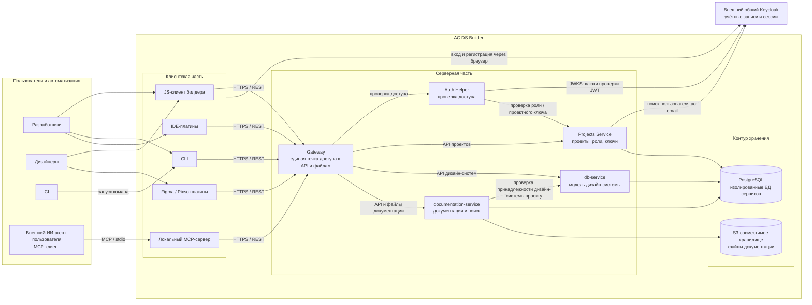

# Архитектура АС DS Builder

## Назначение и границы

АС DS Builder обеспечивает управление проектами и дизайн-системами, хранение тем, токенов и конфигураций компонентов,
публикацию и доступ к документации. Документ описывает целевую архитектуру.

В состав АС входят:

- **Клиентская часть:** JS-клиент билдера, CLI, локальный MCP-сервер, IDE-, Figma- и Pixso-плагины.
- **Серверная часть:** Gateway, Auth Helper, Projects Service, `db-service` и `documentation-service`.
- **Контур хранения:** PostgreSQL и S3; за их эксплуатацию и сопровождение отвечает команда DS Builder.

Клиентские компоненты входят в АС независимо от места исполнения. Пользователи, CI и совместимые внешние ИИ-агенты
используют её клиентские интерфейсы; IDE, Figma и Pixso выступают средами выполнения плагинов.

**Keycloak — общий внешний сервис идентификации** под ответственностью другой команды, конкретный владелец пока
не определён. Это единственный внешний сервис, к которому обращается серверная часть АС.

**Gateway — единственная точка клиентского доступа к серверным API и файлам АС.** Прямой доступ клиентов к сервисам,
PostgreSQL и S3 не предоставляется. Пользовательский вход выполняется на стороне внешнего Keycloak.

## Верхнеуровневая схема

Стрелки показывают инициатора обращения; ответы возвращаются по тому же каналу. Связи с пользователями обозначают
основные сценарии использования. PostgreSQL показан одним узлом: данные и учётные записи сервисов изолированы;
общий физический экземпляр БД не требуется.

## Ответственность компонентов

### Клиентская часть

| Компонент | Назначение |
| --- | --- |
| JS-клиент билдера | Работа разработчиков и дизайнеров с дизайн-системами и документацией. |
| CLI | Работа разработчика и CI с моделью дизайн-системы и локальными артефактами. |
| Локальный MCP-сервер | Доступ внешних ИИ-агентов к возможностям АС через MCP. Использует общий с CLI прикладной слой. |
| IDE-плагины | Доступ к модели, документации и связям с кодом из среды разработки. |
| Figma- и Pixso-плагины | Работа дизайнеров с данными дизайн-системы из дизайн-инструмента. |

### Серверная часть и данные

| Компонент | Ответственность |
| --- | --- |
| Gateway | Маршрутизация клиентских запросов и передача проверенного контекста доступа. |
| Auth Helper | Проверка пользовательских токенов и проектных ключей, получение проектных прав и решение о допуске запроса. |
| Projects Service | Источник истины для проектов, участников, проектных ролей и ключей доступа. |
| `db-service` | Источник истины для дизайн-систем, версий, тем, токенов и конфигураций компонентов. |
| `documentation-service` | Хранение и публикация документации, выдача страниц и файлов, поиск и связи с платформенным кодом. |

Каждый прикладной сервис работает со своей БД PostgreSQL; данные другого сервиса получает через API владельца.
`documentation-service` использует S3 для файлов. Опубликованная документация и связи с кодом не заменяют продуктовую
модель в `db-service`.

## Матрица взаимодействий

Сетевые обращения выполняются по модели запрос–ответ. Внутренние связи Gateway → сервис и сервис → сервис предполагают
проверку служебных ключей; этот подход находится **на рассмотрении**.

| Инициатор → получатель | Назначение | Интерфейс | Доступ |
| --- | --- | --- | --- |
| Внешний агент → локальный MCP | Вызов инструментов и получение результатов. | MCP / stdio | Локальный процесс; учётные данные АС использует MCP-сервер. |
| Клиентская часть → Gateway | Операции с данными, загрузка и скачивание файлов. | HTTPS / REST | Пользовательский токен или проектный ключ. |
| Интерактивные клиенты → Keycloak | Вход и регистрация через браузер. | HTTPS / OAuth2/OIDC | Пользовательская авторизация. |
| Gateway → Auth Helper | Проверка доступа к запрошенной операции. | Внутренний HTTP API | Служебный ключ и исходные учётные данные запроса. |
| Auth Helper → Keycloak | Получение открытых ключей проверки JWT. | HTTPS / JWKS | Доверенный источник ключей. |
| Auth Helper → Projects Service | Проверка проектной роли, статуса проекта и полномочий ключа. | Внутренний HTTP API | Служебный ключ. |
| Projects Service → Keycloak | Поиск пользователя по email для привязки к проекту. | HTTPS / Identity API | Служебный доступ, согласуемый с владельцем Keycloak. |
| Gateway → прикладные сервисы | Передача операции целевому сервису. | Внутренний HTTP API | Служебный ключ и проверенный контекст пользователя или проектного ключа. |
| `documentation-service` → `db-service` | Проверка принадлежности дизайн-системы проекту. | Внутренний HTTP API | Служебный ключ и контекст исходного обращения. |
| Прикладные сервисы → свои БД | Хранение и чтение данных. | Протокол PostgreSQL | Отдельные учётные данные сервисов. |
| `documentation-service` → S3 | Хранение и чтение файлов документации. | S3 API | Служебные учётные данные хранилища. |

Файлы выдаются по цепочке клиент → Gateway → `documentation-service` → S3 с проверкой проектного доступа при каждом
скачивании. Содержимое возвращается через сервис и Gateway; прямые ссылки на S3 клиентам не выдаются.

## Доступ и границы доверия

Любой пользователь с учётной записью в общем Keycloak может войти в DS Builder. Все интерактивные клиенты используют
страницу Keycloak в браузере с последующим возвращением в клиент. CI использует проектные ключи; MCP — заранее
полученную пользовательскую сессию или проектный ключ.

Keycloak отвечает за учётные записи, сессии и глобальные роли. Проектное членство и роли принадлежат Projects Service.
Права Viewer, Editor, Maintainer и Owner определены в документе «Ролевая модель DS Builder». Глобальный доступ `system_admin`
определён в ADR-0001. Проект является границей доступа к данным; полномочия проектного ключа ограничены его scopes.

Gateway делегирует проверку доступа Auth Helper и формирует доверенный контекст запроса. Прикладной сервис проверяет
разрешение операции и принадлежность ресурса проекту. Переданные клиентом служебные заголовки не принимаются как доверенные.

**Межсервисные ключи — на рассмотрении.** Базовый подход: отдельный ключ для каждой разрешённой направленной связи,
обязательная проверка ключа и допустимых операций принимающим сервисом. При отсутствующем, неверном или ненастроенном
ключе запрос не допускается. Служебный ключ не заменяет проверку проектных прав и не передаётся клиентской части АС.

## Открытые вопросы

- Определить команду-владельца Keycloak и согласовать контракт интеграции: браузерный вход, управление сессиями и поиск пользователей.
- Согласовать модель межсервисных ключей, защиту каналов, хранение и ротацию секретов.

## Основания

- ADR-0001: Auth, Projects и RBAC.
- ADR-0002: Документация.
- ADR-0003: Сбор документации CLI — граница клиентской подготовки артефактов; на ревью.
- ADR-0004: MCP.
- ADR-0005: Локальный контекст и авторизация — с учётом согласованного браузерного входа.
- Ролевая модель DS Builder.
