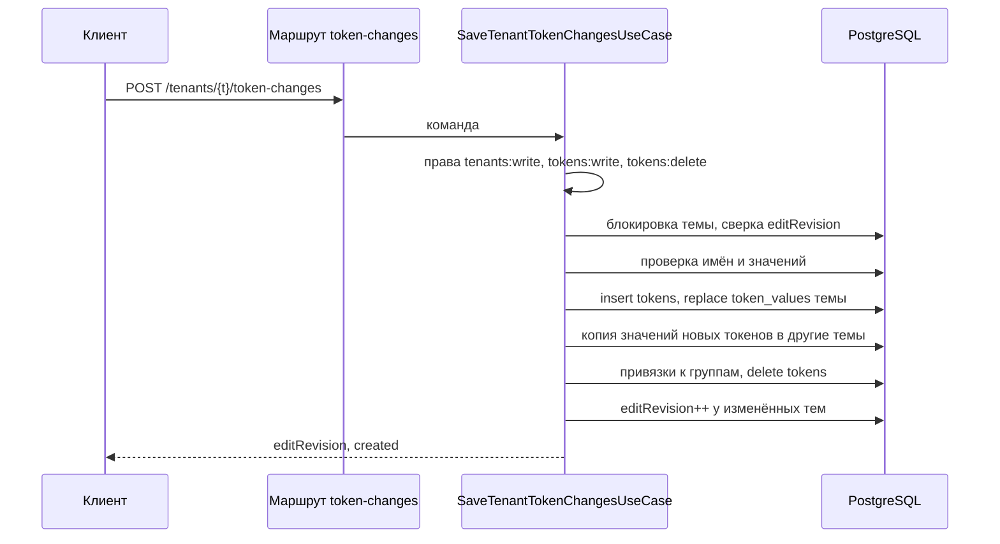

## Контекст

Значения токенов темы хранятся строками `token_values` по токену, теме, платформе и режиму; определения
токенов — общие для дизайн-системы строки `tokens`. `PUT /tenants/{id}/token-values` под блокировкой строки
темы сверяет `editRevision`, удаляет платформенные значения темы и вставляет переданные. `POST /tokens`
создаёт определение без значений, `DELETE /tokens/{id}` удаляет его вместе со значениями всех тем и обнуляет
ссылки компонентов. Ни одна операция не проверяет формат цветового значения.

Клиент `add-color-tokens-editor` сохраняет тему портом `ThemeSaveRepository`; адаптер `legacy` выполняет
четыре шага отдельными запросами. Палитра темы (`theme-palette-api`) хранит копию шаблона и явные
привязки токенов к группам; доступ к ней — порт `TenantPaletteRepository` в `feature-themes/application/palette`
(ленивая инициализация копии для тем, созданных в обход `ds-service`, снимок `FOR SHARE OF tenants`,
сохранение состояния вместе с ревизией) и чистые `PaletteOperations`. Операции палитры и
`PUT token-values` блокируют строку темы `FOR UPDATE OF tenants` и делят одну ревизию `editRevision`.
Контракт `ds-service` — статический `app/src/main/resources/openapi/documentation.yaml` с `x-permission`
у каждой операции и группы `contracts/route-manifest.json`; операции, которых нет в db-service, помечены
`origin: ds-service`, и тесты манифеста db-service их пропускают.

## Цели / Вне целей

**Цели:**

- одно атомарное сохранение изменений токенов темы;
- новый токен сразу полный во всех темах дизайн-системы;
- проверка цветовых значений на сервере;
- конкурентные правки других тем не теряют и не ломают новые и удалённые токены.

**Вне целей:**

- переименование токенов и правка метаданных существующих токенов;
- проверка значений токенов других типов;
- запрет удаления токена, используемого компонентами: ссылки компонентов обнуляются, как сейчас;
- доставка новых токенов в generator.

## Модель данных и контракты

```kotlin
@Serializable
data class SaveTenantTokenChangesRequest(
    val editRevision: Int,
    val create: List<CreateTokenItem> = emptyList(),
    val delete: List<String> = emptyList(),          // tokenId
    val values: List<TokenChangeValueItem>,
)

@Serializable
data class CreateTokenItem(
    val name: String,                                // без префикса режима
    val type: String,                                // color | gradient
    val displayName: String? = null,
    val description: String? = null,
    val enabled: Boolean = true,
    val paletteGroupId: String? = null,              // группа палитры темы
)

@Serializable
data class TokenChangeValueItem(
    val tokenId: String? = null,                     // существующий токен
    val tokenName: String? = null,                   // новый токен: name из create
    val tokenType: String? = null,
    val platform: String,
    val mode: String? = null,
    val paletteId: String? = null,
    val value: JsonElement,
)

@Serializable
data class SaveTenantTokenChangesResponse(
    val editRevision: Int,
    val created: List<CreatedTokenDto>,
)

@Serializable
data class CreatedTokenDto(val name: String, val type: String, val tokenId: String)
```

У значения задан ровно один адрес: `tokenId` либо пара `tokenName` и `tokenType` из `create`. Ошибки —
`ErrorResponse { error, message?, code?, editRevision? }`; `INVALID_TOKEN_VALUE` дополнительно несёт в
`message` адрес значения (`<tokenId|name>:<platform>:<mode>`).

Правила проверки значения цветового токена (`type = color`):

| Форма | Допустимо |
| --- | --- |
| строка или массив из одной строки | `#RGB`, `#RRGGBB`, `#RRGGBBAA`; `[type.shade.step]` или `[type.shade.step][o]`, где `o` от 0 до 1, а ступень есть в `tenant_palette_template` темы |
| `paletteId` | `value` — `null`, `[]` или `["<o>"]` |

Для градиентного токена web-значение — массив строк, каждая — `linear-gradient(...)`, `radial-gradient(...)`,
`conic-gradient(...)` или HEX; значения `ios` и `android` — массивы объектов, их структура не проверяется.

## Программное проектирование

```kotlin
// feature-themes/domain
object TokenNameRule {
    fun validate(name: String): TokenNameViolation?           // пусто, префикс режима, недопустимые символы
}
class TokenValueRule(private val paletteSteps: Set<PaletteStepKey>) {
    fun validate(type: ThemeTokenType, platform: ThemeTokenPlatform, input: TenantTokenValueInput): String?
}
data class PaletteStepKey(val type: ThemePaletteType, val shade: String, val step: Int)

// feature-themes/application
data class SaveTenantTokenChanges(
    val editRevision: Int,
    val create: List<NewToken>,
    val delete: List<UUID>,
    val values: List<TokenChangeValue>,
)
data class NewToken(
    val name: String, val type: ThemeTokenType, val displayName: String?, val description: String?,
    val enabled: Boolean, val paletteGroupId: UUID?,
)
sealed interface TokenRef { data class Existing(val id: UUID) : TokenRef; data class Created(val name: String, val type: ThemeTokenType) : TokenRef }
data class TokenChangeValue(val token: TokenRef, val input: TenantTokenValueInput)

sealed interface TenantTokenChangesLock {
    data object Locked : TenantTokenChangesLock
    data object NotFound : TenantTokenChangesLock
    data class RevisionConflict(val editRevision: Int) : TenantTokenChangesLock
}
/** Команда после проверок: имена новых токенов разрешены, значения адресованы токенам. */
data class ResolvedTokenChanges(
    val create: List<NewToken>,
    val delete: List<UUID>,
    val values: List<TokenChangeValue>,
)

sealed interface TenantTokenChangesOutcome {
    data class Saved(val editRevision: Int, val created: Map<NewTokenKey, UUID>) : TenantTokenChangesOutcome
    data class RevisionConflict(val editRevision: Int) : TenantTokenChangesOutcome
    data object NotFound : TenantTokenChangesOutcome
    data object ForeignToken : TenantTokenChangesOutcome
    data class NameConflict(val name: String) : TenantTokenChangesOutcome
    data class InvalidValue(val address: String, val reason: String) : TenantTokenChangesOutcome
    data object UnknownPaletteGroup : TenantTokenChangesOutcome
}

interface TenantRepository {
    // существующие методы …
    /** Блокирует темы дизайн-системы в порядке `id` и сверяет ревизию выбранной. */
    suspend fun lockForTokenChanges(projectId: UUID, tenantId: UUID, editRevision: Int, allThemes: Boolean): TenantTokenChangesLock
    /** Создаёт, заменяет, копирует и удаляет; увеличивает ревизии изменённых тем и возвращает ревизию выбранной. */
    suspend fun applyTokenChanges(tenantId: UUID, command: ResolvedTokenChanges): TenantTokenChangesOutcome
}

class SaveTenantTokenChangesUseCase(
    private val policy: DsAccessPolicy,
    private val transactions: TransactionRunner,
    private val repository: TenantRepository,
    private val palette: TenantPaletteRepository,       // ступени для проверки, привязки к группам
) {
    suspend fun execute(
        context: DsRequestContext,
        tenantId: UUID,
        command: SaveTenantTokenChanges,
    ): DsResult<TenantTokenChangesOutcome.Saved>
}
```

## Решения

### Одна операция вместо нескольких

Сохранение темы — одно действие пользователя, и частичный результат (определения без значений, значения без
удалений) хуже отказа. Поэтому создание, значения, привязка и удаление выполняются в одной транзакции под
блокировкой строки темы. Операция повторяет семантику `PUT token-values` для значений выбранной темы, чтобы
клиент отправлял тот же полный набор.



Отвергнуто: расширить `PUT token-values` полями создания и удаления — меняет контракт, на который опираются
CLI и прежний клиент.

### Значения нового токена копируются во все темы

Токен — сущность дизайн-системы, значения — темы. Без копии новый токен неполон во всех темах, кроме одной.
Копируются значения выбранной темы для всех платформ и режимов; ссылка на палитру копируется как есть и в
другой теме вычисляется по её собственной палитре. Привязка к группе палитры не копируется: группы
пользовательские у каждой темы свои, другие темы используют группу по умолчанию.

### Ревизии других тем

Добавление строк нового токена и удаление токена меняют данные других тем. Их `editRevision`
увеличивается: иначе открытый в другой вкладке редактор такой темы полной заменой стёр бы значения нового
токена или отправил бы значения удалённого. Темы блокируются в порядке `id`, чтобы два одновременных
сохранения в разных темах не взаимоблокировались.

### Проверка значений на сервере

Проверка — чистое правило `TokenValueRule` в domain. Ступени берутся из копии шаблона в снимке
`TenantPaletteRepository` после `initialize`, поэтому тема, созданная в обход `ds-service`, получает копию
до проверки. Та же проверка подключается к `PUT token-values` для цветовых и градиентных токенов. Существующие
данные не перепроверяются; некорректное значение старой темы будет отклонено только при следующем
сохранении, поэтому перед включением проверки выполняется выборка некорректных значений на стенде.

### Привязка к группе через палитру

Привязка нового токена записывается не прямой вставкой, а `PaletteOperations.assignTokenGroup` над
снимком палитры и `TenantPaletteRepository.save` в той же транзакции. Так сохраняются правила палитры
(группа должна принадлежать теме, системная группа по умолчанию не записывается явно), а ревизия темы
увеличивается один раз за операцию.

### Описание в контракте

Операции нет в db-service, поэтому она добавляется в группу манифеста с `origin: ds-service` и в
`documentation.yaml` с `x-permission: tenants:write`, схемами запроса и ответа и кодами ошибок, как
операции палитры темы. `OpenApiDocumentResourceTest` проверяет, что операции манифеста и документа
совпадают.

## Риски / Компромиссы

- [**BREAKING** проверка значений в `PUT token-values`] → выборка некорректных значений на стенде до
  включения; ответ называет адрес значения.
- [Удаление токена обнуляет ссылки компонентов] → клиент предупреждает списком компонентов до удаления;
  запрет удаления — отдельная задача.
- [Блокировка всех тем дизайн-системы при создании или удалении] → блокировка только при непустых `create`
  или `delete`; тем у дизайн-системы единицы.
- [Зависимость от неслитых PR палитры] → ветка перебазируется на `feature/ds-service` после слияния
  salute-developers/design-system-builder#101 и #105.

## Миграция и совместимость

Схема БД не меняется. `PUT token-values` остаётся для CLI и прежнего клиента. Клиент переходит на новую
операцию последней задачей; откат — возврат адаптера `legacy` в клиенте, сервер совместим с обоими.

## План проверки и развёртывания

- Автоматические: `cd backend-kt/ds-service && ./gradlew test detekt spotlessCheck build` (интеграционные
  тесты на Testcontainers требуют Docker), `cd js/apps/client && npm test && npm run build && npm run lint`,
  `tools/verify fast|full --change add-color-tokens-api`.
- Внешние до архивирования: сценарий сохранения на локальном контуре с проверкой данных в БД, выборка
  некорректных значений.
- После развёртывания: выборка некорректных цветовых значений на стенде до включения проверки в `PUT
  token-values` — в плане развёртывания команды.
