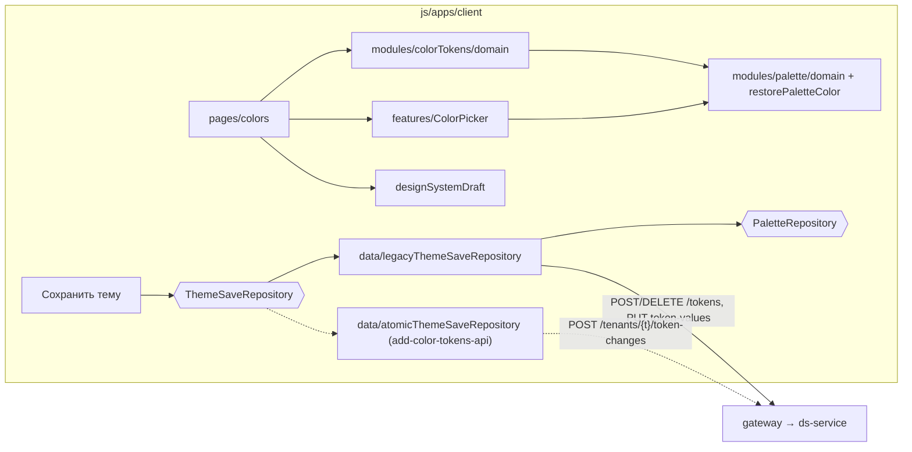

## Контекст

Раздел «Цвета» (`src/pages/colors`) собран из `Workspace`, `Menu` и `TokenColorEditor` на компонентах Plasma
и styled-components. Тема — изменяемые объекты `Theme` и `Token`; цветовой токен клиента — одно значение
режима и подгруппы с именем `<mode>.<group>.<subgroup>.<name>` и значениями трёх платформ. Значение — HEX
или ссылка на палитру `[type.shade.step][opacity]`. Ссылка вычисляется по палитре темы через
`restorePaletteColor`; группа палитры токена — явная привязка или правило по имени (`theme-palette-editor`).
Палитра по умолчанию работает с сервером (`VITE_PALETTE_SOURCE = api`) через
`draftAwarePaletteRepository`, который учитывает токены черновика (id с префиксом `draft:`): их группа —
по правилу имени, явную группу до сохранения задать нельзя.

Правки темы живут в черновике `ds_draft:<projectId>:<designSystemId>:<tenantId>`. В маршруте темы
`.../themes/:tenantId` кнопки публикации нет: её показ зависит от имени и версии дизайн-системы в URL.
`designSystemSave` отправляет только значения через `PUT /tenants/{id}/token-values` и падает на токенах без
определения в дизайн-системе, поэтому созданный в клиенте токен сохранить нельзя. Удаление разрешено только
токенам черновика.

В `ds-service` есть определения токенов (`POST`, `PATCH`, `DELETE /tokens`, `GET
/design-systems/{id}/tokens`), полная замена значений темы с `editRevision` и палитра темы
`/tenants/{id}/palette/*` с общей ревизией. Атомарной операции «создать
токены, сохранить значения, удалить токены» нет, её добавит `add-color-tokens-api`.

Эталон экрана — прототип `kenymook/SDDS-Design-System`, коммит
`86c1005` (последняя правка кода экрана Color Tokens; в HEAD `6243c2b` экран тот же).

## Цели / Вне целей

**Цели:**

- экран Color Tokens с поведением и вёрсткой прототипа;
- связь токена с палитрой темы видна в дереве, на борде, в инспекторе и в выборе цвета;
- создание и удаление цветовых токенов, доведённые до сервера сохранением темы;
- сохранение темы в маршруте tenant;
- экран не меняется при переходе с адаптера `legacy` на атомарное сохранение.

**Вне целей:**

- отслеживание изменений: раздел Changes, статусы правок у строк, сброс правок токена, отмена и повтор;
- переименование токена, правка описания и отображаемого имени;
- смена типа токена (цвет ↔ градиент);
- поплатформенные значения: правка, как сейчас, пишет одно значение во все платформы;
- копирование значений нового токена в другие темы дизайн-системы — это делает сервер в
  `add-color-tokens-api`;
- автоматическое сохранение значений токенов на сервер при каждой правке;
- обмен с Figma, публикация версии дизайн-системы.

## Архитектура



Экран читает и меняет существующие объекты `Theme` через действия `actions/colors.ts` и
`actions/gradients.ts`; модель экрана в `modules/colorTokens/domain` — чистые функции, которые собирают из
`Theme` и палитры темы дерево, борд, инспектор и пары контраста. Сохранение отделено портом: экран и
`Main` зависят только от `ThemeSaveRepository`.

## Модель экрана

Токен экрана — пара «группа и имя» без режима и подгруппы. Соответствие с токенами клиента:

| Прототип | Клиент |
| --- | --- |
| Токен `textAccent` | `text.accent`: все режимы и подгруппы с этим именем |
| Light, Dark | `light.<group>.default.<name>`, `dark.<group>.default.<name>` |
| OnDark, OnLight, Inverse | подгруппы `on-dark`, `on-light`, `inverse`; у `background` — `dark`, `light`, `inverse` |
| Hover, Active | `-hover`, `-active`: не показываются, пересчитываются от значения |

Разделы дерева по группе: `text` → Text & Icons, `surface` → Surfaces, `outline` → Outlines,
`background` → BG, `overlay` → Overlays, `data` → Data. Токены `read-only` и их состояния показываются в
разделе Technical. Раздел Syntax прототипа не показывается: у клиента нет таких токенов. Пустые разделы не
выводятся. Градиентные токены (`*-gradient`) показываются в своём разделе отдельными строками.

Категория на борде — подпись группы палитры токена: Neutral показывается как
General, Accent и Статус как Accent и Status, пользовательские группы — своими подписями. Для Surfaces и
Outlines к категории добавляется Solid или Transparent: префикс `transparent-` и имя `clear` — Transparent,
остальное — Solid. Для BG, Overlays, Data и Technical категория — Default, как в прототипе.

## Программное проектирование

```ts
// modules/colorTokens/domain
type ColorSection = 'text' | 'surface' | 'outline' | 'background' | 'overlay' | 'data' | 'technical';
type ColorContext = 'ondark' | 'onlight' | 'inverse';
type ColorMode = 'light' | 'dark';

interface ColorTokenKey { group: string; name: string; type: 'color' | 'gradient' }
interface ColorFieldValue {
  value: string;                       // исходное значение: HEX, ссылка или градиент
  resolved: string;                    // вычисленный цвет по палитре темы
  paletteLabel: string | null;         // «Blue 500» для ссылки на палитру
  opacity: number;                     // 0..1
}
interface ColorTokenView {
  key: ColorTokenKey;
  displayName: string;
  description: string;
  section: ColorSection;
  category: string;
  paletteGroupId: string | null;
  sourceIndex: number;
  enabled: boolean;
  scheduledForDeletion: boolean;
  modes: Record<ColorMode, ColorFieldValue>;
  contexts: Record<ColorContext, { linked: boolean; values: Record<ColorMode, ColorFieldValue> }>;
  issues: ColorValueIssue[];
}
interface ColorValueIssue { mode: ColorMode | `${ColorContext}-${ColorMode}`; message: string }

function buildColorTokenViews(theme: Theme, palette: ThemePaletteModel | null): ColorTokenView[];
function sectionOf(key: ColorTokenKey): ColorSection;
function categoryOf(key: ColorTokenKey, paletteGroupLabel: string | null): string;
function inheritedContextValue(context: ColorContext, mode: ColorMode, defaults: Record<ColorMode, string>): string;
function validateColorValue(value: string, type: ColorTokenKey['type']): string | null;
function filterAndSortTree(
  views: ColorTokenView[],
  options: { query: string; sort: 'az' | 'source'; issuesOnly: boolean },
): { section: ColorSection; tokens: ColorTokenView[] }[];

interface ContrastPair {
  componentName: string; variation: string; state: string; mode: ColorMode;
  backgroundToken: string; foregroundToken: string; kind: 'text' | 'ui';
  ratio: number | null; threshold: 4.5 | 3; pass: boolean;
}
function collectContrastPairs(components: Config[], theme: Theme, token: ColorTokenKey): ContrastPair[];
function compositeOver(foreground: string, background: string): string;

interface NewColorTokenInput {
  section: ColorSection; category: string; paletteGroupId: string | null;
  name: string; light: string; dark: string;
}
function normalizeNewTokenName(input: NewColorTokenInput): { group: string; name: string } | { error: string };

// modules/colorTokens/application
interface ThemeSaveRequest {
  context: EditorContextKey;
  editRevision: number;
  created: { type: 'color' | 'gradient'; names: string[]; paletteGroupId: string | null }[];
  deleted: { type: 'color' | 'gradient'; names: string[] }[];
  values: { type: string; name: string; mode: ColorMode | null; platform: Platform; value: unknown }[];
}
interface ThemeSaveResult { editRevision: number; createdTokenIds: Record<string, string> }
interface ThemeSaveRepository {
  save(request: ThemeSaveRequest): Promise<ThemeSaveResult>;   // ошибки: ThemeSaveError
}
type ThemeSaveError =
  | { kind: 'conflict'; editRevision: number }
  | { kind: 'forbidden' }
  | { kind: 'invalid'; message: string }
  | { kind: 'partial'; stage: 'definitions' | 'values' | 'deletion' | 'palette'; message: string };
```

`names` нового токена — имена определений без режима: базовое имя во всех подгруппах и состояния `-hover`
и `-active`. `partial` возвращает только адаптер `legacy`.

## Решения

### Вёрстка экрана переносится из прототипа

Как в `add-theme-palette-editor`: разметка функций `editor` (ветка `editorTab === 'colors'`),
`linkedColorTokenTree`, `groupedColorTokens`, `linkedColorTokenCanvas`, `canvasComponentExample`,
`themePreview`, `tokenInspector`, `colorInspectorField`, `colorPickerView`, `colorPickerLibraryView`,
`customTokenModal` и `scheduleTokenDeletion` повторяется React-компонентами с теми же классами; правила
`builder-ui-tokens.css` (блоки «Editor skeleton» и «Color Tokens») и `styles.css` (дерево, свотчи,
инспектор, выбор цвета, разделитель панелей, доступность) переносятся в `src/styles/color-tokens.css` под
корневым классом раздела. Если правило переопределяется позже в файле прототипа, переносится последнее.
Тексты интерфейса берутся из прототипа. Раздел отказывается от `Workspace`, как палитра, и сам ставит
`inert` на панели в режиме только чтения.

Отвергнуто: доработать текущий экран на Plasma — расходится с дизайном; подключить `styles.css` прототипа
целиком — тянет правила других экранов.

Готовность подтверждается сверкой скриншотов эталонных состояний при ширине 1440 px и 900 px. Данные
прототипа и клиента различаются, поэтому сверяются сетка, отступы, типографика, поведение поповеров и окон.

### Ошибки прототипа не переносятся

- Сортировка «А–Я» в прототипе ничего не меняет: разделы пересортировываются по исходному порядку. В
  клиенте «А–Я» сортирует по отображаемому имени внутри раздела.
- Пустой результат поиска в прототипе показывает строки-заглушки. В клиенте — пустое состояние «Ничего не
  найдено».
- Поиск во вкладке Library и мёртвые обработчики (`delete-custom-token`, угол градиента) не переносятся;
  поиск Library работает по имени растяжки.
- Значения подтем в прототипе не проверяются; в клиенте проверяются той же функцией, что Light и Dark.

### Категория — группа палитры

Прототип выводит категорию токена из пути (`.Accent.`, `.Status.`) и тем же правилом выбирает категорию
палитры. В клиенте у токена уже есть группа палитры: явная привязка или правило по имени. Категория на борде и
выбор категории в окне создания используют её, поэтому перенос токена в другую группу палитры сразу виден
на экране токенов, а пользовательские группы палитры становятся категориями.

Явную привязку можно записать только токену с `tokenId`, поэтому категория, выбранная при создании,
хранится в черновике как отложенная группа токена. До сохранения `draftAwarePaletteRepository` и
`restorePaletteColor` относят токен черновика к отложенной группе, а не к группе по правилу имени: категория,
связи и цвет совпадают. Поле «Группа палитры» такого токена остаётся недоступным, как требует
`theme-palette-editor`, и показывает отложенную группу с подсказкой «Закрепится при сохранении темы». При
сохранении отложенная группа, отличная от группы по умолчанию, становится явной привязкой. Если группу
удалили до сохранения, токен возвращается к группе по правилу имени.

Отвергнуто: хранить категорию в имени или отдельном поле — у токенов нет поля категории, а имя задаёт
пользователь; разрешить явную привязку токена черновика — `draft:` id не существует на сервере.

### Связь подтем вычисляется по значениям

Прототип хранит признак «связь отключена» отдельно. Клиент уже вычисляет связь подтемы сравнением её
значений с ожидаемыми (OnDark — Dark, OnLight — Light, Inverse — Light и Dark наоборот) и переносит правку
Light или Dark в связанные подтемы. Этот подход сохраняется: сервер не хранит признака связи, и его
пришлось бы держать только в браузере. Ручная правка подтемы отключает связь, щелчок по переключателю
восстанавливает наследование. Подтема, вручную приведённая к унаследованному значению, считается связанной.

### Удаление — отметка в черновике

Удаление существующего токена записывает в черновик отметку `deleted` с именами всех его определений.
Токен остаётся в дереве, инспектор показывает «Удаление запланировано» с действием «Отменить удаление»
(вместо ссылки на раздел изменений прототипа). При сохранении отмеченные токены удаляются после записи
значений. Токен, созданный в черновике, удаляется сразу. Кнопка доступна ролям `maintainer` и `owner`:
загрузчик сохраняет `effectiveRole` проекта в параметрах дизайн-системы.

### Сохранение темы через порт

Кнопка «Сохранить» появляется в шапке редактора маршрута tenant, когда черновик не пуст и тема доступна для
изменения. `ThemeSaveRepository` скрывает способ доставки:

- `legacy` (по умолчанию в этом изменении):
  1. читает определения дизайн-системы и создаёт `POST /tokens` только недостающие имена — повтор после
     частичного сбоя не создаёт дубликатов;
  2. отправляет `PUT /tenants/{id}/token-values` с `editRevision` без значений удаляемых токенов;
  3. удаляет отмеченные токены `DELETE /tokens/{id}`;
  4. для новых токенов с отложенной группой вызывает привязку к группе через `PaletteRepository`; ревизия
     общая с палитрой, поэтому каждый шаг передаёт ревизию, полученную предыдущим.
- атомарный адаптер — `add-color-tokens-api`.

При успехе черновик очищается и тема перезагружается. `TENANT_EDIT_CONFLICT` сохраняет черновик и
предлагает перезагрузку, как требует `tenant-aware-theme-editor`. Ошибка `partial` сохраняет черновик и
сообщает этап; повторное сохранение продолжает с того же места, потому что шаги 1, 3 и 4 идемпотентны.

Отвергнуто: создавать определения сразу при создании токена — правка без сохранения оставила бы на сервере
токены без значений во всех темах.

### Неполные токены при загрузке

Пока сервер не копирует значения нового токена в другие темы (`add-color-tokens-api`), токен, сохранённый
в одной теме, приходит в другие без значений. Загрузчик перестаёт падать на таких определениях: токен
показывается в дереве с отметкой «Нет значений в этой теме», а инспектор предлагает заполнить Light и Dark
значениями по умолчанию раздела.

### Доступность по свойствам компонентов

У конфигураций компонентов нет ролей «фон» и «текст», как в реестре прототипа. Пары строятся по
web-свойствам стилей компонента в каждой вариации и состоянии: фон — свойства `background*`, `*Background*`,
`fillColor`; передний план — `color`, `*Color` для текста и иконок; контур — `border*`, `outline*`,
`focusColor`. Если имя не распознано, используется группа токена (`surface`, `background` — фон; `text` —
передний план; `outline` — контур). Свойства без web-отображения пропускаются. Порог: текст — 4.5, иконка и
контур — 3. В отличие от прототипа, прозрачность учитывается наложением на фон, а фон с прозрачностью —
на `background.default.primary` режима.

### Градиенты

Тип токена в клиенте и на сервере определяет его имя и формат значений, поэтому переключатель Solid/Gradient
показывает тип токена и не меняет его. Градиентный токен открывает выбор цвета в режиме Gradient со
стопами, позициями и прозрачностью; цвет стопа выбирается во вкладках Custom и Library. Тип градиента —
только Linear, как в прототипе.

### Проблемы значений без отслеживания изменений

Фильтр «Только с проблемами» и отметка строки строятся проверкой текущих значений: пустое значение, не HEX
`#RGB`, `#RRGGBB`, `#RRGGBBAA`, не ссылка на существующую ступень палитры темы, не `linear-gradient(...)` для
градиента. Тексты — из `validateChange` прототипа. Статусы «изменён», «предупреждение» прототипа
относятся к отслеживанию изменений и не переносятся.

## Риски / Компромиссы

- [Адаптер `legacy` не атомарен] → идемпотентные шаги, черновик хранится до полного успеха, этап ошибки
  виден пользователю; атомарное сохранение в `add-color-tokens-api`.
- [Новый токен без значений в других темах до появления сервера] → отметка неполного токена и заполнение
  значениями по умолчанию.
- [Удаление токена, используемого в компонентах] → в режиме `legacy` сервер обнуляет привязки; окно
  удаления предупреждает и перечисляет компоненты, где найден токен, по загруженным конфигурациям.
- [Ветка опирается на неслитые PR палитры salute-developers/design-system-builder#101 и #105] → после их
  слияния ветка перебазируется на `feature/ds-service`; экран переиспользует резолвер, `TokenGroupSelect` и
  Library палитры, не меняя их контракт.
- [Отдельная задача автосохранения значений токенов (вне PR палитры)] → сохранение спрятано за портом
  `ThemeSaveRepository`; автосохранение сможет вызывать тот же порт.
- [Эвристика пар контраста по именам свойств] → правило покрыто тестами на конфигурациях сидов, нераспознанные
  свойства не создают пар.
- [Прототип продолжает меняться] → эталон закреплён коммитом `86c1005`.

## План проверки и развёртывания

- Автоматические: `cd js/apps/client && npm test && npm run build && npm run lint`, `cd js && npm run build`,
  `npm run test:browser` для разметки раздела, `tools/verify fast|full --change add-color-tokens-editor`.
- Внешние до архивирования: сценарий раздела на локальном контуре под editor, maintainer и viewer,
  сохранение темы с проверкой данных на сервере, сверка скриншотов с прототипом.
- После `add-color-tokens-api`: повтор сценария с атомарным адаптером — в задачах того изменения.
