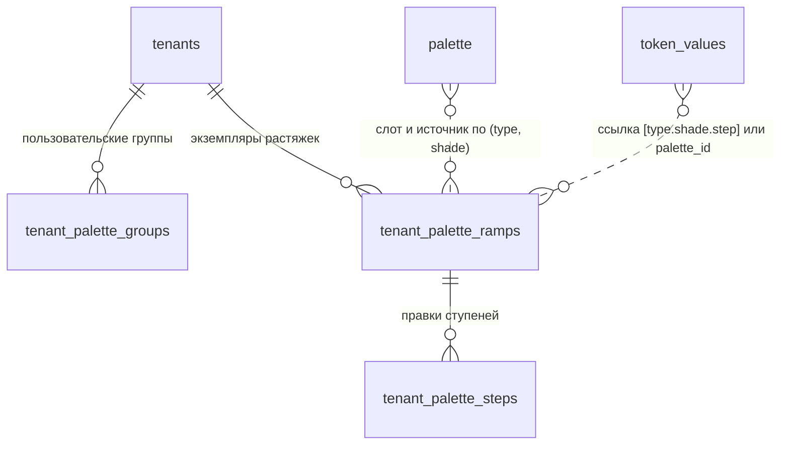

## Контекст

`ds-service` (Kotlin, Ktor, Exposed, Flyway) обслуживает `/api/ds/**` вместо db-service и работает с той
же базой. Тема — тенант дизайн-системы; значения токенов темы читаются и сохраняются в `feature-themes`
(`GET` и `PUT /tenants/{id}/token-values`), сохранение защищено `edit_revision` с блокировкой строки
тенанта. Палитра есть только глобальная (`feature-tokens`, `GET /palette`, запись — системный
администратор).

Значение токена ссылается на палитру двумя способами: внешним ключом `palette_id` со значением `null` или
`[opacity]` (начальные значения темы) и строкой `[general.red.500][0.56]` в `value` (сохранение из
клиента). Оба вида должны продолжать работать.

Клиент из `add-theme-palette-editor` уже работает с палитрой темы через порт `PaletteRepository`; это
изменение даёт адаптеру `api` сервер. Логика палитры описана там же и проверяется эталоном
`js/apps/client/src/modules/palette/fixtures/palette-golden.json`.

## Цели / Вне целей

**Цели:**

- палитра темы на сервере с операциями прототипа и тем же контрактом, что у клиента;
- конкурентный доступ с той же ревизией темы, что у значений токенов;
- цвета палитры темы в CLI `theme fetch`.

**Вне целей:**

- generator: он читает legacy `theme-data` из db-service без тенанта; перевод generator на `ds-service`
  — отдельное изменение, после которого он сможет запросить `resolvePalette=true`;
- изменение библиотеки и её прав;
- перенос `palette_id` в строки и удаление столбца;
- отслеживание изменений палитры.

## Архитектура

Палитра темы живёт в `feature-themes`: операции палитры делят транзакцию и `edit_revision` с тенантом и
его значениями токенов, а feature-модули не могут зависеть друг от друга. Библиотека читается через
внутреннюю проекцию таблицы `palette`, как уже сделано в `TenantTables.kt`.

```mermaid
flowchart LR
  Client[клиент: httpPaletteRepository] -->|/api/projects/{p}/ds/tenants/{t}/palette/*| GW[gateway]
  CLI[dsbuilder theme fetch] -->|token-values?resolvePalette=true| GW
  GW --> Routes[feature-themes presentation: TenantPaletteRoutes]
  Routes --> UC[application: *PaletteUseCase]
  UC --> Domain[domain: группы, вычисление, перестройка]
  UC --> Repo[data: ExposedTenantPaletteRepository]
  Repo --> PG[(PostgreSQL: tenant_palette_*, palette, token_values)]
```

## Модель данных и контракты



- `tenant_palette_groups`: `id uuid`, `tenant_id → tenants ON DELETE CASCADE`, `key text`
  (`custom-<8 символов id>`), `label text`, `created_at`, `updated_at`; уникальность `(tenant_id, key)` и
  `(tenant_id, lower(label))`.
- `tenant_palette_ramps`: `id uuid`, `tenant_id → CASCADE`, `group_key text`, `slot_type palette_type`,
  `slot_shade text`, `source_type palette_type`, `source_shade text`, `added boolean`, `origin`
  (`palette_ramp_origin`: `library | rebuild`), `anchor_step integer null`, `anchor_value text null`,
  `created_at`, `updated_at`; уникальность `(tenant_id, group_key, slot_type, slot_shade)`. Строка
  появляется, только когда растяжку добавили или изменили; растяжки, известные по ссылкам токенов,
  вычисляются.
- `tenant_palette_steps`: `ramp_id → tenant_palette_ramps ON DELETE CASCADE`, `step integer`,
  `value text`; первичный ключ `(ramp_id, step)`.

DTO совпадают с `add-theme-palette-editor` (`ThemePalette`, `PaletteGroup`, `PaletteRamp`, `PaletteStep`,
`PaletteLink`). Операции изменения отвечают `{ editRevision, value }`. Ошибки — `ErrorResponse` с кодами
`PALETTE_GROUP_EXISTS`, `PALETTE_GROUP_SYSTEM`, `PALETTE_RAMP_EXISTS`, `PALETTE_RAMP_LINKED`,
`PALETTE_STEP_MISSING`, `TENANT_EDIT_CONFLICT` (с текущим `editRevision`).

| Метод и путь под `/api/ds/tenants/{tenantId}/palette` | Тело | Право |
|---|---|---|
| `GET` | — | `tenants:read` |
| `GET /links?type&shade&group&step` | — | `tenants:read` |
| `POST /groups` | `{ label, editRevision }` | `tenants:write` |
| `DELETE /groups/{key}` | `{ editRevision }` | `tenants:write` |
| `POST /groups/{key}/ramps` | `{ type, shade, editRevision }` | `tenants:write` |
| `PUT /groups/{key}/ramps/{type}/{shade}/source` | `{ type, shade, editRevision }` | `tenants:write` |
| `POST /groups/{key}/ramps/{type}/{shade}/rebuild` | `{ anchorStep, value, preview, editRevision }` | `tenants:write` |
| `PATCH /groups/{key}/ramps/{type}/{shade}/steps/{step}` | `{ value, editRevision }` | `tenants:write` |
| `DELETE /groups/{key}/ramps/{type}/{shade}` | `{ strategy?, replacement?, editRevision }` | `tenants:write` |

## Программное проектирование

```kotlin
// domain
data class PaletteReference(val type: ThemePaletteType, val shade: String, val step: Int, val opacity: Double?)
object PaletteReferenceParser { fun parse(value: JsonElement?, paletteId: PaletteEntryRef?): PaletteReference? }
object PaletteTokenGroups { fun groupFor(tokenName: String): SystemPaletteGroup }
object PaletteRampRebuilder { fun rebuild(source: LibraryRamp, anchorStep: Int, anchorHex: String): Map<Int, String> }
object PaletteDisplayNames { fun of(source: PaletteRampRef, anchor: PaletteAnchor?): String }
class ThemePaletteResolver(private val state: TenantPaletteState) {
    fun palette(links: List<ColorTokenLink>, canEdit: Boolean): ThemePalette
    fun resolveColor(tokenName: String, value: JsonElement?, paletteId: PaletteEntryRef?): String?
}

// application: один *UseCase на операцию, единственный execute
class GetTenantPaletteUseCase(...) { suspend fun execute(ctx: DsRequestContext, tenantId: UUID): DsResult<ThemePalette> }
class ListTenantPaletteLinksUseCase(...)
class CreateTenantPaletteGroupUseCase(...)
class DeleteTenantPaletteGroupUseCase(...)
class AddTenantPaletteRampUseCase(...)
class ReplaceTenantPaletteRampSourceUseCase(...)
class RebuildTenantPaletteRampUseCase(...)
class UpdateTenantPaletteStepUseCase(...)
class RemoveTenantPaletteRampUseCase(...)

interface TenantPaletteRepository {
    fun lockTenant(projectId: ProjectId, tenantId: UUID, editRevision: Int): TenantLockOutcome
    fun state(projectId: ProjectId, tenantId: UUID): TenantPaletteState?
    fun colorLinks(projectId: ProjectId, tenantId: UUID): List<ColorTokenLink>
    fun saveGroup(...); fun deleteGroup(...); fun saveRamp(...); fun deleteRamp(...)
    fun rewriteTokenReferences(changes: List<TokenReferenceChange>): Int
    fun bumpEditRevision(tenantId: UUID): Int
}
```

Каждая операция изменения выполняется в `TransactionRunner.required`: проверка права, блокировка тенанта
`forUpdate()` и сравнение `editRevision`, изменение, увеличение `edit_revision`. Переписанные ссылки при
удалении растяжки записываются в той же форме, что пишет `PUT /tenants/{id}/token-values`.

## Решения

### Палитра принадлежит теме

В ветке `ds-service` у дизайн-системы несколько тем, а прототип хранит палитру внутри темы. Связи
считаются по значениям токенов этой темы. Отвергнуто: палитра дизайн-системы — замена растяжки в одной
теме меняла бы остальные.

### Ревизия темы вместо отдельной ревизии палитры

Палитра определяет цвета токенов темы, а удаление растяжки переписывает значения токенов. Общая
`edit_revision` защищает от потери правок в обоих направлениях. Цена — клиент обновляет ревизию после
каждой операции палитры перед сохранением токенов; это уже заложено в `add-theme-palette-editor`.

### Ссылки не переносятся

Сервер понимает обе формы ссылки (`palette_id` и строку). Перенос `palette_id` в строки затронул бы
начальные значения тем и CLI без пользы для палитры.

### Вычисление цветов для CLI на сервере

CLI получает HEX и исходную ссылку через `resolvePalette=true` и не повторяет правило групп. CLI пишет
значение токена как есть и игнорирует `palette.json` для таких значений.

### Операции, которых нет в db-service

`OpenApiDocumentFactory` сейчас требует, чтобы каждая операция манифеста была в OpenAPI db-service.
Маршруты палитры темы помечаются в манифесте признаком `"origin": "ds-service"`, и фабрика описывает их
по DTO `ds-service`; тест фабрики проверяет, что признак есть только у новых маршрутов.

## Риски / Компромиссы

- [Миграция `V3` меняет схему, и `FlywayPostgresIntegrationTest` ожидает две миграции и отпечаток после
  `V1`] → тест перестраивается: отпечаток принятой базы сравнивается на цели `1`, число миграций — `3`.
- [db-service работает на той же базе как путь отката] → новые таблицы ему не видны; при откате палитра
  темы перестаёт влиять на CLI, ссылки токенов остаются валидными.
- [Логика палитры на двух языках] → тесты `ds-service` читают эталон `palette-golden.json` клиента.
- [Удаление растяжки переписывает значения токенов, пока у пользователя есть черновик] → клиент
  перезагружает значения темы; черновик выигрывает при следующем сохранении.
- [Чтение палитры загружает все цветовые значения темы] → один запрос на чтение, без N+1; объём
  ограничен числом токенов темы.

## Миграция и совместимость

1. `V3__tenant_palette.sql` создаёт enum `palette_ramp_origin` и три таблицы, данные не меняет.
2. Ответы без `resolvePalette` не меняются.
3. Порядок развёртывания: `ds-service`, затем CLI и клиент с `VITE_PALETTE_SOURCE = api`. Палитры,
   созданные в режиме `local`, на сервер не переносятся.
4. Откат: прежний образ `ds-service` и клиент с `VITE_PALETTE_SOURCE = local`; таблицы `V3` можно
   оставить.

## План проверки и развёртывания

- Автоматические: `cd backend-kt/ds-service && ./gradlew test detekt spotlessCheck build` (нужен Docker
  для Testcontainers), `cd backend-kt && ./gradlew verifyFast`, тесты `frontend-kt` CLI, сборка и тесты
  клиента, `tools/verify fast|full --change add-theme-palette-api`.
- Внешние до архивирования: сценарий раздела в режиме `api` на локальном контуре, два пользователя для
  конфликта ревизии, `dsbuilder theme fetch` против локального gateway.
