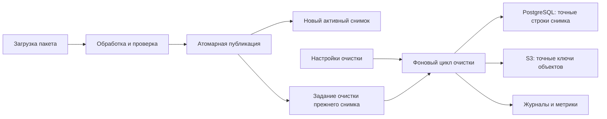
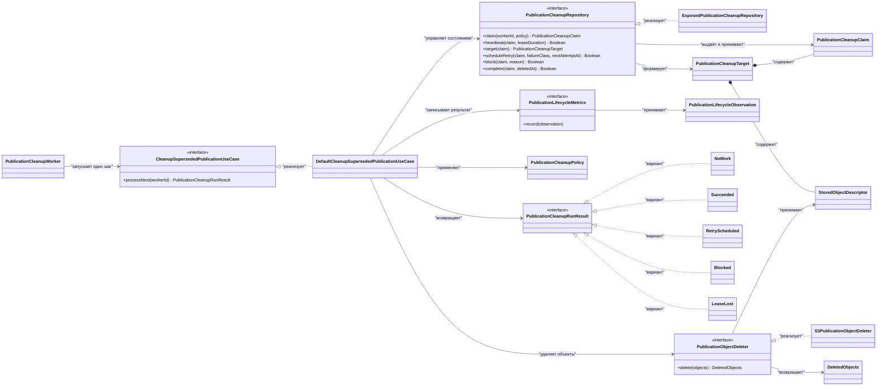
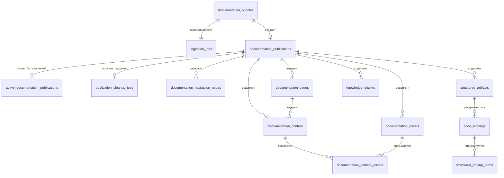
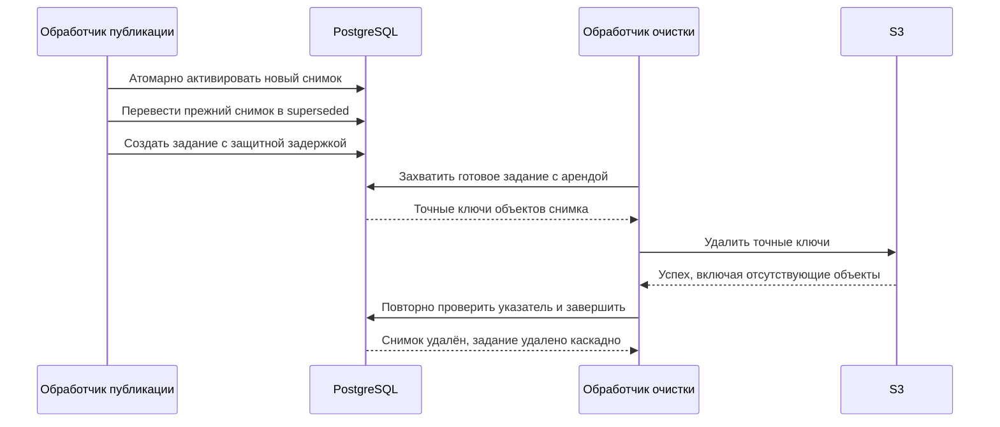
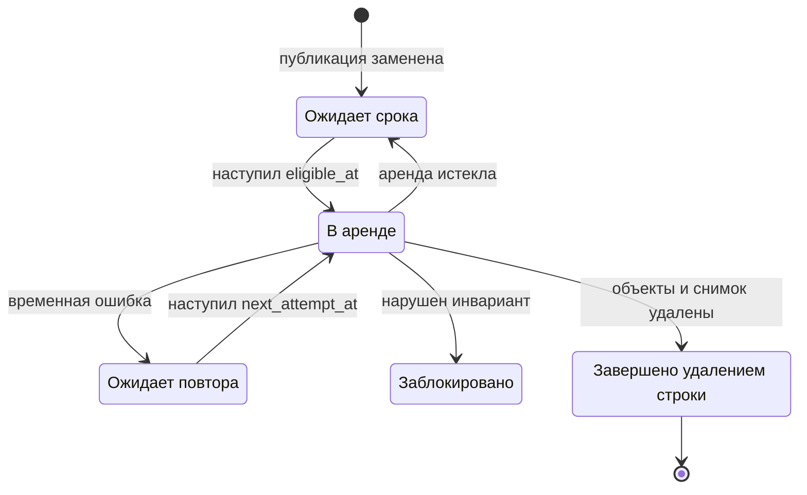

## Контекст

`documentation-service` хранит каждую обработанную загрузку как неизменяемую публикацию. Таблица `active_documentation_publications` указывает на публикацию, доступную для чтения по ключу `(projectId, designSystemId, version, platform)`. Повторная загрузка того же ключа создаёт новый полный снимок, переводит прежний в состояние `superseded`, но не удаляет связанные строки и объекты S3.

Для разных версий это корректная модель: документация должна жить столько же, сколько доступна соответствующая версия библиотеки. Для повторной публикации одного ключа накопление заменённых снимков пользы не даёт. Синхронное удаление в операции публикации при этом опасно: S3 и PostgreSQL не поддерживают общую транзакцию, а долгая очистка увеличит время и риск отказа публикации.

## Цели / Вне целей

**Цели:**

- после повторной публикации одного ключа оставить доступным новый снимок и гарантированно запланировать удаление прежнего;
- выполнять удаление асинхронно, повторяемо и с возможностью продолжения после перезапуска;
- удалять только объекты, принадлежащие конкретной публикации;
- сохранить метаданные загрузки и диагностику после удаления тяжёлых данных;
- сделать рост очереди, задержки и ошибки наблюдаемыми.

**Вне целей:**

- ограничение числа или возраста разных версий дизайн-системы;
- дедупликация одинакового содержимого между публикациями;
- хранение разностей документации или привязок к коду;
- изменение публичных контрактов загрузки, чтения и поиска;
- правила жизненного цикла бакета, удаляющие данные по общему префиксу.

## Архитектура

Правило очистки относится к жизненному циклу публикации и разделяется по существующим слоям: доменный слой описывает состояния и результат, прикладной слой координирует работу через порты, слой данных реализует PostgreSQL и S3, а `app` запускает фоновый цикл и связывает конфигурацию.



Граница ответственности:

- `feature-processing/domain` — состояния задания, политика повторов и результат одного шага;
- `feature-processing/application` — захват задания, проверка актуальности, удаление объектов и завершение;
- `data` — адаптеры PostgreSQL и S3;
- `app` и `di` — настройки, периодический запуск и наблюдаемость;
- `presentation` не меняется.

## Программное проектирование

Контракты прикладного слоя не зависят от Exposed, AWS SDK или механизма периодического запуска:

```kotlin
data class PublicationCleanupPolicy(
    val gracePeriod: Duration,
    val leaseDuration: Duration,
    val retryInitialDelay: Duration,
    val retryMaxDelay: Duration,
)

data class PublicationCleanupClaim(
    val publicationId: String,
    val leaseOwner: String,
    val leaseUntil: Instant,
    val attempt: Int,
)

data class StoredObjectDescriptor(
    val bucket: String,
    val key: String,
    val size: Long,
)

data class PublicationCleanupTarget(
    val claim: PublicationCleanupClaim,
    val publicationObjects: List<StoredObjectDescriptor>,
    val rawBundle: StoredObjectDescriptor,
)

data class DeletedObjects(
    val count: Int,
    val bytes: Long,
)

data class PublicationLifecycleObservation(
    val outcome: PublicationCleanupOutcome,
    val failureClass: PublicationCleanupFailureClass?,
    val durationMillis: Long,
    val deletedBytes: Long,
)

sealed interface PublicationCleanupRunResult {
    data object NoWork : PublicationCleanupRunResult
    data class Succeeded(val deleted: DeletedObjects) : PublicationCleanupRunResult
    data class RetryScheduled(
        val failureClass: PublicationCleanupFailureClass,
        val nextAttemptAt: Instant,
    ) : PublicationCleanupRunResult
    data class Blocked(
        val failureClass: PublicationCleanupFailureClass,
    ) : PublicationCleanupRunResult
    data object LeaseLost : PublicationCleanupRunResult
}
enum class PublicationCleanupOutcome { SUCCEEDED, RETRY_SCHEDULED, BLOCKED, LEASE_LOST }
enum class PublicationCleanupFailureClass { OBJECT_STORAGE, DATABASE, INVARIANT }

interface PublicationCleanupRepository {
    suspend fun claim(workerId: String, policy: PublicationCleanupPolicy): PublicationCleanupClaim?
    suspend fun heartbeat(claim: PublicationCleanupClaim, leaseDuration: Duration): Boolean
    suspend fun target(claim: PublicationCleanupClaim): PublicationCleanupTarget?
    suspend fun scheduleRetry(
        claim: PublicationCleanupClaim,
        failureClass: PublicationCleanupFailureClass,
        nextAttemptAt: Instant,
    ): Boolean
    suspend fun block(claim: PublicationCleanupClaim, reason: PublicationCleanupFailureClass): Boolean
    suspend fun complete(claim: PublicationCleanupClaim, deletedAt: Instant): Boolean
}

fun interface PublicationObjectDeleter {
    suspend fun delete(objects: List<StoredObjectDescriptor>): DeletedObjects
}

fun interface PublicationLifecycleMetrics {
    fun record(observation: PublicationLifecycleObservation)
}

interface CleanupSupersededPublicationUseCase {
    suspend fun processNext(workerId: String): PublicationCleanupRunResult
}

class DefaultCleanupSupersededPublicationUseCase(
    repository: PublicationCleanupRepository,
    objects: PublicationObjectDeleter,
    metrics: PublicationLifecycleMetrics,
    policy: PublicationCleanupPolicy,
) : CleanupSupersededPublicationUseCase

class PublicationCleanupWorker(
    cleanup: CleanupSupersededPublicationUseCase,
    pollingInterval: Duration,
)

class ExposedPublicationCleanupRepository(
    database: Database,
) : PublicationCleanupRepository

class S3PublicationObjectDeleter(
    client: S3Client,
) : PublicationObjectDeleter
```

Связи контрактов и реализаций:



Роли интерфейсов:

- `CleanupSupersededPublicationUseCase` — входной порт одного ограниченного шага очистки. Фоновый цикл вызывает его, но не знает о транзакциях PostgreSQL, объектах S3, повторах и блокировках. Возвращаемый `PublicationCleanupRunResult` позволяет циклу решить только, продолжать ли опрос или ждать следующего периода.
- `PublicationCleanupRepository` — порт устойчивого состояния и транзакционных инвариантов. Он захватывает и продлевает аренду, повторно проверяет активный указатель, формирует точную цель очистки и выполняет условные переходы `retry_wait`, `blocked` или успешное завершение. Интерфейс не удаляет объекты S3.
- `PublicationObjectDeleter` — порт удаления из хранилища объектов. Он принимает уже проверенный список точных `StoredObjectDescriptor`, выполняет идемпотентное пакетное удаление и возвращает число и размер удалённых объектов. Интерфейс не выбирает публикацию и не меняет состояние PostgreSQL.
- `PublicationLifecycleMetrics` — выходной порт наблюдаемости. Он принимает только низкокардинальное `PublicationLifecycleObservation`; результат вызова не влияет на переход состояния задания, поэтому сбой реализации метрик не должен превращать успешную очистку в повтор.
- `PublicationCleanupRunResult` — закрытая иерархия исходов одного шага, а не инфраструктурный порт. Она различает отсутствие готовой работы, успех, запланированный повтор, блокировку и потерю аренды без передачи наружу исключений PostgreSQL или S3.

Роли классов:

- `PublicationCleanupWorker` принадлежит `app`: соблюдает `enabled` и `pollingInterval`, назначает `workerId`, вызывает `processNext` и корректно прекращает цикл при остановке приложения.
- `DefaultCleanupSupersededPublicationUseCase` содержит порядок прикладного сценария и единственный принимает решение о следующем переходе задания. Все четыре зависимости передаются через конструктор.
- `ExposedPublicationCleanupRepository` реализует транзакции и конкурентный захват PostgreSQL; он является единственным местом, где прикладные операции переводятся в SQL.
- `S3PublicationObjectDeleter` адаптирует существующий `S3Client`, разбивает список на допустимые пакеты и считает отсутствие объекта успешным результатом.

Конкретная реализация `PublicationLifecycleMetrics` связывается в `di` с существующим механизмом метрик приложения; отдельный инфраструктурный тип в контракте не закрепляется. Благодаря этому способ экспорта метрик можно выбрать при реализации без изменения прикладного слоя.

Разделение портов соответствует границам отказа: транзакцию PostgreSQL можно повторить независимо от S3, удаление S3 можно сделать идемпотентным независимо от очереди, а наблюдаемость можно заменить или отключить без изменения решения о состоянии задания.

`complete` повторно проверяет владение арендой и отсутствие активного указателя, удаляет публикацию в одной транзакции и отмечает `documentation_bundles.storage_deleted_at`. Удаление публикации каскадно удаляет строку очереди.

## Модель данных и контракты

Добавляется таблица `publication_cleanup_jobs`:

| Поле | Назначение |
| --- | --- |
| `publication_id` | Первичный и внешний ключ на `documentation_publications.id` с `ON DELETE CASCADE` |
| `state` | `pending`, `leased`, `retry_wait` или `blocked` |
| `eligible_at` | Момент, после которого очистку можно начинать |
| `lease_owner`, `lease_until` | Владение заданием с ограниченным сроком |
| `attempt` | Число начатых попыток |
| `next_attempt_at` | Момент следующей попытки после временной ошибки |
| `last_failure_class` | Ограниченный класс последней ошибки без чувствительных данных |
| `created_at`, `updated_at` | Диагностика возраста и движения очереди |

Строка создаётся в той же транзакции, которая переводит прежнюю публикацию в `superseded` и переключает активный указатель. Внешний ключ не позволяет заданию осиротеть; при успешном завершении отдельное удаление строки очереди не требуется.

Для новых заданий `eligible_at` равен времени фиксации повторной публикации плюс `documentation.cleanup.graceSeconds`.

В `documentation_bundles` добавляется `storage_deleted_at`. Строка пакета, состояние задания обработки и диагностические поля сохраняются, но тяжёлый исходный объект удаляется.



Диаграмма показывает связи, участвующие в очистке: строки документации, индекса и привязок каскадно удаляются с публикацией, а метаданные исходного пакета и задания обработки остаются. Ключи объектов S3 берутся из `documentation_content`, `documentation_assets`, `structured_artifacts` и `documentation_bundles`.

Настройки приложения:

- `documentation.cleanup.enabled` — по умолчанию `false` для безопасного включения после развёртывания;
- `documentation.cleanup.graceSeconds` — по умолчанию `86400`;
- `documentation.cleanup.pollingMs` — период опроса очереди;
- `documentation.cleanup.leaseSeconds` — срок аренды задания;
- `documentation.cleanup.retryInitialSeconds` и `documentation.cleanup.retryMaxSeconds` — границы экспоненциальной задержки повторов.

## Поток данных



Порядок одного шага:

1. Репозиторий атомарно захватывает готовое задание через `FOR UPDATE SKIP LOCKED`, увеличивает `attempt` и устанавливает аренду.
2. Он проверяет, что публикация остаётся `superseded` и на неё не указывает `active_documentation_publications`.
3. Он возвращает только сохранённые ключи объектов этой публикации и исходного пакета.
4. Адаптер S3 удаляет эти ключи; отсутствие объекта считается успехом.
5. Завершающая транзакция повторно проверяет аренду и активный указатель, удаляет публикацию с зависимыми строками и отмечает удаление исходного объекта.
6. Другие версии и платформы не затрагиваются.



Завершённое состояние не хранится в очереди отдельной строкой: оно означает успешную завершающую транзакцию, в которой строка публикации и связанное задание уже удалены.

## Ошибки и восстановление

- Частично удалённый набор S3 безопасно удалить повторно, потому что операция идемпотентна.
- Ошибка S3 или PostgreSQL переводит задание в `retry_wait` с экспоненциальной задержкой в заданных границах.
- Истёкшая аренда снова делает задание доступным; прежний обработчик не может завершить его после потери владения.
- Если публикация снова оказалась активной или нарушена связь данных, задание переходит в `blocked` и требует вмешательства.
- Сбой после удаления S3, но до транзакции PostgreSQL, приводит к безопасному повтору и последующему удалению строк.
- Сбой публикации до фиксации транзакции не создаёт задания очистки и не меняет активную публикацию.

## Наблюдаемость

`PublicationLifecycleMetrics` следует существующему подходу `DocumentationSearchMetrics`: прикладной слой передаёт наблюдение через порт, а `app` связывает его с инфраструктурой метрик. Допустимы только ограниченные значения результата и класса ошибки; `projectId`, `designSystemId`, `publicationId` и ключи объектов не используются как метки.

Минимальный набор сигналов:

- количество созданных, успешно завершённых, повторённых и заблокированных заданий;
- длительность одной попытки и число удалённых байтов;
- размер очереди, возраст старейшего готового задания и число истёкших аренд;
- структурированные журналы переходов с идентификатором публикации только в теле записи.

Состояние фонового цикла учитывается внутренней диагностикой приложения, но не меняет семантику `/health/ready`: недоступность очистки не должна останавливать публикацию и чтение документации. Новые HTTP-маршруты не добавляются.

## Безопасность и права доступа

- Удаление выполняется только по ключам, прочитанным из строк конкретной публикации; удаление по префиксу запрещено.
- Учётная запись получает `DeleteObject` только для тех бакетов и префиксов, куда сервис уже записывает документацию.
- Тексты ошибок S3, содержимое документов и пользовательские значения не попадают в метки метрик.

## Решения

### Асинхронная очистка после фиксации публикации

Выбрано устойчивое задание PostgreSQL с защитной задержкой. Оно не удлиняет критический путь публикации и восстанавливается после перезапуска. Синхронное удаление отклонено из-за отсутствия общей транзакции PostgreSQL и S3.

### Полные снимки вместо разностей и хеш-адресуемого хранения

На этом этапе сохраняются полные снимки. Разности усложняют чтение, восстановление цепочки и удаление; хеш-адресуемое хранение требует подсчёта ссылок и сборщика мусора. Эти механизмы оправданы только после измерения межверсионного повторения данных. Текущая проблема решается дешевле удалением заведомо ненужных снимков одного ключа.

### Точные ключи вместо правил жизненного цикла S3

Правила бакета плохо выражают связь с активным указателем и могут удалить полезные версии. Явный список ключей даёт проверяемую область удаления.

### Внешний ключ очереди с каскадным удалением

Очередь ссылается на публикацию через `ON DELETE CASCADE`. Это запрещает осиротевшие задания и делает успешное завершение атомарным: удаление публикации одновременно удаляет задание. Для аудита остаются записи пакета, задания обработки, журналы и агрегированные метрики.

## Риски / Компромиссы

- Удаление S3 не откатывается вместе с PostgreSQL. Риск закрывается точными ключами, защитной задержкой, повторной проверкой активного указателя и идемпотентным повтором.
- При выключенном обработчике очередь растёт. Это намеренный режим безопасного развёртывания, поэтому обязательны метрики размера и возраста очереди.
- Большая публикация может не уложиться в аренду. Обработчик продлевает аренду между пакетами удаления; потерявший аренду процесс не может завершить задание.
- Сохранение полных снимков не уменьшает объём активных данных между разными версиями. Это сознательно отложено до появления измерений, подтверждающих ценность более сложной дедупликации.

## План миграции

1. Аддитивная миграция создаёт `publication_cleanup_jobs`, индексы захвата и `documentation_bundles.storage_deleted_at`.
2. Та же миграция создаёт задания для существующих публикаций `superseded` с `eligible_at = migration_time + 86400 seconds`. Значение намеренно фиксировано и не зависит от конфигурации времени выполнения.
3. Новая версия приложения развёртывается с `documentation.cleanup.enabled=false`.
4. Проверяются число созданных заданий, выборка точных ключей и права S3 на тестовой публикации.
5. Очистка включается конфигурацией и наблюдается по размеру и возрасту очереди.
6. Для отката сначала выключается обработчик. Аддитивную схему можно оставить: она не влияет на чтение, публикацию и поиск; уже удалённые заменённые снимки не восстанавливаются.
