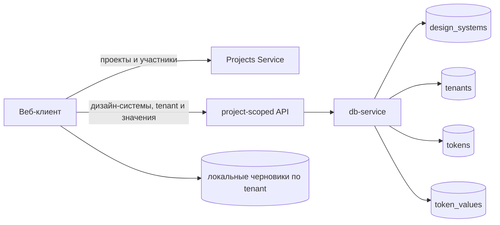

## Context

Projects Service уже владеет проектами, участниками и итоговой ролью пользователя. `db-service` владеет дизайн-системами, tenant, определениями и значениями токенов, компонентными настройками и версиями публикации. Веб-клиент использует устаревший сценарий одной темы: маршрут содержит имя и версию дизайн-системы, загрузчик объединяет значения всех tenant, параметры берутся у первого tenant, сохранение ищет `${name}_default`, а локальный черновик различает только имя и версию дизайн-системы.

Визуальным ориентиром служит `portal-flow-prototype`, а описания экранов задают композицию и состояния. Продуктовая модель текущего репозитория имеет приоритет при расхождении: Theme является tenant, отдельной версии и статуса Draft у неё нет; роли и разрешения определяет `authorization/policy.json`.

### Внешние визуальные источники

Исполнитель SHALL использовать каталог `portal/apps/portal-flow-prototype/` из репозитория `SDDS-Design-System` как источник визуальной композиции, состояний, адаптивности и поведения карточек. Основные реализации находятся в `app.js` и `styles.css`, графические материалы — в `assets/catalog/`.

Логика экранов описана в следующих документах:

- `portal/docs/design-spec/screens/builder-create-project.md`;
- `portal/docs/design-spec/screens/builder-project.md`;
- `portal/docs/design-spec/screens/builder-design-system.md`;
- `portal/docs/design-spec/screens/builder-design-system-settings.md`;
- `portal/docs/design-spec/screens/builder-create-design-system.md`;
- `portal/docs/design-spec/screens/builder-create-theme.md`.

Все пути в этом разделе заданы относительно корня репозитория `SDDS-Design-System` и не предполагают конкретного расположения checkout на машине исполнителя.

Если внешний путь недоступен, исполнитель SHALL остановиться и запросить источник, а не заменять визуальную часть произвольным дизайном. При содержательном расхождении прототипа с этим Change приоритет имеют требования OpenSpec: роли берутся из backend, Theme не имеет версии и Draft-статуса, дизайн-система удаляется полностью.

## Goals / Non-Goals

**Goals:**

- реализовать сквозной пользовательский сценарий от списка проектов до открытия созданной темы в редакторе;
- использовать стабильные идентификаторы в маршрутах и не связывать навигацию с изменяемыми названиями;
- адаптировать прототип к ролям `viewer`, `editor`, `maintainer`, `owner` и разрешениям действующей политики;
- создавать готовый к редактированию tenant одной атомарной операцией;
- изолировать загрузку, черновики и сохранение значений разных tenant;
- сохранить границу модели версий на уровне дизайн-системы, не вводя версию Theme.

**Non-Goals:**

- переработка самих редакторов палитры, токенов, типографики, размеров и компонентов;
- отдельное версионирование или статус жизненного цикла Theme;
- ожидающие приглашения и добавление незарегистрированных пользователей;
- архивирование дизайн-системы;
- изменение project scope и project role проверок `db-service` сверх уже существующего поведения;
- добавление превью карточки, для которого пришлось бы собирать данные несколькими запросами на каждую дизайн-систему;
- изменение `frontend-kt`.
- изменение legacy-сценария публикации npm-пакета, generator/publisher, registry или token configuration.

## Architecture



Projects Service остаётся источником метаданных проекта, membership и `effectiveRole`. `db-service` остаётся источником модели дизайн-системы. Клиент координирует несколько запросов на уровне экрана, но API возвращает компактные агрегаты, предотвращающие запрос на каждую сущность: `effectiveRole` в проекте, `tenantCount` и `themePreviews` в строке дизайн-системы, а также `preview` в tenant DTO.

## Decisions

### 1. Маршруты используют идентификаторы

Целевые маршруты строятся вокруг следующих сегментов:

```text
/projects
/projects/new
/projects/:projectId
/projects/:projectId/settings
/projects/:projectId/design-systems/new
/projects/:projectId/design-systems/:designSystemId
/projects/:projectId/design-systems/:designSystemId/settings
/projects/:projectId/design-systems/:designSystemId/themes/new
/projects/:projectId/design-systems/:designSystemId/themes/:tenantId/*
```

Имя и версия дизайн-системы исключаются из идентичности маршрута. Это позволяет переименовывать и переносить сущности без поломки сохранённых ссылок. Старые маршруты одной темы получают ограниченное перенаправление только тогда, когда однозначно найден legacy tenant; при неоднозначности клиент открывает обзор дизайн-системы, а не выбирает первый tenant.

Альтернатива — сохранить маршруты по имени и добавить `tenantName`. Она отклонена из-за переименований, глобальной уникальности имён и неоднозначности регистра.

### 2. Интерфейс использует итоговую роль и единую карту разрешений

`GET /projects` и `GET /projects/{projectId}` возвращают `effectiveRole`. Это роль текущего пользователя с учётом владения проектом, membership и системного администратора. Клиент преобразует роль в разрешения той же иерархии, что задана `authorization/policy.json`:

| Действие | Viewer | Editor | Maintainer | Owner |
|---|:---:|:---:|:---:|:---:|
| Просмотр проекта, дизайн-систем и тем | ✓ | ✓ | ✓ | ✓ |
| Изменение темы и её значений |  | ✓ | ✓ | ✓ |
| Создание темы |  | ✓ | ✓ | ✓ |
| Изменение проекта и участников |  |  | ✓ | ✓ |
| Создание, изменение и удаление дизайн-системы |  |  | ✓ | ✓ |
| Удаление темы |  |  | ✓ | ✓ |
| Архивирование проекта |  |  |  | ✓ |

Карта разрешений управляет видимостью и доступностью действий, но не является границей безопасности: сервер продолжает проверять запросы. Прямой переход на недоступный маршрут показывает состояние отсутствия доступа.

Альтернатива — рассыпать сравнения ролей по компонентам. Она отклонена, потому что наследование Maintainer и Owner легко реализовать непоследовательно.

### 3. API агрегирует только данные, устраняющие N+1

В project response DTO добавляется `effectiveRole`. Ответ списка дизайн-систем получает `tenantCount` и `themePreviews` не более четырёх tenant через агрегирующий запрос. Элементы `GET /design-systems/{designSystemId}/tenants` получают компактное поле `preview`. Остальные экраны собирают данные несколькими запросами уровня страницы: проект и список дизайн-систем; дизайн-система и список tenant; общая модель редактора и значения выбранного tenant.

`preview` содержит только пять разрешённых цветов: акцент Light, цвет на акценте Light, поверхность Light, акцент Dark и поверхность Dark. Сервер сначала извлекает актуальные значения канонических цветовых токенов выбранного tenant, разрешая `paletteId` и ссылки на палитру. Если обязательного значения нет, оно дополняется из профиля в `colorConfig`; для legacy tenant без профиля используется контрастная палитра, детерминированно выбранная по `tenantId`.

Карточка Theme строит из этой проекции мини-интерфейс Light/Dark, соответствующий прототипу. Карточка дизайн-системы строит мозаику 2×2 из `themePreviews`; порядок стабилен по `createdAt`, затем по `id`, поэтому обложка не переставляет плитки после обычного редактирования. Дизайн-система без тем показывает специальную иллюстративную заглушку из элементов токенов, типографики и компонентов. Отдельные загружаемые изображения и файловое хранилище в change не вводятся.

Альтернатива — загрузить все token values каждого tenant на клиенте. Она отклонена из-за N+1-запросов, лишнего объёма данных и дублирования разрешения ссылок. Хранить отдельный снимок обложки также не требуется: проекция вычисляется из источника истины и поэтому обновляется после сохранения Theme.

### 4. Создание дизайн-системы подготавливает общую модель

`POST /design-systems` создаёт дизайн-систему и копирует в неё канонический базовый набор определений токенов, который уже понимает существующий редактор. Логика инициализации выделяется из legacy-сценария и переиспользуется им, чтобы избежать двух несовместимых шаблонов. Операция выполняется в транзакции и не создаёт tenant автоматически: первая Theme создаётся явным пользовательским действием.

Профили Theme изменяют значения, но не состав определений токенов. Поэтому определения создаются один раз на дизайн-систему, а не копируются при каждом tenant.

Альтернатива — передавать весь шаблон токенов из клиента. Она отклонена: клиент не должен владеть схемой исходных данных и может устареть относительно `db-service`.

### 5. `POST /tenants` создаёт готовую Theme

Контракт создания расширяется явным DTO:

```ts
type ThemeProfile = 'sber' | 'malachite' | 'b2b' | 'custom';

interface CreateTenantRequest {
    designSystemId: string;
    name: string;
    description?: string;
    profile?: ThemeProfile;
    customPalette?: {
        primary: string;
        onPrimary: string;
        background: string;
        text: string;
    };
}

interface TenantColorConfig {
    profile: ThemeProfile;
    customPalette?: CreateTenantRequest['customPalette'];
    grayTone?: string;
    accentColor?: string;
    light?: { strokeSaturation: number; fillSaturation: number };
    dark?: { strokeSaturation: number; fillSaturation: number };
}
```

Профиль по умолчанию — `malachite`. Встроенные профили и Custom преобразуются серверным инициализатором в полный набор значений Light и Dark для существующих определений токенов. Tenant, `colorConfig` и значения создаются одной транзакцией.

Название нормализуется удалением крайних пробелов и схлопыванием последовательностей. Существующий индекс tenant заменяется регистронезависимым уникальным индексом по `design_system_id` и `lower(name)`; сохранение нормализованного имени обеспечивает также устойчивость к лишним пробелам. Конфликт возвращает `409`.

Альтернатива — создать tenant, а затем отправить множество `POST /token-values`. Она отклонена из-за частичных тем, большого числа запросов и гонки с первым открытием редактора.

### 6. Редактор разделяет общую и tenant-зависимую модель

Загрузчик получает `projectId`, `designSystemId`, `tenantId` и выполняет параллельно доступные чтения:

- метаданные дизайн-системы и tenant;
- определения токенов дизайн-системы;
- значения токенов выбранного tenant;
- компонентные настройки дизайн-системы.

Адаптер собирает из DTO существующие `DesignSystem`, `Theme` и компонентную модель. Он проверяет принадлежность tenant указанной дизайн-системе и никогда не выбирает `.limit(1)` либо первый элемент. При смене `tenantId` прежний запрос отменяется или его результат отбрасывается по ключу загрузки.

Компонентные настройки и определения токенов остаются общими для дизайн-системы. Этот change не переопределяет поведение их редакторов; tenant-aware гарантия относится к значениям темы, маршруту и черновику.

В одной вкладке активен один tenant, но локальные черновики могут одновременно существовать для нескольких tenant. Перед сменой маршрута редактор синхронно записывает текущий черновик по его контекстному ключу, затем освобождает вычисленное состояние Theme. При возврате серверный снимок выбранного tenant загружается заново, после чего поверх него применяется только его локальный черновик.

### 7. Пакетное сохранение ограничено одним выбранным tenant

Добавляется `PUT /tenants/{tenantId}/token-values`:

```ts
interface BatchSaveTenantTokenValuesRequest {
    editRevision: number;
    values: Array<{
        tokenId: string;
        platform: 'web' | 'ios' | 'android' | null;
        mode: 'light' | 'dark' | null;
        paletteId?: string | null;
        value: unknown;
    }>;
}

interface BatchSaveTenantTokenValuesResponse {
    editRevision: number;
}
```

Это один запрос для набора значений одного tenant, а не одновременное сохранение нескольких tenant. Измерение `platform` обязательно, потому что существующая модель редактора хранит варианты одного токена для `web`, `ios` и `android`, а строки `token_values` различаются сочетанием `tokenId + tenantId + platform + mode`.

Операция блокирует строку tenant в транзакции, сравнивает переданный `editRevision` с текущим, проверяет принадлежность каждого `tokenId` дизайн-системе tenant и уникальность сочетаний `tokenId + platform + mode`, затем заменяет только управляемые редактором значения этого tenant и увеличивает `editRevision`. Значения другого tenant и служебные строки, не входящие в присланный набор управления, не удаляются. Точный признак управляемых редактором строк должен быть выражен существующими `platform` и `mode`; новая универсальная колонка происхождения в этом change не вводится.

`editRevision` — внутренний счётчик оптимистичной блокировки, а не версия Theme и не часть публикационного интерфейса. Если ревизия устарела, API возвращает `409 Conflict` с кодом `TENANT_EDIT_CONFLICT`, ничего не записывает и сообщает актуальную ревизию. Клиент сохраняет локальный черновик и предлагает перезагрузить данные; автоматическое слияние в этом change не выполняется. Разные tenant имеют независимые ревизии и не конфликтуют друг с другом.

Ключ локального черновика меняется на `ds_draft:${projectId}:${designSystemId}:${tenantId}`. Вспомогательное состояние добавленных токенов также перестаёт быть глобальным и входит в контекст редактора выбранного tenant.

Альтернатива — расширить legacy update только параметром `tenantId`. Она отклонена как долгосрочный публичный контракт: этот маршрут одновременно сохраняет общие компонентные данные и tenant-зависимые значения, что повышает риск перезаписи соседних тем. Legacy-маршрут может переиспользовать новую операцию внутри для совместимости.

### 8. Граница версионирования остаётся на уровне дизайн-системы

Theme не получает собственного номера версии: `editRevision` остаётся только техническим счётчиком конкурентного сохранения. Legacy-сценарий публикации npm-пакета и создание публикационных версий не входят в этот change и не изменяются ради нового projects workflow. Когда публикация будет переработана отдельным change, её версия должна принадлежать дизайн-системе целиком, а не отдельному tenant.

## Программное проектирование

Ключевые клиентские контракты:

```ts
type ProjectRole = 'viewer' | 'editor' | 'maintainer' | 'owner';
type ProjectPermission =
    | 'project:update'
    | 'project:archive'
    | 'members:manage'
    | 'designSystems:write'
    | 'designSystems:delete'
    | 'tenants:write'
    | 'tenants:delete';

interface ProjectSummaryDto {
    id: string;
    name: string;
    description?: string;
    status: 'active' | 'archived';
    effectiveRole: ProjectRole;
}

interface ThemePreviewDto {
    accentLight: string;
    onAccentLight: string;
    surfaceLight: string;
    accentDark: string;
    surfaceDark: string;
}

interface DesignSystemSummaryDto {
    id: string;
    name: string;
    tenantCount: number;
    themePreviews: Array<{
        tenantId: string;
        name: string;
        preview: ThemePreviewDto;
    }>;
}

interface EditorContextKey {
    projectId: string;
    designSystemId: string;
    tenantId: string;
}

interface ThemeEditorRepository {
    load(context: EditorContextKey, signal?: AbortSignal): Promise<ThemeEditorSnapshot>;
    saveTenantValues(
        context: EditorContextKey,
        editRevision: number,
        values: TenantTokenValueDto[],
    ): Promise<{ editRevision: number }>;
}

interface ThemeDraftStore {
    read(context: EditorContextKey): ThemeDraft | null;
    write(context: EditorContextKey, draft: ThemeDraft): void;
    clear(context: EditorContextKey): void;
}
```

Слой страниц не обращается к `fetch` напрямую: он использует типизированные функции API и хуки запросов. Существующие объекты редактора остаются адаптерами над DTO, чтобы не переносить сетевые детали в контроллеры токенов.

## Ошибки и восстановление

- Ошибки загрузки списка или сущности показываются в границе соответствующей страницы с повтором запроса.
- `401` передаётся существующему сценарию повторной авторизации; `403` показывает отсутствие доступа без подмены роли.
- `404` для вложенной сущности не приводит к выбору первой доступной сущности.
- `409` при создании Theme сохраняет введённые данные формы и показывает ошибку дубликата.
- Транзакционные операции создания Theme и пакетного сохранения либо применяются полностью, либо не изменяют состояние.
- Конфликт `editRevision` возвращает `409 Conflict`, не удаляет локальный черновик и требует осознанной перезагрузки данных.
- При ошибке сохранения локальный черновик не удаляется.

## Безопасность и права доступа

Клиент скрывает недоступные действия для ясности интерфейса, но доверяет отказу API как окончательному решению. `effectiveRole` используется только для представления и не передаётся клиентом как доказательство полномочий. Gateway продолжает формировать доверенные заголовки проекта. Расширение project scope и project role проверок в маршрутах `db-service` не входит в change; новые изменяющие маршруты используют тот же действующий механизм `requireScope` и ролевую проверку, что соседние маршруты.

## Migration Plan

1. Добавить `effectiveRole` совместимым полем DTO Projects Service и развернуть его до клиента.
2. Добавить миграцию уникального индекса и `editRevision` tenant, расширенные DTO и транзакционные операции `db-service`; обновить OpenAPI.
3. Развернуть клиент с новыми маршрутами, экранами и tenant-aware адаптером.
4. На переходный период оставить legacy API для старых клиентов; новый клиент его не использует для выбора tenant и сохранения tenant-значений.
5. Откат клиента безопасен, пока legacy API сохранён. Откат `db-service` не удаляет tenant или значения; функциональный индекс можно снять обратной миграцией, если она потребуется политикой выпуска.

## План проверки и развёртывания

Локально проверяются модульные и маршрутные тесты Projects Service, `db-service` и веб-клиента, сборки затронутых контуров, OpenAPI и миграция на тестовой базе.

До архивирования требуется внешняя проверка на полном локальном контуре с настоящими PostgreSQL, Keycloak и Gateway: создать проект, назначить роли, создать дизайн-систему и две темы, независимо изменить их одинаковый токен и перезагрузить страницы. Успех подтверждается снимками экранов и ответами API, показывающими разные значения двух tenant, отсутствие смешивания черновиков и корректную обработку конкурентного конфликта. Legacy-публикация npm-пакета не является частью этой проверки.

После развёртывания следует наблюдать ошибки `409` создания Theme, ошибки транзакций сохранения и долю ответов `404` на новые ID-маршруты; это наблюдение не блокирует архивирование change.

## Risks / Trade-offs

- [Большой объём UI и API в одном change] → Разделить реализацию на последовательные вертикальные этапы и сохранить старый редактор через адаптер.
- [Базовый шаблон токенов расходится с legacy] → Извлечь единый серверный инициализатор и использовать его в обоих сценариях.
- [Переход на ID-маршруты ломает старые ссылки] → Оставить ограниченное перенаправление без неявного выбора tenant.
- [Пакетная замена может удалить служебные значения] → Ограничить замену проверенным набором строк редактора и покрыть сохранность прочих строк интеграционным тестом.
- [Два редактора одного tenant могут перезаписать изменения] → Сравнивать и атомарно увеличивать `editRevision`, возвращать конфликт без автоматического слияния и сохранять локальный черновик.
- [Разрешение цветов превью может быть дорогим] → Выбирать только пять канонических значений, агрегировать не более четырёх тем на карточку и проверять план SQL-запроса на наборе с несколькими дизайн-системами.
- [Legacy Theme не содержит канонических токенов] → Последовательно применять профиль `colorConfig` и детерминированную контрастную палитру, не оставляя пустую обложку.
- [Карта разрешений клиента может отстать от политики] → Содержать её в одном модуле, тестировать все четыре роли и считать серверный `403` окончательным.
- [Визуальный объём прототипа замедлит реализацию] → Переиспользовать существующие компоненты Plasma и копировать композицию, состояния и адаптивность без зависимости от исходников прототипа во время выполнения.
