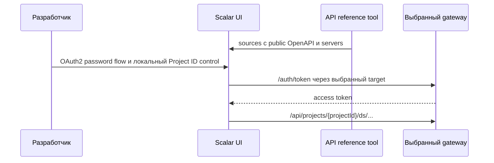

## Context

OpenAPI-документы сервисов уже существуют в разных форматах и описывают внутренние пути. Внешний клиент обращается только к identity gateway: его маршруты добавляют `/api`, идентификатор проекта и префикс предметной области. Ручное преобразование этих путей мешает интерактивной проверке API.

## Goals / Non-Goals

**Goals:**

- одной командой запускать локальный Scalar UI;
- показывать отдельные источники Authentication, Projects и Design systems;
- преобразовывать все пути документа сервиса одним правилом service-level prefix;
- давать Local gateway по умолчанию и необязательные Dev/Production targets;
- получать Bearer token через документированный публичный `/auth/token`.

**Non-Goals:**

- не объединять схемы и операции сервисов в один OpenAPI-документ;
- не выводить правила из nginx и не регистрировать операции вручную;
- не менять runtime-маршрутизацию, RBAC или CORS gateway;
- не публиковать UI в production в этом change.

## Decisions

### Каталог источников на уровне сервисов

Инструмент хранит компактный каталог из четырёх записей: путь к исходной спецификации, title и правило преобразования public base path. Каждая запись применяется ко всем `paths` исходного документа; отдельная операция в каталоге не указывается.

| Источник | Исходный путь | Public path |
|---|---|---|
| Authentication | новый gateway OpenAPI | без преобразования |
| Projects | `/projects` | `/api/projects` |
| Design systems | `/api/ds` | `/api/projects/{projectId}/ds` |
| Documentation | `/documentation` | `/api/projects/{projectId}/documentation` |

Преобразователь также добавляет обязательный path parameter `projectId` только к проектно-областным документам. Это даёт Scalar точный публичный контракт и не дублирует список ручек.

### Несколько источников Scalar вместо merge

Scalar получает `sources`: Authentication, Projects и Design systems. Документы не сливаются, поэтому одинаковые имена схем, tags и operationId не конфликтуют. Каждый преобразованный документ получает одинаковый список `servers`, сформированный из конфигурации запуска.

Преобразователь оставляет только paths, покрытые `sourcePrefix`, и удаляет служебные trusted-header parameters (`X-User-*`, `X-Project-*`, `X-Actor-Type`, `X-System-Admin`). Для публичных источников он добавляет Bearer security scheme и requirement: gateway сам извлекает эти заголовки из access token. Поэтому UI не предлагает пользователю подменять внутренний контекст авторизации.

### Локальный dev-инструмент

Команда `backend-kt/scripts/start-api-reference.sh` запускает генерацию документов и локальный Node-сервер с Scalar UI. Local target всегда `http://localhost:8080`. `DS_API_REFERENCE_DEV_GATEWAY` и `DS_API_REFERENCE_PROD_GATEWAY` добавляют соответствующие target только при явном задании; URL не коммитятся.

Браузер обращается к серверу инструмента по same-origin URL `/targets/{target}/…`; сервер разрешает только три именованных target из своей конфигурации, отрезает технический префикс и проксирует запрос выбранному gateway. Это устраняет зависимость UI от CORS удалённого gateway, не является Scalar cloud proxy и не меняет CORS gateway. Сервер привязан к loopback-интерфейсу и не принимает произвольный URL от клиента.

`ds-service` добавляет Gradle-задачу генерации JSON-документа из `OpenApiDocumentFactory`. Поэтому инструмент не требует запущенный `ds-service` для чтения его контракта.

Для безопасных локальных значений Authentication document задаёт OpenAPI defaults (`grant_type=password`, `client_id=dsbuilder-api`, `scope=openid`). Пароли и access token defaults не допускаются. Защищённые документы используют Scalar OAuth2 password flow: его относительный `tokenUrl` разрешается от выбранного same-origin server и потому всегда обращается к тому же Local, Dev или Production gateway, что и операция. Proxy server URL оканчивается на `/`, иначе URL resolver Scalar воспринимает имя target как заменяемый последний сегмент пути. Scalar хранит credential только в памяти (`persistAuth: false`).

Локальная страница API Reference содержит control `Project ID`, доступный до открытия Test Request. Разработчик сначала запрашивает список проектов, затем один раз указывает идентификатор; страница сохраняет его только в browser local storage и передаёт как default всех project-scoped параметров источника Design systems. Это обходит ограничение встроенного Scalar Test Request: он не отображает environments, а его `Open API Client` открывает отдельный внешний client. `DS_API_REFERENCE_PROJECT_ID` сохраняется как необязательный стартовый override для автоматизированных локальных проверок.

### Публичный Authentication document

Документ содержит только безопасный для интерактивного использования `/auth/token` с `application/x-www-form-urlencoded` и ответом access token. `/internal/**` identity-gateway в UI не включается. Пользователь вручную переносит access token в Bearer security scheme Scalar; токены и client secret не записываются в конфигурацию и `persistAuth` выключен.



## Программное проектирование

```text
ServiceSource(id, title, specPath, sourcePrefix, gatewayPrefix, requiresProjectId)

transformOpenApi(source: OpenApiDocument, descriptor: ServiceSource,
                 servers: List<Server>): OpenApiDocument

start-api-reference.sh [--port <port>]
```

`transformOpenApi` является чистой функцией: она копирует document, отбирает `paths` source prefix, переписывает ключи `paths`, добавляет `projectId`, удаляет trusted-header parameters, добавляет Bearer security и подставляет относительные same-origin servers. HTTP-сервер только отдаёт её результат, локальную HTML-страницу с control `Project ID`, Scalar shell и проксирует закрытый каталог target.

## Risks / Trade-offs

- [Новый маршрут сервиса не покрыт корректным prefix] → проверка сравнивает преобразованные пути с service-level prefix и не позволяет неизвестный исходный префикс.
- [Dev/Production gateway недоступен из браузера] → same-origin proxy инструмента отправляет запрос только в явно настроенный target; CORS gateway не требуется.
- [Контракт `ds-service` расходится с runtime] → генерация использует тот же `OpenApiDocumentFactory`, что и runtime endpoint.
- [Полученный токен остаётся в браузере] → `persistAuth: false`, без secret в файлах и без внешнего proxy.

## Migration Plan

Инструмент добавляется как локальная команда и не влияет на текущие приложения или gateway. Откат состоит в удалении команды и dev-зависимости; публичные runtime API не меняются.
