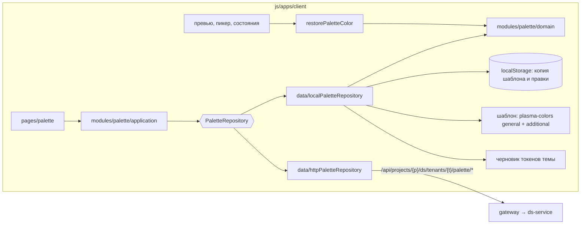

## Контекст

В ветке Kotlin `ds-service` тема — это тенант дизайн-системы, у дизайн-системы может быть несколько
тем, а редактор открывается по маршруту `.../themes/:tenantId`. Клиент загружает тему через
`api/themeEditorRepository.ts` (`/tenants/{id}`, `/tenants/{id}/token-values`, токены дизайн-системы) и
сохраняет значения токенов `PUT /tenants/{id}/token-values` с `editRevision`; правки до сохранения живут
в черновике `ds_draft:<projectId>:<designSystemId>:<tenantId>`.

Палитры как сущности темы нет нигде:

- цвета ссылок вычисляются встроенной `@salutejs/plasma-colors` — напрямую или через
  `getRestoredColorFromPalette` из `@salutejs/plasma-tokens-utils` (около 20 вызовов);
- значение токена ссылается на палитру либо строкой `[general.red.500][0.56]`, либо внешним ключом
  `paletteId`, который клиент при загрузке превращает в ту же строку;
- в `ds-service` есть только общая библиотека `GET /palette`, изменять её может лишь системный
  администратор.

Продуктовое правило: общая «официальная» палитра — шаблон. Тема получает копию шаблона при создании и
дальше меняет её независимо; изменения темы не отражаются на шаблоне, изменения шаблона не отражаются на
существующих темах, у двух тем две разные палитры.

Прототип группирует растяжки палитры по назначению. Экземпляр растяжки в группе определяется слотом —
растяжкой, на которую ссылаются токены, — и может получить другой источник, перестройку от опорного
цвета или правки отдельных ступеней. Связи токенов при этом не рвутся: ссылка указывает на слот, а
значение берётся из экземпляра в группе токена.

Сервер палитры темы описан в изменении `add-theme-palette-api` и может появиться позже.

## Цели / Вне целей

**Цели:**

- раздел «Палитра» темы с поведением и дизайном прототипа;
- палитра темы — независимая копия шаблона;
- явная и редактируемая принадлежность токена к группе палитры;
- раздел работает до появления сервера и переключается на сервер без изменения экрана;
- превью токенов и компонентов показывают цвета палитры темы;
- одна и та же логика палитры в клиенте и на сервере, проверенная общими эталонными данными.

**Вне целей:**

- серверная часть и CLI (`add-theme-palette-api`), доставка палитры в generator;
- обновление палитры существующей темы до новой версии шаблона;
- отслеживание изменений: раздел Changes, счётчик и сброс правок, отмена и повтор, сравнение с
  опубликованной версией;
- обмен палитрой с Figma (`tokens.json`);
- связь стартового профиля темы (`sber`, `malachite`, `b2b`, `custom`) с группами палитры;
- глобальная замена и перестройка растяжки во всех группах, навигатор «вне бренда»;
- общий доступ к палитре в режиме `local`: она видна только в одном браузере.
- сохранение значений токенов темы на сервер из редактора новых маршрутов: правки, в том числе сделанные
  палитрой, остаются в локальном черновике `ds_draft:…`. Сервер (`PUT /tenants/{id}/token-values`) и метод
  `saveTenantValues` готовы, автосохранение по прототипу (отложенная отправка, ревизия, конфликт) —
  отдельное изменение; палитра формирует черновик только из библиотечных ссылок и HEX.

## Архитектура



Экран и прикладные сценарии зависят только от порта `PaletteRepository`. Адаптер выбирается при старте
по `VITE_PALETTE_SOURCE` (`local` по умолчанию, пока сервер не влит; `api` после). Оба адаптера
возвращают одни и те же DTO контракта, поэтому переключение не меняет экран.

Модуль `domain` — чистые функции без React и HTTP: разбор ссылки, группа токена по умолчанию, состав
групп, вычисление ступени, перестройка, отображаемые имена. Его используют локальный адаптер и резолвер
цветов; сервер реализует те же правила в Kotlin и проверяется на тех же эталонных данных.

## Модель данных и контракты

DTO совпадают с контрактом `add-theme-palette-api`:

```ts
type PaletteType = 'general' | 'additional';
type SystemGroupKey = 'neutral' | 'accent' | 'status' | 'data' | 'syntax';
interface PaletteRampRef { type: PaletteType; shade: string }

interface ThemePalette {
  tenantId: string;
  editRevision: number;          // в режиме local — счётчик правок палитры в браузере
  canEdit: boolean;
  offBrand: boolean;
  groups: PaletteGroup[];
  tokens: PaletteTokenAssignment[];
  template: PaletteTemplateRamp[];       // копия шаблона темы: для «Добавить палитру» и «Поменять»
}
interface PaletteTemplateRamp { type: PaletteType; shade: string; steps: { step: number; value: string }[] }
interface PaletteGroup {
  id: string;                    // UUID у системных и пользовательских групп
  kind: 'system' | 'custom';
  systemKey: SystemGroupKey | null;
  label: string;
  ramps: PaletteRamp[];
}
interface PaletteTokenAssignment {
  tokenId: string; tokenName: string; groupId: string;
  assignment: 'explicit' | 'default';   // default — по правилу имени, пока привязки нет
}
interface PaletteRamp {
  slot: PaletteRampRef; source: PaletteRampRef; displayName: string;
  origin: 'template' | 'rebuild'; anchor: { step: number; value: string } | null;
  added: boolean; modified: boolean; linkedCount: number; steps: PaletteStep[];
}
interface PaletteStep { step: number; value: string; templateValue: string; overridden: boolean; linkedCount: number }
interface PaletteLink {
  tokenId: string; tokenName: string; displayName: string | null; groupId: string;
  mode: string | null; step: number; opacity: number | null; platforms: string[];
}
```

- `templateValue` — значение ступени источника в копии шаблона темы; `overridden` означает отличие от
  него.
- Ошибки операций: `{ error, code, details? }`, где `code` — `PALETTE_GROUP_EXISTS`,
  `PALETTE_GROUP_SYSTEM`, `PALETTE_RAMP_EXISTS`, `PALETTE_RAMP_LINKED`, `PALETTE_STEP_MISSING` или
  `TENANT_EDIT_CONFLICT`.

Состояние режима `local` хранится в `localStorage` под ключом
`ds_palette:<projectId>:<designSystemId>:<tenantId>`:

```ts
interface LocalPaletteState {
  version: 1;
  editRevision: number;
  template: Record<`${PaletteType}.${string}`, Record<string, string>>;  // копия шаблона на момент создания
  groups: { id: string; kind: 'system' | 'custom'; systemKey: SystemGroupKey | null; label: string }[];
  ramps: {
    groupId: string; slot: PaletteRampRef; source: PaletteRampRef; added: boolean;
    origin: 'template' | 'rebuild'; anchor: { step: number; value: string } | null;
    steps: Record<string, string>;                                     // правки ступеней
  }[];
  tokenGroups: Record<string, string>;                                 // tokenId → groupId, только явные
}
```

Состояние создаётся при первом открытии палитры темы в браузере: шаблон копируется из встроенной
`plasma-colors`, системные группы получают UUID.

## Программное проектирование

```ts
// modules/palette/domain
export function parsePaletteReference(value: unknown): PaletteReference | null;
export function formatPaletteReference(reference: PaletteReference): string;
export function defaultGroupForToken(tokenName: string): SystemGroupKey;
export function rampDisplayName(source: PaletteRampRef, anchor: { value: string } | null): string;
export function rebuildRamp(source: Record<string, string>, anchorStep: number, anchorHex: string): Record<number, string>;
export function buildThemePalette(input: ThemePaletteInput): { palette: ThemePalette; links: SlotLink[] };
export function resolveStepInGroup(palette: ThemePalette, groupId: string, ref: PaletteRampRef & { step: number }): string | undefined;
export function resolveTokenGroupId(palette: ThemePalette, tokenName: string): string | undefined;
export function resolvePaletteStep(palette: ThemePalette, value: unknown, tokenName?: string): { hex: string; opacity: number | null } | undefined;

// modules/palette/application
export interface PaletteRepository {
  load(ctx: PaletteContext): Promise<ThemePalette>;
  links(ctx: PaletteContext, query: PaletteLinksQuery): Promise<PaletteLink[]>;
  createGroup(ctx: PaletteContext, label: string, editRevision: number): Promise<PaletteMutation<PaletteGroup>>;
  deleteGroup(ctx: PaletteContext, groupId: string, editRevision: number): Promise<PaletteMutation<void>>;
  assignTokenGroup(ctx: PaletteContext, tokenId: string, groupId: string | null, editRevision: number): Promise<PaletteMutation<PaletteTokenAssignment>>;
  addRamp(ctx: PaletteContext, groupId: string, slot: PaletteRampRef, editRevision: number): Promise<PaletteMutation<PaletteRamp>>;
  replaceSource(ctx: PaletteContext, groupId: string, slot: PaletteRampRef, source: PaletteRampRef, editRevision: number): Promise<PaletteMutation<PaletteRamp>>;
  rebuild(ctx: PaletteContext, groupId: string, slot: PaletteRampRef, input: RebuildInput): Promise<PaletteMutation<PaletteRamp> | RebuildPreview>;
  updateStep(ctx: PaletteContext, groupId: string, slot: PaletteRampRef, step: number, value: string, editRevision: number): Promise<PaletteMutation<PaletteRamp>>;
  removeRamp(ctx: PaletteContext, groupId: string, slot: PaletteRampRef, input: RemoveRampInput): Promise<PaletteMutation<{ reassigned: number }>>;
}
export interface PaletteMutation<T> { editRevision: number; value: T }
export interface RebuildPreview { steps: { step: number; value: string }[] }   // ответ rebuild при preview: true
export function createPaletteRepository(source: 'api' | 'local', deps: PaletteRepositoryDeps): PaletteRepository;

// palette/activePalette.ts — палитра открытой темы для резолвера цветов
export function setActivePalette(palette: ThemePalette | null): void;
export function restorePaletteColor(value: string, alphaSign?: 0 | -1, tokenName?: string): string;
export function restoreTemplateColor(type: string, shade: string, step: string): string | undefined;  // шаблон local
```

`restorePaletteColor` заменяет `getRestoredColorFromPalette` в местах отображения цветов токенов. Без
активной палитры или без найденной ступени он откатывается к `getRestoredColorFromPalette`, поэтому
мастер создания и экраны до загрузки палитры работают как раньше. Ссылка разрешается по группе токена
`tokenName`; без имени — по копии шаблона темы. `palette/activePalette.ts` — единственное место прямого
импорта `getRestoredColorFromPalette`: через него же `restoreTemplateColor` снимает шаблон режима `local`. Оформление самого приложения
продолжает использовать встроенную палитру.

Страница `pages/palette/Palette.tsx` разбита на `PaletteSidebar`, `PaletteBoard`, `PaletteInspector`,
`RampPopover`, `StepColorEditor`, `TokenGroupSelect`, `AddRampDialog`, `RemoveRampDialog`,
`CreateGroupDialog`, `DeleteGroupDialog`; состояние экрана — в хуке `usePaletteEditor`, палитра
загружается в `useDesignSystem` вместе с темой и передаётся через контекст `Main`. `TokenGroupSelect` используется и в инспекторе палитры, и в редакторе цветового
токена.

## Решения

### Палитра темы — копия шаблона

Общая палитра служит шаблоном: тема получает её копию при создании и дальше от неё не зависит. Значения
ступеней, источники замены и превью перестройки берутся из копии темы, а не из текущей общей палитры.
Отвергнуто: хранить у темы только отличия поверх живой общей палитры — тогда правка общей палитры
администратором меняла бы цвета всех тем, где растяжку не трогали.

В режиме `local` шаблоном служит встроенная `plasma-colors`; копия сохраняется в состоянии при первом
открытии, поэтому обновление пакета не меняет уже созданную палитру.

### Явная принадлежность токена к группе

От группы токена зависит, из какого экземпляра растяжки берётся его цвет, поэтому ошибка группы — это
неверный цвет. Имя токена задаёт пользователь и не обязано содержать `accent` или `data`, а в
пользовательскую группу по имени токен попасть не может. Поэтому:

- привязка токена к группе хранится явно в палитре темы и меняется пользователем;
- правило по имени даёт только группу по умолчанию для токенов без привязки (`assignment: 'default'`);
  оно никогда не выбирает пользовательскую группу;
- токен попадает в пользовательскую группу только явной привязкой;
- при удалении пользовательской группы привязки её токенов удаляются, и токены возвращаются к группе по
  умолчанию.

Правило по умолчанию: имя без префикса режима, начинающееся с `data.`, — `data`; последний сегмент с
`accent` или `promo` — `accent`; с `positive`, `negative`, `warning` или `info` — `status`; остальное —
`neutral`.

### Группы адресуются по `id`

У каждой группы, включая системные, есть UUID; системная группа дополнительно несёт `systemKey`. Растяжки,
привязки токенов, связи и операции ссылаются на группу только по `id`. Системные группы создаются вместе
с палитрой темы, их нельзя удалить или переименовать.

### Сначала клиент, через порт и два адаптера

Сервер палитры могут влить позже, поэтому экран не должен от него зависеть. Порт `PaletteRepository`
повторяет контракт `add-theme-palette-api`, адаптер `local` выполняет те же операции в браузере.

- Операции, которые меняют только палитру (замена источника, перестройка, правка ступени, добавление
  растяжки, группы, привязка токена к группе), в режиме `local` меняют только `localStorage`. Ссылки
  токенов не меняются, поэтому сохранение темы на сервер остаётся корректным.
- Удаление растяжки со стратегией в режиме `local` записывает новые ссылки или HEX в черновик токенов
  темы; они уходят на сервер обычным сохранением `PUT /tenants/{id}/token-values`.
- В режиме `local` раздел показывает баннер «Палитра хранится в этом браузере и не публикуется».
- Когда сервер влит, `add-theme-palette-api` переключает значение по умолчанию на `api`; адаптер `local`
  остаётся для разработки и тестов.

Отвергнуто: заглушка ответов в тестовом HTTP-сервере вместо адаптера. Она не даёт показать раздел на
стенде до появления сервера и не проверяет логику палитры.

### Модель слотов из прототипа

Ссылка токена остаётся строкой `[type.shade.step]` и обозначает слот в группе токена. Замена и
перестройка меняют значение слота только в этой группе, не трогая ссылки. Альтернатива — переписывать
ссылки токенов на собственные растяжки темы — потребовала бы, чтобы сервер понимал новые ссылки до
выхода клиента.

### Одинаковая логика на клиенте и сервере

Эталон `src/modules/palette/fixtures/palette-golden.json` содержит входные данные (шаблон, состояние
палитры, привязки и значения токенов) и ожидаемые результаты (группы по умолчанию, состав групп,
значения ступеней, перестройка, отображаемые имена). Клиентские тесты проверяют `domain`; тесты
`ds-service` читают тот же файл.

### Вёрстка раздела переносится из прототипа

Эталон — коммит `bae288ab81bd17bd95b0a4a2a07f5e900d6683c0` репозитория `kenymook/SDDS-Design-System`:

- разметка функций `paletteEditorV3`, `sourcePaletteFamilyMenuV3`, `sourcePaletteColorMenuV3`,
  `sourcePaletteRampBoardV3`, `sourcePaletteRampCardV3`, `sourcePaletteRampStepV3`,
  `sourcePaletteEditPopoverV3`, `sourcePaletteSelectedPanelV3`, `paletteSwatchLabelStyle` и модальных
  окон палитры в `portal/apps/portal-flow-prototype/app.js`;
- правила `.source-palette-*` в `styles.css`, включая `@media(max-width:900px)` и
  `@media(prefers-reduced-motion:reduce)`;
- значения `builder-ui-tokens.css`.

Экраны ветки уже свёрстаны по прототипу обычным CSS (`src/styles/workflow.css` с переменными `--p-*`),
поэтому правила `.source-palette-*` переносятся в `src/styles/palette.css` под тем же префиксом, а
разметка повторяется React-компонентами с теми же классами. Значения `builder-ui-tokens.css`, которых
нет среди `--p-*`, добавляются в `palette.css` как переменные раздела. Тексты интерфейса берутся из
прототипа. Выбора группы токена в прототипе нет; `TokenGroupSelect` оформляется так же, как выпадающие
списки инспектора прототипа. Глобальная тема и другие разделы не меняются.

Отвергнуто: собирать экран из компонентов Plasma — расходится с дизайном; подключить `styles.css`
прототипа целиком — тянет правила других экранов.

Готовность вёрстки подтверждается сверкой скриншотов эталонных состояний клиента и прототипа при ширине
1440 px и 900 px. Данные прототипа и клиента различаются (у прототипа свой набор токенов и растяжек),
поэтому сверяются состояния и вёрстка: сетка, отступы, типографика, поведение поповеров и модалок, а не
совпадение цветов. Неустранимые расхождения перечисляются здесь с причиной.

#### Расхождения с прототипом

Сверка выполнялась на работающем прототипе (палитра совпадает с `bae288a`) и разделе клиента при ширине
1440 px и 900 px: пары скриншотов 15 состояний сняты headless Chrome в
`.agent-workflow/add-theme-palette-editor/prototype/` (там же `compare.html`), вычисленные стили элементов,
общих для обеих реализаций, сравнены автоматически и совпадают. Данные различаются: у прототипа своя
дизайн-система (растяжки Gray, Cool Gray и Hue N, 14 ступеней), у клиента — `general` и `additional`.
Прототип не подключает шрифт Inter и без установленного в системе Inter рисует текст Arial, клиент
загружает Inter — отсюда возможная разница в переносах строк. Состояние «Только просмотр» в прототипе
задаётся ролью из демо-данных проекта и не снималось; в клиенте оно проверено отдельно (задача 6.2).
Расхождения, которые остаются, и их причины:

- Заголовок «Палитра» и метка «Custom · вне брендовой палитры» в разметке есть, но, как и в прототипе, блок
  `.source-palette-hero` скрыт правилом `.source-palette-v3 > .source-palette-hero`; признак палитры вне
  бренда виден в боковой панели блоком `.source-palette-brand-status`, сетка раздела подписана «Палитра»
  для вспомогательных технологий.
- В тулбаре нет кнопок отмены и повтора и счётчика правок: отслеживание изменений вне изменения. Вместо
  счётчика у кнопки инспектора — значок панели.
- У растяжек `general` 15 ступеней (есть 50), у прототипа — 14; минимальная ширина ступени уменьшена с 52
  до 48 px, сетка превью в окнах — на 15 колонок, чтобы ступень 1000 не обрезалась.
- Кнопка «Создать группу» в боковой панели: в V3 прототипа она не выведена, оформление взято у кнопки
  пустого состояния.
- Правка ступени использует выбор цвета клиента (`ColorConstructor` без прозрачности) внутри поповера
  `.source-palette-edit-popover`; у поповера снято ограничение высоты 390 px, иначе кнопки не видны.
- Выбора группы токена в прототипе нет: в инспекторе это метка группы у строки связанного токена,
  раскрывающая `TokenGroupSelect`, в редакторе цветового токена — поле «Группа палитры».
- Строки связанных токенов показывают режим и ступень, инспектор — слот и источник растяжки (требования
  спецификации).
- Текст пустого состояния связей оформлен как строки инспектора: в прототипе для него есть правило только
  у кнопки.
- Пустые группы, в том числе системные (например, Syntax без токенов), показываются на борде и в боковой
  панели при фильтре «Все» без поиска. В прототипе у системных групп всегда есть растяжки; в клиенте состав
  группы складывается из ссылок её токенов, и без этого в пустую группу нельзя было бы добавить палитру.
- Колонка борда сжимается до нуля, а не до 480 px: раздел живёт в рабочей области редактора, а не на всю
  ширину окна, и сетка прототипа (минимум 1080 px) не помещалась в неё — при прокрутке к элементу инспектора
  содержимое уезжало влево. Растяжки шире колонки прокручиваются внутри борда; до 900 px сохранено поведение
  прототипа — сетка с минимальной шириной прокручивается сама.
- На время переключения «Палитра» ↔ «Цвет» переходы выключены: в прототипе оформление ступеней анимируется
  при смене режима, и на мгновение вся растяжка выглядит выделенной.
- Подпись растяжки `general` — «General» (серые семейства — «Neutral», как у прототипа): аналога семейств
  `general` в прототипе нет. Подпись `additional` на карточке — «Hue130», в боковой панели — «Hue 130»,
  как в прототипе.
- Списки выбора растяжки («Поменять», «Добавить палитру», замена при удалении) показывают сначала серые
  семейства, затем остальные в порядке шаблона; порядок шаблона в контракте API не меняется.
- Редактор ступени выше поповера прототипа (область действия и кнопки «Отмена» / «Применить»), поэтому,
  если он не помещается ни под ступенью, ни над ней, он встаёт сбоку от ступени, а не поверх неё.
- При открытии окна фокус переходит в поле ввода или на кнопку закрытия; в прототипе фокус не управляется.
- Тексты окна «Создать группу» говорят о палитре темы и явной привязке токенов, а не о палитре
  дизайн-системы: группа принадлежит палитре темы, токены попадают в неё явной привязкой.

### Конфликт ревизий в режиме `api`

Операции палитры передают `editRevision` темы и получают новую. Ответ `409 TENANT_EDIT_CONFLICT`
приводит к перезагрузке темы вместе с палитрой и ревизией (`reload()` в `useDesignSystem`) и уведомлению;
черновик токенов накладывается заново. Перечитать только палитру недостаточно: ревизия общая со значениями
токенов, и следующая операция снова получила бы конфликт. После каждой операции клиент обновляет
`editRevision`, который использует сохранение значений токенов. Ответ на загрузку палитры прежней темы
отбрасывается по `tenantId`.

### Рост метрик Strictacode клиента

Раздел добавляет в `js/apps/client` около 3,5 тыс. строк прикладной логики (домен палитры, адаптеры, экран).
Её плотность сложности выше средней по клиенту, где большую долю строк дают истории и разметка, поэтому
сравнение с baseline `javascript-client` не проходит: score 44 → 45, density 7,51 → 8,10 (с правками по итогам сверки с прототипом), refactoring
pressure 58 → 59, overengineering pressure 10 → 13. Чистая `origin/feature/ds-service` проходит на пределе
(density 7,45, OP 11). Уложиться в baseline можно только убрав около 40% ветвлений нового кода, то есть
функциональность. Решение разработчика: рост принят, baseline `javascript-client` обновлён в этом изменении
с явным разрешением `strictacode-policy`; baseline `javascript-cli` и `javascript-db-service` не меняются.

## Риски / Компромиссы

- [Логика палитры существует на двух языках] → общий эталон `palette-golden.json`, тесты обеих сторон.
- [Шаблон `local` (встроенная `plasma-colors`) и шаблон сервера (общая палитра `ds-service`) могут
  различаться] → в режиме `api` используется копия, сделанная сервером; при переходе с `local` на `api`
  палитра темы берётся с сервера, а не из браузера.
- [Смена группы токена меняет его цвет] → выбор группы показывает цвет токена в текущей и новой группе
  до подтверждения.
- [Палитра `local` не видна другим пользователям и теряется при очистке браузера] → баннер; режим
  предназначен для разработки и показа до слияния сервера.
- [Около 20 вызовов `getRestoredColorFromPalette`] → замена только в местах отображения цветов
  токенов, откат к прежнему поведению без палитры, правило ESLint против новых прямых вызовов.
- [Прототип продолжает меняться] → эталоном служит закреплённый коммит.
- [Состояния hover/active цветовых токенов хранятся в теме как HEX, а не ссылки] → операции палитры их
  не пересчитывают: после «Поменять», «Изменить» или правки ступени hover/active токена остаются
  прежними до следующей правки самого токена в разделе «Цвета». Пересчёт — вне этого изменения.
- [Публикация в редакторе темы сейчас скрыта] → раздел не добавляет собственной публикации; правки
  токенов уходят прежним сохранением темы.

## План проверки и развёртывания

- Автоматические: `cd js/apps/client && npm test && npm run build && npm run lint`, `cd js && npm run build`,
  `tools/verify fast|full --change add-theme-palette-editor`.
- Внешние до архивирования: прогон раздела в режиме `local` на локальном контуре, сверка скриншотов с
  прототипом.
- После слияния `add-theme-palette-api`: прогон того же сценария в режиме `api` описан в его задачах.
