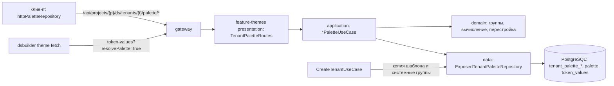
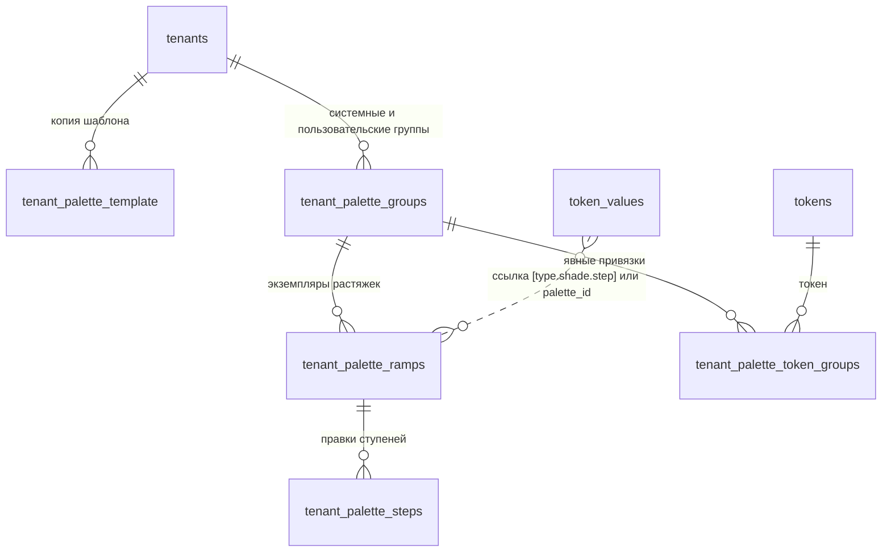

## Контекст

`ds-service` (Kotlin, Ktor, Exposed, Flyway) обслуживает `/api/ds/**` вместо db-service и работает с той
же базой. Тема — тенант дизайн-системы; тенанты создаются и удаляются в `feature-themes`, там же
читаются и сохраняются значения токенов темы (`GET` и `PUT /tenants/{id}/token-values`), сохранение
защищено `edit_revision` с блокировкой строки тенанта. Палитра есть только общая (`feature-tokens`,
таблица `palette`, `GET /palette`, запись — системный администратор).

Продуктовое правило: общая палитра — шаблон. Тема получает её копию и дальше меняет независимо; правки
темы не отражаются на шаблоне и других темах, правки шаблона не отражаются на существующих темах.

Значение токена ссылается на палитру двумя способами: внешним ключом `palette_id` со значением `null` или
`[opacity]` (начальные значения темы) и строкой `[general.red.500][0.56]` в `value` (сохранение из
клиента). Оба вида должны продолжать работать.

Клиент из `add-theme-palette-editor` уже работает с палитрой темы через порт `PaletteRepository`; это
изменение даёт адаптеру `api` сервер. Логика палитры описана там же и проверяется эталоном
`js/apps/client/src/modules/palette/fixtures/palette-golden.json`.

## Цели / Вне целей

**Цели:**

- палитра темы на сервере — независимая копия шаблона с операциями прототипа и тем же контрактом, что у
  клиента;
- явная привязка токенов к группам палитры и адресация групп по `id`;
- конкурентный доступ с той же ревизией темы, что у значений токенов;
- цвета палитры темы в CLI `theme fetch`.

**Вне целей:**

- generator: он читает legacy `theme-data` из db-service без тенанта; перевод generator на `ds-service`
  — отдельное изменение, после которого он сможет запросить `resolvePalette=true`;
- обновление палитры существующей темы до новой версии шаблона;
- изменение шаблона и его прав;
- перенос `palette_id` в строки и удаление столбца;
- отслеживание изменений палитры.

## Архитектура

Палитра темы живёт в `feature-themes`: копия шаблона создаётся в транзакции создания тенанта, операции
палитры делят транзакцию и `edit_revision` с тенантом и его значениями токенов, а feature-модули не могут
зависеть друг от друга. Шаблон читается через внутреннюю проекцию таблицы `palette`, как уже сделано в
`TenantTables.kt`.



## Модель данных и контракты



- `tenant_palette_template`: `tenant_id → tenants ON DELETE CASCADE`, `type palette_type`, `shade text`,
  `step integer`, `value text`; первичный ключ `(tenant_id, type, shade, step)`. Копия шаблона на момент
  создания палитры темы; после создания не меняется.
- `tenant_palette_groups`: `id uuid`, `tenant_id → CASCADE`, `kind` (`palette_group_kind`:
  `system | custom`), `system_key text null` (`neutral | accent | status | data | syntax`), `label text`,
  `position integer`, `created_at`, `updated_at`; уникальность `(tenant_id, system_key)` при непустом
  ключе и `(tenant_id, lower(label))`; проверка: `system_key` задан тогда и только тогда, когда
  `kind = 'system'`.
- `tenant_palette_ramps`: `id uuid`, `group_id → tenant_palette_groups ON DELETE CASCADE`, `slot_type
  palette_type`, `slot_shade text`, `source_type palette_type`, `source_shade text`, `added boolean`,
  `origin` (`palette_ramp_origin`: `template | rebuild`), `anchor_step integer null`, `anchor_value text
  null`, `created_at`, `updated_at`; уникальность `(group_id, slot_type, slot_shade)`. Строка появляется,
  только когда растяжку добавили или изменили; растяжки, известные по ссылкам токенов, вычисляются.
- `tenant_palette_steps`: `ramp_id → tenant_palette_ramps ON DELETE CASCADE`, `step integer`,
  `value text`; первичный ключ `(ramp_id, step)`.
- `tenant_palette_token_groups`: `tenant_id → CASCADE`, `token_id → tokens ON DELETE CASCADE`,
  `group_id → tenant_palette_groups ON DELETE CASCADE`; первичный ключ `(tenant_id, token_id)`. Только
  явные привязки; при удалении группы привязки её токенов удаляются каскадом.

Миграция `V3` создаёт копию шаблона и пять системных групп для каждого существующего тенанта; для новых
тенантов это делает `CreateTenantUseCase` в своей транзакции.

DTO совпадают с `add-theme-palette-editor` (`ThemePalette` с полем `template` — растяжками копии шаблона темы, `PaletteGroup` с `id`, `kind`, `systemKey`,
`PaletteTokenAssignment`, `PaletteRamp`, `PaletteStep` с `templateValue`, `PaletteLink` с `groupId`).
Операции изменения отвечают `{ editRevision, value }`. Ошибки — `ErrorResponse` с кодами
`PALETTE_GROUP_EXISTS`, `PALETTE_GROUP_SYSTEM`, `PALETTE_RAMP_EXISTS`, `PALETTE_RAMP_LINKED`,
`PALETTE_STEP_MISSING`, `TENANT_EDIT_CONFLICT` (с текущим `editRevision`).

| Метод и путь под `/api/ds/tenants/{tenantId}/palette` | Тело | Право |
|---|---|---|
| `GET` | — | `tenants:read` |
| `GET /links?type&shade&groupId&step` | — | `tenants:read` |
| `POST /groups` | `{ label, editRevision }` | `tenants:write` |
| `PATCH /groups/{groupId}` | `{ label, editRevision }` | `tenants:write` |
| `DELETE /groups/{groupId}` | `{ editRevision }` | `tenants:write` |
| `PUT /token-groups/{tokenId}` | `{ groupId \| null, editRevision }` | `tenants:write` |
| `POST /groups/{groupId}/ramps` | `{ type, shade, editRevision }` | `tenants:write` |
| `PUT /groups/{groupId}/ramps/{type}/{shade}/source` | `{ type, shade, editRevision }` | `tenants:write` |
| `POST /groups/{groupId}/ramps/{type}/{shade}/rebuild` | `{ anchorStep, value, preview, editRevision }`; при `preview: true` ответ `{ steps: [{ step, value }] }` | `tenants:write` |
| `PATCH /groups/{groupId}/ramps/{type}/{shade}/steps/{step}` | `{ value, editRevision }` | `tenants:write` |
| `DELETE /groups/{groupId}/ramps/{type}/{shade}` | `{ strategy?, replacement?, editRevision }` | `tenants:write` |

Растяжка внутри группы адресуется слотом `(type, shade)`: это неизменяемый естественный ключ, совпадающий
со ссылкой токена.

## Программное проектирование

```kotlin
// domain (чистые функции, проверяются эталоном palette-golden.json)
data class PaletteReference(val ramp: PaletteRampRef, val step: Int, val opacity: Double?) {
    companion object { fun parse(raw: String?): PaletteReference? }      // строковая форма; palette_id — в data
}
object DefaultPaletteGroups { fun groupFor(tokenName: String): SystemPaletteGroup }
object PaletteRampRebuilder { fun rebuild(source: Map<Int, String>, anchorStep: Int, anchorHex: String): Map<Int, String>? }
object PaletteDisplayNames { fun of(source: PaletteRampRef, anchor: PaletteAnchor?): String }
object ThemePaletteBuilder { fun build(tenantId, canEdit, state, tokens, values): ThemePalette }
object ThemePaletteResolver { fun stepInGroup(...); fun groupOf(...); fun resolve(palette, tokenName, reference): String? }
object PaletteOperations {                                            // (state, ..., palette) -> PaletteOperationResult<T>
    createGroup, renameGroup, deleteGroup, assignTokenGroup, addRamp, replaceSource,
    rebuildPreview, rebuild, updateStep, removeRamp
}

// application: один *UseCase на операцию, единственный execute
class GetTenantPaletteUseCase(...)                  // tenants:read; canEdit = tenants:write и тема своего проекта
class ListTenantPaletteLinksUseCase(...)
class CreateTenantPaletteGroupUseCase(...)          // и Rename/Delete/AssignTokenGroup/AddRamp/ReplaceSource/
class PreviewTenantPaletteRampRebuildUseCase(...)   // Rebuild/UpdateStep/RemoveRamp — через TenantPaletteMutator
class TenantPaletteMutator(policy, transactions, repository) {
    // tenants:write до транзакции; в TransactionRunner.required: lock → initializedSnapshot → операция → save → effect
    suspend fun <T, R> mutate(context, tenantId, editRevision, view, effect, operation): DsResult<TenantPaletteMutation<R>>
    suspend fun <T> preview(context, tenantId, editRevision, operation): DsResult<T>   // без записи
}

interface TenantPaletteRepository {
    suspend fun initialize(tenantId: UUID)                                   // идемпотентно: копия шаблона и системные группы
    suspend fun lock(projectId: ProjectId, tenantId: UUID, editRevision: Int): TenantPaletteLock   // FOR UPDATE OF tenants
    suspend fun snapshot(projectId: ProjectId, tenantId: UUID): TenantPaletteSnapshot?            // FOR SHARE OF tenants
    suspend fun save(tenantId: UUID, state: TenantPaletteState)              // группы, растяжки, ступени, привязки, ревизия
    suspend fun rewriteTokenReferences(tenantId: UUID, rewrite: TokenReferenceRewrite, resolveHex: (Int) -> String?): Int
}
```

Право `tenants:write` проверяется до транзакции. Каждая операция изменения выполняется в
`TransactionRunner.required`: блокировка строки темы `FOR UPDATE OF tenants` и сравнение `editRevision`, снимок
(с созданием палитры теме без неё), операция, запись состояния с новой `edit_revision` и побочное действие
(переписывание ссылок токенов) в той же транзакции.

Уточнения по коду `ds-service` (на этапе реализации):

- Операции — те же чистые функции над состоянием палитры, что у клиента (`modules/palette/domain`),
  перенесённые в `feature-themes/domain` и проверенные эталоном. Хранилище под блокировкой тенанта
  читает состояние палитры темы (копия шаблона, группы, растяжки, ступени, явные привязки), use case
  применяет операцию, и хранилище записывает группы, растяжки, ступени и привязки темы целиком; `id` групп
  сохраняются. Отдельные методы `saveGroup`/`saveRamp` не нужны.
- Ссылка через `palette_id` разбирается по строке общей палитры `(type, shade, saturation)` и
  прозрачности из `value` (`null` или `["0.56"]`); строковая — из `value`.
- OpenAPI `ds-service` — вручную поддерживаемый `app/src/main/resources/openapi/documentation.yaml`
  (генерации из манифеста нет): операции палитры описываются в нём с `x-permission`, а
  `OpenApiDocumentResourceTest` и `DsServiceHttpPostgresIntegrationTest` учитывают новое число операций.
  Соответствие манифеста OpenAPI db-service проверяет JS-тест `route-manifest.test.ts` и
  дифференциальный прогон; оба пропускают группы манифеста с `"origin": "ds-service"`.
- `ErrorResponse` получает необязательный объект `details`; `PALETTE_STEP_MISSING` передаёт в нём
  `steps`. Ошибки проверки (`400`) несут текст в `message`.
- Общая палитра на чистой базе заполняется при создании первого тенанта
  (`GeneratedTenantTokenValueInitializer`), поэтому `CreateTenantUseCase` создаёт копию шаблона после
  инициализации значений токенов. Переписанные ссылки при
удалении растяжки записываются в той же форме, что пишет `PUT /tenants/{id}/token-values`.
`CreateTenantUseCase` вызывает `TenantPaletteRepository.initialize` в транзакции создания тенанта.
- Тема может появиться в обход `ds-service`: клиент создаёт дизайн-систему через db-service
  `legacy/design-systems/create`, и тот вставляет тенанта без `tenant_palette_*`. Поэтому `initialize`
  идемпотентна (копия шаблона — только целиком и один раз, системные группы — только недостающие, вставка
  `ON CONFLICT DO NOTHING`), а чтение палитры, операции и `resolvePalette` создают палитру теме без неё в своей
  транзакции. Эти чтения изменяющие.
- Снимок палитры берёт строку темы `FOR SHARE OF tenants` (не строку дизайн-системы): операции палитры и `PUT token-values` берут её `FOR UPDATE`, поэтому
  все чтения снимка (и значения токенов при `resolvePalette`) видят одно зафиксированное состояние.
- Ошибки домена палитры вида «некорректно» отдаются как `400 invalid_body` с текстом в `message`; ошибки
  маршрута (путь, тело, query) тоже несут строковый `message`. Ответы операций — представления после
  операции: группа с растяжками, растяжка, привязка токена.
- Превью перестройки — отдельный use case: права и ревизия как у записи, данные и ревизия не меняются.
- `resolvePalette` убирает `paletteId` у вычисленных значений: HEX самодостаточен, CLI не разрешает его ещё раз.
- При удалении растяжки «как Custom» HEX ступени берётся как при вычислении цвета токена: растяжка группы,
  иначе копия шаблона слота.
- `canEdit` — право `tenants:write` и принадлежность дизайн-системы проекту: общую дизайн-систему
  (`project_id IS NULL`) проект только читает.

## Решения

### Палитра темы — копия шаблона

Тема хранит полную копию шаблона (`tenant_palette_template`, около 790 строк) и правки поверх этой копии.
Все вычисления — значения ступеней, источники замены, перестройка, `templateValue`, `offBrand` — опираются
на копию темы. Изменение общей палитры администратором не меняет существующие темы.

Отвергнуто:

- хранить только отличия поверх живой общей палитры — правка общей палитры меняла бы цвета всех тем, где
  растяжку не трогали;
- копировать только растяжки, на которые ссылаются токены, — добавление растяжки из шаблона позже брало бы
  уже изменённый шаблон, и копия перестала бы быть снимком.

### Палитра принадлежит теме

У дизайн-системы несколько тем, у каждой своя палитра. Связи считаются по значениям токенов этой темы.

### Явная привязка токена к группе

Группа токена определяет, из какого экземпляра растяжки берётся его цвет, а имя токена задаёт пользователь
и не обязано содержать `accent`, `status` или `data`. Поэтому принадлежность хранится явно в
`tenant_palette_token_groups` и меняется операцией `PUT /token-groups/{tokenId}`. Правило по имени — только
группа по умолчанию для токенов без привязки; оно выбирает лишь системные группы и возвращается в ответе
как `assignment: "default"`. В пользовательскую группу токен попадает только явной привязкой.

Отвергнуто: заполнять привязки всех токенов при создании палитры. Токены дизайн-системы добавляются и
после создания темы, и для них всё равно нужно правило по умолчанию; явная таблица хранит только решения
пользователя.

### Группы адресуются по `id`

Системные группы хранятся строками у каждой темы с `kind = system` и `system_key`, пользовательские — с
`kind = custom`. API, растяжки, привязки и связи ссылаются на группу только по UUID; производного
текстового ключа нет, поэтому нет и вопросов о его неизменяемости и коллизиях. Различие системных и
пользовательских групп выражено полем `kind` и проверкой в схеме; системную группу нельзя удалить или
переименовать.

### Ревизия темы вместо отдельной ревизии палитры

Палитра определяет цвета токенов темы, а удаление растяжки переписывает значения токенов. Общая
`edit_revision` защищает от потери правок в обоих направлениях. Цена — клиент обновляет ревизию после
каждой операции палитры перед сохранением токенов; это уже заложено в `add-theme-palette-editor`.

### Ссылки не переносятся

Сервер понимает обе формы ссылки (`palette_id` и строку). Перенос `palette_id` в строки затронул бы
начальные значения тем и CLI без пользы для палитры. Ссылка через `palette_id` разрешается по
`(type, shade, saturation)` строки общей палитры и затем по копии шаблона темы.

### Вычисление цветов для CLI на сервере

CLI получает HEX и исходную ссылку через `resolvePalette=true` и не повторяет правила групп и копии
шаблона. CLI пишет значение токена как есть и игнорирует `palette.json` для таких значений.

### Операции, которых нет в db-service

Маршруты палитры темы помечаются в манифесте признаком `"origin": "ds-service"` и описываются вручную в
`documentation.yaml` по DTO `ds-service`. JS-тест манифеста и дифференциальный прогон пропускают такие
группы: в db-service этих маршрутов нет.

### Черновик клиента в режиме `api`

Сервер знает только сохранённые значения токенов, а редактор показывает значения черновика: новые токены
(`draft:`) и сохранённые токены с записью черновика. Адаптер `api` клиента считает связи таких токенов по
черновику (в инспекторе и в окне удаления), не убирает растяжку без стратегии при таких связях, а после
удаления на сервере переписывает их ссылки в черновике и перезагружает тему. Записи черновика сохранённых
токенов не сбрасываются, а переписываются: так не теряются остальные правки токена.

## Риски / Компромиссы

- [Миграция `V3` меняет схему и данные, а `FlywayPostgresIntegrationTest` ожидает две миграции и
  отпечаток после `V1`] → тест перестраивается: отпечаток принятой базы сравнивается на цели `1`, число
  миграций — `3`.
- [Копия шаблона — около 790 строк на тему] → объём мал, вставка одним пакетом в порядке ключа с `ON CONFLICT DO NOTHING`; чтение палитры
  берёт копию одним запросом.
- [Тема не получает исправлений общей палитры] → так задумано; обновление темы до новой версии шаблона —
  отдельная операция в будущем.
- [db-service работает на той же базе как путь отката] → новые таблицы ему не видны; при откате палитра
  темы перестаёт влиять на CLI, ссылки токенов остаются валидными.
- [Логика палитры на двух языках] → тесты `ds-service` читают эталон `palette-golden.json` клиента.
- [Удаление растяжки переписывает значения токенов, пока у пользователя есть черновик] → клиент
  перезагружает значения темы; черновик выигрывает при следующем сохранении.

- [Strictacode `javascript-client` растёт: score 45 → 46, complexity density 8.17 → 8.24, refactoring pressure
  59 → 60] → рост даёт учёт черновика клиента в режиме `api` (`palette/draftAwarePaletteRepository.ts`); baseline
  обновлён решением разработчика с `--allow-protected strictacode-policy`.

## Миграция и совместимость

1. `V3__tenant_palette.sql` создаёт enum `palette_ramp_origin`, `palette_group_kind` и пять таблиц, затем
   для каждого существующего тенанта копирует общую палитру в `tenant_palette_template` и создаёт пять
   системных групп. Темы, созданные позже в обход `ds-service` (db-service, откат), получают палитру при
   первом обращении к ней.
2. Ответы без `resolvePalette` не меняются.
3. Порядок развёртывания: `ds-service`, затем CLI и клиент с `VITE_PALETTE_SOURCE = api`. Палитры,
   созданные в режиме `local`, на сервер не переносятся.
4. Откат: прежний образ `ds-service` и клиент с `VITE_PALETTE_SOURCE = local`; таблицы `V3` можно
   оставить.

## План проверки и развёртывания

- Автоматические: `cd backend-kt/ds-service && ./gradlew test detekt spotlessCheck build` (нужен Docker
  для Testcontainers), `cd backend-kt && ./gradlew verifyFast`, тесты `frontend-kt` CLI, сборка и тесты
  клиента, `tools/verify fast|full --change add-theme-palette-api`.
- Внешние до архивирования: сценарий раздела в режиме `api` на локальном контуре, независимость палитры
  темы от правки общей палитры, два пользователя для конфликта ревизии, `dsbuilder theme fetch` против
  локального gateway.
