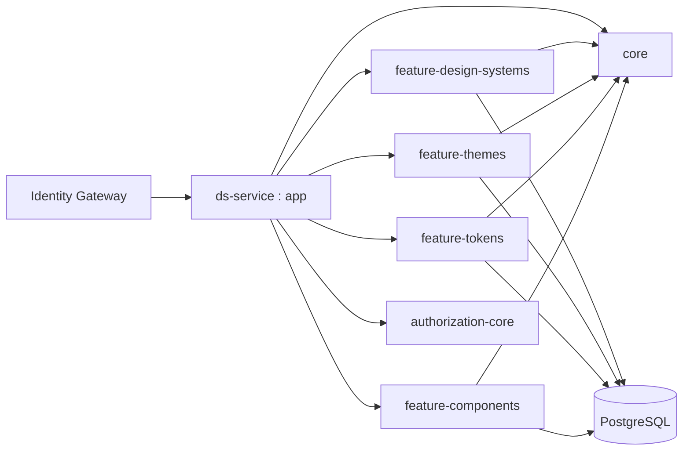
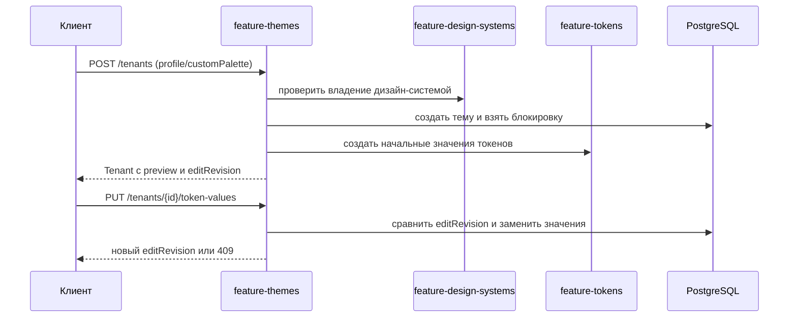
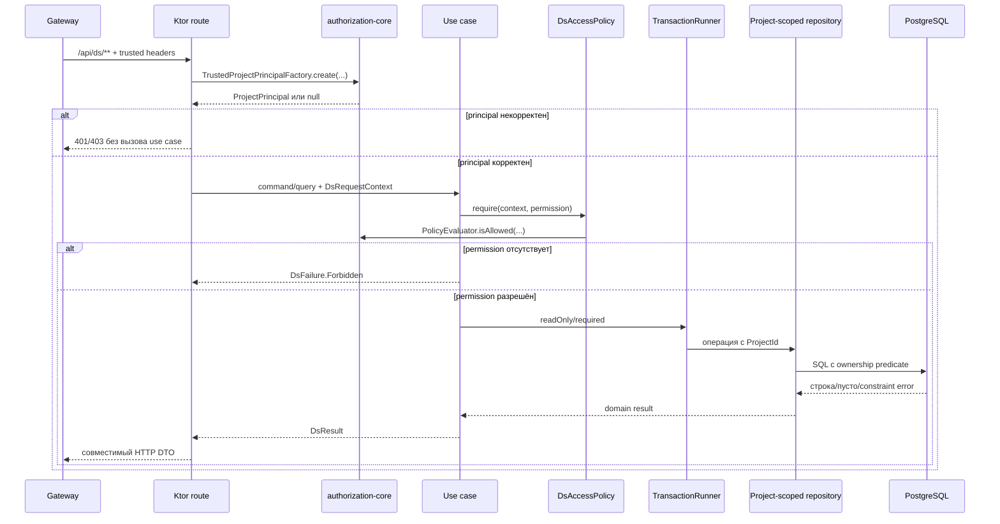
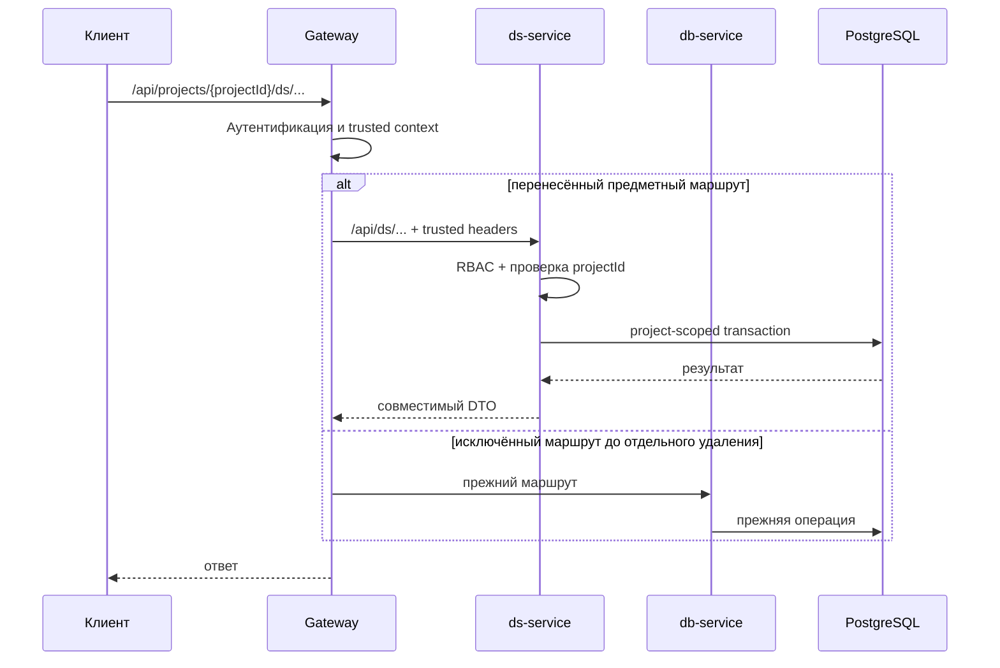

## Context

`js/services/db-service` является текущим источником истины для схемы PostgreSQL, предметных маршрутов и поведения конфигурационной модели. Сервис одновременно содержит нужный предметный API и маршруты, которые не относятся к переносу: `legacy`, `admin`, документацию и сохранённые запросы. Проверки RBAC в нём неполны и местами допускают запрос при отсутствии trusted-контекста.

Новый `backend-kt/ds-service` должен заменить реализацию выбранного API целиком, но не менять продуктовую модель. Поэтому совместимость определяется текущими HTTP-контрактами и наблюдаемым поведением `db-service`, а не желаемой будущей переработкой. Исключение — обязательная закрытая по умолчанию авторизация и фильтрация по проекту.

Изменение затрагивает новый сервис, общую политику авторизации, Gateway, локальный контур, PostgreSQL, `documentation-service` как потребителя проверки владения и `import-uikit-api-meta.sh` как единственного известного автора глобального компонентного слоя.

## Goals / Non-Goals

**Goals:**

- перенести согласованный набор предметных маршрутов в Kotlin за одно изменение и переключить их одной операцией маршрутизации;
- сохранить внешние пути, методы, запросы, ответы, статусы, транзакционные границы и поведение схемы;
- обеспечить чистые границы `presentation -> application -> domain`, реализации портов в `data` и сборку зависимостей в `di`;
- применять общую RBAC-политику и независимую проверку принадлежности каждого ресурса проекту;
- передать управление схемой Flyway без потери данных и без параллельного запуска двух средств миграции;
- обеспечить проверяемый запуск в Gradle, Docker и общем локальном контуре, а также безопасный возврат на `db-service`.

**Non-Goals:**

- изменение предметной схемы, нормализация таблиц или исправление существующих особенностей API;
- перенос `legacy`, `admin`, `documentation-pages`, `saved-queries` и генерации;
- удаление `db-service`, его миграций или исключённых маршрутов;
- поэтапное переключение отдельных предметных сущностей в production;
- переработка DTO, добавление пагинации или новый вариант API;

Исключённые `legacy` и `saved-queries` остаются доступными через project-scoped Gateway fallback в `db-service`; `/api/admin/**` остаётся user-authenticated fallback в `db-service`. `documentation-pages` не получает fallback в `/ds/**`: документация обслуживается отдельным `documentation-service` по своему Gateway namespace.
- перенос codec из `frontend-kt`: `ds-service` сохраняет только текущую серверную семантику `component-config`.

## Decisions

### Один модульный сервис с предметными feature-модулями

`ds-service` создаётся как отдельная Gradle-сборка и подключается к `backend-kt/settings.gradle.kts`. Целевой граф модулей:



- `feature-design-systems` владеет дизайн-системами, версиями и журналом изменений.
- `feature-themes` владеет темами, которые во внешнем API продолжают называться `tenants`.
- `feature-tokens` владеет токенами, значениями токенов и палитрой.
- `feature-components` владеет компонентами, связями с дизайн-системами, зависимостями, reuse-конфигурациями, вариациями, свойствами, платформенными корректировками, внешними видами, стилями, состояниями, комбинациями и `component-config`.
- `core` содержит только действительно общую техническую инфраструктуру: конфигурацию БД и транзакций, trusted principal, применение политики, общую модель ошибок, сериализацию, идентификаторы и время. Предметные модели в `core` не выносятся.
- `app` содержит Ktor bootstrap, установку плагинов, сборку Koin-модулей, health/readiness, OpenAPI и регистрацию feature-маршрутов.

Альтернативы: один `feature-ds` был бы быстрее в начале, но создал бы крупный связанный модуль; отдельный микросервис на каждую сущность усложнил бы транзакции и противоречил требованию не дробить перенос. Выбран один сервис с крупными предметными границами.

### Чистая архитектура внутри каждого feature-модуля

Каждый feature-модуль использует пакеты `presentation`, `application`, `domain`, `data`, `di`:

- `presentation` содержит Ktor routes, явные request/response DTO и отображение ошибок;
- `application` содержит use case, команды/запросы и порты репозиториев;
- `domain` содержит сущности, value objects, инварианты и предметные ошибки без Ktor, Exposed и форматов хранения;
- `data` содержит Exposed tables, SQL, реализации репозиториев и отображение записей БД;
- `di` связывает интерфейсы с реализациями и не содержит бизнес-логики.

Публичный тип, use case, DTO или репозиторий размещается в отдельном файле, кроме малых тесно связанных value objects. Маршруты группируются по ресурсу, а не в одном общем файле. Общие CRUD-абстракции допускаются только когда сохраняют предметные типы и не скрывают проверки доступа или транзакционные правила.

Альтернатива с прямым вызовом Exposed из route handlers короче, но смешивает API, авторизацию и хранение, затрудняет проверку совместимости и нарушает архитектурные границы репозитория.

### Актуализация тем после `projects-workflow`

После переноса базы на `feature/projects-workflow` эталонный `db-service` дополнил предметный контракт тем. Это не новая Kotlin-модель: `ds-service` воспроизводит уже опубликованное поведение источника истины.



`feature-themes` остаётся владельцем HTTP-контрактов темы, её preview, нормализации имени и атомарного пакетного сохранения значений. Он зависит только от узких application-портов: проверка доступности дизайн-системы и получение/инициализация токенов выполняются через порты, реализованные в `data`, а не через presentation или Exposed другого feature-модуля. `feature-design-systems` при создании системы вызывает отдельный use case инициализации определений токенов; шаблонные определения остаются локальными данными `feature-tokens`.

Новая Flyway-миграция повторяет применённый Drizzle DDL: добавляет `tenants.edit_revision` со значением по умолчанию `0`, нормализует уже существующие имена и заменяет уникальный индекс на регистронезависимый. Она идёт после baseline и не переписывает историю. При конфликте версии пакетного сохранения application-слой возвращает `DsFailure.Conflict` с кодом `TENANT_EDIT_CONFLICT` и актуальной ревизией, presentation отображает совместимое тело `409`.

Альтернатива — оставить старый `colorConfig` как Kotlin-специфику — отклонена: она расходится с уже опубликованным OpenAPI `db-service` и ломает переключение Gateway. Отдельный сервис тем также отклонён, так как для этого потребовалась бы распределённая транзакция с токенами.

### Программное проектирование

#### Размещение контрактов

| Модуль и слой | Ответственность | Основные контракты |
|---|---|---|
| `app` | запуск Ktor, конфигурация, Koin composition root, Flyway, health/readiness, OpenAPI | `DsServiceConfiguration`, `Application.installDsService`, `ReadinessContributor` |
| `core/application` | единый контекст запроса, применение готового RBAC evaluator, транзакционная граница, общие ошибки | `DsRequestContext`, `DsAccessPolicy`, `TransactionRunner`, `DsResult`, `DsFailure` |
| `core/data` | пул БД, реализация транзакций и минимальные общие SQL-средства project scope | `ExposedTransactionRunner`, `ProjectScopeSql` |
| `feature-design-systems` | дизайн-системы, версии и журнал изменений | отдельные `List*UseCase`, `Get*UseCase`, `Create*UseCase`, `Update*UseCase`, `Delete*UseCase` и use case агрегатных чтений |
| `feature-themes` | темы и их значения токенов | отдельные use case для CRUD темы и `GetTenantTokenValuesUseCase` |
| `feature-tokens` | токены, значения и палитра | отдельные use case для каждого CRUD, lookup и чтения значений |
| `feature-components` | вся компонентная модель и пакетные конфигурации | отдельный use case для каждой операции route manifest, включая три `ComponentConfig*UseCase` |

Каждая строка route manifest соответствует одному application use case с единственным открытым методом `execute`. Use case оформляется классом, а не методом общего `Queries`, `Commands`, `Operations`, `Service` или универсального CRUD-интерфейса. Общий код выносится только в узкие порты и политики, но не объединяет разные пользовательские сценарии. Каждый публичный интерфейс, DTO, use case и значимый предметный тип размещается в отдельном файле. В одном файле допускаются только тесно связанные закрытые реализации или небольшой тип вместе с его enum/value object. Файлы вида `Models.kt`, `Dtos.kt`, `Repositories.kt` с несвязанными публичными объявлениями для нескольких ресурсов запрещены.

#### Переиспользование authorization-core

`ds-service` MUST подключать существующий Gradle-проект `backend-kt/authorization-core` и напрямую переиспользовать его публичные контракты:

```kotlin
AuthorizationPolicyLoader.load(configuredPath: String?): LoadedAuthorizationPolicy
PolicyEvaluator(loaded: LoadedAuthorizationPolicy)
PolicyEvaluator.isAllowed(principal: ProjectPrincipal, permission: String): Boolean
TrustedProjectPrincipalFactory.create(
    actorType: String?,
    projectId: String?,
    userId: String?,
    projectKeyId: String?,
    projectRole: String?,
    projectScopes: String?,
    systemAdmin: String?,
    policy: AuthorizationPolicy,
): ProjectPrincipal?
```

`ds-service` не создаёт собственные копии `AuthorizationPolicy`, `ProjectPrincipal`, role inheritance, разбора scopes, проверки `system_admin` или алгоритма `isAllowed`. В `core/application` допускается только тонкий адаптер, который сопоставляет строковый permission предметной операции с существующим `PolicyEvaluator` и преобразует отказ в единую ошибку приложения:

```kotlin
data class DsRequestContext(
    val principal: ProjectPrincipal,
    val correlationId: String,
)

class DsAccessPolicy(
    private val evaluator: PolicyEvaluator,
) {
    fun require(context: DsRequestContext, permission: String): DsResult<Unit>
    val diagnostics: PolicyDiagnostics
}
```

Presentation-адаптер читает нормализованные заголовки Ktor и вызывает именно `TrustedProjectPrincipalFactory.create`. `app` создаёт единственный immutable `LoadedAuthorizationPolicy` через `AuthorizationPolicyLoader`, единственный `PolicyEvaluator` и передаёт их через Koin всем feature-модулям. Если загрузка или проверка policy завершилась ошибкой, приложение не создаёт permissive evaluator и остаётся неготовым.

#### Общие application-контракты

Application-слой использует типизированный результат и не зависит от HTTP-статусов или SQL-исключений:

```kotlin
sealed interface DsResult<out T> {
    data class Success<T>(val value: T) : DsResult<T>
    data class Failure(val error: DsFailure) : DsResult<Nothing>
}

sealed interface DsFailure {
    data class InvalidRequest(val code: String, val details: Map<String, String>) : DsFailure
    data object Forbidden : DsFailure
    data object NotFound : DsFailure
    data class Conflict(val code: String) : DsFailure
    data class DependencyUnavailable(val dependency: String) : DsFailure
}

interface TransactionRunner {
    suspend fun <T> required(block: suspend () -> DsResult<T>): DsResult<T>
    suspend fun <T> readOnly(block: suspend () -> DsResult<T>): DsResult<T>
}
```

`DsFailure.NotFound` одинаков для отсутствующей и чужой сущности. Presentation-слой централизованно отображает `InvalidRequest`, `Forbidden`, `NotFound`, `Conflict` и `DependencyUnavailable` в совместимые HTTP-ответы. Data-слой перехватывает известные PostgreSQL constraint violations и отображает их в предметный `Conflict` или `InvalidRequest`; неизвестная ошибка остаётся технической и не раскрывает SQL клиенту.

#### Контракты feature-design-systems

В каждой операции `projectId` берётся из `DsRequestContext`, а не из request DTO. Feature содержит следующие самостоятельные классы:

- дизайн-системы: `ListDesignSystemsUseCase`, `GetDesignSystemUseCase`, `CreateDesignSystemUseCase`, `UpdateDesignSystemUseCase`, `DeleteDesignSystemUseCase`;
- агрегатные чтения: `ListDesignSystemComponentsUseCase`, `ListDesignSystemTokensUseCase`, `ListDesignSystemComponentStylesUseCase`, `ListDesignSystemTenantsUseCase`, `ListDesignSystemAppearancesUseCase`, `ListDesignSystemChangesUseCase`;
- версии: `ListDesignSystemVersionsUseCase`, `GetDesignSystemVersionUseCase`, `ListVersionsByDesignSystemUseCase`, `CreateDesignSystemVersionUseCase`, `UpdateDesignSystemVersionUseCase`, `DeleteDesignSystemVersionUseCase`;
- журнал изменений: `ListDesignSystemChangeEntriesUseCase`, `GetDesignSystemChangeUseCase`, `ListChangesByDesignSystemUseCase`, `CreateDesignSystemChangeUseCase`.

Контракт каждого класса показывает собственные зависимости и только один сценарий:

```kotlin
class GetDesignSystemUseCase(
    private val accessPolicy: DsAccessPolicy,
    private val transactionRunner: TransactionRunner,
    private val repository: DesignSystemRepository,
) {
    suspend fun execute(
        context: DsRequestContext,
        id: DesignSystemId,
    ): DsResult<DesignSystem>
}

class CreateDesignSystemUseCase(
    private val accessPolicy: DsAccessPolicy,
    private val transactionRunner: TransactionRunner,
    private val repository: DesignSystemRepository,
) {
    suspend fun execute(
        context: DsRequestContext,
        command: CreateDesignSystem,
    ): DsResult<DesignSystem>
}

class ListDesignSystemComponentStylesUseCase(
    private val accessPolicy: DsAccessPolicy,
    private val transactionRunner: TransactionRunner,
    private val repository: DesignSystemAggregateRepository,
) {
    suspend fun execute(
        context: DsRequestContext,
        designSystemId: DesignSystemId,
        componentId: ComponentId,
    ): DsResult<List<StyleSummary>>
}

class CreateDesignSystemVersionUseCase(
    private val accessPolicy: DsAccessPolicy,
    private val transactionRunner: TransactionRunner,
    private val repository: DesignSystemVersionRepository,
) {
    suspend fun execute(
        context: DsRequestContext,
        command: CreateDesignSystemVersion,
    ): DsResult<DesignSystemVersion>
}
```

Остальные перечисленные use case имеют ту же форму: явные зависимости конструктора и один `execute` с типизированным входом и результатом. Route не выбирает операцию внутри одного общего сервиса по enum или имени действия.

`ComponentSummary`, `TokenSummary`, `StyleSummary`, `TenantSummary` и `AppearanceSummary` в агрегатных чтениях являются локальными read models `feature-design-systems`, а не импортами domain/application другого feature-модуля. Это сохраняет независимость feature-модулей и внешний DTO-контракт.

Application ports данных сохраняют project scope в сигнатуре, чтобы реализация не могла случайно выполнить неограниченный запрос:

```kotlin
interface DesignSystemRepository {
    suspend fun listAccessible(projectId: ProjectId): List<DesignSystem>
    suspend fun findAccessible(projectId: ProjectId, id: DesignSystemId): DesignSystem?
    suspend fun createOwned(projectId: ProjectId, command: CreateDesignSystem): DesignSystem
    suspend fun updateOwned(
        projectId: ProjectId,
        id: DesignSystemId,
        command: UpdateDesignSystem,
    ): DesignSystem?
    suspend fun deleteOwned(projectId: ProjectId, id: DesignSystemId): Boolean
}
```

Порты версий и изменений следуют тому же правилу: метод чтения или изменения принимает `projectId` и ограничивает данные через родительскую дизайн-систему внутри одного SQL-запроса.

#### Контракты feature-themes и feature-tokens

`feature-themes` содержит `ListTenantsUseCase`, `GetTenantUseCase`, `CreateTenantUseCase`, `UpdateTenantUseCase`, `DeleteTenantUseCase` и `GetTenantTokenValuesUseCase`.

`feature-tokens` содержит отдельные `List*UseCase`, `Get*UseCase`, `Create*UseCase`, `Update*UseCase` и `Delete*UseCase` для `tokens`, `token-values` и `palette`, а также `GetTokenValuesUseCase` и `ListPaletteByTypeUseCase`.

Примеры контрактов:

```kotlin
class GetTenantTokenValuesUseCase(
    private val accessPolicy: DsAccessPolicy,
    private val transactionRunner: TransactionRunner,
    private val repository: TenantRepository,
) {
    suspend fun execute(
        context: DsRequestContext,
        tenantId: TenantId,
    ): DsResult<List<TokenValue>>
}

class ListTokensUseCase(
    private val accessPolicy: DsAccessPolicy,
    private val transactionRunner: TransactionRunner,
    private val repository: TokenRepository,
) {
    suspend fun execute(
        context: DsRequestContext,
        filter: TokenFilter,
    ): DsResult<List<Token>>
}

class UpdateTokenValueUseCase(
    private val accessPolicy: DsAccessPolicy,
    private val transactionRunner: TransactionRunner,
    private val repository: TokenValueRepository,
) {
    suspend fun execute(
        context: DsRequestContext,
        id: TokenValueId,
        command: UpdateTokenValue,
    ): DsResult<TokenValue>
}

class ListPaletteByTypeUseCase(
    private val accessPolicy: DsAccessPolicy,
    private val transactionRunner: TransactionRunner,
    private val repository: PaletteRepository,
) {
    suspend fun execute(
        context: DsRequestContext,
        type: PaletteType,
    ): DsResult<List<PaletteEntry>>
}
```

`TenantRepository`, `TokenRepository`, `TokenValueRepository` и `PaletteRepository` предоставляют необходимые persistence-операции нескольким use case и принимают явный `ProjectId` вместо `DsRequestContext`. Проверка permission остаётся в application, а SQL-фильтрация ownership — в repository.

#### Контракты feature-components

Компонентный feature не объединяется в один application-сервис. Для каждой операции создаётся самостоятельный use case:

| Ресурс | Use case |
|---|---|
| `components` | `ListComponentsUseCase`, `GetComponentUseCase`, `CreateComponentUseCase`, `UpdateComponentUseCase`, `DeleteComponentUseCase`, `ListComponentVariationsUseCase`, `ListComponentPropertiesUseCase`, `ListDependenciesByComponentUseCase` |
| `design-system-components` | `ListDesignSystemComponentsUseCase`, `GetDesignSystemComponentUseCase`, `CreateDesignSystemComponentUseCase`, `DeleteDesignSystemComponentUseCase` |
| `component-deps` | `ListComponentDependenciesUseCase`, `GetComponentDependencyUseCase`, `CreateComponentDependencyUseCase`, `UpdateComponentDependencyUseCase`, `DeleteComponentDependencyUseCase` |
| `component-reuse-configs` | `ListComponentReuseConfigsUseCase`, `GetComponentReuseConfigUseCase`, `CreateComponentReuseConfigUseCase`, `UpdateComponentReuseConfigUseCase`, `DeleteComponentReuseConfigUseCase`, `ListComponentReuseConfigsByDependencyUseCase` |
| `variations` | `ListVariationsUseCase`, `GetVariationUseCase`, `CreateVariationUseCase`, `UpdateVariationUseCase`, `DeleteVariationUseCase`, `ListVariationStylesUseCase`, `ListVariationPropertiesUseCase` |
| свойства и platform params | отдельный use case для каждой CRUD/lookup операции `properties`, `property-platform-params`, `property-variations` и обеих групп adjustments |
| appearances | отдельный use case для каждой CRUD/lookup операции `appearances`, `appearance-variations`, `appearance-variation-values` |
| styles и property values | отдельный use case для каждого CRUD и lookup `styles`, `variation-property-values`, `invariant-property-values` |
| states | отдельные CRUD use case, `GetStateImpactUseCase`, `ListStateSetsUseCase`, `GetStateSetUseCase`, `ResolveStateSetUseCase` |
| style combinations | отдельный use case для каждого CRUD, чтения/добавления members и CRUD `style-combination-members` |
| `component-config` | `GetComponentConfigUseCase`, `ImportComponentConfigUseCase`, `ExportComponentConfigUseCase` |

Для остальных строк CRUD-классы именуются по тому же явному правилу `List<Resource>UseCase`, `Get<Resource>UseCase`, `Create<Resource>UseCase`, `Update<Resource>UseCase`, `Delete<Resource>UseCase`; специальные lookup/resolve-сценарии получают отдельное предметное имя. Это правило именования не означает общий базовый CRUD-класс: каждый сценарий остаётся самостоятельным классом и файлом.

Основные и пакетные контракты имеют следующий вид:

```kotlin
class GetComponentUseCase(
    private val accessPolicy: DsAccessPolicy,
    private val transactionRunner: TransactionRunner,
    private val repository: ComponentRepository,
) {
    suspend fun execute(
        context: DsRequestContext,
        id: ComponentId,
    ): DsResult<Component>
}

class ListVariationPropertiesUseCase(
    private val accessPolicy: DsAccessPolicy,
    private val transactionRunner: TransactionRunner,
    private val repository: VariationRepository,
) {
    suspend fun execute(
        context: DsRequestContext,
        variationId: VariationId,
    ): DsResult<List<Property>>
}

class GetComponentConfigUseCase(
    private val accessPolicy: DsAccessPolicy,
    private val transactionRunner: TransactionRunner,
    private val repository: ComponentConfigRepository,
) {
    suspend fun execute(
        context: DsRequestContext,
        query: ComponentConfigQuery,
    ): DsResult<ComponentConfig>
}

class ImportComponentConfigUseCase(
    private val accessPolicy: DsAccessPolicy,
    private val transactionRunner: TransactionRunner,
    private val repository: ComponentConfigRepository,
) {
    suspend fun execute(
        context: DsRequestContext,
        command: ImportComponentConfig,
    ): DsResult<ComponentConfigImportResult>
}

class ExportComponentConfigUseCase(
    private val accessPolicy: DsAccessPolicy,
    private val transactionRunner: TransactionRunner,
    private val repository: ComponentConfigRepository,
) {
    suspend fun execute(
        context: DsRequestContext,
        query: ExportComponentConfig,
    ): DsResult<ComponentConfigPackage>
}
```

Use case использует узкий application port repository с обязательным `ProjectId`. Один универсальный `CrudUseCase<Any>`, `CrudService<Any>` или repository, принимающий имя таблицы, запрещён: он стирает типы, ownership и предметные ограничения.

`ImportComponentConfigUseCase` вызывает необходимые persistence-операции только внутри `TransactionRunner.required`. Он сохраняет порядок и каскады текущего импорта и полагается на перенесённые PostgreSQL constraints/triggers как на последнюю границу целостности. `GetComponentConfigUseCase` и `ExportComponentConfigUseCase` выполняются через `TransactionRunner.readOnly`; предел тела импорта остаётся не меньше `16 MiB`. Пакетная операция не раскладывается на публичные CRUD-вызовы по HTTP.

#### Общая физическая схема без циклических feature-зависимостей

Feature-модули не импортируют domain/application другого feature-модуля. Каждый repository владеет отображением своих таблиц. Для SQL join, который проверяет доступ через `design_systems`, `core/data` предоставляет узкий `ProjectScopeSql` с физическими именами и предикатами доступности, но без domain-моделей или CRUD:

```kotlin
interface ProjectScopeSql {
    fun designSystemIsAccessible(projectId: ProjectId, designSystemIdColumn: Column<Long>): Op<Boolean>
}
```

Этот контракт является внутренним data-контрактом и не виден domain/application. Он устраняет копирование security-sensitive SQL и не превращает `core` в владельца предметных сущностей. Feature repository обязан применять предикат в том же запросе, который читает или изменяет ресурс; предварительное незащищённое чтение с последующей проверкой не допускается.

#### Presentation и DTO

Каждый feature публикует отдельный установщик маршрутов и набор явных mapper:

```kotlin
interface FeatureRoutes {
    fun install(parent: Route)
}

interface RequestContextFactory {
    fun create(call: ApplicationCall): DsResult<DsRequestContext>
}

interface DesignSystemDtoMapper {
    fun toResponse(model: DesignSystem): DesignSystemResponse
    fun toCreateCommand(request: CreateDesignSystemRequest): DsResult<CreateDesignSystem>
    fun toUpdateCommand(request: UpdateDesignSystemRequest): DsResult<UpdateDesignSystem>
}

interface DsHttpErrorMapper {
    fun status(error: DsFailure): HttpStatusCode
    fun body(error: DsFailure, correlationId: String): ErrorResponse
}
```

`RequestContextFactory` использует `TrustedProjectPrincipalFactory` из `authorization-core`; собственный parser trusted headers запрещён. Route отвечает только за разбор path/query/body, создание контекста, вызов одного use case и сериализацию DTO. Permission, транзакции и SQL в route отсутствуют. Domain- и persistence-типы не помечаются `@Serializable` только ради HTTP.

#### Сборка зависимостей

Каждый feature предоставляет один Koin module из пакета `di`. `app` загружает их вместе с единственными экземплярами `LoadedAuthorizationPolicy`, `PolicyEvaluator`, `DsAccessPolicy`, `Database`, `TransactionRunner`, `ProjectScopeSql` и runtime-наблюдаемости. Feature-модуль регистрирует собственные use case, repository, mapper и `FeatureRoutes`; разрешение зависимостей между feature-модулями через service locator запрещено.

Основной путь запроса выглядит так:



### Явный контракт совместимости

До реализации формируется машиночитаемый список разрешённых маршрутов из спецификации изменения. Для каждого маршрута фиксируются:

- метод и публичный путь `/api/projects/{projectId}/ds/**`;
- внутренний путь `/api/ds/**` после переписывания Gateway;
- request DTO, query-параметры, response DTO и коды ответа текущей реализации;
- необходимый permission и способ вычисления владельца;
- транзакционность и существенные ограничения размера.

Контрактные тесты запускают одинаковые запросы к `db-service` и `ds-service` на эквивалентных фикстурах и сравнивают статус и JSON с нормализацией только недетерминированных значений. Для мутаций используются изолированные базы. Известное поведение, например обязательный, но не влияющий на выборку `version` в `GET /component-config`, сохраняется до отдельного изменения.

Альтернатива с «улучшением по ходу переноса» отклонена: она не позволяет отделить ошибки миграции от продуктовых изменений.

### RBAC и принадлежность проекту закрыты по умолчанию

Gateway аутентифицирует запрос, проверяет публичный path `projectId` и перезаписывает trusted-заголовки до удаления project-префикса. `ds-service` самостоятельно создаёт principal через `authorization-core` и принимает project context только из проверенного `X-Project-Id`; внутренний путь `/api/ds/**` уже не содержит `projectId`.

Порядок проверки:

1. отсутствующий, неполный, противоречивый или неизвестный trusted principal отклоняется до use case;
2. отсутствие permission возвращает `403` без чтения или изменения данных;
3. разрешённая операция выполняет project-scoped запрос;
4. отсутствующий или чужой ресурс возвращает одинаковый `404` без раскрытия существования;
5. `system_admin` применяет только известный политике override.

Permission выбирается по предметной группе и действию: `*:read` для `GET`, `*:write` для `POST`/`PATCH`, `*:delete` для `DELETE`. Дизайн-системы, версии и изменения используют `design-systems:*`; темы — `tenants:*`; токены, значения и палитра — `tokens:*`; компоненты и верхнеуровневые связи — `components:*`; вариации, свойства, стили, состояния и конфигурации — `components:variations:*`, кроме импорта/экспорта целого компонента, для которого применяются `components:write`/`components:read`.

Глобальная дизайн-система с `project_id IS NULL` и связанные глобальные данные доступны на чтение авторизованному проекту, если текущая модель разрешает такую связь. Изменять глобальный слой может только `system_admin` или отдельный доверенный внутренний вызов с равнозначным permission; обычный project principal не может превратить проектную запись в глобальную.

Альтернатива с одной проверкой в Gateway отклонена: Gateway не знает владельца косвенно связанного ресурса, а внутренний доступ к сервису не должен обходить защиту.

### Flyway становится единственным владельцем схемы

Flyway запускается приложением до readiness. Миграции находятся в `ds-service/app/src/main/resources/db/migration` и включают:

- проверенный baseline, создающий текущую схему `schema.ts` на пустой БД;
- SQL текущих ограничений, индексов, функций и триггеров, включая поведение `0004_component_import.sql`;
- последующие версионированные миграции только из `ds-service`.

Для существующей БД используется отдельная управляемая процедура: до первого запуска вычисляется и проверяется отпечаток ожидаемой схемы, создаётся `flyway_schema_history` с согласованной baseline-версией без повторного выполнения DDL, затем выполняется `flyway validate`. Автоматический `baselineOnMigrate` без проверки схемы запрещён. Для пустой БД выполняется полный `migrate`, после чего схема сравнивается с эталонной.

После принятия владения Drizzle migration runner для этой БД отключается. `db-service` при параллельном чтении или откате использует ту же схему, но не запускает миграции. Новая схема во время этого изменения не вводится.

Альтернативы: переписать исторические Drizzle-файлы один к одному рискованно из-за исторического состояния; полагаться на `baselineOnMigrate` небезопасно, потому что неизвестная схема была бы принята молча. Выбран проверенный baseline текущего состояния и явная процедура принятия существующей БД.

### Управляемое совместное существование и одно переключение

До переключения `ds-service` разворачивается рядом с `db-service`, выполняет readiness и теневое сравнение только безопасных чтений. Двойная запись запрещена. Мутационные проверки выполняются на копии или изолированной БД.

Gateway получает один переключаемый upstream для согласованного предметного набора. Более специфичные правила для исключённых маршрутов могут продолжать направлять их в `db-service`; они не считаются частью API `ds-service`. Это сохраняет возможность удалить их отдельным решением и не расширяет текущую задачу.



Откат меняет upstream перенесённого набора обратно на `db-service`. Он допустим, пока Kotlin-версия не применила несовместимую схему; в этом изменении таких миграций нет.

### Runtime, здоровье и наблюдаемость

Сервис получает собственные `Dockerfile`, `application.yaml`, пример переменных окружения и запись в `backend-kt/docker-compose.yml`/локальном запуске. Внутренний порт закрепляется как `8085` и задаётся через `DS_SERVICE_PORT`; то же значение используется в приложении, compose и Gateway. Обязательная конфигурация: JDBC URL, пользователь и пароль БД, путь к policy, параметры пула, порт, режим и уровень журналирования; секреты поступают только из окружения.

`/health` проверяет процесс без внешних зависимостей. `/ready` подтверждает соединение с БД, успешный Flyway `validate`, загруженную policy и завершённую регистрацию модулей. OpenAPI публикует только реализованный allowlist. Журналы содержат request/correlation id, route template, actor type, project id, permission, исход авторизации, длительность и класс результата без токенов, секретов и содержимого конфигураций. Метрики различают HTTP-ошибки, отказы RBAC, промахи ownership, транзакционные ошибки и состояние пула.

## Data Model and Contracts

`js/services/db-service/src/db/schema.ts` и применённые Drizzle-миграции являются входным эталоном для baseline. Kotlin Exposed tables повторяют имена таблиц и колонок, типы, nullable, defaults, foreign keys, cascade/restrict, unique constraints и индексы. Идентификаторы и временные поля не переосмысливаются.

Domain-модели не используются как DTO и не обязаны повторять строки таблиц. Отображения разделены:

`HTTP DTO <-> application command/query <-> domain model <-> persistence record`.

Совместимость JSON проверяется контрактными тестами. Необязательное поле, `null`, отсутствие поля, числовое представление и порядок массивов считаются частью поведения там, где на них опирается текущий клиент.

## Risks / Trade-offs

- [Большой объём маршрутов в одном изменении] → реализация идёт по feature-модулям, но общий контракт и переключение остаются едиными; для каждой группы обязательны модульные, интеграционные и дифференциальные тесты.
- [Скрытое поведение Express/Drizzle не отражено в OpenAPI] → эталонные запросы выполняются против текущего сервиса и фиксируются как контрактные тесты до переноса группы.
- [Несовпадение Flyway baseline с production-схемой] → обязательны schema fingerprint, пробный baseline на копии существующей БД и `flyway validate`; автоматическое принятие неизвестной схемы запрещено.
- [Два сервиса могут одновременно мигрировать одну БД] → у окружения только один migration owner; запуск `db-service` в режиме отката отделён от migration job.
- [RBAC изменит ранее permissive-поведение] → матрица route/permission/ownership становится явной, проверки покрываются негативными тестами, а изменение объявляется намеренным.
- [Глобальные компоненты не имеют прямого `project_id`] → ownership выводится по связям с доступной дизайн-системой; глобальные мутации ограничены `system_admin`/trusted internal actor.
- [Исключённый маршрут всё ещё используется неизвестным клиентом] → перед переключением анализируются Gateway/access logs и репозиторные потребители; при необходимости специфичный маршрут временно остаётся на `db-service`.
- [Откат после записи Kotlin] → DTO и схема остаются совместимыми, поэтому `db-service` может читать записи; до переключения это проверяется мутационными контрактными тестами на изолированной БД.

## Migration Plan

1. Зафиксировать route manifest и эталонные контракты `db-service`, включая исключённые маршруты и матрицу RBAC.
2. Создать Gradle-проект, слои, runtime, Docker/compose и технические endpoints; подключить policy и Flyway.
3. Построить и проверить Flyway baseline на пустой БД и на копии существующей схемы.
4. Реализовать feature-модули и контрактные тесты в порядке зависимостей: дизайн-системы, темы, токены, компоненты и `component-config`.
5. Перевести `documentation-service` ownership client и `import-uikit-api-meta.sh` на новый внутренний адрес и защищённый контекст.
6. Развернуть `ds-service` рядом с `db-service`, проверить readiness, OpenAPI, метрики и сравнить безопасные чтения.
7. Остановить Drizzle migration job, выполнить контролируемый Flyway baseline/validate существующей БД и назначить Flyway единственным владельцем.
8. Одной конфигурационной операцией переключить разрешённый предметный набор Gateway на `ds-service`; исключённые специфичные пути при необходимости оставить на `db-service`.
9. Наблюдать ошибки, latency, RBAC и расхождения. При критическом отклонении вернуть upstream на `db-service`; Flyway history и Kotlin-сервис сохранить для диагностики, данные не откатывать.

## Open Questions

- Какие исключённые маршруты фактически доступны через production Gateway и должны временно остаться на `db-service`, а какие уже можно перестать маршрутизировать? Ответ получается из конфигурации и access logs до cutover и не расширяет API Kotlin-сервиса.
- Есть ли production-базы с ручным расхождением относительно применённых Drizzle-миграций? Для каждой такой базы до baseline потребуется отдельный отчёт schema diff и устранение расхождения.
