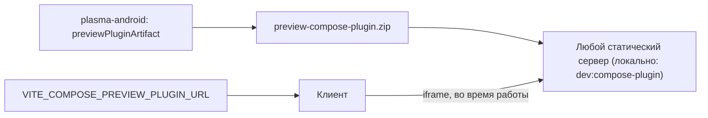

## Контекст

Прототип Compose-preview состоит из двух частей в разных репозиториях.

- **design-system-builder** (локальная перебазированная ветка `feature/compose-preview`, не опубликована): хост плагина в клиенте (`js/apps/client/src/composePreview`: `ComposePreviewFrame`, сессия обмена сообщениями, проверка manifest), сборка данных из состояния редактора (`draft.ts`, `assembler.ts`), интеграция в `ComponentEditorPreview`, локальная раздача архива плагина скриптом на порту 8081, тесты и браузерная проверка.
- **plasma-android** (локальная перебазированная ветка `feature/preview-compose`, не опубликована): `preview-contract`, `preview-sdk-compose`, `preview-compose-plugin`, четыре коммита.

Цель изменения: PoC. Клиент и плагин собираются независимо и встречаются только в браузере: клиент загружает плагин по адресу из переменной сборки в `iframe`, и они обмениваются сообщениями. Кода плагина в сборке клиента нет, линковки между ними нет.

## Цели / Не цели

**Цели:**
- Прототип живёт в рабочих ветках, собирается и проходит свои проверки на актуальных основах.
- Клиент и плагин проверены друг на друге.
- Описано, как собрать плагин и раздать его для работы клиента.
- Compose-preview включается явно и всегда имеет возврат к React-preview.

**Не цели:**
- Доставка плагина на DEV и PROM, изменения CI/CD, хранилище и инфраструктура.
- Расширение контракта payload, универсальный реестр компонентов, новые компоненты (отдельные изменения плана).
- Поддержка чужих и пользовательских плагинов, подпись артефактов, Preview Artifact Service.
- Preview выпущенных версий дизайн-системы и любые изменения серверной части.

## Решения

### Переносится итоговое состояние путей, а не история

Коммиты прототипа нельзя воспроизвести как есть: первый содержит дубли `.agents/skills/openspec-*` (в основе уже есть свои команды `opsx`) и скрипт `import-uikit-api-meta.mjs`, который следующий коммит удаляет. Поэтому из локальной ветки `feature/compose-preview` берётся итоговое содержимое перечисленных в задачах путей, а коммиты создаются заново с осмысленными сообщениями.

В `plasma-android` четыре коммита прототипа переносятся последовательно (cherry-pick с локальной перебазированной ветки): они уже лежат поверх актуального `develop`, не смешаны с посторонними файлами и содержат собственные артефакты OpenSpec.

Кроме того, активное изменение прототипа `connect-component-editor-to-compose-preview-payload` переносится вместе с остальными артефактами. Его выполненные задачи подтверждаются прогоном проверок этого изменения, после чего оно архивируется по общему процессу.

### Одна конфигурация тестов клиента

В основе уже есть `js/apps/client/vitest.config.ts` (окружение `jsdom`, `setupFiles`, `css`). Прототип добавил блок `test` в `vite.config.ts`. Когда существует `vitest.config.ts`, `vitest` читает его и игнорирует `test` из `vite.config.ts`, поэтому настройки прототипа (`include`, `restoreMocks`) не применялись бы. Они переносятся в `vitest.config.ts`, а блок `test` из `vite.config.ts` удаляется. Тип `vitest/globals` в `tsconfig.app.json` сохраняется только если тесты прототипа используют глобальные функции.

### Загрузка плагина во время работы

Схема показывает, что связь между клиентом и плагином только по адресу: клиент получает строку с адресом при сборке и загружает по ней файлы плагина в `iframe` во время работы. Файлы плагина не попадают в сборку клиента и не линкуются с ним. Где именно лежат файлы, определяет тот, кто запускает клиент; изменений CI/CD для этого не требуется.

Альтернатива «класть плагин в `public` клиента» отклонена: она связывает релиз клиента с релизом `plasma-android`. Альтернатива «хранить архив в Git» отклонена: бинарный файл на 4 МБ уже был убран из прототипа.

Требования к хостингу (тип содержимого `application/wasm`, загрузка в `iframe`, доступность сетевых ресурсов плагина, например шрифтов) описываются в `README.md` клиента, а локально их обеспечивает готовый скрипт `serve-compose-plugin`.

### Включение и возврат к React-preview

Отдельного флага не вводится: отсутствие `VITE_COMPOSE_PREVIEW_PLUGIN_URL` означает выключенное Compose-preview. Это уже работает в прототипе (`getComposePreviewPluginUrl()` возвращает `undefined`).

Возврат при сбое строится на двух уровнях: проверка manifest и окружения до запуска плагина (недоступность, несовместимая версия, нет поддержки Wasm) и обработка ошибок сессии во время работы (нет сообщения готовности, ответ с ошибкой). В обоих случаях React-preview остаётся доступным, а последний успешный кадр Compose-preview сохраняется.

### Безопасность

Хост создаёт `iframe` с атрибутом `sandbox="allow-scripts allow-same-origin"`, а сессия проверяет `event.source` и `event.origin` ответа. Если плагин раздаётся с того же источника (origin), что и клиент, такая песочница не изолирует: код плагина получает доступ к `localStorage` страницы клиента, где лежат access- и refresh-токены. По умолчанию локальный сервер раздачи работает на другом порту (`8081`), то есть на другом источнике, и такой доступ невозможен.

В README фиксируется рекомендация раздавать плагин с отдельного источника, а допущение изложено явно: выполняется только плагин, собранный командой SDDS из `plasma-android`, и спецификация запрещает загрузку других источников. Для пользовательских плагинов потребуется отдельная модель безопасности по ADR-0006; это вне изменения.

## Риски / Компромиссы

- **Совместимость после перебазирования не проверена.** Тесты и браузерная проверка клиента и сборка плагина на новых основах ещё не запускались. Первая часть работы — получить достоверный результат; он может выявить поломки, которых мы пока не видим.
- **Требования к браузеру.** Плагину нужна поддержка WasmGC. Состав поддерживаемых версий браузеров не проверялся, поэтому нужна матрица проверки и сообщение пользователю при отсутствии поддержки.
- **Размер и время загрузки.** Размер Wasm-бандла и время холодного старта не измерялись. Измерение входит в задачи, но порогов не задаёт; решение о допустимости принимается по результату.
- **Раздача с общего источника.** Если кто-то раздаст плагин с того же источника, что клиент, код плагина сможет читать токены из `localStorage`. Смягчается рекомендацией в README и тем, что плагин собирает только SDDS.

## План проверки

Локальные проверки: модульные тесты клиента, сборка клиента (`npm run build`), линтер, браузерная проверка `playwright` с настоящим плагином, `./gradlew -p integration-core :preview-compose-plugin:previewPluginArtifact` и тесты модулей `preview-*` в `plasma-android`.

Внешние проверки до архивирования: запуск связки клиента и плагина, собранных с актуальных веток; раздача плагина локальным сервером (тип `.wasm`, загрузка в `iframe`, шрифты); поведение в браузерах из согласованной матрицы; измерение размера бандла и времени первого рендера.

## Принятые решения

- **Браузеры:** Compose-preview должно работать в Chrome, Edge и Firefox. Safari проверяется, результат фиксируется; если не работает, пользователь получает сообщение и React-preview. Порог размера бандла не задаётся: размер измеряется, решение о допустимости принимается по результату.
- **Доставка на DEV и PROM** вынесена из изменения (цель PoC). Ранее принятые для неё решения (ручная выкладка `s3cmd`, размещение в одном бакете с клиентом, риск общего источника) сохранены в `ADR-0006-implementation-plan.md`, раздел «Отложенное».

## Открытые вопросы

- **Внешнее требование «плагин собрать под `js`, а не под `wasmJs`».** Пришло после подготовки артефактов, не принято и не отклонено; в этом изменении плагин собирается под `wasmJs`. Что выяснено: Compose UI в браузере опирается на WebAssembly при любой цели, JS-цель в документации JetBrains описана как запасной вариант для браузеров без WasmGC, а «без WebAssembly вообще» для `uikit-compose` недостижимо (источники: блог JetBrains «Present and Future of Kotlin for Web», `whats-new-compose-190`, FAQ Compose Multiplatform). Нужно выяснить у автора требования, допустим ли обычный WebAssembly (`skiko.wasm`) без WasmGC. Если да, потребуется перенос `wasmJsMain` в `jsMain` в `preview-sdk-compose` и `preview-compose-plugin`, замена задач сборки и упаковки и пересмотр требований к браузеру в спецификациях. Остальной стек (`uikit-compose`, `sandbox-compose`, `uikit-compose-fixtures`, `haze`) уже имеет `jsMain`. Клиент от выбора цели не зависит.
