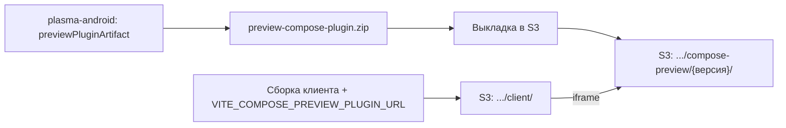

## Контекст

Прототип Compose-preview состоит из двух частей в разных репозиториях.

- **design-system-builder** (локальная перебазированная ветка `feature/compose-preview`, не опубликована): хост плагина в клиенте (`js/apps/client/src/composePreview`: `ComposePreviewFrame`, сессия обмена сообщениями, проверка manifest), сборка данных из состояния редактора (`draft.ts`, `assembler.ts`), интеграция в `ComponentEditorPreview`, локальная раздача архива плагина скриптом на порту 8081, тесты и браузерная проверка.
- **plasma-android** (локальная перебазированная ветка `feature/preview-compose`, не опубликована): `preview-contract`, `preview-sdk-compose`, `preview-compose-plugin`, четыре коммита.

Клиент в окружениях DEV и PROM раздаётся как статический сайт в S3 (`.github/workflows/deploy-front-apps-*.yml`, `s3cmd sync --delete-removed --no-mime-magic`). Сервера, который отдавал бы клиент, нет, поэтому раздавать плагин «рядом» средствами сервера нельзя. Переменные клиента (`VITE_*`) вшиваются при сборке.

Прототип не доставляет плагин до пользователей: адрес по умолчанию `http://localhost:8081/`, а архив собирается вручную в другом репозитории.

## Цели / Не цели

**Цели:**
- Прототип живёт в рабочих ветках, собирается и проходит свои проверки на актуальных основах.
- Клиент и плагин проверены друг на друге.
- Плагин доставляется на сайт независимо от сборки клиента и версионируется.
- Compose-preview включается явно и всегда имеет возврат к React-preview.

**Не цели:**
- Расширение контракта payload, универсальный реестр компонентов, новые компоненты (отдельные изменения плана).
- Автоматизация публикации плагина из CI `plasma-android` (см. открытые вопросы).
- Поддержка чужих и пользовательских плагинов, подпись артефактов, Preview Artifact Service.
- Preview выпущенных версий дизайн-системы и любые изменения серверной части.

## Решения

### Переносится итоговое состояние путей, а не история

Коммиты прототипа нельзя воспроизвести как есть: первый содержит дубли `.agents/skills/openspec-*` (в основе уже есть свои команды `opsx`) и скрипт `import-uikit-api-meta.mjs`, который следующий коммит удаляет. Поэтому из локальной ветки `feature/compose-preview` берётся итоговое содержимое перечисленных в задачах путей, а коммиты создаются заново с осмысленными сообщениями.

В `plasma-android` четыре коммита прототипа переносятся последовательно (cherry-pick с локальной перебазированной ветки): они уже лежат поверх актуального `develop`, не смешаны с посторонними файлами и содержат собственные артефакты OpenSpec.

Кроме того, активное изменение прототипа `connect-component-editor-to-compose-preview-payload` переносится вместе с остальными артефактами. Его выполненные задачи подтверждаются прогоном проверок этого изменения, после чего оно архивируется по общему процессу.

### Одна конфигурация тестов клиента

В основе уже есть `js/apps/client/vitest.config.ts` (окружение `jsdom`, `setupFiles`, `css`). Прототип добавил блок `test` в `vite.config.ts`. Когда существует `vitest.config.ts`, `vitest` читает его и игнорирует `test` из `vite.config.ts`, поэтому настройки прототипа (`include`, `restoreMocks`) не применялись бы. Они переносятся в `vitest.config.ts`, а блок `test` из `vite.config.ts` удаляется. Тип `vitest/globals` в `tsconfig.app.json` сохраняется только если тесты прототипа используют глобальные функции.

### Раздача плагина вне сборки клиента

Схема показывает, что клиент и плагин попадают в хранилище разными путями. Каталог клиента синхронизируется с удалением отсутствующих файлов, поэтому плагин лежит в соседнем каталоге `compose-preview`, а не внутри каталога клиента. Адрес версии плагина задаётся переменной репозитория GitHub отдельно для DEV и PROM и передаётся шагу сборки клиента.

Версия в пути (`.../compose-preview/{версия}/`) делает файлы неизменяемыми и разрешает долгое кеширование. Откат плагина — это смена значения переменной и пересборка клиента. Альтернатива «класть плагин в `public` клиента» отклонена: она связывает релиз клиента с релизом `plasma-android` и конфликтует с `--delete-removed`. Альтернатива «хранить архив в Git» отклонена: бинарный файл на 4 МБ уже был убран из прототипа.

Хранилище загружается через `s3cmd --no-mime-magic`: типы содержимого определяются по расширению. Корректный `application/wasm` для `.wasm` не гарантирован, поэтому он проверяется отдельно в каждом окружении до включения для пользователей (внешняя проверка).

### Включение и возврат к React-preview

Отдельного флага не вводится: отсутствие `VITE_COMPOSE_PREVIEW_PLUGIN_URL` означает выключенное Compose-preview. Это уже работает в прототипе (`getComposePreviewPluginUrl()` возвращает `undefined`). Выключение в окружении — это пересборка клиента без переменной.

Возврат при сбое строится на двух уровнях: проверка manifest и окружения до запуска плагина (недоступность, несовместимая версия, нет поддержки Wasm) и обработка ошибок сессии во время работы (нет сообщения готовности, ответ с ошибкой). В обоих случаях React-preview остаётся доступным, а последний успешный кадр Compose-preview сохраняется.

### Безопасность

Хост создаёт `iframe` с атрибутом `sandbox="allow-scripts allow-same-origin"`, а сессия проверяет `event.source` и `event.origin` ответа. Если плагин находится на том же источнике (origin), что и клиент, такая песочница не изолирует: код плагина получает доступ к хранилищу и cookie страницы клиента. Источник определяется именем хоста, а не путём. Этим изменением плагин размещается в том же бакете, что и клиент (соседний каталог), поэтому при одном имени хоста перед бакетом клиент и плагин окажутся на одном источнике. Какое имя хоста стоит перед бакетом в DEV и PROM, из репозитория не видно. Это выбор размещения, а не наблюдаемый факт.

Для первого выпуска это принимается: выполняется только плагин, собранный командой SDDS из `plasma-android`, и спецификация запрещает загрузку других источников. Для пользовательских плагинов потребуется отдельный источник и собственная модель безопасности по ADR-0006; это вне изменения. Допущение фиксируется здесь, чтобы не потерялось.

## Риски / Компромиссы

- **Совместимость после перебазирования не проверена.** Тесты и браузерная проверка клиента и сборка плагина на новых основах ещё не запускались. Первая часть работы — получить достоверный результат; он может выявить поломки, которых мы пока не видим.
- **Требования к браузеру.** Плагину нужна поддержка WasmGC. Состав поддерживаемых версий браузеров не проверялся, поэтому нужна матрица проверки и сообщение пользователю при отсутствии поддержки.
- **Размер и время загрузки.** Размер Wasm-бандла и время холодного старта не измерялись. Измерение входит в задачи, но порогов не задаёт; решение о допустимости принимается по результатам.
- **Тип содержимого и CORS в S3.** Неверный тип `.wasm` ломает потоковую компиляцию; недоступность ресурсов (шрифты по внешним адресам) ломает тему. Обе проблемы видны только в реальном окружении.
- **Ручная выкладка плагина.** Без автоматизации версия, указанная в переменной клиента, может разойтись с загруженной в S3. Смягчается неизменяемым версионированным путём и проверкой адреса перед включением.
- **Один источник для клиента и плагина** (см. «Безопасность»).

## План проверки и развёртывания

Локальные проверки: модульные тесты клиента, сборка клиента (`npm run build`), линтер, браузерная проверка `playwright` с настоящим плагином, `./gradlew -p integration-core :preview-compose-plugin:previewPluginArtifact` и тесты модулей `preview-*` в `plasma-android`.

Внешние проверки до архивирования: запуск связки клиента и плагина, собранных с актуальных веток; раздача плагина из хранилища DEV (тип `.wasm`, загрузка в `iframe`, шрифты); поведение в браузерах из согласованной матрицы; измерение размера бандла и времени первого рендера.

Наблюдения после развёртывания: доля сессий, где Compose-preview вернулось к React-preview из-за ошибки, и ошибки загрузки плагина в консоли у реальных пользователей. Они вносятся в эксплуатационный список выпуска и не блокируют архивирование.

## Принятые решения по ранее открытым вопросам

- **Выкладка плагина** выполняется вручную: разработчик с доступом к S3 запускает задокументированную команду `s3cmd`. Автоматизация через workflow — отдельное изменение. Ручная выкладка допустима для первого выпуска, потому что адрес версии неизменяем и фиксируется в переменной клиента, а проверка адреса входит в задачи.
- **Размещение плагина:** в том же бакете и под тем же именем хоста, что клиент (вариант А). Клиент и плагин оказываются на одном источнике, поэтому код плагина способен читать `localStorage` клиента, где лежат access- и refresh-токены (`api/tokenStore.ts`). Решение принимается для первого выпуска при условиях: плагин собирает только команда SDDS из `plasma-android`, загрузка других плагинов запрещена спецификацией `compose-preview-plugin-delivery`, право записи в каталог плагина в S3 имеет ограниченный круг лиц. Отдельное имя хоста для плагина (вариант Б) обязательно до поддержки пользовательских или сторонних плагинов.
- **Браузеры:** Compose-preview должно работать в Chrome, Edge и Firefox. Safari проверяется, результат фиксируется; если не работает, пользователь получает сообщение и React-preview. Порог размера бандла не задаётся: размер измеряется, решение о допустимости принимается по результату.

## Открытые вопросы

- **Внешнее требование «плагин собрать под `js`, а не под `wasmJs`».** Пришло после подготовки артефактов, не принято и не отклонено; в этом изменении плагин собирается под `wasmJs`. Что выяснено: Compose UI в браузере опирается на WebAssembly при любой цели, JS-цель в документации JetBrains описана как запасной вариант для браузеров без WasmGC, а «без WebAssembly вообще» для `uikit-compose` недостижимо (источники: блог JetBrains «Present and Future of Kotlin for Web», `whats-new-compose-190`, FAQ Compose Multiplatform). Нужно выяснить у автора требования, допустим ли обычный WebAssembly (`skiko.wasm`) без WasmGC. Если да, потребуется перенос `wasmJsMain` в `jsMain` в `preview-sdk-compose` и `preview-compose-plugin`, замена задач сборки и упаковки и пересмотр требований к браузеру в спецификациях. Остальной стек (`uikit-compose`, `sandbox-compose`, `uikit-compose-fixtures`, `haze`) уже имеет `jsMain`. Клиент от выбора цели не зависит.
