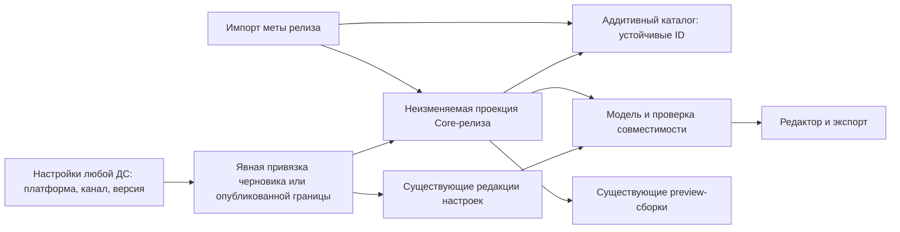

## Контекст

Исследование базы `d508f04e` выявило разную временную семантику:

- `ExposedDesignSystemVersionRepository.publish` фиксирует предметные редакции через существующую границу versionId и создаёт следующий черновик. Core и preview к ней не привязаны.
- `ComponentsTable`, `PropertiesTable`, `ComponentStatesTable`, `PropertyPlatformParamsTable` являются общими. API-импорт аддитивен, но обновляет deprecated у платформенных имён.
- `ExposedComponentEditorBundleRepository`, `AppearanceEditorModelReader`, `ComponentConfigBuilder`, `ComponentConfigImporter` и `PlatformParamOffsets` смешивают версионированные настройки и общий API. Прямая фильтрация новых свойств скрыла бы несовместимые сохранённые значения.
- `EditorPropertyValue` уже хранит id, propertyId, kind, styleIds, stateSetId/states, литерал/tokenId, alpha, adjustment, ссылку вложенного стиля и revision. Оси и значения осей позволяют восстановить расположение проблемы. Отдельного хранилища старых значений не требуется.
- Preview-реестр уже хранит platform/libraryVersion/metaSha256/buildId/commit. Активная сборка сейчас выбирается независимо от версии ДС; web-кеш также привязан к проекту, а не к Core.

## Цели и границы

Один Change вводит релизные описания Core, закрепление preview, выбор канала stable/dev и конкретной версии Core по платформам любой ДС, проверку совместимости, серверные ограничения публикации/экспорта и UI «Проблемы». Документация, code binding и автоматическая отправка результатов генерации относятся к зависимому `separate-core-documentation-sources`.

Не создаются новая система предметных версий, второй реестр preview или особый тип «тестовая ДС». Регистрация Core и выбор его конкретной версией ДС разделены; глобальное переключение всех черновиков не вводится. Не требуется полный справочник платформенных методов: сохраняются используемые моделью сущности и исходная мета для происхождения. Не гарантируется побайтовая воспроизводимость бинарного кода при разных версиях внешних генераторов.

Версионирование каталога и файлов иконок, закрепление его `load_id` и диагностика удалённых иконок не входят в Change. Закрепление Core и preview не обещает неизменность внешнего каталога иконок. Восстановление неизвестного исторического Core по внешним артефактам также не входит в Change.

Объём сохраняется одним Change. Реализация и проверка идут последовательно: хранение/импорт → выбор Core и чтение → совместимость/исправления → preview. Развёртывание выполняется после проверки всей цепочки; временный режим, в котором релизы уже записываются, а ДС продолжают читать общий каталог, не вводится.

## Решения

### Устойчивый каталог и неизменяемое описание релиза

Общие таблицы сохраняют ID и аддитивное накопление. Их поля больше не являются авторитетным API для чтения ДС. `CoreReleaseRef = {libraryId, platform, version}`, уникальный внутри каталога релизов. `channel = stable | dev` — обязательный неизменяемый атрибут нового релиза, передаваемый рядом с `coreRelease` только в запросе загрузки. Канал не выводится из строки версии или окружения сервера и не расширяет ключ уникальности: те же координаты нельзя зарегистрировать заново в другом канале. Выпуск проверенного dev-состава в stable создаёт отдельный стабильный релиз с его версией; ДС с pinned не переключаются; latest соответствующего канала обновляется. Библиотека определяется серверным соответствием платформе; существующее различие `web/react`, `xml/android-view`, `ios/swiftui/uikit` преобразуется явно на границе, а не меняется массово в БД.

Идентичность существующего компонента остаётся `(name, platform)`, свойства — `(componentId, name)`. Удаление из нового Core не удаляет общую запись. Переименование API библиотеки не угадывается и рассматривается как удаление прежней сущности и появление новой. После включения записи в Core административные операции не могут менять её ключевые поля идентичности (`name`, платформу, принадлежность свойства компоненту); редактируемые описания не являются импортными ключами. При появлении библиотек с разным смыслом одной пары name/platform нужна отдельная миграция пространства имён; текущий Change не объединяет такие конфликты молча.

Предварительная схема:

| Таблица | Содержание |
|---|---|
| `core_releases` | ID, libraryId/platform/version, channel, исходный объект меты, SHA-256, время импорта, происхождение |
| `core_release_components` | releaseId/componentId и релизные имя/описание |
| `core_release_properties` | releaseId/propertyId/componentId, тип/default/описание, используемые ограничения |
| `core_release_platform_params` | releaseId/platformParamId/propertyId, имя, deprecated/message |
| `core_release_states` | releaseId/stateId/componentId и описание состояний, объявленных компонентом |
| `core_release_component_dependencies` | Определённая Core вложенность и ограничения вложенных свойств из нормализованной меты |
| `design_system_version_core_releases` | versionId/platform → releaseId и канал; у черновика явный выбор, у публикации неизменяемая привязка |
| Ревизия выбора Core черновика | coreSelectionRevision, отдельная от предметного draftRevision; согласование настроек, записи и публикации |
| `core_release_preview_builds` | Ссылки на существующие buildId и проверенный релиз, без копии сборок |
| `design_system_version_preview_builds` | versionId/platform → выбранный buildId либо ожидающий слот релиза |

Наборы состояний и ссылки значений сохраняют прежние ID. Общие состояния взаимодействия (`hovered`, `pressed`, `focused` и другие записи с `componentId=null`) остаются предустановленным системным набором, не частью меты или состава Core-релиза. Их отсутствие в мете не означает удаления; проверка разрешает их по системному набору. Состояния, объявленные конкретным компонентом, проверяются по релизной проекции с сохранением прежних ID.

Поля API компонентов, влияющие на модель/экспорт, читаются через релизную проекцию; новые ручные правки общего каталога не меняют старые проекции. Данные, принадлежащие ДС (оси, значения, поправки, переиспользование), остаются в существующих предметных редакциях. Поправки по platformParamId проверяются на принадлежность релизу, а не теряются из-за фильтрации.

Вложенность компонентов определяется Core и не изменяется настройками ДС. Нормализованный контракт сохраняет доступное в исходной мете описание вложенности, целевых компонентов/типов и ограничений вложенных свойств; отсутствие сведений не дополняется предположениями из пользовательских назначений. Для миграционного технического снимка допускаются существующие доказуемые сведения каталога с явным происхождением. Полный граф внутренних компонентов, не представленный метой, не восстанавливается и не является целью Change.

Выбор оформления и стилей для предусмотренного Core вложенного свойства принадлежит ДС и читается из её предметных редакций. Технические `REUSE`-связи, создаваемые при таком выборе, не расширяют состав Core и не являются доказательством разрешённой вложенности. Существующий смешанный `component_deps` нельзя целиком копировать в релиз или использовать вместо выбранной предметной границы. Для чтения и web-адаптера отдельно разрешаются вложенность Core (включая известный порядок `COMPOSE`) и назначения оформлений ДС. Проверяются только ограничения, доказуемо заданные Core.

JSON-описания допустимы для редких платформенных подробностей, но принадлежность сущностей и поля фильтрации должны быть доступны SQL. Альтернатива — хранить только исходную мету: это потребовало бы разбирать её при каждом чтении и не решило бы существующие SQL-связи. Копирование всего каталога для каждой ДС не нужно.


```mermaid
flowchart LR
    I["Импорт меты релиза"] --> C["Аддитивный каталог: устойчивые ID"]
    I --> R["Неизменяемая проекция Core-релиза"]
    R --> C
    D["Настройки любой ДС: платформа, канал, версия"] --> V["Явная привязка черновика или опубликованной границы"]
    V --> R
    V --> S["Существующие редакции настроек"]
    R --> M["Модель и проверка совместимости"]
    S --> M
    R --> P["Существующие preview-сборки"]
    M --> E["Редактор и экспорт"]
```

### Импорт без переключения ДС с pinned

Исходный мета-файл сохраняет прежний платформенный формат: массив компонентов у Compose/React/SwiftUI, объект с `components` у Android View. Координаты `coreRelease: {libraryId, platform, version}` передаются в запросе импорта; manifest preview содержит только координаты без канала; `channel: stable | dev` передаётся отдельно в запросе загрузки; CLI получает координаты из явных параметров либо метаданных артефакта, а канал — только из обязательного --channel, без угадывания версии. В административный DTO входят координаты, нормализованные данные и исходная мета с проверяемой суммой. `metaSha256` вычисляется по точным байтам исходного файла, без повторной сериализации, нормализации или включения координат. В web-архив включается тот же файл `api-meta.json`: его байты должны совпадать с переданным исходником импорта. Оболочка JSON вокруг массива не вводится; читатели React-меты в preview и js/cli сохраняют существующий формат. Импорт обновляет каталог и сохраняет полное описание состава нового релиза одной транзакцией. Пустой массив или исчезнувшие компоненты/свойства — допустимый состав, а не команда физического удаления общих ID. Некорректная схема, неизвестный нормализованный тип и противоречащие дубликаты отклоняют весь релиз до изменения каталога. Прежнее частичное принятие с `rejected` не применяется к релизному импорту: диагностика разрешена, регистрация неполной проекции — нет. Исправленный повтор после отказа допускается под теми же координатами, поскольку отклонённый релиз не зарегистрирован. Известное намеренное преобразование исходного формата определяется контрактом нормализации и не считается ошибкой само по себе; смена известного типа между релизами сохраняется в проекции, не переписывая тип общей записи.

Неизменность проверяется по исходной мете и полному нормализованному составу, включая вложенность; совпадения только SHA-256 исходного файла недостаточно. Повтор тех же координат и содержимого идемпотентен; другое содержимое — `409 CORE_RELEASE_IMMUTABLE`. Канал из запроса загрузки также проверяется на неизменность. Пробный импорт не изменяет данные. Успешный новый импорт добавляет релиз в список выбранного канала/платформы, обновляя только привязки черновиков с явно выбранным latest для этой платформы/канала. Повтор старого релиза также не меняет выбор ДС. Глобальный current/latest больше не является источником Core черновика. Атомарная регистрация меты не ждёт Markdown или preview.

### Настройки Core любой ДС

Для каждой платформы в настройках обычной ДС доступны два поля: `channel` (`stable` или `dev`) и конкретная версия из каталога этой платформы/канала. Специальных типов, флагов или ролей «тестовая ДС» нет. Выбор Compose не меняет web/xml/ios. Версия выбирается конкретно (pinned) или режимом latest. В обоих случаях хранится фактический releaseId; latest дополнительно следует последнему зарегистрированному релизу выбранного канала. Канал в форме фильтрует список; смена только канала без выбора версии не сохраняется.

В форме новой ДС канал по умолчанию stable, но конкретная версия либо latest выбирается и сохраняется явно. До выбора платформа остаётся без Core с явным состоянием в UI; ни stable, ни dev релиз не подставляется автоматически. Работа, требующая Core такой платформы, получает `CORE_SELECTION_REQUIRED`, а остальные платформы продолжают работать. Публикация/экспорт требуют выбора для платформ активных компонентов, не для всех существующих в системе платформ. Новый импорт сам не заполняет ранее пустую настройку.

Сохранение выбора проверяет существующие права изменения настроек ДС, принадлежность черновика, ожидаемые draftId/coreSelectionRevision и соответствие releaseId библиотеке, платформе и каналу. Неверная пара отклоняется атомарно; проверка совпадения — серверная. Повтор уже сохранённой пары не меняет ревизию. Для действительной смены сервер увеличивает coreSelectionRevision, сохраняет пару и возвращает новый контекст и сводку blockingCount/warningCount без сохранённых значений. Подробный отчёт читается через compatibility с отдельными правами компонентов. Даже конфликтная конфигурация допускает выбор нового Core: значения сохраняются для исправления, а новый экспорт и публикация блокируются до исправления. Вернуться к доступной прежней версии можно тем же явным действием; автоматического отката нет.

Импорт Core — техническое пополнение каталога. Ни импорт, ни явная смена выбранного Core сами не создают версию ДС, следующий черновик, предметную запись журнала или публикацию пакета; draftRevision не меняется. Отдельная ревизия выбора нужна для согласования запросов, а не для обхода пустого журнала: одна смена Core не позволяет выпустить ДС без предметных изменений. Опубликованная граница доступна только для чтения, и следующий черновик наследует конкретный набор Core и выбранную политику pinned/latest; история всегда читает закреплённые releaseId.

Регистрация preview берёт эксклюзивный барьер конкретного Core-релиза. Публикация ДС после барьера ДС берёт разделяемые барьеры выбранных Core по releaseId до создания SERIALIZABLE-снимка. Это исключает пропуск первого preview при параллельном создании исторического слота; другие Core и чистый импорт меты не блокируются.

Ключ актуальности отчёта/кеша включает `(draftId, draftRevision, coreSelectionRevision, coreReleaseIds, validatorVersion)`. Каталог добавления и шаблоны читаются в проверенном DS/version-контексте выбранного Core, включая новый компонент, ещё нигде не привязанный. Для компонента без предустановленного web-шаблона создаются пустое оформление и Core-зависимости; preview не является условием добавления. После сохранения выбора обновляются каталог доступных компонентов, модель, отчёт и preview данной ДС. Новый компонент dev-релиза не виден как доступный для добавления у ДС на stable; общий реестр ID не должен обходить релизную проекцию. Импорт не меняет кеш модели существующих ДС, но обновляет список доступных версий в настройках. Поздняя preview-сборка отдельно обновляет доступность preview того же выбранного Core.

### Единая проверка и правила блокировки

Сервер сравнивает сохранённые назначения ДС с API выбранного Core. Он читает настройки до фильтрации по релизу. Область блокирующей проверки определяется активными связями компонентов выбранной границы ДС: собственные настройки скрытых компонентов сохраняются, но не входят в экспорт и не блокируют публикацию/экспорт. Ссылки из активных компонентов на скрытые проверяются и при недоступной цели блокируют операцию; скрытие цели не устраняет проблему у активного источника. Восстановление связи сохраняет прежние настройки и снова включает их в проверку; само восстановление разрешено и не публикует ДС. Counts и пагинация отчёта относятся к одной и той же области проверки. Проверяются: существование используемого компонента/свойства/состояния/платформенного параметра, совместимость типов литерала или токена, доступность зависимого компонента и ссылок вложенных стилей в выбранной модели. Проверка не требует существования preview-бинарника.

| Ситуация | Результат |
|---|---|
| Добавлена неиспользуемая сущность | Нет конфликта |
| Используемая сущность deprecated | Предупреждение, публикация разрешена |
| Удалена неиспользуемая сущность | Нет конфликта, Core-релиз разрешён |
| Удалена сущность с сохранёнными настройками | Блокирующая проблема затронутой ДС; настройки сохранены |
| Тип изменён, сохранённое значение совместимо | Нет блокировки только из-за различия номеров/типов |
| Значение/токен не подходит новому типу | Блокирующая проблема |
| Сборка preview ещё не поступила | Превью недоступно, конфигурационная публикация не блокируется |

Публикация повторяет проверку выбранного набора Core, draftRevision и coreSelectionRevision в одной операции с фиксацией границы. Смена выбора, запись/исправление и публикация сериализуются на уровне активного черновика и его привязок Core; используются единый порядок блокировок и короткие транзакции. Устаревшая coreSelectionRevision даёт `409 CORE_SELECTION_STALE` без записи; публикация не переключает Core незаметно для клиента. Параллельный импорт другого релиза не меняет этот набор. Нельзя проверить A, а закрепить B. Предварительный отчёт клиента не является разрешением на публикацию. Конфликты дают `409 CORE_COMPATIBILITY_CONFLICT`, без публикации или нового черновика. Остальные существующие проверки версии/прав/пустого журнала сохраняются.

Порядок блокировок для смены выбора, предметной записи, исправления и публикации един: существующая блокировка редактирования/публикации данной ДС → строка активного черновика → его привязки Core в порядке platform → изменяемые предметные строки в устойчивом порядке ID. Проверка ожидаемых ревизий выполняется после захвата соответствующих блокировок. Импорт меты не захватывает блокировки ДС и не блокирует редактирование из-за общего указателя Core. Полная проверка публикации остаётся в согласованной транзакции; перенос проверки наружу без повторной проверки состояния не допускается. На большой ДС измеряются время проверки и ожидание параллельного сохранения, прежде чем выбирать оптимизации.

Получение нового экспорта для генерации возвращает тот же отказ при блокирующих конфликтах Core выбранной версии или черновика. Эта проверка выполняется при fetch/export и не распространяется на последующее использование ранее сохранённого снимка.

Локальная генерация использует выбранный сохранённый снимок ДС и его метаданные происхождения Core без обязательного обращения к серверу. Она не требует актуального серверного контекста, совпадения отпечатка с текущим черновиком или совпадения Core снимка с локальной версией библиотеки. Импорт нового Core, изменение или появление конфликтов серверного черновика и недоступность сервера не запрещают генерацию из сохранённого снимка и не вызывают автоматического обновления данных.

Например, данные ДС закреплены за опубликованным Core A, а в том же репозитории разрабатывается ещё не выпущенный Core B: CLI генерирует код из снимка A. Совместимость результата с локальными исходниками и зависимостями B проверяется локальной сборкой и тестами; одно различие версий не доказывает несовместимость. Сервер проверяет конфигурацию относительно Core выбранной границы, но не гарантирует совместимость с произвольными локальными исходниками. Если запрошено получение нового экспорта и оно отклонено, операция завершается явной ошибкой без незаметной подстановки старого снимка; отдельная генерация из явно выбранного сохранённого снимка остаётся доступной.

### DTO проблем и расположение сохранённых значений

Единый отчёт: `reportId`, `designSystemId`, `draftId`/`versionId`, `draftRevision?`, `coreSelectionRevision?`, `coreReleases` (с каналами), `validatorVersion`, `blockingCount`, `warningCount`, `items`, `nextCursor` для списка. Counts относятся ко всему отчёту, не к одной странице. Контекст системных чтений/export/preview включает coreSelectionRevision черновика и канал каждого релиза; клиент использует его при последующих согласованных записях. Отчёт без Core имеет явную диагностическую причину, а не выдуманный последний релиз.

Элемент: устойчивый `issueId`, `code`, `severity`, `message`, `componentId/name`, `appearanceId/name?`, `propertyId/name?`, старое описание из предыдущего известного Core при наличии, `targetCoreRelease`, `valueKind`, `valueId`, `styleIds`, подписи осей/значений, `stateSetId/states`, `storedValue`, `entityRevision`, допустимые действия. Для удалённого компонента проблема может относиться к связи ДС с компонентом целиком и содержать дочерние затронутые значения; идентификаторы не выдумываются.

`storedValue` повторяет реальные данные: literal/tokenId/tokenName, alpha, adjustment и вложенную ссылку. Отдельно DTO содержит дочерние платформенные поправки: их ID/revision, platformParamId, смещение и template; скаляр adjustment их не заменяет. Это сохранённая настройка в текущем черновике, не обещание восстановить вычисленное значение токена до обновления Core. Если старое описание неизвестно, показываются сохранённые ID/имена с соответствующим признаком.

Проблемы одного назначения с разными причинами можно группировать визуально; location остаётся точным для invariant/variation/combination и состояния. Отчёт всей ДС не требует загружать все editor-bundle в браузер. Фильтр componentId возвращает те же issueId в секции компонента.

Серверного кеша отчёта в первой реализации нет: каждый запрос, в том числе следующая страница, вычисляет отчёт заново. Порядок проблем детерминирован, курсор включает отпечаток границы, предметной и Core-ревизий, версию проверки и фильтры. Поэтому следующий запрос может обслужить другой экземпляр сервера без общего хранилища кеша. Устаревший курсор возвращает `409 CORE_CONTEXT_STALE`. Упоминания инвалидации кеша относятся к клиенту; серверный кеш или иная оптимизация вводятся только при подтверждённой измерениями необходимости.

### Обычная запись и исправления

Обычное создание/изменение значения проверяет тип, токен, компонентные состояния, платформенные параметры и известные ограничения вложенных ссылок по текущему Core черновика. `PropertiesTable.type` общего каталога не является правилом валидации. Общие состояния остаются системными. Разрешение Core и запись согласуются со сменой выбора в настройках ДС: клиент передаёт coreSelectionRevision прочитанного контекста, устаревшая запись отклоняется до изменения данных и требует обновления модели; сервер проверяет назначение относительно выбранного Core. Параллельный импорт не переключает контекст записи. Проверяется записываемое назначение, а не отсутствие всех остальных конфликтов ДС, чтобы исправления оставались доступны. Удаление старого назначения допускается и после исчезновения его свойства из Core.

### Исправления и UI

В разделе публикации показываются блокирующие проблемы и предупреждения: компонент, оформление, вариации/сочетания и состояния, причина и значение. Переход открывает компонент, оформление и секцию «Проблемы». Эта секция находится рядом со «Стилизацией» и «Структурой», поддерживает фильтрацию и переход к месту настройки. Удалённый из Core, но настроенный компонент остаётся в списке ДС как недоступный с доступом к проблемам; отказ export не должен делать editor-bundle целиком недоступным. Нормальная модель и диагностическая модель разделяются в ответе.

Удаление проблемы адресуется сохранённому valueKind/valueId и существующим предметным ID; не требует наличия свойства или состояния в новом Core. Используются прежние права, согласование правок, revision, журнал, откат и сигналы. Удаляется назначение с принадлежащими ему ссылками/поправками, не общий каталог и не опубликованные данные.

Перенос: сервер принимает источник и целевой propertyId, проверяет совместимость типа, токена, состояний, области и ссылок вложенного компонента, а также отсутствие назначения в целевой ячейке. Создание новой записи и удаление старой выполняются атомарно с проверкой entityRevision, coreSelectionRevision и выбранного Core. При конфликте назначения — отказ без перезаписи; автоматического выбора похожего имени нет. В первой реализации перенос назначения с отдельными `*_platform_param_adjustments` запрещён: без сопоставления параметров нельзя гарантировать сохранение смещений и шаблонов. Сервер проверяет их наличие в той же операции и отказывает без изменения источника/цели; автоматического удаления или копирования старых platformParamId нет. Такие назначения исправляются вручную, удаление остаётся доступным с обычным журналом и откатом. Если перенос невозможен, UI объясняет причину и предлагает удалить или подготовить замену вручную. После исправления отчёт обновляется, а запоздалый старый отчёт не возвращает уже устранённую проблему.

### Preview в рамках того же Change

Реестр `compose_preview_plugin_builds` сохраняется. Его libraryVersion/metaSha256 связываются с Core-релизом после проверки platform, библиотеки, канала и точного файла меты. Если новый preview поступает вместе с метой, существующая публикация использует общий релизный импорт; отдельный глобальный импорт без координат не выполняется.

Черновик выбирает последнюю успешно зарегистрированную совместимую сборку своего Core, а не глобально активную сборку другой версии. При публикации фиксируется точный buildId каждой доступной платформы вместе с releaseId. Если сборки ещё нет, фиксируется ожидающий слот этого релиза; первая поздняя совместимая сборка заполняет его однократно атомарно. Следующие сборки того же Core не заменяют закреплённую у опубликованной ДС. Бинарные артефакты и мета, на которые есть ссылки версий, защищены от существующей очистки старых сборок.

Системный маршрут выдаёт pluginUrl/buildId/coreRelease/metaSha256 для выбранной версии ДС; без обязательного coreReleaseId во входе. Кеш клиента включает проект/ДС/границу/Core/buildId; смена контекста сбрасывает iframe и игнорирует запоздалые ответы. Manifest/protocol/платформа/поддержка компонента проверяются как раньше. Прямой VITE_*_PREVIEW_PLUGIN_URL сохраняется только как явный режим разработки с пометкой неподтверждённого соответствия; это не воспроизводимое превью опубликованной версии. При отсутствии сборки недоступно только превью, редактор и проблемы продолжают работать. Получение списка Compose-компонентов, editor-bundle, диагностики и исправлений не зависит от наличия pluginUrl; `404`, ошибка разрешения или несовместимая сборка не скрывают доступные компоненты. Контракт выбора синхронизирован с активным `host-compose-preview-plugin`: глобальный адрес и кеш только по проекту заменяются выбором по ДС/границе/Core/buildId.

## Границы API и архитектуры

Предлагаемые операции уточняются в source-of-truth OpenAPI при реализации:

| Операция | Контракт |
|---|---|
| Существующий административный импорт меты | Координаты, channel, нормализованный состав, исходная мета/сумма, dryRun; отчёт с releaseId |
| Каталог версий Core для настроек | GET по проектному контексту с фильтрами platform/channel, постраничный список конкретных releaseId/version/channel; права чтения ДС |
| Настройки Core ДС | GET по DS/version; PUT платформы черновика с channel/releaseId/expectedDraftId/expectedCoreSelectionRevision; возврат сохранённого выбора и отчёта |
| Существующие системные чтения и export | Прежние DS/version селекторы; сервер разрешает Core; в метаданных ответа добавляются coreReleases |
| `GET /api/projects/{projectId}/design-systems/{designSystemId}/compatibility` | Прежний выбор черновика/версии, componentId/severity/cursor; единый отчёт |
| Системное чтение preview выбранной платформы | DS/version → pluginUrl/buildId/coreRelease/channel либо явное отсутствие |
| Удаление проблемного назначения | valueKind/valueId, expectedRevision и существующий контракт согласования правок |
| Перенос проблемного назначения | Источник, targetPropertyId, expectedRevision/Core-контекст; атомарный результат |

Системные данные проверяют принадлежность проекту и версии; глобальный catalog остаётся отдельным административным/справочным входом. Его ответы нельзя использовать как историческую модель ДС. Нет обязательного coreReleaseId в обычных клиентских запросах. Между несколькими запросами можно передать необязательный отпечаток разрешённого контекста, чтобы сервер выявил смену Core и потребовал повторное чтение, а не смешивал данные.

При переданном устаревшем отпечатке чтение возвращает `409 CORE_CONTEXT_STALE`; устаревшая ревизия в команде изменения выбора/настроек или публикации возвращает `409 CORE_SELECTION_STALE`. Независимые чтения без отпечатка используют фактический разрешённый контекст, а не требуют обязательного предварительного запроса.

Таблица привязок Core хранит versionId без дублирования design_system_id. Принадлежность проверяется через design_system_versions и выбранную границу существующего ModelReadContext до чтения Core. Чужая версия даёт 404; прямое разрешение по непроверенному versionId не допускается.

### Совместимость с публичным чтением

`add-public-design-system-reading` (PR #168) интегрируется после этого Change и использует общий CoreContextResolver. Для одной разрешённой опубликованной границы гость и участник получают одинаковые релизные описания компонентов, модель, экспорт и выбор preview; различается проверка доступа. Публичный доступ не вводится этим Change.

`X-DS-Read-Context` определяет разрешённую ДС/версию и режим доступа; coreReleases описывает Core той же границы, вычисленный сервером в той же операции. Это не два независимых выбора. Публичный контекст не раскрывает ревизии черновика. Если соседний Change сохраняет `/catalog/...?...designSystemId=...` как адресный вход, он обязан направлять его в то же разрешение границы и релизную проекцию, а не только фильтровать изменяемый общий каталог по ID. Несвязанные определения остаются недоступными. Порядок интеграции и совместный сценарий A/B должны быть сохранены при переносе публичного чтения на новую базу.

Применяются существующие права чтения компонентов/версий и записи значений; новые права не обходят их. Выбор Core требует существующего права изменения настроек ДС; доступ к dev имеет та же политика, что stable, без специального статуса ДС. Каталог версий доступен для выбора с правами чтения ДС, тогда как импорт сохраняет отдельные административные права. `400` — синтаксис/неверный селектор, `403` — права, `404` — неизвестный/чужой объект, `409` — устаревшая ревизия/несовместимость/занятое назначение, `422` — неверная мета. Ответы не раскрывают данные чужих проектов.

В Kotlin presentation разбирает DTO, application разрешает контекст/проверяет/оркестрирует, domain определяет идентичность/совместимость, data реализует SQL/HTTP/хранилище, di связывает реализации. Общий Core-контекст размещается в ds-service/core с портами, не импортируя feature-components в feature-design-systems. Frontend core-* содержит только общий контекст/порты; feature-* не зависят друг от друга; CLI и MCP остаются оболочками общих use case.

## Программное проектирование

```kotlin
// domain
 data class CoreReleaseRef(val libraryId: String, val platform: String, val version: String)
 enum class CoreChannel { STABLE, DEV }
 data class CoreSelection(val platform: String, val channel: CoreChannel, val releaseId: String)
 data class CompatibilityScope(val designSystemId: String, val versionId: String, val draftRevision: Long?, val coreSelectionRevision: Long?)
// application
 interface CoreContextResolver {
     suspend fun resolve(scope: CompatibilityScope): ResolvedCoreContext
 }
 interface CoreSelectionService {
     suspend fun select(command: SelectPlatformCore): CoreSelectionResult
 }
 interface CompatibilityChecker {
     suspend fun check(context: ResolvedCoreContext): CompatibilityReport
 }
 interface VersionCoreBinder {
     suspend fun bindForPublication(context: ResolvedCoreContext): CoreBindingResult
 }
 interface PreviewBuildResolver {
     suspend fun resolve(context: ResolvedCoreContext, platform: String): PreviewSelection
 }
 interface ProblemRepairService {
     suspend fun remove(command: RemoveProblemValue): RepairResult
     suspend fun transfer(command: TransferProblemValue): RepairResult
 }
```

## Миграция и зависимые изменения

Добавляются Flyway-миграции, существующие ID и предметные редакции сохраняются. Для старых границ без сохранённого Core создаётся технический снимок текущего каталога на момент миграции. Он закрепляется за опубликованными и архивными версиями, включая версии с сохранённым снимком настроек: такой снимок сам по себе не доказывает исторический состав Core. Сохранённые снимки настроек не переписываются. Происхождение обозначается как «историческое происхождение не установлено», канал не угадывается. Уже существующие релизные привязки сохраняются. Миграция работает с БД, не читает S3 и не ищет внешние артефакты. Технический снимок фиксирует описание Core с момента миграции, а не восстанавливает утраченную историю. Подставлять будущий latest запрещено. Без доказуемой существующей привязки исторический preview недоступен; последующего автоматического уточнения закреплённого Core нет.

Миграции актуального dev V19 (индексы журнала), V20 (каталог иконок) и V21 (дополнение вариации view) сохраняются без изменений. Невыпущенные миграции Core получают номера V22/V23, канал — V24, выбор ДС — V25, latest — V26, редакции preview — V27; проверяется обновление фактической схемы dev V21 до V27. Дополнительная миграция выбора фиксирует для каждого существующего черновика тот Core, который он разрешал до миграции. Опубликованные привязки не меняются. Старые миграции не переписываются. Глобальный current может использоваться один раз при переносе данных, после чего чтения черновиков от него не зависят. Канал старого релиза переносится только при доказуемом происхождении; технический снимок/неизвестный канал не объявляется stable по строке версии. Такие сохранённые привязки отображаются как наследованные с неустановленным каналом и продолжают работать до явного выбора. Они не предлагаются как новые релизы stable/dev. Новые импорты всегда требуют канал, новые ручные выборы всегда требуют полную пару stable/dev + версия. Удаление Core, на который ссылается черновик или публикация, запрещено.

Далее переводятся все системные чтения/проверки, export и preview; общий каталог сохраняется для идентичности. Несопоставленные legacy-поля и вручную созданные сущности должны попасть в миграционный отчёт и технический снимок, а не исчезнуть. Все опубликованные ссылки учитываются очисткой. Первый настоящий релиз не переключает эти границы, даже если его мета меньше накопленного каталога; массовый отчёт влияния импорта на все ДС не требуется. До развёртывания миграция проверяется на изолированной копии продовых данных с сохранением доступов и без публикации данных/секретов в Git.

Особенность первого развёртывания: при возврате к серверу без поддержки Core-релизов оператор временно останавливает импорт меты, включая импорт при загрузке preview; новые таблицы/объекты не удаляются. Перед повторным запуском нового сервера проверяются целостность привязок и отсутствие изменений каталога старым импортом. При расхождении автоматическое восстановление не выполняется: сначала выясняется источник изменения. Это инструкция перехода через конкретную границу версий, а не постоянный механизм отката или новые продуктовые ограничения. Отдельные задачи разработки для него не вводятся. Новый сервер отклоняет старый формат импорта до записи независимо от версии CLI.

Производитель меты/preview в plasma-android оформляется отдельным Change; здесь фиксируются контракт, тестовые примеры и внешняя проверка. В js/cli и публикации preview передаются координаты релиза и канал отдельно от неизменённого формата массива React-меты; проверяется совпадение исходных байтов при упаковке web-архива.

Для Compose, Android View, SwiftUI и React контракт регистрации релиза общий. Правила платформенной нормализации не меняются ради версионирования: предусмотренные пропуски служебных полей и объединение имён допустимы. Конфликты, делающие релиз недопустимым, не скрываются успешным частичным импортом: CLI прекращает отправку при такой диагностике, сервер отклоняет недопустимый запрос атомарно. `--strict` не служит переключателем атомарности. `add-cli-import-api-swiftui` сохраняет свой нормализатор и использует общий релизный транспорт; его дельты применяются до этого Change, который обновляет общие требования CLI. Отсутствие координат/канала/исходной меты в старом запросе даёт 400 CORE_RELEASE_METADATA_REQUIRED с пояснением о необходимом обновлении CLI/формата запроса.

Пересекающиеся дельты `host-compose-preview-plugin` синхронизируются по загрузке, условию показа, выбору и очистке. Согласованный порядок применения спецификаций: `host-compose-preview-plugin` и `add-cli-import-api-swiftui`, затем `version-core-entities-and-preview`; публичное чтение интегрируется после него. Сохранение закреплённых сборок обязательно вне лимита старых неактивных билдов. Пробная архивация выполняется только на временной копии, рабочие Changes остаются активными до завершения реализации и внешних проверок.

`separate-core-documentation-sources` начинается после завершения этого Change и использует CoreReleaseRef, сохранённый исходник меты, DS-контекст и фиксацию публикации. Он не повторяет импорт релизов, совместимость или выбор preview.

## Риски и проверка

- Неполный перевод чтений оставит влияние общего каталога → проверять bundle, списки, модель оформления, импорт/экспорт, поправки, вложенные ссылки и MCP одним набором сценариев A/B.
- Проверка до фильтрации обязательна → тесты удалённого свойства/состояния/компонента с сохранёнными invariant/variation/combination и токенами.
- Смена Core не меняет настройки → отдельная инвалидация отчётов, кеша редактора и preview по Core-контексту. Сохранённые локальные снимки CLI сохраняют своё происхождение и пригодность для генерации; их обновление выполняется явно.
- Гонки смены выбора/публикации/исправления → единые блокировки привязок черновика и проверка draftRevision/coreSelectionRevision; нельзя закрепить другой релиз после проверки.
- Значения типа value могут не иметь полной информации о допустимом enum в нормализованной модели → проверять только доказуемые ограничения; не выдавать предположения за установленный конфликт.

Локальные проверки охватывают domain/use case, SQL-репозитории и миграции, Ktor/OpenAPI/route manifest, frontend-контекст, CLI/MCP, web-навигацию и кеш preview. По workflow выполняются FAST, независимое review и FULL, без изменения защищённых тестов архитектуры и baseline.

До архивирования нужна проверка реального PostgreSQL/S3 и Compose-плагинов A/B: зафиксировать две обычные ДС на A, импортировать B в dev без изменения обеих ДС, явно выбрать dev/B только для Compose первой ДС, убедиться в сохранённых значениях и блокировке только её черновика при неизменных второй ДС, других платформах и истории; исправить проблему, опубликовать и проверить независимость A/B preview. Сохраняются команды, HTTP-коды, идентификаторы и контрольные суммы без секретов. Недоступная инфраструктура или Android-артефакты не считаются успехом.

После развёртывания наблюдаются длительность проверки, число конфликтов и недоступных совместимых preview; эксплуатационные наблюдения не включаются в блокирующие задачи до архивирования.

### Автоматическое следование выбранному каналу

В привязке платформы хранится selection_mode=pinned/latest (по умолчанию pinned, включая миграцию). Релиз остаётся неизменяемым, режим относится к настройке ДС. latest означает порядок регистрации created_at DESC, id ASC, как у каталога; semver и preview не определяют порядок. Выбор latest в пустом канале отклоняется. Запрос latest не требует releaseId: его определяет сервер; прежний запрос без selectionMode остаётся pinned.

Новый импорт после записи релизной проекции обновляет только latest-привязки черновиков своей платформы/канала и увеличивает coreSelectionRevision; draftRevision и журнал не трогаются. Импорт и сохранение настройки сначала используют общий барьер платформы, затем существующие барьеры публикации ДС в устойчивом порядке. Это исключает пропуск параллельного выбора latest и гонку с публикацией. Повторный импорт и dryRun не меняют настройки. Проверка совместимости выполняется по обновлённому конкретному Core при обычном чтении/экспорте/публикации; проблемы не препятствуют регистрации релиза. Компромисс: импорт может ждать публикации ДС, явно подписанных на latest.

В опубликованном контексте selectionMode представляется как pinned, чтение и preview используют закреплённые releaseId/buildId. Следующий черновик наследует режим, выбранный до публикации. Экспорт и локальная генерация используют конкретный снимок, не разрешают latest заново.

В общем селекторе вариант «Последняя (номер версии)» отделён от конкретной версии и получает галочку при сохранённом latest. Отдельная подпись фактической версии не добавляется. Автоматический выбор режима для новых/существующих ДС не вводится.

Сборка preview и CLI не требуют чистого Git-дерева. Незакоммиченные файлы не блокируют создание или отправку артефакта; commit в manifest обозначает базовый HEAD. Изменённые байты под занятыми Core-координатами сервер отклоняет всегда; preview допускает только замену незакреплённого dev-build. Сборка не загружает артефакт автоматически.

### Замена dev-preview без накопления сборок

Специального флага замены нет. Обычная загрузка заменяет только dev-поставку с той же Core-идентичностью/метой/протоколом и без исторического слота на build ID. Проверка выполняется повторно при записи под барьером реестра и эксклюзивным барьером Core, общим с публикацией ДС. Защита черновиков от очистки не считается историческим закреплением для замены. API Core остаётся неизменяемым.

Служебный storageKey хранится отдельно от логического buildId; существующие строки без него используют прежний путь. Для первой регистрации dev-сборки и её замены создаётся каталог buildId-zipSha256. После retention-очистки повторная публикация изменённых файлов того же buildId получает другой URL; старые immutable-кеши не используются для нового содержимого. После полной загрузки одна транзакция заменяет метаданные и storageKey; читатели видят прежнюю либо новую полную редакцию. URL содержит storageKey, поэтому кеши manifest/JS/Wasm разделены. После фиксации старый каталог удаляется под барьером реестра с проверкой, что он снова не стал текущим. Неудачные/неудалённые каталоги подбирает существующая очистка, сопоставляя физические storageKey. Обычно остаётся только текущий каталог; временно существуют текущий и загружаемый. Сбой S3/БД не меняет старую привязку. При отказе первой регистрации незарегистрированный каталог также удаляется под барьером реестра с повторной проверкой отсутствия ссылок; ошибку удаления подбирает та же очистка осиротевших каталогов. Reload страницы получает новый URL; уже открытая старая вкладка может потребовать перезагрузку после удаления прежних файлов.

Административная загрузка preview остаётся вне публичного набора paths. Её обновлённый контракт хранится в x-admin-preview-publication канонического openapi/documentation.yaml; это не расширяет публичный набор маршрутов и прав проекта.

### Отделение сборки от канала публикации

Обязательный --channel stable|dev задаётся в preview-plugin publish и передаётся в ImportApiMetaRequest. Новые ZIP Compose/web содержат только Core-координаты, исходную мету, контрольную сумму и базовый commit; канал туда не входит. Старое поле channel игнорируется. Выбор канала не меняет ZIP, не зависит от URL dev/prom и не изменяет канал уже зарегистрированного Core. --apply остаётся единственным переключателем пробной/реальной загрузки. Типовые CI-процессы выбирают канал в шаге загрузки; проверка stable release/tag принадлежит CI, не Gradle или CLI.

Новая явно заданная версия Core формирует новый детерминированный build ID даже без коммита: SHA-256 строки commit + newline + libraryId + newline + platform + newline + Core version, первые 12 hex. Повторные сборки одной комбинации не создают новые ID. Это сохраняет возможность B/B2 с разными preview-коммитами и позволяет локально передать новую Core-версию без коммита. Server/CLI проверяют формат ID, координаты, мету и неизменяемость; привязка ID к первым 12 символам commit удалена, старые архивы поддерживаются. По умолчанию Compose сохраняет dev-метку версии на базе HEAD; при изменении меты без коммита пользователь явно меняет coreVersion.

### Навигация и исправление несовместимых назначений

Общий отчёт находится в разделе «Валидация» на панели навигации редактора. Используется общий SettingsFrame: слева единственный раздел «Совместимость», по центру полный отчёт с группировкой по компонентам, справа сведения выбранной проблемы, исходное значение и переходы без изменения данных. Публикация показывает только результат проверки и переход в валидацию. Историческая граница сохраняется в ссылках, исправления в ней недоступны. Для платформ без визуального редактора полный отчёт остаётся доступен с диагностикой без действий изменения.

Компоненты с блокирующими проблемами получают индикатор в списке. В инспекторе появляется вкладка «Проблемы»: перечень назначений и ссылки, без кнопок исправления. Ссылка выбирает оформление, точные стили/сочетание и открывает «Стилизацию»; проблемная строка подсвечивается и прокручивается в область видимости, включая состояние. Отсутствующее свойство представлено строкой сохранённого назначения, с обычным полем прежнего значения только для чтения и стандартной очисткой, без переноса и создания новых значений. Сохранённый несовместимый тип показывается без преобразования до явного исправления. Проблемы уровня компонента ведут к объяснению в валидации либо настройкам Core. Смена вкладки и раскрытие группы не изменяют ДС. Исправление использует существующий серверный контракт с ревизиями; до прямого исправления ожидается завершение автосохранения, после перечитываются модель и отчёт.

ApiDeprecated не создаёт индикатор, вкладку или строку проблемы: остаётся предупреждением непосредственно у свойства. Серверный warning и прежние API сохраняются для совместимости; пользовательский список валидации содержит блокирующие проблемы. Общий и компонентный списки используют одну выборку и те же issueId, не создают отдельный кеш проверок.

### Уточнение внешнего вида валидации

Знак предупреждения — общий SVG-глиф, одинаковый для списка, вкладки и rail. Строка компонента резервирует отдельную колонку для индикатора; крестик остаётся на той же строке. Общий отчёт растягивается на всю центральную колонку. Правый инспектор отчёта только объясняет и направляет к компоненту/назначению. Перенос пользователь выполняет вручную в редакторе; специальный селектор переноса удалён. Сохранённое недоступное назначение выглядит обычным полем с красной рамкой и прежним значением, без повторения оформления/вариации; очистка использует прежний безопасный серверный контракт. При блокирующих проблемах footer публикации показывает пояснение и danger-кнопку «Валидация (N проблем)» со склонениями вместо submit.

### Расположение элементов отчёта и стоимость чтения

Подпись недоступного назначения размещается под самим полем и ограничивается его шириной. Текст отсутствующего свойства: «Свойство отсутствует в выбранной версии библиотеки.». В списке компонентов индикатор расположен после кнопки скрытия, у правого края. Общий счётчик показан нейтральным бейджем слева у «Совместимость» и справа в заголовке центральной панели; счётчик компонента также нейтральный. Строка отчёта выровнена без левого отступа, справа отдельная вертикально центрированная кнопка быстрого перехода. Основной акцентный переход находится внизу правой панели на всю её ширину.

Измерения локальной Test DS: 143 оформления, полный compatibility 3,40–3,44 с. Чтение каждой модели оформления повторяло запросы справочников, состояний, ссылок, осей и ревизий; ссылки на вложенные стили дополнительно перечитывали оси по одному назначению. Проверка теперь читает модели одной ДС пакетно в прежнем транзакционном Core-контексте: общие справочники, ревизии и ссылки читаются один раз, значения группируются по виду и ID владельца, оси вложенных стилей — по оформлению. Те же функции сборки значений используются одиночным редактором. Серверный кеш не вводится. componentId по-прежнему фильтрует единый отчёт после общей проверки, сохраняя глобальные counts и issueId. Тест стоимости: 37 обращений для одного и 41 оформления при неизменных результатах и изоляции истории.

Повторный замер после обновления локального backend: полный отчёт 0,998–1,128 с, компонентный 0,912–0,935 с. Полный JSON отчёта до/после совпал, включая все 24 записи и четыре блокирующие проблемы текущего снимка. Снижение времени получено устранением повторных чтений, а не фильтрацией данных или кешем.

### Повторное ускорение совместимости без кеша

После пакетного чтения оставалась почти секунда. В проверке каждого назначения выполнялся полный перебор платформенных параметров ради deprecated: O(число значений × число параметров). Индекс deprecated propertyId строится один раз из того же набора параметров текущей транзакции; проверка становится линейной по данным, результат не меняется.

EXPLAIN ANALYZE на локальных данных показал ещё одну причину: разрешение Core внутри SQL-проекции выполнялось для строк каталога. Параметры занимали 203–221 мс, свойства 69–74 мс. Условие выбора теперь относится к строке core_releases, а принадлежность платформе сущности проверяется отдельным равенством. Для свойств/состояний платформа берётся обычным JOIN components вместо вложенного SELECT для каждой строки. Эквивалентные планы: параметры около 3 мс, свойства около 4,5 мс. Глобальный нескоупированный каталог и системные состояния сохраняют прежние ветки UNION; диагностическая ветка отсутствующих компонентов сохраняется. Изменение общее для чтений каталога, поэтому проверяются Core-настройки, история и разные платформы. Постоянный кеш не вводится.

После второго ускорения на том же локальном контуре: первый полный запрос после перезапуска 0,643 с; следующие полные запросы 0,205–0,348 с, компонентные 0,152–0,237 с. Полный JSON до/после совпал: 24 записи, четыре блокирующие проблемы, прежние значения и ревизии. Это измеренные времена на данном стенде, не универсальный SLA.

### Подробности только для найденных проблем

Следующий резерв — оформление результата. Проверка по-прежнему читает и проверяет все назначения, включая недоступные свойства/состояния и ссылки. Первый пакетный проход не загружает редакторские оси, имена токенов, ревизии и подписи для исправных значений и не сортирует их. Для найденных проблем второй пакетный проход в той же транзакции догружает точные адреса и ревизии. Это не отдельный кеш: свежая проверка выполняется всегда. Обычное чтение редактора остаётся полным. Если проблем нет, второй проход не нужен. Количество SQL-запросов не растёт по числу проблемных оформлений; история и все поля отчёта сохраняются.

Сопоставимый повторный замер с одинаковым прогревом и чередованием полного/компонентного запроса: медиана полного отчёта 172,5 → 145,7 мс; компонентного 168,5 → 142,8 мс. После обновления backend первая проверка заняла 621 мс; это ускорение не устраняет прогрев JVM. Полный JSON сохранился. На тестовой БД запросы для 1 и 41 проблемного оформления — по 32, для корректного пустого отчёта — 28. Выигрыш этого этапа умеренный; все назначения проверяются каждый раз, обычный редактор получает полную модель.
